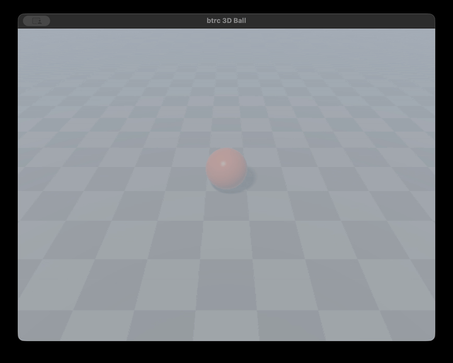

# btrc

**Modern syntax & features. C output. No magic.**

btrc is a statically-typed language that transpiles to C. It adds classes, generics, type inference, lambdas, f-strings, collections, threads, GPU compute, automatic reference counting, exception handling, and a standard library -- all while staying compatible with C. The generated C is strict C11: no compiler extensions, no runtime library, no garbage collector, no virtual machine. Small inline helpers handle strings, collections, threading, and exceptions, but nothing is linked separately. You can inspect, debug, and link the output with any C11 compiler. It comes with a VS Code extension, a language server, and 930 tests.

And no – it's not actually better than C, but I like the name, which I ripped off from [btrfs](https://en.wikipedia.org/wiki/Btrfs).

Here's an example:

```
#include "engine/engine.btrc"

int main() {
    var engine = Engine("btrc 3D Ball", 800, 600);
    var player = new GameObject();
    float speed = 4.0;

    while (engine.isRunning()) {
        engine.update();
        float dt = engine.time.deltaTime;

        if (engine.input.key(KEY_W)) { player.move(0.0, 0.0, speed * dt); }
        if (engine.input.key(KEY_S)) { player.move(0.0, 0.0, -speed * dt); }
        if (engine.input.key(KEY_A)) { player.move(speed * dt, 0.0, 0.0); }
        if (engine.input.key(KEY_D)) { player.move(-speed * dt, 0.0, 0.0); }
        if (engine.input.key(KEY_SPACE)) { player.jump(speed); }

        player.applyPhysics(dt);
        engine.render(player);
    }
    return 0;
}
```



## Why btrc?

I’ve wanted a modern, ergonomic take on C for years: something fast, simple, cross-platform, built with intent, and featuring (iffy) built-in GPU support. btrc is a personal project that tries to scratch this itch, and I've had it on the backburner for years. I never had the time (and honestly, I still don't), but with the help of AI, I've managed to bring it to life over some late night hacking. The experience of using AI to create an ambitious project from scratch made the project worth it. Also, the irony isn't lost on me: I'm fully aware of how silly it is to use AI to write a programming language in a time where we are writing less and less code ourselves.

## What Is It?

btrc is defined through a formal [EBNF grammar](src/language/grammar.ebnf), which mathematically defines every keyword and operator; an [algebraic AST spec](src/language/ast/ast.asdl) defines every node type for the language graph; and a compiler pipeline consumes both the spec and the graph, walking your code through six stages (lexical analysis, syntax analysis, semantic analysis, intermediate code generation, code optimization, code generation). However, instead of outputting an intermediate language like LLVM or assembly code directly, it outputs C code. I don't expect folks will want to look at the C code outside of debugging errors, but it should resemble something that a human could have written (but more verbose and with a lot more underscores). You *should* be able to read it, debug it, and link it anything (or link anything else to it). It's just C11.

Depending on how you define things, it might be more accurate to call btrc a transpiler rather than a compiler. You get gcc and clang compatibility for free, but you also inherit many of C's limitations. There is no borrow checker or lifetime analysis here. I did mitigate some of the pain with a simple Automatic Reference Counting (ARC) system that automatically handles most memory management (even dealing with cycles and cleaning up allocations during exceptions). That said, it won't prevent all use-after-free bugs. Just like in C, you can absolutely still shoot yourself in the foot if you aren't careful.

## Should I Use It?

Probably not. But you're welcome to contribute if you find this kind of thing fun.

If you need a production systems language with full safety guarantees, use [Rust](https://www.rust-lang.org/), [Zig](https://ziglang.org/), [Odin](https://odin-lang.org/), or [C3](https://c3-lang.org/). Those languages are more mature, robust, and real.

Plus, btrc *definitely* has bugs.

## Quick Start

```bash
# Option 1: Nix (recommended — all dependencies handled)
nix develop
make build

# Option 2: Devcontainer (VS Code)
make devcontainer    # build container image
# then "Reopen in Container" in VS Code

# Option 3: Manual (Python 3.13+, gcc, pytest required)
make build

# Compile and run a program
./bin/btrcpy hello.btrc -o hello.c
gcc hello.c -o hello -lm
./hello

# Or use the Python compiler directly
python3 -m src.compiler.python.main hello.btrc -o hello.c
```

## What You Get Over C

| C Pain Point | btrc Solution |
|---|---|
| No classes | Full OOP: classes, inheritance, interfaces, abstract classes, properties |
| No generics | Monomorphized generics (`Vector<T>`, `Map<K,V>`, user-defined) |
| No memory management | ARC (Automatic Reference Counting) |
| No type inference | `var x = 42;` just works |
| `printf` formatting | f-strings: `f"x = {x + 1}"` |
| No collections | `Vector<T>`, `Map<K,V>`, `Set<T>`, `List<T>`, `Array<T>` with rich APIs |
| No lambdas | Arrow lambdas: `(int x) => x * 2` |
| No exceptions | `try`/`catch`/`finally` with ARC-safe cleanup on throw |
| No operator overloading | `__add__`, `__sub__`, `__eq__`, `__neg__` |
| No string methods | `.len()`, `.contains()`, `.split()`, `.trim()`, `.toUpper()`, and many more |
| No threads | `spawn` + `Thread<T>` + `Mutex<T>` |
| No GPU compute | `@gpu` functions transpile to WGSL shaders with auto-generated WebGPU boilerplate |
| Null pointer chaos | Nullable types (`T?`), optional chaining `?.`, null coalescing `??` |
| Manual memory only | Automatic reference counting with `keep`/`release` + cycle detection |

## What You Keep From C

- Direct memory control with `new`/`delete` and pointers
- Full C interop -- call any C library, use any C header
- `#include`, `struct`, `typedef`, `extern` -- all still work
- Same mental model: stack vs heap, pointers, manual lifetime management
- Generated C is strict C11 -- compiles with any C11 compiler (gcc, clang, MSVC)

---

## Language Guide

### Types

```
// Primitives
int x = 42;
float f = 3.14;
double d = 2.718281828;
long big = 100000;
bool flag = true;
char c = 'A';
string name = "btrc";

// Extended integer types (same as C)
short s = 10;
unsigned int u = 42;
long long ll = 9999999999;

// Pointers (just like C)
int* ptr = &x;
int val = *ptr;

// Type inference
var count = 10;          // int
var msg = "hello";       // string
var items = [1, 2, 3];   // Vector<int>
var cache = {"a": 1};    // Map<string, int>
```

### Number Literals

```
int dec = 255;
int hex = 0xFF;
int bin = 0b11111111;
int oct = 0o377;
float f = 3.14f;
```

### Control Flow

```
// if / else if / else
if (x > 0) {
    print("positive");
} else if (x == 0) {
    print("zero");
} else {
    print("negative");
}

// C-style for
for (int i = 0; i < 10; i++) {
    sum += i;
}

// for-in with range
for i in range(10) { }
for i in range(2, 8) { }
for i in range(0, 20, 2) { }

// for-in over collections and strings
for val in myVector { }
for key, value in myMap { }
for ch in someString { }

// while / do-while
while (running) { tick(); }
do { x++; } while (x < 10);

// switch
switch (status) {
    case 200: handle_ok(); break;
    case 404: handle_not_found(); break;
    default: handle_error();
}
```

### Functions

```
int add(int a, int b) {
    return a + b;
}

// Default parameters
string greet(string name, string prefix = "Hello") {
    return f"{prefix}, {name}!";
}

greet("world");          // "Hello, world!"
greet("world", "Hey");   // "Hey, world!"

// Forward declarations (mutual recursion)
bool is_even(int n);
bool is_odd(int n) { return n == 0 ? false : is_even(n - 1); }
bool is_even(int n) { return n == 0 ? true : is_odd(n - 1); }
```

### Lambdas

```
// Arrow syntax (expression body)
var double_it = (int x) => x * 2;

// Arrow syntax (block body)
var abs_fn = (int x) => {
    if (x < 0) { return -x; }
    return x;
};

// Verbose syntax
var multiply = int function(int a, int b) { return a * b; };

// Use with collection methods
nums.forEach(void function(int x) { print(f"{x}"); });
Vector<int> evens = nums.filter(bool function(int x) { return x % 2 == 0; });
```

### Classes

```
class Point {
    public int x;
    public int y;
    private string label = "origin";  // default field values

    public Point(int x, int y) {
        self.x = x;
        self.y = y;
    }

    public int distSquared() {
        return self.x * self.x + self.y * self.y;
    }

    // Static method
    class Point zero() { return Point(0, 0); }

    // Destructor -- called when refcount reaches zero or on delete
    public void __del__() { }
}

Point p = Point(3, 4);
assert(p.distSquared() == 25);
Point z = Point.zero();
```

Access levels: `public`, `private`, `class` (static).

### Inheritance

```
class Animal {
    public string name;
    public Animal(string name) { self.name = name; }
    public string speak() { return "..."; }
}

class Dog extends Animal {
    public Dog(string name) { self.name = name; }
    public string speak() { return "Woof"; }
}

Dog d = Dog("Rex");
print(d.speak());    // "Woof"
print(d.name);       // "Rex"
```

The compiler validates that method overrides have compatible signatures -- mismatched return types or parameter types are caught at compile time.

### Interfaces and Abstract Classes

```
interface Drawable {
    void draw();
}

abstract class Shape {
    public abstract double area();
    public string kind() { return "shape"; }  // concrete method allowed
}

class Circle extends Shape implements Drawable {
    public double r;
    public Circle(double r) { self.r = r; }
    public double area() { return 3.14159 * self.r * self.r; }
    public void draw() { print(f"circle r={self.r}"); }
}
```

Interfaces support inheritance (`interface A extends B`). The compiler checks that implementing classes provide all required methods with compatible signatures.

### Generics

btrc generics are monomorphized -- the compiler generates specialized C code for each type combination. Zero runtime overhead, but binary size grows with each unique type combination (the same trade-off as C++ templates and Rust generics).

```
class Box<T> {
    public T value;
    public Box(T val) { self.value = val; }
    public T get() { return self.value; }
}

Box<int> bi = Box(42);
Box<string> bs = Box("hello");

class Pair<A, B> {
    public A first;
    public B second;
    public Pair(A a, B b) { self.first = a; self.second = b; }
}

Pair<string, int> entry = Pair("score", 100);
```

Generic interfaces are also supported (e.g. `Iterable<T>`).

### Operator Overloading

```
class Vec2 {
    public int x;
    public int y;
    public Vec2(int x, int y) { self.x = x; self.y = y; }

    public Vec2 __add__(Vec2 other) {
        return Vec2(self.x + other.x, self.y + other.y);
    }
    public Vec2 __neg__() {
        return Vec2(-self.x, -self.y);
    }
    public bool __eq__(Vec2 other) {
        return self.x == other.x && self.y == other.y;
    }
}

Vec2 c = Vec2(1, 2) + Vec2(3, 4);   // Vec2(4, 6)
Vec2 d = -c;                         // Vec2(-4, -6)
```

Supported operators: `__add__`, `__sub__`, `__mul__`, `__div__`, `__mod__`, `__neg__`, `__eq__`.

### Properties

```
class Temperature {
    private float celsius;

    public Temperature(float c) { self.celsius = c; }

    public float fahrenheit {
        get { return self.celsius * 9.0 / 5.0 + 32.0; }
        set { self.celsius = (value - 32.0) * 5.0 / 9.0; }
    }
}

var t = Temperature(100.0);
float f = t.fahrenheit;      // 212.0 (getter)
t.fahrenheit = 32.0;         // sets celsius to 0.0 (setter)
```

Auto-properties are also supported: `public int x { get; set; }`.

### Enums

```
// Simple enums
enum Color { RED, GREEN, BLUE };
enum Status { OK = 200, NOT_FOUND = 404, ERROR = 500 };

// Rich enums (algebraic data types / tagged unions)
enum class Shape {
    Circle(double radius),
    Rect(double w, double h),
    Point
}

Shape s = Shape.Circle(5.0);
if (s.tag == Shape.Circle) {
    print(f"radius: {s.data.Circle.radius}");
}

// Auto-generated toString
print(s.toString());    // "Circle(radius=5.0)"
```

### Tuples

```
(int, int) divmod(int a, int b) {
    return (a / b, a % b);
}

(int, int) result = divmod(17, 5);
assert(result._0 == 3);  // quotient
assert(result._1 == 2);  // remainder

// Nested tuples
(int, (string, bool)) nested = (1, ("yes", true));
```

### Collections

#### Vector (dynamic array)

```
Vector<int> nums = [10, 20, 30];
nums.push(40);
nums[0] = 99;
int val = nums.pop();

for x in nums { print(f"{x}"); }

// Rich API -- sort, reverse, slice, take, drop, distinct, copy, ...
nums.sort();
Vector<int> sub = nums.slice(1, 3);
bool has = nums.contains(20);
int total = nums.sum();

// Higher-order functions
Vector<int> evens = nums.filter(bool function(int x) { return x % 2 == 0; });
nums.forEach(void function(int x) { print(f"{x}"); });
bool any_neg = nums.any(bool function(int x) { return x < 0; });
int sum = nums.reduce(0, int function(int acc, int x) { return acc + x; });

nums.free();
```

Also available: `.insert()`, `.remove()`, `.indexOf()`, `.lastIndexOf()`, `.swap()`, `.fill()`, `.clear()`, `.first()`, `.last()`, `.min()`, `.max()`, `.distinct()`, `.take()`, `.drop()`, `.copy()`, `.extend()`, `.all()`, `.findIndex()`, `.join()`.

#### List (doubly-linked list)

```
List<int> ll = List();
ll.pushBack(1);
ll.pushFront(0);
int front = ll.front();
int removed = ll.popFront();
Vector<int> v = ll.toVector();
ll.free();
```

#### Map (hash map)

```
Map<string, int> ages = {"alice": 30, "bob": 25};
ages.put("carol", 35);
int age = ages.get("alice");
bool exists = ages.has("bob");
int fallback = ages.getOrDefault("dave", 0);

Vector<string> keys = ages.keys();
Vector<int> values = ages.values();

for k, v in ages {
    print(f"{k}: {v}");
}

ages.free();
```

Also available: `.putIfAbsent()`, `.remove()`, `.merge()`, `.containsValue()`, `.size()`, `.isEmpty()`, `.clear()`.

#### Set (hash set)

```
Set<int> s = {};
s.add(10);
s.add(20);
s.add(10);            // duplicate ignored

Set<int> other = {};
other.add(20);
other.add(30);

Set<int> u = s.unite(other);       // {10, 20, 30}
Set<int> i = s.intersect(other);   // {20}
Set<int> d = s.subtract(other);    // {10}
```

Also available: `.symmetricDifference()`, `.isSubsetOf()`, `.isSupersetOf()`, `.filter()`, `.any()`, `.all()`, `.forEach()`, `.toVector()`, `.copy()`.

#### Array (fixed-size)

```
Array<int> arr = Array(100);
arr.set(0, 42);
int val = arr.get(0);
arr.fill(0);
arr.free();
```

#### Iterable Protocol

Any class that implements `iterLen()` and `iterGet(int i)` can be used in `for-in` loops. All built-in collections implement this.

### Strings

btrc strings have a full method API -- no more `strlen`/`strstr`/`strtok` gymnastics.

```
string s = "hello world";

int len = s.len();
bool has = s.contains("world");
int idx = s.indexOf("world");
bool starts = s.startsWith("hello");

string up = s.toUpper();
string trimmed = "  hi  ".trim();
string replaced = s.replace("world", "btrc");
string sub = s.substring(0, 5);         // "hello"
string padded = "42".zfill(5);          // "00042"

// Concatenation and conversion
string full = "hello" + " " + "world";
string num = 42.toString();

// Iterate characters
for ch in "hello" { print(f"{ch}"); }
```

Also available: `.toLower()`, `.capitalize()`, `.title()`, `.swapCase()`, `.reverse()`, `.repeat()`, `.lstrip()`, `.rstrip()`, `.removePrefix()`, `.removeSuffix()`, `.padLeft()`, `.padRight()`, `.center()`, `.charAt()`, `.charLen()`, `.lastIndexOf()`, `.endsWith()`, `.count()`, `.find()`, `.isEmpty()`, `.equals()`, `.split()`, `.isDigit()`, `.isAlpha()`, `.isAlnum()`, `.isUpper()`, `.isLower()`, `.isBlank()`, `.toInt()`, `.toFloat()`, `.toDouble()`, `.toLong()`.

### Null Safety

btrc has nullable types, optional chaining, and null coalescing. The compiler warns when you use `.field` on a nullable type without `?.`, helping catch null dereferences at compile time.

```
// Nullable type annotation
Box? b = findBox(id);       // b might be null

// Optional chaining -- safe navigation
int val = b?.value;         // 0 if b is null, no crash

// Null coalescing -- provide defaults
string name = ptr ?? "anonymous";
int value = b?.val ?? -1;
```

### Memory Management

btrc uses lightweight **automatic reference counting (ARC)** for memory management. Every class instance tracks how many references point to it. When the count reaches zero, the object is automatically destroyed. No garbage collector -- deterministic cleanup at scope boundaries.

> **Safety model:** btrc inherits C's memory model. The compiler checks types and access control at compile time. ARC handles common memory management automatically, but does not prevent all use-after-free or dangling pointer bugs. If you need full memory safety guarantees, use Rust. btrc is for programmers who want C's control with better ergonomics.

```
// Heap allocation -- refcount starts at 1
Node n = new Node(99);
n.val = 100;
delete n;                    // force destroy, set to NULL

// ARC auto-releases at scope exit
void example() {
    Node n = new Node(42);
    // ... use n ...
}   // n automatically released here (rc--)

// Pointers work like C
int x = 42;
int* ptr = &x;
int val = *ptr;

// C memory functions available
int* buf = (int*)malloc(100 * sizeof(int));
free(buf);
```

#### ARC Keywords: `keep` and `release`

| Keyword | Usage | Meaning |
|---------|-------|---------|
| `keep` | Function param: `store(keep T t)` | "I store this pointer" -- rc++ at call site |
| `keep` | Function return: `keep T pop()` | "Caller takes ownership" -- caller auto-manages |
| `keep` | Statement: `keep p;` | Explicit rc++ (keep alive past scope exit) |
| `release` | Statement: `release p;` | rc--; destroy at zero; p = NULL |

```
// Container stores a reference -- keep param increments refcount
class Container {
    public Node item;
    public void store(keep Node n) {
        self.item = n;
    }
}

void example() {
    var c = new Container();
    var n = new Node(42);
    c.store(n);              // rc++ at call site (keep param)
    delete c;                // Container destructor releases item (rc--)
    // n still alive -- rc was incremented by keep
    delete n;                // force destroy
}
```

**Zero-cost when unused:** When no `keep` is ever applied to a variable, the compiler skips all refcount operations. The generated C is identical to hand-written manual code.

**Cycle detection:** For classes that can form reference cycles (A -> B -> A), the compiler includes a trial-deletion cycle collector. Non-cyclable types pay zero overhead.

**Exception safety:** ARC-tracked objects allocated inside `try` blocks are automatically cleaned up when an exception is thrown.

### Exception Handling

```
void validate(int x) {
    if (x < 0) {
        throw "negative value";
    }
}

try {
    validate(-1);
} catch (string e) {
    print(f"caught: {e}");
} finally {
    print("cleanup runs always");
}
```

Exceptions use `setjmp`/`longjmp` under the hood. ARC-managed objects are cleaned up automatically on throw.

### Threads

btrc has built-in threading with `spawn`, typed `Thread<T>`, and `Mutex<T>`.

```
// Spawn a thread -- returns Thread<T> where T is the lambda return type
Thread<int> t = spawn(() => {
    return 42;
});

int result = t.join();    // blocks until thread completes

// Captured variables are copied into the thread
int x = 10;
Thread<int> t = spawn(() => {
    return x * 2;         // captures x by value
});

// Mutex for shared mutable state
Mutex<int> counter = Mutex(0);
counter.set(counter.get() + 1);
int val = counter.get();
counter.destroy();
```

Captured class instances are ARC-safe -- the compiler increments the reference count at spawn time and decrements it when the thread completes. Under the hood, `spawn` creates a POSIX pthread.

### GPU Compute

Array params become storage buffers, scalar params become uniforms, `gpu_id()` maps to the global invocation index, and `return` writes to an output buffer. Void-returning kernels mutate arrays in-place.

```
#include <gpu.btrc>

// In-place mutation: each thread scales one element
@gpu
void scale(float[] data, float factor) {
    int i = gpu_id();
    data[i] = data[i] * factor;
}

// Return variant: each thread produces one output element
@gpu
float[] sgdUpdate(float[] weights, float[] gradients, float lr) {
    int i = gpu_id();
    return weights[i] - lr * gradients[i];
}
```

For a full example that combines `@gpu` kernels with btrc classes, see [`examples/sgd/sgd.btrc`](examples/sgd/sgd.btrc) -- GPU-accelerated stochastic gradient descent that learns `y = 2x + 3` from training data.

### 3D Game Engine

btrc includes a Unity-inspired 3D game engine built on WebGPU rendering. A ball on a ground plane with WASD movement, space to jump, real-time shadows, and SDF raymarching -- all in ~570 lines of btrc across 11 engine modules.

```
#include "engine/engine.btrc"

int main() {
    var engine = Engine("btrc 3D Ball", 800, 600);
    var player = new GameObject();
    float speed = 4.0;

    while (engine.isRunning()) {
        engine.update();
        float dt = engine.time.deltaTime;

        if (engine.input.key(KEY_W)) { player.move(0.0, 0.0, speed * dt); }
        if (engine.input.key(KEY_S)) { player.move(0.0, 0.0, -speed * dt); }
        if (engine.input.key(KEY_A)) { player.move(speed * dt, 0.0, 0.0); }
        if (engine.input.key(KEY_D)) { player.move(-speed * dt, 0.0, 0.0); }
        if (engine.input.key(KEY_SPACE)) { player.jump(speed); }

        player.applyPhysics(dt);
        engine.render(player);
    }
    return 0;
}
```

The engine is modular: `GameObject` with physics, `Camera` with follow behavior, `Light` and `Material` for shading, `Ground` checkerboard and `Sky` gradient, `Scene` compositing with a WGSL raymarching shader, `Input` for keyboard, `Time` for frame timing, and `Renderer` tying it all together. See [`examples/game/`](examples/game/).

```bash
make gpu && make examples-game
./examples/game/game
```

### C Interop

btrc understands most C syntax. You can mix btrc and C freely in the same file.

```
#include <math.h>

struct Vec2 {
    float x;
    float y;
};

float dot(struct Vec2* a, struct Vec2* b) {
    return a->x * b->x + a->y * b->y;
}

int main() {
    struct Vec2 a = {3.0f, 4.0f};
    struct Vec2 b = {1.0f, 0.0f};
    float d = dot(&a, &b);
    printf("dot = %f, sqrt = %f\n", d, sqrt(d));
    return 0;
}
```

### Standard Library

btrc includes a standard library written in btrc itself (`src/stdlib/`), auto-included by the compiler.

#### Math

```
double pi = Math.PI();
int abs = Math.abs(-5);
int clamped = Math.clamp(x, 0, 100);
double root = Math.sqrt(2.0);
int fact = Math.factorial(10);
int gcd = Math.gcd(12, 8);
bool prime = Math.isPrime(17);
double sin = Math.sin(Math.PI() / 2.0);
```

#### DateTime and Timer

```
DateTime now = DateTime.now();
string date = now.dateString();     // "2025-01-15"
string time = now.timeString();     // "14:30:00"

Timer t = Timer();
t.start();
// ... work ...
t.stop();
float elapsed = t.elapsed();       // seconds
```

#### Random

```
Random rng = Random();
rng.seedTime();
int n = rng.randint(1, 100);
float f = rng.random();            // [0, 1)
rng.shuffle(myVector);             // in-place Fisher-Yates
```

#### File I/O

```
File f = File("data.txt", "r");
if (f.ok()) {
    string content = f.read();
    f.close();
}

File out = File("output.txt", "w");
out.writeLine("hello");
out.close();

// Static helpers
bool exists = Path.exists("data.txt");
string content = Path.readAll("data.txt");
Path.writeAll("output.txt", "hello");
```

#### Console

```
Console.log("message");            // stdout + newline
Console.error("problem");          // stderr + newline
```

#### Result

```
Result<int, string> divide(int a, int b) {
    if (b == 0) { return Result.err("division by zero"); }
    return Result.ok(a / b);
}

Result<int, string> r = divide(10, 0);
if (r.isErr()) {
    print(f"error: {r.unwrapErr()}");
}
```

#### Error Classes

`Error`, `ValueError`, `IOError`, `TypeError`, `IndexError`, `KeyError` -- all with `.toString()`.

---

## Compilation Pipeline

btrc compiles through six stages. Two formal specs drive the front-end: [`src/language/grammar.ebnf`](src/language/grammar.ebnf) defines all keywords, operators, and syntax rules; [`src/language/ast/ast.asdl`](src/language/ast/ast.asdl) defines all AST node types using [Zephyr ASDL](https://www.cs.princeton.edu/~appel/papers/asdl97.pdf). A structured IR separates lowering from emission.

```
  src/language/grammar.ebnf  (single source of truth: keywords, operators, syntax)
  src/language/ast/ast.asdl  (single source of truth: AST node types)
         |
  .btrc source
         |
    [Lexer]       --> tokens            grammar-driven (keywords + operators from EBNF)
         |
    [Parser]      --> typed AST         ASDL-generated node classes
         |
    [Analyzer]    --> checked AST       scopes, types, generic instance collection
         |
    [IR Gen]      --> IR tree           structured nodes (IRIf, IRCall, IRFor, ...)
         |
    [Optimizer]   --> optimized IR      dead helper elimination
         |
    [C Emitter]   --> .c file           simple tree walk -- no lowering logic
         |
    gcc/clang     --> native binary     any C11 compiler works
```

The generated C is self-contained -- no runtime library, no special headers. It includes everything inline: vtables for inheritance, monomorphized generic structs, collection implementations, string helpers, threading wrappers, and exception handling via `setjmp`/`longjmp`.

---

## Project Structure

```
src/
  language/
    grammar.ebnf               # Formal EBNF grammar (lexical + syntactic rules)
    ast/
      ast.asdl                 # Algebraic AST spec (Zephyr ASDL)
      asdl_parser.py           # ASDL file parser
      asdl_python.py           # ASDL --> Python dataclasses
      asdl_btrc.py             # ASDL --> btrc classes
      gen_builtins.py          # stdlib .btrc --> LSP builtins

  compiler/
    python/                    # Compiler (Python)
      ebnf.py                  # EBNF parser --> GrammarInfo
      tokens.py                # Token + TokenType (grammar-driven)
      lexer.py                 # Grammar-driven lexer
      lexer_literals.py        # Number/string literal parsing
      ast_nodes.py             # GENERATED from ast.asdl
      cache.py                 # Stdlib source caching
      disk_cache.py            # On-disk compilation cache
      main.py                  # Pipeline entry point + CLI
      parser/                  # Recursive descent parser (mixin-based)
      analyzer/                # Type checking, scopes, generics, GPU validation
      ir/                      # IR pipeline
        nodes.py               # IR node dataclass definitions
        optimizer.py           # Dead helper elimination
        emitter.py             # IR --> C text (tree walk)
        emitter_exprs.py       # Expression emission mixin
        emitter_gpu.py         # GPU kernel + dispatch emission mixin
        gen/                   # AST --> IR lowering
          arc.py               # ARC reference counting
          gpu.py               # @gpu kernel IR generation
          gpu_wgsl.py          # btrc AST --> WGSL compute shader text
          threads.py           # spawn/Thread/Mutex lowering
          generics/            # Monomorphization (vectors, maps, sets, user types)
        helpers/               # Runtime helper C source (strings, alloc, threads, ...)
      tests/                   # Python unit tests (568 tests)

  stdlib/                      # Standard library (auto-included btrc source)
    vector.btrc                # Vector<T> (dynamic array)
    list.btrc                  # List<T> (doubly-linked list)
    array.btrc                 # Array<T> (fixed-size)
    iterable.btrc              # Iterable<T> interface
    map.btrc                   # Map<K,V> (hash map)
    set.btrc                   # Set<T> (hash set)
    strings.btrc               # Strings static utilities
    math.btrc                  # Math static utilities
    datetime.btrc              # DateTime + Timer
    random.btrc                # Random number generation
    io.btrc                    # File + Path I/O
    console.btrc               # Console output
    error.btrc                 # Error class hierarchy
    result.btrc                # Result<T,E> type
    gpu/                       # GPU runtime (WebGPU/wgpu-native)
      gpu.btrc                 # GPU btrc types
      btrc_gpu.h               # C header for GPU compute functions
      btrc_gpu.c               # C implementation (wgpu-native backend)

  tests/                       # Language test suite (362 .btrc files)
    runner.py                  # Pytest runner (compile + gcc + run + diff)
    generate_expected.py       # Regenerate golden .stdout files
    basics/                    # Types, vars, print, nullable, casting, sizeof
    control_flow/              # if/for/while/switch/try-catch, range
    classes/                   # Classes, inheritance, interfaces, abstract
    collections/               # Vector, List, Map, Set, Array, iteration
    strings/                   # String methods, f-strings, conversions
    functions/                 # Default params, lambdas, forward decl, recursion
    generics/                  # User-defined generics, Result<T,E>
    enums/                     # Simple enums, rich enums, toString
    tuples/                    # Tuple creation, access, multi-element
    memory/                    # ARC: keep/release, cycle detection, exceptions
    threads/                   # spawn, Thread<T>, Mutex<T>, ARC captures
    gpu/                       # @gpu kernels, WGSL generation, dispatch
    stdlib/                    # Math, DateTime, Random
    algorithms/                # Quicksort, BST, hash table, linked list

  devex/
    ext/                       # VS Code extension (syntax highlighting + LSP client)
    lsp/                       # Language server (completions, diagnostics, hover, go-to-def)

examples/
  game/                        # 3D game engine -- Unity-inspired, WGSL raymarching
    engine/                    # Engine modules: Camera, Light, Material, Ground, Sky, Scene, Input, Time, GameObject, Renderer
    game.btrc                  # The ball game (WASD + space to jump)
  todo/                        # Todo board -- classes, generics, collections
  sgd/                         # GPU-accelerated SGD -- @gpu, classes, Vector
  triangle/                    # WebGPU triangle -- raw WGSL render pipeline
```

## Build & Test

```bash
make build                  # Create bin/btrcpy wrapper script
make test                   # Run all tests (unit + language, gcc -std=c11)
make test-btrc              # Run language tests only (gcc -std=c11)
make test-c11               # Strict C11 compliance: gcc + clang at -O0 through -O3
make lint                   # Run ruff linter
make format                 # Format with ruff
make test-generate-goldens  # Regenerate golden .stdout files
make stubs-generate         # Regenerate built-in type stubs
make extension              # Package VS Code extension (.vsix)
make extension-install      # Install VS Code extension (dev)
make examples               # Build and run examples
make gpu                    # Install WebGPU + GLFW and build GPU runtime
make examples-game          # Build the 3D engine game
make examples-triangle      # Build the GPU triangle example
make examples-sgd           # Build the GPU SGD example
make examples-todo          # Build the todo example
make devcontainer           # Generate .devcontainer/ and build image
make clean                  # Remove build artifacts
```

### Requirements

All dependencies are managed by [`flake.nix`](flake.nix). If using the devcontainer or `nix develop`, everything is set up automatically.

Manual install requires:
- Python 3.13+
- gcc and/or clang
- pytest + pytest-xdist (for tests)
- ruff (for linting)
- pygls + lsprotocol (for LSP server)
- Node.js + npm (for VS Code extension)
- wgpu-native + GLFW (for GPU support, optional — `make gpu`)

### CI

GitHub Actions ([`.github/workflows/ci.yml`](.github/workflows/ci.yml)) runs on every push and PR to `main`:
1. Builds the devcontainer image
2. Runs `make lint` (ruff)
3. Runs `make test` (568 unit tests + 362 language tests, gcc `-std=c11`)

GPU tests are automatically skipped in CI when the GPU runtime is not built.

## Editor Support

btrc ships with a VS Code extension ([`src/devex/ext/`](src/devex/ext/)) and a Language Server Protocol implementation ([`src/devex/lsp/`](src/devex/lsp/)) that reuses the compiler's own lexer, parser, and analyzer. Diagnostics match exactly what the compiler reports -- there is no separate linting pass.

The LSP server maintains a two-tier cache: the current analysis (which may have parse errors while you type) and the last fully successful analysis. Features like go-to-definition and hover fall back to the good cache during transient errors, so intelligence keeps working while you edit.

### Features

| Feature | Description |
|---|---|
| Syntax highlighting | TextMate grammar + semantic tokens for rich classification |
| Diagnostics | Real-time errors and warnings from the compiler's lexer, parser, and analyzer |
| Code completion | Keywords, types, member access (`.`, `?.`, `->`), stdlib static methods, snippets |
| Hover | Type information for variables, fields, methods, classes, and built-in types |
| Go to definition | Classes, functions, methods, fields, properties, variables, enums, typedefs |
| Find references | All usages of a symbol across the document with scope-aware matching |
| Rename | Symbol rename across all references |
| Signature help | Parameter hints for functions, constructors, methods, and stdlib calls |
| Document symbols | Outline view with class hierarchy (fields, methods as children) |

### Install

```bash
# Install the VS Code extension (builds + installs)
make extension-install

# Or open the project in the devcontainer for automatic setup
```

The extension auto-discovers the LSP server and Python interpreter. Configure `btrc.pythonPath` or `btrc.serverPath` in VS Code settings if needed.

## Roadmap

Planned but not yet implemented:
- **Self-hosting** -- rewrite the compiler in btrc itself (bootstrap cycle)
- **Module system** -- currently relies on `#include "file.btrc"` textual inclusion
- **Pattern matching** -- `match` expressions for rich enums with exhaustiveness checking
- **Weak references** -- `weak` keyword for intentional non-owning references
- **Incremental compilation** -- only recompile changed files
