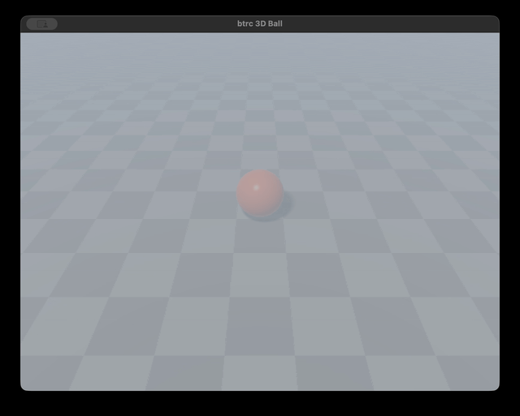

# btrc

**Modern syntax & features. C output. No magic.**

btrc is a statically-typed language that transpiles to C. It adds classes, generics, type inference, lambdas, f-strings, imports, collections, threads, GPU compute, automatic reference counting, exception handling, and a growing standard library -- all while staying compatible with C. The generated C is strict C11: no compiler extensions, no garbage collector, and no virtual machine. Core CPU programs embed the small helpers they use; optional GPU, GUI, tray, and other native backends link their platform runtimes explicitly. You can inspect, debug, and link the output with a C11 toolchain. It comes with a VS Code extension, a language server, and hundreds of compiler/language tests.

And no – it's not actually better than C, but I like the name, which I ripped off from [btrfs](https://en.wikipedia.org/wiki/Btrfs).

Here's an example:

```
#include "engine/engine.btrc"

int main() {
    var engine = Engine("btrc 3D Ball", 800, 600);
    var player = new GameObject();
    float speed = 4.0;

    while (engine.isRunning()) {
        engine.update();
        float dt = engine.time.deltaTime;

        if (engine.input.key(KEY_W)) { player.move(0.0, 0.0, speed * dt); }
        if (engine.input.key(KEY_S)) { player.move(0.0, 0.0, -speed * dt); }
        if (engine.input.key(KEY_A)) { player.move(speed * dt, 0.0, 0.0); }
        if (engine.input.key(KEY_D)) { player.move(-speed * dt, 0.0, 0.0); }
        if (engine.input.key(KEY_SPACE)) { player.jump(speed); }

        player.applyPhysics(dt);
        engine.render(player);
    }
    return 0;
}
```



## Why btrc?

I’ve wanted a modern, ergonomic take on C for years: something fast, simple, cross-platform, built with intent, and featuring (iffy) built-in GPU support. btrc is a personal project that tries to scratch this itch, and I've had it on the backburner for years. I never had the time (and honestly, I still don't), but with the help of AI, I've managed to bring it to life over some late night hacking. The experience of using AI to create an ambitious project from scratch made the project worth it. Also, the irony isn't lost on me: I'm fully aware of how silly it is to use AI to write a programming language in a time where we are writing less and less code ourselves.

## What Is It?

btrc is defined through a formal [EBNF grammar](src/language/grammar.ebnf), which mathematically defines every keyword and operator; an [algebraic AST spec](src/language/ast.asdl) defines every node type for the language graph; and a compiler pipeline consumes both the spec and the graph, walking your code through six stages (lexical analysis, syntax analysis, semantic analysis, intermediate code generation, code optimization, code generation). However, instead of outputting an intermediate language like LLVM or assembly code directly, it outputs C code. I don't expect folks will want to look at the C code outside of debugging errors, but it should resemble something that a human could have written (but more verbose and with a lot more underscores). You *should* be able to read it, debug it, and link it anything (or link anything else to it). It's just C11.

Depending on how you define things, it might be more accurate to call btrc a transpiler rather than a compiler. You get gcc and clang compatibility for free, but you also inherit many of C's limitations. There is no Rust-style borrow checker here. The analyzer does enforce managed-value ownership and lifetime rules at call, assignment, projection, aggregate, and exception boundaries, while ARC handles most managed-object cleanup (including cycles and allocations unwound by exceptions). Raw pointers and explicit destruction remain C-like, so the compiler still cannot prevent every use-after-free or dangling-pointer bug.

## Should I Use It?

Probably not. But you're welcome to contribute if you find this kind of thing fun. [AGENTS.md](AGENTS.md) has the architecture rules and the gates a change has to pass; work happens directly on `main`.

If you need a production systems language with full safety guarantees, use [Rust](https://www.rust-lang.org/), [Zig](https://ziglang.org/), [Odin](https://odin-lang.org/), or [C3](https://c3-lang.org/). Those languages are more mature, robust, and real.

Plus, btrc *definitely* has bugs.

## Quick Start

```bash
# Option 1: Nix (recommended — all dependencies handled)
nix develop
make build
nix run .#btrc -- hello.btrc -o hello.c
nix run .#btrc-format -- check hello.btrc

# Option 2: Devcontainer (VS Code)
make devcontainer    # build container image
# then "Reopen in Container" in VS Code

# Option 3: Manual (Python 3.13+, gcc, pytest required)
make build

# Compile and run a program
./bin/btrcpy hello.btrc -o hello.c
gcc hello.c -o hello -lm
./hello

# Strict imports are the default. Legacy projects can opt out temporarily.
./bin/btrcpy tool.btrc -o tool.c
./bin/btrcpy --relaxed-imports tool.btrc -o tool.c

# Or use the Python compiler directly
python3 -m src.compiler.python.main hello.btrc -o hello.c
```

The flake exports the compiler and source formatter as
`packages.<system>.btrc`, `apps.<system>.btrc`,
`packages.<system>.btrc-format`, and `apps.<system>.btrc-format`, so downstream
flakes can depend on BTRC directly instead of shelling into this repository.
The formatter's complete style and exit-code contract is in
[the devex guide](docs/devex/formatter.md).

Useful compiler modes include:

```bash
# Build the stdlib once, then emit program-only C against that archive.
./bin/btrcpy --build-stdlib build/stdlib
./bin/btrcpy --stdlib build/stdlib app.btrc -o app.c

# Reassert the strict default and bypass the transpilation cache.
./bin/btrcpy --strict-imports --no-cache app.btrc -o app.c

# Temporarily compile a legacy project with implicit cross-file visibility.
./bin/btrcpy --relaxed-imports app.btrc -o app.c

# Keep all generated declarations for inspection, or profile compiler phases.
./bin/btrcpy --no-dce app.btrc -o app.c
./bin/btrcpy --profile app.btrc -o app.c
```

See [the precompiled-stdlib design](docs/design/precompiled-stdlib.md) for the
archive layout and cross-translation-unit ownership contract. Run
`./bin/btrcpy --help` for the complete current option list.

## What You Get Over C

| C Pain Point | btrc Solution |
|---|---|
| No classes | Full OOP: classes, inheritance, interfaces, abstract classes, properties |
| No generics | Monomorphized generics (`Vector<T>`, `Map<K,V>`, user-defined) |
| No memory management | ARC (Automatic Reference Counting) |
| No type inference | `var x = 42;` just works |
| `printf` formatting | f-strings: `f"x = {x + 1}"` |
| Ad hoc include order | `import std.{json, process}`, `import ./src/**`, plus old `#include` compatibility |
| No collections | `Vector<T>`, `Map<K,V>`, `Set<T>`, `List<T>`, `Array<T>` with rich APIs |
| No lambdas | Arrow lambdas: `(int x) => x * 2` |
| No exceptions | `try`/`catch`/`finally` with ARC-safe cleanup on throw |
| No operator overloading | `__add__`, `__sub__`, `__eq__`, `__neg__` |
| No string methods | `.len()`, `.contains()`, `.split()`, `.trim()`, `.toUpper()`, and many more |
| No threads | `spawn` + `Thread<T>` + `Mutex<T>` |
| No GPU compute | `@gpu` functions transpile to WGSL shaders with auto-generated WebGPU boilerplate |
| Unbounded callback work | `@realtime` proves the complete reachable call graph is realtime-safe |
| Null pointer chaos | Nullable types (`T?`), optional chaining `?.`, null coalescing `??` |
| Manual memory only | Automatic reference counting with `keep`/`release` + cycle detection |

## Imports and Stdlib

Strict imports are the language, API, and CLI default. Every source file must
import the files that own the top-level language symbols it references. An
`import` edge is directed and transitive: an importer sees its dependency, but
the dependency does not see back into the importer, and sibling imports do not
see one another automatically.

The compiler still supports C-style `#include "file.btrc"` for compatibility.
btrc includes are textual compilation-unit composition, so include-connected
fragments share visibility in both directions. New modular code should prefer
`import`; `--relaxed-imports` is the explicit legacy opt-out.

```
import std.{cli, fs, json, process, toml, ui}
import std.*
import ./src/core/*
import ./src/**
```

Supported forms are:

- `std.name` for one standard-library module
- `std.{a, b, c}` for a small ordered set
- `std.*` or `std.**` for the discovered standard library
- relative files such as `./helpers/message.btrc`
- directory globs with `./dir/*`
- recursive directory globs with `./dir/**`

Import resolution imposes no compiler-defined ceilings on source size, file
count, nesting depth, or directory-scan size. Traversal is iterative and
directory listings stream, so a compilation scales with the memory and file
descriptors the host actually provides; genuine filesystem and allocation
failures are reported as diagnostics.

Explicit imports are always resolved. `--no-stdlib` only disables the implicit
stdlib composition used by `--relaxed-imports`; it has no effect on normal
strict-mode imports. See the normative
[import and compilation-unit contract](docs/language/imports.md) for visibility,
deduplication, source-macro, enum-member, and compatibility semantics.

The current stdlib surfaces are intentionally practical:

- `Strings` for object-oriented string helpers, conversion, splitting, joining,
  padding, and comparisons, plus `StringBuilder` for amortized text assembly
- `Command`, `CommandOutput`, `UnixShell`, `ShellWords`, `UnixPipe`, and
  `ChildProcess` for shell/process orchestration
- `FileSystem`, `PathTools`, `Directory`, `DirectoryLease`, and `FileStatus` for
  filesystem work, including identity-matched recursive removal
- `JsonObject`, `JsonValue`, and `Toml` for declarative data, including compact,
  pretty, and canonical newline-terminated JSON document serialization
- `CliArgs`, `CliCommand`, `CliCommandLine`, and `CliHelp` for simple CLIs
- `UiDocument`, `Window`, `Tray`, `DaemonSpec`, and related daemon/UI models for
  lightweight native-app scaffolding
- `Platform`, `Environment`, and `Terminal` for OS/runtime integration

Low-level stdlib internals may call C APIs because that is how btrc exposes
platform primitives. Application and test code should use the object-oriented
wrappers instead of reaching for `strcmp`, `__btrc_strdup`, manual shell string
assembly, or raw path manipulation.

`ChildProcess.run` can borrow explicit parent descriptors into fixed child
descriptor numbers and borrow a working-directory descriptor on native Linux.
Those capabilities have no pathname fallback and fail closed on other targets.

### Package dependencies

A project can declare local or Git dependencies in the nearest `btrc.toml`:

```toml
manifest-version = 1

[package]
name = "myapp"

[dependencies]
mathx = { path = "../mathx" }
netkit = { git = "https://example.com/netkit.git", rev = "v1.2.0" }
```

Version-1 manifests are strict and recursive. Both compilers resolve local path
graphs with dependency-local aliases, reject cycles, atomically publish the
same canonical schema-3 `btrc.lock`, and deduplicate diamonds. `btrcpy`
additionally materializes Git entries, preserves the requested ref, and pins
its exact commit. `btrcc` currently rejects Git acquisition precisely instead
of invoking a shell or silently using an unpinned checkout. Pass `--fetch` to
`btrcpy` only when you intentionally want to advance a moving Git ref. Git
checkouts use `~/.btrc/pkgs/` by default, or `$BTRC_PKG_CACHE` when set.

Package imports address the dependency name and then an optional module path:

```btrc
import mathx
import netkit.http
```

The resolver looks under each dependency's `src/` directory first, then its
root. `btrcpy`, `btrcc`, and the LSP keep package maps isolated per invocation
or workspace, so one project's manifest cannot leak into another project.
Native package tables can declare validated C, C++, Objective-C, and
Objective-C++ units plus headers, includes, defines, frameworks, pkg-config
requirements, and platform predicates. `--target OS-ARCH --emit-link-plan
PATH` emits the canonical plan for Make, Nix, or CMake to consume; manifests
cannot inject flags, commands, or shell fragments. `btrcc` requires the target
explicitly for every version-1 manifest and fails closed when it is omitted;
`btrcpy` may infer its supported host target.

The default Nix package installs both `btrcpy` and `btrc-native-plan`; the
adapter is also exposed as `.#btrc-native-plan`. The standalone proof uses the
same installed surface:

```bash
make examples-native-package TARGET=linux-x64
nix flake check
```

## What You Keep From C

- Direct memory control with `new`/`delete` and pointers
- Full C interop -- call any C library, use any C header
- `#include`, `struct`, `typedef`, `extern` -- all still work
- Same mental model: stack vs heap, pointers, manual lifetime management
- Generated C is strict C11 -- continuously tested with GCC and Clang; Windows bundles use MinGW-w64

---

## Language Guide

### Types

```
// Primitives
int x = 42;
float f = 3.14;
double d = 2.718281828;
long big = 100000;
bool flag = true;
char c = 'A';
string name = "btrc";

// Extended integer types (same as C)
short s = 10;
unsigned int u = 42;
long long ll = 9999999999;

// Pointers (just like C)
int* ptr = &x;
int val = *ptr;

// Type inference
var count = 10;          // int
var msg = "hello";       // string
var items = [1, 2, 3];   // Vector<int>
var cache = {"a": 1};    // Map<string, int>
```

### Number Literals

```
int dec = 255;
int hex = 0xFF;
int bin = 0b11111111;
int oct = 0o377;
float f = 3.14f;
```

### Control Flow

```
// if / else if / else
if (x > 0) {
    print("positive");
} else if (x == 0) {
    print("zero");
} else {
    print("negative");
}

// C-style for
for (int i = 0; i < 10; i++) {
    sum += i;
}

// for-in with range
for i in range(10) { }
for i in range(2, 8) { }
for i in range(0, 20, 2) { }

// for-in over collections and strings
for val in myVector { }
for key, value in myMap { }
for ch in someString { }

// while / do-while
while (running) { tick(); }
do { x++; } while (x < 10);

// switch
switch (status) {
    case 200: handle_ok(); break;
    case 404: handle_not_found(); break;
    default: handle_error();
}
```

### Functions

```
int add(int a, int b) {
    return a + b;
}

// Default parameters
string greet(string name, string prefix = "Hello") {
    return f"{prefix}, {name}!";
}

greet("world");          // "Hello, world!"
greet("world", "Hey");   // "Hey, world!"

// Named arguments
int mix(int a, int b = 2, int c = 3) {
    return a + b * 10 + c * 100;
}

mix(1, c=4);             // same as mix(1, 2, 4)
mix(c=5, a=6, b=7);      // same as mix(6, 7, 5)

// Forward declarations (mutual recursion)
bool is_even(int n);
bool is_odd(int n) { return n == 0 ? false : is_even(n - 1); }
bool is_even(int n) { return n == 0 ? true : is_odd(n - 1); }
```

### Lambdas

```
// Arrow syntax (expression body)
var double_it = (int x) => x * 2;

// Arrow syntax (block body)
var abs_fn = (int x) => {
    if (x < 0) { return -x; }
    return x;
};

// Verbose syntax
var multiply = int function(int a, int b) { return a * b; };

// Use with collection methods
nums.forEach(void function(int x) { print(f"{x}"); });
Vector<int> evens = nums.filter(bool function(int x) { return x % 2 == 0; });
```

### Classes

```
class Point {
    public int x;
    public int y;
    private string label = "origin";  // default field values

    public Point(int x, int y) {
        self.x = x;
        self.y = y;
    }

    public int distSquared() {
        return self.x * self.x + self.y * self.y;
    }

    // Static method
    class Point zero() { return Point(0, 0); }

    // Destructor -- called when refcount reaches zero or on delete
    public void __del__() { }
}

Point p = Point(3, 4);
assert(p.distSquared() == 25);
Point z = Point.zero();
```

Access levels: `public`, `private`, `class` (static).

### Inheritance

```
class Animal {
    public string name;
    public Animal(string name) { self.name = name; }
    public string speak() { return "..."; }
}

class Dog extends Animal {
    public Dog(string name) { self.name = name; }
    public string speak() { return "Woof"; }
}

Dog d = Dog("Rex");
print(d.speak());    // "Woof"
print(d.name);       // "Rex"
```

The compiler validates that method overrides have compatible signatures -- mismatched return types or parameter types are caught at compile time.

### Interfaces and Abstract Classes

```
interface Drawable {
    void draw();
}

abstract class Shape {
    public abstract double area();
    public string kind() { return "shape"; }  // concrete method allowed
}

class Circle extends Shape implements Drawable {
    public double r;
    public Circle(double r) { self.r = r; }
    public double area() { return 3.14159 * self.r * self.r; }
    public void draw() { print(f"circle r={self.r}"); }
}
```

Interfaces are compile-time implementation contracts. Dispatch is static, so
variables, fields, parameters, and return values use the implementing concrete
class rather than an interface type.

Interfaces support inheritance (`interface A extends B`). The compiler checks that implementing classes provide all required methods with compatible signatures.

### Generics

btrc generics are monomorphized -- the compiler generates specialized C code for each type combination. Zero runtime overhead, but binary size grows with each unique type combination (the same trade-off as C++ templates and Rust generics).

```
class Box<T> {
    public T value;
    public Box(T val) { self.value = val; }
    public T get() { return self.value; }
}

Box<int> bi = Box(42);
Box<string> bs = Box("hello");

class Pair<A, B> {
    public A first;
    public B second;
    public Pair(A a, B b) { self.first = a; self.second = b; }
}

Pair<string, int> entry = Pair("score", 100);
```

Generic interfaces are also supported (e.g. `Iterable<T>`).

### Operator Overloading

```
class Vec2 {
    public int x;
    public int y;
    public Vec2(int x, int y) { self.x = x; self.y = y; }

    public Vec2 __add__(Vec2 other) {
        return Vec2(self.x + other.x, self.y + other.y);
    }
    public Vec2 __neg__() {
        return Vec2(-self.x, -self.y);
    }
    public bool __eq__(Vec2 other) {
        return self.x == other.x && self.y == other.y;
    }
}

Vec2 c = Vec2(1, 2) + Vec2(3, 4);   // Vec2(4, 6)
Vec2 d = -c;                         // Vec2(-4, -6)
```

Supported operators: `__add__`, `__sub__`, `__mul__`, `__div__`, `__mod__`, `__neg__`, `__eq__`.

### Properties

```
class Temperature {
    private float celsius;

    public Temperature(float c) { self.celsius = c; }

    public float fahrenheit {
        get { return self.celsius * 9.0 / 5.0 + 32.0; }
        set { self.celsius = (value - 32.0) * 5.0 / 9.0; }
    }
}

var t = Temperature(100.0);
float f = t.fahrenheit;      // 212.0 (getter)
t.fahrenheit = 32.0;         // sets celsius to 0.0 (setter)
```

Auto-properties are also supported: `public int x { get; set; }`.

### Enums

```
// Simple enums
enum Color { RED, GREEN, BLUE };
enum Status { OK = 200, NOT_FOUND = 404, ERROR = 500 };

// Rich enums (algebraic data types / tagged unions)
enum class Shape {
    Circle(double radius),
    Rect(double w, double h),
    Point
}

Shape s = Shape.Circle(5.0);
if (s.tag == Shape.Circle) {
    print(f"radius: {s.data.Circle.radius}");
}

// Auto-generated toString
print(s.toString());    // "Circle(radius=5.0)"
```

### Tuples

```
(int, int) divmod(int a, int b) {
    return (a / b, a % b);
}

(int, int) result = divmod(17, 5);
assert(result._0 == 3);  // quotient
assert(result._1 == 2);  // remainder

// Nested tuples
(int, (string, bool)) nested = (1, ("yes", true));
```

### Collections

#### Vector (dynamic array)

```
Vector<int> nums = [10, 20, 30];
nums.push(40);
nums[0] = 99;
int val = nums.pop();

for x in nums { print(f"{x}"); }

// Rich API -- sort, reverse, slice, take, drop, distinct, copy, ...
nums.sort();
Vector<int> sub = nums.slice(1, 3);
bool has = nums.contains(20);
int total = nums.sum();

// Higher-order functions
Vector<int> evens = nums.filter(bool function(int x) { return x % 2 == 0; });
nums.forEach(void function(int x) { print(f"{x}"); });
bool any_neg = nums.any(bool function(int x) { return x < 0; });
int sum = nums.reduce(0, int function(int acc, int x) { return acc + x; });

nums.free();
```

Also available: `.insert()`, `.remove()`, `.indexOf()`, `.lastIndexOf()`, `.swap()`, `.fill()`, `.clear()`, `.first()`, `.last()`, `.min()`, `.max()`, `.distinct()`, `.take()`, `.drop()`, `.copy()`, `.extend()`, `.all()`, `.findIndex()`, `.join()`.

#### List (doubly-linked list)

```
List<int> ll = List();
ll.pushBack(1);
ll.pushFront(0);
int front = ll.front();
int removed = ll.popFront();
Vector<int> v = ll.toVector();
ll.free();
```

#### Map (hash map)

```
Map<string, int> ages = {"alice": 30, "bob": 25};
ages.put("carol", 35);
int age = ages.get("alice");
bool exists = ages.has("bob");
int fallback = ages.getOrDefault("dave", 0);

Vector<string> keys = ages.keys();
Vector<int> values = ages.values();

for k, v in ages {
    print(f"{k}: {v}");
}

ages.free();
```

Also available: `.putIfAbsent()`, `.remove()`, `.merge()`, `.containsValue()`, `.size()`, `.isEmpty()`, `.clear()`.

#### Set (hash set)

```
Set<int> s = {};
s.add(10);
s.add(20);
s.add(10);            // duplicate ignored

Set<int> other = {};
other.add(20);
other.add(30);

Set<int> u = s.unite(other);       // {10, 20, 30}
Set<int> i = s.intersect(other);   // {20}
Set<int> d = s.subtract(other);    // {10}
```

Also available: `.symmetricDifference()`, `.isSubsetOf()`, `.isSupersetOf()`, `.filter()`, `.any()`, `.all()`, `.forEach()`, `.toVector()`, `.copy()`.

#### Array (fixed-size)

```
Array<int> arr = Array(100);
arr.set(0, 42);
int val = arr.get(0);
arr.fill(0);
arr.free();
```

#### Iterable Protocol

Any class that implements `iterLen()` and `iterGet(int i)` can be used in `for-in` loops. All built-in collections implement this.

### Strings

btrc strings have a full method API -- no more `strlen`/`strstr`/`strtok` gymnastics.

```
string s = "hello world";

int len = s.len();
bool has = s.contains("world");
int idx = s.indexOf("world");
bool starts = s.startsWith("hello");

string up = s.toUpper();
string trimmed = "  hi  ".trim();
string replaced = s.replace("world", "btrc");
string sub = s.substring(0, 5);         // "hello"
string padded = "42".zfill(5);          // "00042"

// Concatenation and conversion
string full = "hello" + " " + "world";
string num = 42.toString();

// Iterate characters
for ch in "hello" { print(f"{ch}"); }
```

Also available: `.toLower()`, `.capitalize()`, `.title()`, `.swapCase()`, `.reverse()`, `.repeat()`, `.lstrip()`, `.rstrip()`, `.removePrefix()`, `.removeSuffix()`, `.padLeft()`, `.padRight()`, `.center()`, `.charAt()`, `.charLen()`, `.lastIndexOf()`, `.endsWith()`, `.count()`, `.find()`, `.isEmpty()`, `.equals()`, `.split()`, `.isDigit()`, `.isAlpha()`, `.isAlnum()`, `.isUpper()`, `.isLower()`, `.isBlank()`, `.toInt()`, `.toFloat()`, `.toDouble()`, `.toLong()`.

### Null Safety

btrc has nullable types, optional chaining, and null coalescing. The compiler warns when you use `.field` on a nullable type without `?.`, helping catch null dereferences at compile time.

```
// Nullable type annotation
Box? b = findBox(id);       // b might be null

// Optional chaining -- safe navigation
int val = b?.value;         // 0 if b is null, no crash

// Null coalescing -- provide defaults
string name = ptr ?? "anonymous";
int value = b?.val ?? -1;
```

### Memory Management

btrc uses lightweight **automatic reference counting (ARC)** for memory management. Every class instance tracks how many references point to it. When the count reaches zero, the object is automatically destroyed. No garbage collector -- deterministic cleanup at scope boundaries.

> **Safety model:** btrc inherits C's memory model. The compiler checks types and access control at compile time. ARC handles common memory management automatically, but does not prevent all use-after-free or dangling pointer bugs. If you need full memory safety guarantees, use Rust. btrc is for programmers who want C's control with better ergonomics.

```
// Heap allocation -- refcount starts at 1
Node n = new Node(99);
n.val = 100;
delete n;                    // force destroy, set to NULL

// ARC auto-releases at scope exit
void example() {
    Node n = new Node(42);
    // ... use n ...
}   // n automatically released here (rc--)

// Pointers work like C
int x = 42;
int* ptr = &x;
int val = *ptr;

// C memory functions available
int* buf = (int*)malloc(100 * sizeof(int));
free(buf);
```

#### ARC Keywords: `keep` and `release`

| Keyword | Usage | Meaning |
|---------|-------|---------|
| `keep` | Function param: `store(keep T t)` | Keep the argument alive until the call returns |
| `keep` | Function return: `keep T pop()` | Explicitly documents the managed-return ABI; managed btrc returns are already caller-owned |
| `keep` | Statement: `keep p;` | Explicit rc++ (keep alive past scope exit) |
| `release` | Statement: `release p;` | rc--; destroy at zero; p = NULL |

```
// Managed fields own their stored references. A keep parameter also protects
// the argument for the duration of the call.
class Container {
    public Node item;
    public void store(keep Node n) {
        self.item = n;
    }
}

void example() {
    var c = new Container();
    var n = new Node(42);
    c.store(n);              // item retains n; call guard is then released
    delete c;                // Container destructor releases item (rc--)
    // n is still alive through its local owned reference
    delete n;                // force destroy
}
```

`delete` is an explicit force-destroy operation. Use it only after every other
owner has released the object; it intentionally invalidates outstanding aliases.
Use `release` when shared owners may still exist. Storing a managed value in a
class field or auto-property retains it independently of a parameter annotation.

Every class value returned by a btrc function or method gives
the caller one owned reference. Returning a fresh value or owned local transfers
that reference; returning a borrowed parameter, `self`, field, or property
retains it first. The `keep` return spelling remains useful as explicit API/ABI
documentation, but it is not required to make a managed return caller-owned.
Managed property reads remain field-like borrowed projections; when their
receiver is itself a temporary owner, the compiler retains the projected value
before releasing that receiver.

Tuples, C structs, fixed C arrays, and rich-enum payloads are shallow value
aggregates: class elements inside them are borrowed references. Keep an explicit
class owner alive for at least as long as the aggregate. The compiler rejects
embedding or assigning a caller-owned temporary directly because these
aggregates have no copy/destructor protocol with which to release it.

**Pay for managed values only:** Refcount operations are emitted at managed
ownership boundaries; primitive-only code does not incur ARC work.

**Cycle detection:** For classes that can form reference cycles (A -> B -> A), the compiler includes a trial-deletion cycle collector. Non-cyclable types pay zero overhead.

**Exception safety:** ARC-tracked objects allocated inside `try` blocks are automatically cleaned up when an exception is thrown.

### Exception Handling

```
void validate(int x) {
    if (x < 0) {
        throw "negative value";
    }
}

try {
    validate(-1);
} catch (string e) {
    print(f"caught: {e}");
} finally {
    print("cleanup runs always");
}
```

Exceptions use `setjmp`/`longjmp` under the hood. ARC-managed objects are cleaned up automatically on throw.

### Threads

btrc has built-in threading with `spawn`, typed `Thread<T>`, and `Mutex<T>`.

```
// Spawn a thread -- returns Thread<T> where T is the lambda return type
Thread<int> t = spawn(() => {
    return 42;
});

int result = t.join();    // blocks until thread completes

// Captured variables are copied into the thread
int x = 10;
Thread<int> t = spawn(() => {
    return x * 2;         // captures x by value
});

// Mutex for shared mutable state
Mutex<int> counter = Mutex(0);
counter.set(counter.get() + 1);
int val = counter.get();
counter.destroy();
```

Captured class instances are ARC-safe -- the compiler increments the reference count at spawn time and decrements it when the thread completes. Under the hood, `spawn` creates a POSIX pthread.

### GPU Compute

Array params become storage buffers, scalar params become uniforms, `gpu_id()` maps to the global invocation index, and `return` writes to an output buffer. Void-returning kernels mutate arrays in-place.

```
#include <gpu.btrc>

// In-place mutation: each thread scales one element
@gpu
void scale(float[] data, float factor) {
    int i = gpu_id();
    data[i] = data[i] * factor;
}

// Return variant: each thread produces one output element
@gpu
float[] sgdUpdate(float[] weights, float[] gradients, float lr) {
    int i = gpu_id();
    return weights[i] - lr * gradients[i];
}
```

For a full example that combines `@gpu` kernels with btrc classes, see [`examples/sgd/sgd.btrc`](examples/sgd/sgd.btrc) -- GPU-accelerated stochastic gradient descent that learns `y = 2x + 3` from training data.

### Realtime Functions

`@realtime` is a compile-time contract for code that may run on an audio or
other hard-realtime thread. Both compilers follow every statically resolved
BTRC call and reject the root if any reachable path allocates, performs ARC,
throws, uses strings or collections, locks, logs, blocks, does I/O, or reaches
an unknown external/indirect call. Diagnostics name the exact operation and
full call path. Hosted and runtime calls are safe only when their generated
manifest row explicitly says so; an absent summary is unsafe.

```
@realtime void applyGain(float* samples, int count, float gain) {
    for (int index = 0; index < count; index++) {
        samples[index] = samples[index] * gain;
    }
}
```

See [`examples/realtime_gain.btrc`](examples/realtime_gain.btrc) for a complete
strict-C11 standalone program.

### 3D Game Engine

btrc includes a Unity-inspired 3D game engine built on WebGPU rendering. A ball on a ground plane with WASD movement, space to jump, real-time shadows, and SDF raymarching -- all in ~570 lines of btrc across 11 engine modules.

```
#include "engine/engine.btrc"

int main() {
    var engine = Engine("btrc 3D Ball", 800, 600);
    var player = new GameObject();
    float speed = 4.0;

    while (engine.isRunning()) {
        engine.update();
        float dt = engine.time.deltaTime;

        if (engine.input.key(KEY_W)) { player.move(0.0, 0.0, speed * dt); }
        if (engine.input.key(KEY_S)) { player.move(0.0, 0.0, -speed * dt); }
        if (engine.input.key(KEY_A)) { player.move(speed * dt, 0.0, 0.0); }
        if (engine.input.key(KEY_D)) { player.move(-speed * dt, 0.0, 0.0); }
        if (engine.input.key(KEY_SPACE)) { player.jump(speed); }

        player.applyPhysics(dt);
        engine.render(player);
    }
    return 0;
}
```

The engine is modular: `GameObject` with physics, `Camera` with follow behavior, `Light` and `Material` for shading, `Ground` checkerboard and `Sky` gradient, `Scene` compositing with a WGSL raymarching shader, `Input` for keyboard, `Time` for frame timing, and `Renderer` tying it all together. See [`examples/game/`](examples/game/).

```bash
make gpu && make examples-game
./examples/game/game
```

### C Interop

btrc understands most C syntax. You can mix btrc and C freely in the same file.

```
#include <math.h>

struct Vec2 {
    float x;
    float y;
};

float dot(struct Vec2* a, struct Vec2* b) {
    return a->x * b->x + a->y * b->y;
}

int main() {
    struct Vec2 a = {3.0f, 4.0f};
    struct Vec2 b = {1.0f, 0.0f};
    float d = dot(&a, &b);
    printf("dot = %f, sqrt = %f\n", d, sqrt(d));
    return 0;
}
```

### Freestanding / embedded targets

`btrcpy --freestanding` emits C with no hosted-libc includes — every runtime
symbol is routed through a single retargetable seam (`btrc_rt.h`) so a btrc
program can target a kernel module, firmware, or bootloader. The pure subset and
core stdlib (strings, collections, integer math) compile to an object with
**zero libc dependencies** against the shipped reference runtime. See
[docs/design/freestanding.md](docs/design/freestanding.md).

### Standard Library

btrc includes a standard library written in btrc itself (`src/stdlib/`). Strict
imports are the default, so programs import the modules they use explicitly;
implicit whole-stdlib composition is available only through the legacy
`--relaxed-imports` mode.

#### Math

```
import std.math;

double pi = Math.PI();
int abs = Math.abs(-5);
int clamped = Math.clamp(x, 0, 100);
double root = Math.sqrt(2.0);
int fact = Math.factorial(10);
int gcd = Math.gcd(12, 8);
bool prime = Math.isPrime(17);
double sin = Math.sin(Math.PI() / 2.0);
```

#### DateTime and Timer

```
import std.datetime;

DateTime now = DateTime.now();
string date = now.dateString();     // "2025-01-15"
string time = now.timeString();     // "14:30:00"

Timer t = Timer();
t.start();
// ... work ...
t.stop();
float elapsed = t.elapsed();       // seconds
```

#### Random

```
import std.random;

Random rng = Random();
rng.seedTime();
int n = rng.randint(1, 100);
float f = rng.random();            // [0, 1)
rng.shuffle(myVector);             // in-place Fisher-Yates
```

#### File I/O

```
import std.io;

File f = File("data.txt", "r");
if (f.ok()) {
    string content = f.read();
    f.close();
}

File out = File("output.txt", "w");
out.writeLine("hello");
out.close();

// Static helpers
bool exists = Path.exists("data.txt");
string content = Path.readAll("data.txt");
Path.writeAll("output.txt", "hello");
```

#### Console

```
import std.console;

Console.log("message");            // stdout + newline
Console.error("problem");          // stderr + newline
```

#### Application directories

```btrc
import std.ApplicationDirectories;

ApplicationDirectoryRootsOutcome resolved = ApplicationDirectories.resolve(ApplicationDirectoryLimits.standard());
if (resolved.ok()) {
	string state = resolved.roots().stateRoot();
	string cache = resolved.roots().cacheRoot();
	string config = resolved.roots().configRoot();
}
```

The returned paths are absolute, lexically normalized per-user roots. The API
does not create them or append an application name. macOS uses Application
Support/Caches; Linux follows XDG with HOME fallbacks. Errors and path limits
are explicit.

#### Result

```
import std.result;

Result<int, string> divide(int a, int b) {
    if (b == 0) { return Result.err("division by zero"); }
    return Result.ok(a / b);
}

Result<int, string> r = divide(10, 0);
if (r.isErr()) {
    print(f"error: {r.unwrapErr()}");
}
```

#### Error Classes

Import `std.error` to use `Error`, `ValueError`, `IOError`, `TypeError`,
`IndexError`, and `KeyError`; each provides `.toString()`.

---

## Compilation Pipeline

btrc compiles through six stages. Two formal specs drive the front-end: [`src/language/grammar.ebnf`](src/language/grammar.ebnf) defines all keywords, operators, and syntax rules; [`src/language/ast.asdl`](src/language/ast.asdl) defines all AST node types using [Zephyr ASDL](https://www.cs.princeton.edu/~appel/papers/asdl97.pdf). A structured IR separates lowering from emission.

```
  src/language/grammar.ebnf  (single source of truth: keywords, operators, syntax)
  src/language/ast.asdl  (single source of truth: AST node types)
         |
  .btrc source
         |
    [Lexer]       --> tokens            grammar-driven (keywords + operators from EBNF)
         |
    [Parser]      --> typed AST         ASDL-generated node classes
         |
    [Analyzer]    --> checked AST       scopes, types, generic instance collection
         |
    [IR Gen]      --> IR tree           structured nodes (IRIf, IRCall, IRFor, ...)
         |
    [Optimizer]   --> optimized IR      typed reachability + normalization
         |
    [C Emitter]   --> .c file           simple tree walk -- no lowering logic
         |
    gcc/clang     --> native binary     any C11 compiler works
```

For core CPU programs, generated C is self-contained apart from the ordinary C
and platform libraries selected by the program. It includes the needed static
inheritance/member lowering, monomorphized generic structs, collection and
string helpers, threading wrappers, and exception handling via
`setjmp`/`longjmp`. GPU, GUI, tray, and similar native features link their
documented backend runtimes.

Runtime helper source has one shared home. `src/runtime/c/manifest.toml`
describes names, dependencies, headers, features, source markers, and stable
catalog order for the pre-authored `core.c`, `collections.c`, `cycles.c`,
`mutex.c`, `process.c`, `strings.c`, `threads.c`, `trycatch.c`, and `gpu.c`
assets plus `btrc_rt.h`. The unified generator emits immutable metadata to
`src/compiler/python/runtime/generated.py` and
`src/compiler/btrc/generated/runtime/catalog.btrc`; retained catalog owners in
the two compilers select and materialize those assets. Lowering and emission do
not construct runtime C source.

---

## Self-Hosting

btrc compiles itself. Alongside the reference compiler in Python, the same
six-stage pipeline is implemented in btrc under
[`src/compiler/btrc/`](src/compiler/btrc/): lexer, parser, analyzer, structured
IR lowering, optimizer, and C emitter. Its front-end resolves directed
`import` dependencies and textual `#include` composition with strict imports
enabled by default. Implicit whole-stdlib composition exists only behind the
explicit `--relaxed-imports` compatibility mode. The compiler is bootstrapped
by transpiling its own source with the reference compiler (a C compiler does
the rest); from then on `btrcc` compiles btrc programs on its own.

Because btrc has no dynamic dispatch, the AST and IR are *fat tagged nodes* -- one struct per layer carrying a `kind` tag and the union of every field, dispatched with `if (n.kind == ...)`. The checked-in Python and btrc AST layers are generated from the same [`ast.asdl`](src/language/ast.asdl) contract by the unified [`AstCatalogGenerator`](tools/compiler_codegen/ast.py); `make ast-generate-btrc` delegates to that canonical generator. The self-hosted AST tooling consumes the same schema and is verified against that generated contract.

The self-hosted compiler is held to a strict bar: across the entire language test suite, the C it emits must compile under `gcc -std=c11` (and `clang`) **and** produce byte-identical program output to the reference compiler. It also reaches a **bootstrap fixed point** -- the self-built `btrcc` compiles its own source, and that output, recompiled, is byte-identical (the compiler reproduces itself bit-for-bit). Run the bootstrap-parity suite and the fixed-point check with:

```bash
make test-btrc-selfhost      # build btrcc, then run the whole corpus through it
make bootstrap               # prove btrcc reproduces itself bit-for-bit (fixed point)
```

---

## Project Structure

The production compiler inventories are exact: 82 Python files and 91
self-hosted `.btrc` files (85 compiler/generated files plus six explicit tool
entry files). The complete file-by-file contract is in
[Compiler Structure](docs/design/compiler-structure.md); the package view is:

```
src/
  language/
    grammar.ebnf               # Formal EBNF grammar (lexical + syntactic rules)
    ast.asdl                   # Algebraic AST spec (Zephyr ASDL) -- single source of truth
    hosted_abi.toml            # Shared hosted signatures, effects, and provenance

  runtime/c/                   # Shared pre-authored runtime assets
    manifest.toml              # Helper metadata and deterministic catalog order
    btrc_rt.h                  # Retargetable runtime seam
    core.c                     # Core allocation/printing support
    collections.c              # Collection support
    cycles.c                   # Cycle collection support
    mutex.c                    # Mutex support
    process.c                  # Process support
    strings.c                  # String support
    threads.c                  # Thread support
    trycatch.c                 # Exception support
    gpu.c                      # GPU support

  compiler/
    python/                    # Exact 82-file reference compiler
      __init__.py              # Stable Compiler/Options/Result API
      main.py                  # Thin process entry point
      application/             # Compiler, CompilationPipeline, immutable results
      cli/                     # Compiler and bundle process adapters
      frontend/                # Stage, sources, imports/visibility, packages
      syntax/                  # Grammar, tokens, generated AST, canonical codec
      lexer/                   # Grammar-driven Lexer and LiteralScanner
      parser/                  # One stateful recursive-descent Parser
      analyzer/
        analyzer.py            # SemanticAnalyzer composition root
        program.py             # Analysis state, results, scopes, and indexes
        declarations.py        # Declaration registry, policy, and hierarchy
        types.py               # TypeSystem and inference
        aggregates.py          # Aggregate and initializer semantics
        expressions.py         # Expression analysis
        calls.py               # Call and callable-flow analysis
        statements.py          # Statement/update analysis
        flow.py                # Control and nullable-flow analysis
        storage.py             # Storage and qualifier provenance
        ownership.py           # Ownership, borrow, and cycle analysis
        generics.py            # Generic analysis and instance closure
        gpu.py                 # GPU semantic validation
        macros.py              # Source macro semantics
        generated_symbols.py   # Generated-symbol registry
      ir/
        __init__.py            # Package marker; no dependency facade
        nodes.py               # Complete typed IR model and IRModule
        verifier.py            # IR schema and invariant verification
        optimizer.py           # Complete IROptimizer pass owner
        lowering/
          lowerer.py           # IRLowerer composition root
          session.py           # Per-lowering mutable data only
          translation_unit.py  # Translation-unit orchestration/finalization
          declarations.py      # DeclarationLowerer
          classes.py           # ClassLowerer
          functions.py         # FunctionLowerer
          types.py             # CTypeLowerer
          expressions.py       # ExpressionLowerer
          calls.py             # Typed call planning/materialization
          storage.py           # Typed storage planning/materialization
          ownership.py         # OwnershipLowerer and lifetime policy
          statements.py        # StatementLowerer
          control_flow.py      # ControlFlowLowerer
          collections.py       # CollectionLowerer
          iteration.py         # IterationLowerer
          exceptions.py        # ExceptionLowerer/setjmp analysis
          concurrency.py       # ConcurrencyLowerer
          generics.py          # Immutable specialization views only
          gpu.py               # GpuLowerer
      backend/
        c_emitter.py           # CEmitter structured IR formatter
        wgsl_emitter.py        # WgslEmitter GPU shader formatter
      abi/                     # Generated declarations, hosted/freestanding owners
      runtime/                 # Generated helper data and RuntimeHelperCatalog
      artifacts/               # Archive, cache, publication, stdlib, selfhost

    btrc/                      # Exact 91-file self-hosted compiler
      btrcc_main.btrc          # Thin process entry point
      compiler.btrc            # Public Compiler application object
      cli/driver.btrc          # BtrccDriver command/process boundary
      pipeline/                # CompilerPipeline, options, and result models
      syntax/                  # Grammar, token, identity, type, literal owners
      lexer/                   # Lexer and imports-only stage manifest
      frontend/                # Sources, stdlib, resolution, strict visibility
      parser/                  # Parser, source macros, stage manifest
      analyzer/                # Semantic owners and stage manifest
        ownership/            # Managed-value and cycle semantics
        validation/           # Validator composition plus ten domain validators
      ir/                      # Structured model, CEmitter, stage manifest
        runtime/              # Runtime catalog and reference collection
        lowering/             # IRLowerer, context, and domain lowerers
          ownership/          # Six focused ownership lowerers
        gpu/                   # GpuWgslEmitter and GpuPipeline
        optimization/         # IROptimizer, cleanup, setjmp analysis/safety
      generated/               # Data-only AST, hosted-ABI, runtime catalogs
      tools/                   # Five entry points plus the ASDL schema owner

  stdlib/                      # Standard-library modules (explicit in strict mode)
    vector.btrc                # Vector<T> (dynamic array)
    list.btrc                  # List<T> (doubly-linked list)
    array.btrc                 # Array<T> (fixed-size)
    iterable.btrc              # Iterable<T> interface
    map.btrc                   # Map<K,V> (hash map)
    set.btrc                   # Set<T> (hash set)
    strings.btrc               # Strings static utilities
    math.btrc                  # Math static utilities
    datetime.btrc              # DateTime + Timer
    random.btrc                # Random number generation
    io.btrc                    # File + Path I/O
    console.btrc               # Console output
    error.btrc                 # Error class hierarchy
    result.btrc                # Result<T,E> type
    gpu/                       # GPU runtime (WebGPU/wgpu-native)
      gpu.btrc                 # GPU btrc types
      btrc_gpu.h               # C header for GPU compute functions
      btrc_gpu.c               # Strict-C11 implementation (wgpu-native backend)
      btrc_gpu_compute_singleton.h # Atomic compute-context publication
      btrc_gpu_surface_macos.m # macOS Cocoa/Metal surface bridge

  tests/                       # Test suite — one framework for both compilers
    runner.py                  # Unified runner: each .btrc test through BOTH the
                               #   Python and self-hosted compilers (--compilers)
    generate_expected.py       # Regenerate golden .stdout files
    conftest.py                # --compilers option + shared fixtures
    python/                    # Python reference-compiler unit tests
    btrc/                      # Self-hosted-compiler-specific tests
    <category>/                # Shared language tests (.btrc), run on both
    basics/                    # Types, vars, print, nullable, casting, sizeof
    control_flow/              # if/for/while/switch/try-catch, range
    classes/                   # Classes, inheritance, interfaces, abstract
    collections/               # Vector, List, Map, Set, Array, iteration
    strings/                   # String methods, f-strings, conversions
    functions/                 # Default params, lambdas, forward decl, recursion
    generics/                  # User-defined generics, Result<T,E>
    enums/                     # Simple enums, rich enums, toString
    tuples/                    # Tuple creation, access, multi-element
    memory/                    # ARC: keep/release, cycle detection, exceptions
    threads/                   # spawn, Thread<T>, Mutex<T>, ARC captures
    gpu/                       # @gpu kernels, WGSL generation, dispatch
    stdlib/                    # Math, DateTime, Random
    algorithms/                # Quicksort, BST, hash table, linked list

  devex/
    lsp/                       # Protocol, analysis, catalog, workspace, features
    debug/                     # Protocol, toolchain, LLDB backend, runtime bootstrap
    vscode/                    # Extension source, config, assets, packaging owners

examples/
  realtime_gain.btrc             # standalone @realtime raw-buffer kernel
  game/                        # 3D game engine -- Unity-inspired, WGSL raymarching
    engine/                    # Engine modules: Camera, Light, Material, Ground, Sky, Scene, Input, Time, GameObject, Renderer
    game.btrc                  # The ball game (WASD + space to jump)
  todo/                        # Todo board -- classes, generics, collections
  sgd/                         # GPU-accelerated SGD -- @gpu, classes, Vector
  triangle/                    # WebGPU triangle -- raw WGSL render pipeline
```

## Build & Test

`make test` is the gate: it runs the frozen compiler-boundary check, then the
whole suite across both compilers, then the bootstrap fixed point serially. A
green run is 7,274 passing tests and 20 skips, and `make bootstrap` proves the
self-hosted compiler reproduces itself byte-for-byte.

Two things are worth knowing before you trust a green run. The skips are
missing tools rather than product defects -- `naga`, `lldb`, `pkg-config`, and
platform-specific paths -- but they are still coverage you did not get, and the
run looks identical either way: install those and the GPU/WGSL validation, the
debugger, and the tray runtime all start testing for real. And
`stdlib/test_stdlib_daemon.btrc` asserts a wall-clock daemon-stop deadline, so
it can fail on a saturated machine and pass on a quiet one; that is a timing
assumption in the test, not a defect in the stdlib.

```bash
make all                    # Build and verify the complete developer tree
make build                  # Create bin/btrcpy wrapper script (Python reference compiler)
make package                # Build the Python sdist, then its installable wheel
make wheel                  # Build only the installable Python wheel
make btrcc                  # Build the self-hosted compiler for THIS machine -> bin/btrcc
make test                   # Everything: unit + LSP + debugger + language on BOTH compilers
make test-unit              # Python compiler unit and code-generation tests
make test-lsp               # Language-server tests
make test-debug             # Debug-adapter tests (requires lldb + a C compiler)
make test-selfhost          # Self-hosted lexer parity
make test-btrc              # Language corpus through the Python reference compiler
make test-btrc-selfhost     # Language corpus through the self-hosted compiler (btrcc)
make bootstrap              # Prove the self-hosted compiler's byte-stable fixed point
make test-boundaries        # Check the frozen compiler boundaries (portable records)
make test-c11               # Strict, warning-free C11: gcc + clang at -O0 through -O3
make generated-check        # Verify every committed generated source is current
make compiler-codegen-check # Verify shared-spec generated compiler sources
make lint                   # Run ruff linter
make format                 # Format with ruff
make format-check           # Check formatting without modifying files
make test-generate-goldens  # Regenerate golden .stdout files
make compiler-codegen-generate # Regenerate compiler/devex data from shared specs
make extension              # Package VS Code extension (.vsix)
make extension-install      # Install VS Code extension (dev)
make examples               # Build and run examples
make gpu                    # Install WebGPU + GLFW and build GPU runtime
make gpu-required           # Build GPU runtime and fail if production deps are absent
make gui                    # Build the GUI runtime
make examples-game          # Build the 3D engine game
make examples-triangle      # Build the GPU triangle example
make examples-sgd           # Build the GPU SGD example
make examples-todo          # Build the todo example
make examples-gui           # Build and run the headless GUI example
make bench                  # Build and run transpile/compile/runtime benchmarks
make devcontainer           # Generate .devcontainer/ and build image
make clean                  # Remove build artifacts
```

### Cross-platform builds of the self-hosted compiler

`btrcc` is btrc source transpiled to C (by `btrcpy`) and then compiled by a C
toolchain. `make btrcc` builds the source-tree developer executable for the
current machine. The cross targets use [`zig cc`](https://ziglang.org) and
publish relocatable, checksummed distributions in `dist/`:

```bash
make btrcc                  # native build for this machine -> bin/btrcc
make btrcc-macos-arm64      # -> dist/btrcc-macos-arm64.tar.gz{,.sha256}
make btrcc-macos-x64        # -> dist/btrcc-macos-x64.tar.gz{,.sha256}
make btrcc-linux-x64        # -> dist/btrcc-linux-x64.tar.gz{,.sha256}
make btrcc-linux-arm64      # -> dist/btrcc-linux-arm64.tar.gz{,.sha256}
make btrcc-windows-x64      # -> dist/btrcc-windows-x64.zip{,.sha256}
make btrcc-dist             # all five distributions
```

Each archive has one self-contained layout:

```text
btrcc-<target>/
  bin/btrcc[.exe]
  LICENSE
  share/btrc/language/grammar.ebnf
  share/btrc/stdlib/...
  share/btrc/manifest.json
```

The executable resolves this data relative to its real path, including when it
is launched through an absolute `PATH` entry or symlink, so the bundle works
from any current directory. `btrcc --stdlib-dir` prints the selected stdlib.
`BTRC_HOME` may explicitly select another data root containing `language/` and
`stdlib/`; when set, it is authoritative and an invalid value is an error.
Verify a release before extracting it with `sha256sum -c <archive>.sha256`
(`shasum -a 256 -c <archive>.sha256` on macOS).

For generated C that imports a native module, add the reported stdlib path and
the module subdirectory to the C compiler include path—for example,
`stdlib="$(btrcc --stdlib-dir)"` followed by
`cc -I "$stdlib" -I "$stdlib/gui" ...`. Link the corresponding bundled/runtime
source or library and the platform dependencies documented by `gpu/`, `gui/`,
or `tray/`.

**Windows** uses a small compat layer in [`src/stdlib/win/`](src/stdlib/win/)
(applied only to Windows builds, via `-I` + `-include`) that fills the handful of
POSIX headers/symbols MinGW-w64 omits. This gets `btrcc` and ordinary btrc
programs building and running on Windows; the POSIX-only stdlib modules
(`Process`, raw-mode `Terminal`, sockets, `Regex`) don't have real Win32 backends
yet, so programs that call into them aren't supported on Windows. Most
filesystem and compiler I/O still uses the narrow C runtime or Win32 `A` APIs,
so paths outside the active Windows code page are not consistently supported;
`realpath` is the exception and uses UTF-16 internally. `removeRecursive`
removes files and final reparse points, but deliberately returns `-1` for an
ordinary directory until a handle-relative NT deletion backend exists. Test it
with:

```bash
make test-windows           # cross-build btrcc.exe + a sample; run under wine if present
```

`make test-windows` cross-builds on any host and runs the sample under
`wine`/`wine64` when available (Linux/CI), skipping execution gracefully
otherwise. A [`Windows` CI workflow](.github/workflows/windows.yml) builds and
**runs** the binaries natively on `windows-latest` for pushes and pull requests
targeting `main`.

The developer `bin/btrcc` discovers `src/language/grammar.ebnf` and `src/stdlib`
from its executable-relative checkout. Release bundles instead discover the
matching files under `share/btrc`, so they do not require a repository checkout.

### Requirements

All dependencies are managed by [`flake.nix`](flake.nix). If using the devcontainer or `nix develop`, everything is set up automatically.

Manual install requires:
- Python 3.13+
- gcc and/or clang
- pytest + pytest-xdist (for tests)
- ruff (for linting)
- pygls + lsprotocol (for a source-tree LSP server; vendored in the VSIX)
- Node.js + npm (for VS Code extension)
- wgpu-native + GLFW (optional for compiler use; required by `make test`/`make test-c11` so GPU cases cannot be skipped)

### CI

GitHub Actions ([`.github/workflows/ci.yml`](.github/workflows/ci.yml)) runs on every push and PR to `main`:
1. Validates the Nix flake and builds the devcontainer image
2. Checks lint and formatting
3. Builds the Python distribution and VS Code extension
4. Runs the reference, self-hosted, LSP, debugger, and shared language suites
5. Re-runs the shared language suite across the strict GCC/Clang C11 matrix

CI builds the GPU runtime as a required gate before both corpus matrices; a
missing backend dependency fails the job instead of silently skipping GPU
runtime cases.

Two further workflows cover the platforms the Linux job cannot:
[`macOS`](.github/workflows/macos.yml) and
[`Windows`](.github/workflows/windows.yml) each build a native release archive,
relocate it, and run the compiled output on that operating system.

## Editor Support

btrc ships with a VS Code extension ([`src/devex/vscode/`](src/devex/vscode/)) and a Language Server Protocol implementation ([`src/devex/lsp/`](src/devex/lsp/)) that reuses the compiler's own lexer, parser, and analyzer. Diagnostics match exactly what the compiler reports -- there is no separate linting pass.

The packaged extension vendors the LSP's pure-Python dependencies. Its bundled
server/compiler fallback still requires Python 3.13 or newer; the launcher
probes the configured interpreter and will use an installed `btrc-lsp` command
instead of starting the bundled payload with an unsupported Python. Nix and the
devcontainer provide the supported interpreter automatically.

The LSP server maintains a two-tier cache: the current analysis (which may have parse errors while you type) and the last fully successful analysis. Features like go-to-definition and hover fall back to the good cache during transient errors, so intelligence keeps working while you edit.

### Features

| Feature | Description |
|---|---|
| Syntax highlighting | TextMate grammar + semantic tokens for rich classification |
| Diagnostics | Real-time errors and warnings from the compiler's lexer, parser, and analyzer |
| Code completion | Keywords, types, member access (`.`, `?.`, `->`), stdlib static methods, snippets |
| Hover | Type information for variables, fields, methods, classes, and built-in types |
| Go to definition | Classes, functions, methods, fields, properties, variables, enums, typedefs |
| Find references | All usages of a symbol across the document with scope-aware matching |
| Rename | Symbol rename across all references |
| Signature help | Parameter hints for functions, constructors, methods, and stdlib calls |
| Document symbols | Outline view with class hierarchy (fields, methods as children) |
| Debugging | Source-level debugging in `.btrc` files: breakpoints (incl. conditional + logpoints), stepping, call stack, and btrc-aware variable inspection |

### Debugging

Press **F5** on a `.btrc` file to compile it with debug info and debug it
natively in VS Code -- breakpoints, step over/into/out, the call stack, and
variables shown as btrc values (a `string` shows its text, `Vector<int>` shows
`[1, 2, 3]`, a class shows its fields). The compiler emits `#line` directives
under `--debug` so the binary's DWARF points back at btrc source, and a Debug
Adapter ([`src/devex/debug/`](src/devex/debug/)) drives `lldb` to present it.
See [docs/design/debugger.md](docs/design/debugger.md). Requires `lldb` and a C
compiler.

### Install

```bash
# Install the VS Code extension (builds + installs)
make extension-install

# Or open the project in the devcontainer for automatic setup
```

The extension auto-discovers the LSP server and Python interpreter. Configure `btrc.pythonPath` or `btrc.serverPath` in VS Code settings if needed.

## Roadmap

Planned but not yet implemented:
- **Known language gaps** -- the remaining unsupported forms and their regression status are tracked in [docs/known-language-gaps.md](docs/known-language-gaps.md)
- **Module system** -- imports already resolve and compose declarations textually;
  namespaced modules and separate compilation remain planned
- **Pattern matching** -- `match` expressions for rich enums with exhaustiveness checking
- **Weak references** -- `weak` keyword for intentional non-owning references
- **Incremental compilation** -- only recompile changed files
