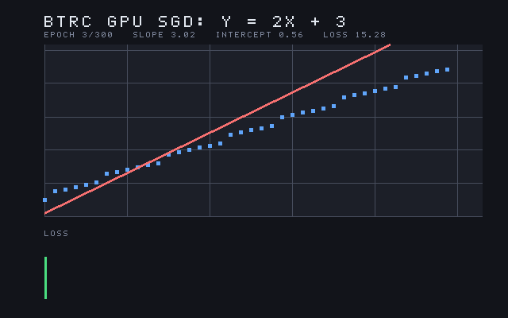
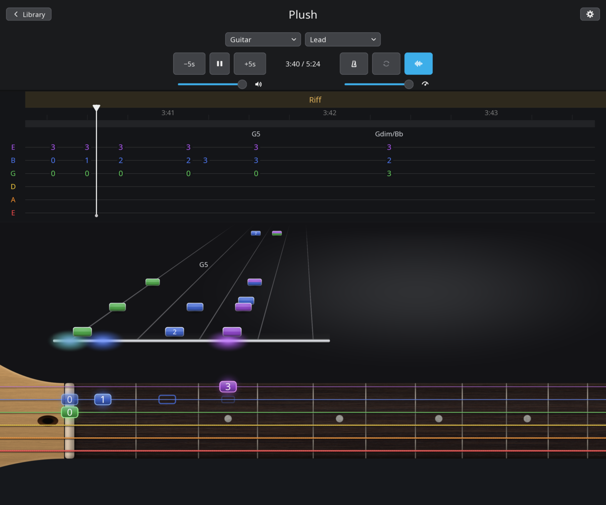
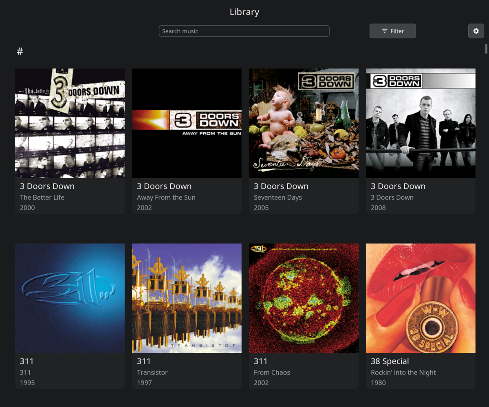

# btrc

**C, but better?**

It is possible to design a beautiful programming language with modern ergonomics and tools that doesn't sacrifice performance, readability, and interoperability?

Sort of.

btrc is a statically-typed language that transpiles to C. There is no garbage collector, no virtual machine, and no runtime: the output is strict C11 that you can read, debug, and link with any C11 toolchain, and you get all the following:

- **C11.** Almost all C11 is valid btrc. You can intermingle the two languages in the same file without any special syntax or glue code. :)
- **Classes, interfaces and generics.** Compile-time type safety for managed objects with monomorphized generics (i.e. type safety that costs nothing at runtime).
- **Type inference.** `var count = 10;` just works and costs nothing at runtime because of btrc's compile-time typechecker.
- **Real strings and collections**: UTF-8 strings, f-strings like `f"x={x}"`, and collections like `Vector<T>`, `Map<K,V>`, `Set<T>`, `List<T>`, `Array<T>`.
- **Automatic reference counting** with a cycle collector, so that you don't have to worry about memory management. There's no VM or garbage collector, so ARC is suitable for high-performance applications. If ARC is not enough, `keep` and `release` allow you to step in and handle edge cases manually. And, if that's not enough, then don't use btrc's objects -- you can use raw C when and where you want.
- **Exceptions**, with `try`/`catch`/`finally` that unwinds ARC correctly.
- **Threads**: `spawn`, typed `Thread<T>`, `Mutex<T>`, background job queues.
- **GPU acceleration**: Mark a function `@gpu` and btrc compiles it to a WGSL compute shader, automatically orchestrating WebGPU buffer uploads, dispatch, and readback—with a zero-dependency CPU fallback if no GPU is found.
- **Native UI**: Real platform controls (AppKit on macOS, SDL3/WebGPU on Linux, with eventual support on Windows, Android, and iOS) and a self-drawn declarative toolkit—with the ability to composite hardware-accelerated 3D WebGPU views directly alongside native widgets.
- **Package management**: a `btrc.toml` manifest, a real lockfile, path and Git dependencies.
- **A standard library**: Written in btrc: rich strings, collections (`Vector`, `Map`, `Set`), `JSON`, `TOML`, `HTTP`, audio, and OS abstraction—with a freestanding zero-libc mode for embedded targets.
- **A module system**: `import` with strict, directed visibility, instead of header order and luck.

There's no free lunch, but it's cheap. What you give up is surprisingly low:

- **A few bytes and CPU cycles for managed objects.** Managed objects carry an ARC header (48 bytes to support cycle collection and safe unwinding). But you only pay for what you use: btrc primitives and C structs and raw pointers carry zero extra bytes and zero runtime overhead.
- **Total memory safety guarantees.** While there is no Rust-style borrow checker, the compiler enforces managed lifetimes and ARC prevents most leaks, but raw pointers and free remain C-like. You can still shoot yourself in the foot. But the code is also readable by just about anyone including those who have never seen btrc -- so there's that.
- **A bit of binary size.** Generics are fully monomorphized for maximum speed, which trades binary footprint for zero runtime dispatch cost (the same tradeoff as C++ templates or Rust generics).
- **A bit of compile time.** Not only do those generics take a bit of time to compile, but you're adding a transpiler to the mix before the C compiler.

Corporate battle-testing. It's an ambitious personal project with known gaps and bugs—not a 10-year-old production standard.

And no – it's not actually better than C, but I like the name, which I ripped off from [btrfs](https://en.wikipedia.org/wiki/Btrfs).

## What it looks like

### Ordinary code

```
import Library.Vector;

interface Priced {
    int cents();
}

class Item implements Priced {
    public string name;
    public int price;

    public Item(string name, int price) {
        self.name = name;
        self.price = price;
    }

    public int cents() { return self.price; }

    public string toString() {
        return f"{self.name}: {self.price / 100}.{self.price % 100}";
    }
}

int main() {
    Vector<Item> cart = [];
    cart.push(Item("coffee", 350));
    cart.push(Item("bagel", 275));
    cart.push(Item("orange", 95));

    int total = 0;
    for item in cart {
        print(item.toString());
        total += item.cents();
    }

    Vector<Item> cheap = cart.filter(bool function(Item i) { return i.cents() < 300; });
    print(f"{cart.size()} items, {cheap.size()} under 3.00, {total} cents total");
    return 0;
}
```

```
coffee: 3.50
bagel: 2.75
orange: 0.95
3 items, 2 under 3.00, 720 cents total
```

No manual `free`, no `strlen`, no `printf` format string, no header file. The
`Item` objects are reference counted and released when `cart` goes out of
scope, and the whole program is one self-contained `.c` file when you are done.

### It is still C

Nothing above replaces C -- it sits on top of it. Structs, pointers, `malloc`,
the preprocessor and any C library you want are all still right there, in the
same file, with no binding layer in between. And when reference counting is not
the ownership model you want, `release` and `delete` hand you the refcount
directly.

```
#include <math.h>

struct Vec2 { float x; float y; };

float length(struct Vec2* v) {
    return sqrtf(v->x * v->x + v->y * v->y);
}

class Node {
    public int value;
    public Node(int value) { self.value = value; }
}

int main() {
    struct Vec2 v = {3.0f, 4.0f};
    printf("len = %f\n", length(&v));

    int* buf = (int*)malloc((size_t)4 * sizeof(int));
    buf[0] = 7;
    free(buf);

    Node a = new Node(1);    // refcounted: released for you when a leaves scope
    Node b = new Node(2);
    release b;               // rc--: that was the last reference, so b is
                             //   destroyed here and set to null
    Node c = new Node(3);
    delete c;                // destroy right now, whatever the count
    return 0;
}
```

`keep` is the other half of that: `keep p;` pins an object across a boundary
the compiler cannot see -- a pointer handed to a C callback, say -- and the
matching `release` on the far side lets it go. A `keep` parameter does the same
for the duration of one call.

btrc is a little stricter than C where C is genuinely dangerous: that
`(size_t)4` is required, because mixing `int` with `size_t` in an arithmetic
operator is a compile error rather than a platform-dependent surprise.

### GPU compute

Mark a function `@gpu` and the compiler generates a WGSL compute shader, the
WebGPU buffer setup, the dispatch, and the readback. At the call site it is
just a function call:

```
/* One thread per weight: descend the gradient, with a little L2 pull. */
@gpu float[] sgdUpdate(float[] weights, float[] gradients, float lr) {
    int i = gpu_id();
    float w = weights[i];
    float g = gradients[i];
    return w - lr * (g + 0.001 * w);
}
```

```
// ...and the WebGPU boilerplate you did not write:
weights = sgdUpdate(weights, gradients, lr);
```

Array parameters become storage buffers, scalars become uniforms, `gpu_id()` is
the global invocation index, and the return value becomes the output buffer.
Where no GPU adapter is present the compiler has already emitted a CPU
fallback, so the same program still runs and still produces the same numbers.

Here is that kernel fitting `y = 2x + 3` by gradient descent -- gradients on the
CPU, the weight update on the GPU, 300 epochs:



Every frame of that animation was drawn by
[`examples/sgd-render`](examples/sgd-render/), which runs the training loop and
rasterizes each epoch to an offscreen surface -- no window, no display server.
[`examples/sgd`](examples/sgd/Sgd.btrc) is the same model without the drawing.

### Hardware-accelerated 3D

A GPU view is an ordinary object you hand a shader and some uniforms. This is
the note highway from [BTRSmith](https://github.com/schiffy91/btrsmith), a
guitar-learning app written entirely in btrc: the song plays, the chart scrolls
toward you, and every note is a lit, bevelled tile with its fret number:



Each frame starts on the CPU as plain btrc values. The projection walks the
authored arrangement against the transport clock, keeps the notes inside the
look-ahead window, works out where the fretting hand should be, and hands the
renderer one `Highway3DFrame`:

```
/* Highway3DProjection.btrc: one frame from the transport clock. */
if (note.start().value() <= horizon && note.end().value() >= now) {
    visible.push(Highway3DNote(index, note.stringIndex(), note.fret(),
        note.start().value() - now,                              // frames until impact
        note.end().value() > now ? note.end().value() - now : 0LL,  // sustain left
        self.techniques(authored),
        showFret=self._fretLabels.get(index), chordName=self._chordNames.at(index)));
}
// ...
return Highway3DProjectionOutcome.ready(Highway3DFrame(clock.session(), clock.epoch(),
    clock.deviceFrame(), TransportFrame(now), self._spec.lookAheadFrames,
    self._timeline.stringCount(), visible, truncated, hand,
    HighwayFretRange(firstFret, lastFret), impacts));
```

The WGSL lives beside the btrc that feeds it, as a string the renderer compiles
through `view.createProgram(...)`. This is the note material -- a curved,
top-lit face with a dark lower bevel, lit by tile coordinates so the shading
never depends on which string or beat a note belongs to:

```
fn noteMaterial(point: vec2f, noteColor: vec3f, outside: f32) -> vec3f {
    let up = point.y * 0.5 + 0.5;
    let dome = max(0.0, 1.0 - point.x * point.x * 0.4 - point.y * point.y * 0.35);
    var shade = noteColor * (0.54 + 0.27 * up + 0.10 * dome);
    let glaze = (smoothstep(-0.05, 0.16, point.y) - smoothstep(0.68, 0.94, point.y))
        * 0.20 * (1.0 - 0.22 * point.x * point.x);
    shade = mix(shade, vec3f(0.94, 0.97, 1.0), glaze);
    shade *= 1.0 - 0.28 * (1.0 - smoothstep(-0.8, -0.5, point.y));
    let rim = smoothstep(-3.1, -0.5, outside);
    let rimLight = clamp(0.52 + 0.40 * point.y + 0.16 * abs(point.x), 0.0, 1.0);
    let rimColor = mix(noteColor * 0.22 + vec3f(0.08), vec3f(0.96, 0.98, 1.0), rimLight);
    return mix(shade, rimColor, rim);
}
```

The GPU view renders into an offscreen target that the window composites with
the native controls around it, so the tablature, transport and fretboard above
are ordinary widgets and the highway is just another child. Closing the window
drains the GPU work and its callbacks in order. For a self-contained example,
[`examples/game`](examples/game/) is an SDF-raymarched ball game in about 760
lines of btrc.

### Native UI

There are two ways to put something on screen, and btrc ships both.

**Real platform controls.** `GUI` creates an actual window with actual native
widgets -- AppKit views on macOS, controls btrc draws over SDL3 and WebGPU on
Linux -- behind the portable `IWindow`, `IButton`, `ITextField` interfaces, so
the program never names a platform:

```
var window = GUI.createWindow("Native BTRC", 440.0, 180.0);
var content = GUI.createColumn(16.0);
var title = GUI.createTextField("Native BTRC", "Window title");
var rename = GUI.createButton("Apply title");

window.attachRoot(content);
content.attach(title);
rename.onAction(RenameWindow(window, title), actions);
window.show();
GUI.run();
```

**A toolkit btrc draws itself.** When you want to own every pixel, `View` builds
a tree and rasterizes it, with the same layout on every platform:

```
View build() {
    return View.column().pad(16).withGap(8).kids([
        View.text("Hello — héllo"),
        View.button("Increment", "inc"),
        View.checkbox("Word wrap", "wrap", true),
        View.spacer(),
        View.row().withGap(8).kids([
            View.button("Save", "save"),
            View.button("Quit", "quit"),
        ]),
    ]);
}
```

Here is the first way at full size: BTRSmith's library, 922 albums scanned
from a Rocksmith DLC folder, with artwork decoded off the main thread and a
recycled pool of native cells behind a scroll view:



An album card is a handful of native controls that get rebound as the grid
scrolls. Only what changed reaches the platform -- text, visibility and frames
are compared before a setter is called, and artwork already decoded on a worker
is presented as a handle rather than re-encoded:

```
/* AlbumGrid.btrc: bind one recycled card to an album. */
public void bind(AlbumCellView cell, bool opensSection, AlbumLibraryNativeLayout layout,
                 double x, double y, string unknownYear) {
    string identity = cell.album.id().value();
    bool hasArtwork = cell.artwork != null;
    if (identity != self._identity || cell.artworkRevision != self._artworkRevision || hasArtwork != self._hasArtwork) {
        if (cell.artworkHandle != null) { self._artwork.setImageHandle(cell.artworkHandle); }
        else { self._artwork.setImage(cell.artwork); }
        self._identity = identity;
        self._artworkRevision = cell.artworkRevision;
        self._hasArtwork = hasArtwork;
    }
    string artistText = cell.album.artist();
    if (artistText != self._artistText) { self._artistText = artistText; self._artist.setText(artistText); }
    string yearText = cell.album.year().isKnown() ? f"{cell.album.year().value()}" : unknownYear;
    if (yearText != self._yearText) { self._yearText = yearText; self._year.setText(yearText); }
    string statusText = hasArtwork ? "" : (cell.artworkLoading ? "Loading artwork…"
        : (cell.artworkError.isEmpty() ? "No artwork" : f"Artwork unavailable: {cell.artworkError}"));
    if (statusText != self._statusText) { self._statusText = statusText; self._artworkStatus.setText(statusText); }
    // ...
}
```

The cell's controls are created once (`GUI.createPanel`, `GUI.createImageView`,
`GUI.createLabel`) and live in the card for the life of the grid; the same
source produces the AppKit screen on macOS and the drawn screen above on Linux.
[`examples/gui`](examples/gui/) has both toolkit paths side by side,
[`examples/native-ui`](examples/native-ui/) is a small headless library browser,
and [`examples/tray`](examples/tray/) puts an app in the system tray.

### Wrapping a C library

Native interop is a declaration, not a bridge. Say which header you want, which
symbols to take from it, and who owns what. Given this C library:

```c
/* sessions.h */
typedef struct Session Session;

Session* session_open(const char* name);
int      session_count(Session* session);
void     session_close(Session* session);
```

the whole binding is:

```toml
[[native.bindings]]
module = "Sessions"
header = "sessions.h"
language = "c"
symbols = ["Session", "session_open", "session_count", "session_close"]
borrowed-parameters = ["session_count.session"]

[native.bindings.resources.Session]
ownership = "unique"
release = "session_close"
```

and `Session` is now a typed btrc value:

```
var session = session_open("library");
if (session == null) { throw "cannot open the session"; }
print(f"{session_count(session)} entries");
/* session_close runs when the owner goes out of scope */
```

Three things are doing the work there. `header` means the compiler reads the
real header with Clang, so the types are the header's actual types rather than
a hand-transcribed guess that drifts. `ownership = "unique"` makes `Session` a
value that cannot be copied out of its owner, so it cannot be used after it is
closed. `release` names the function that frees it, so it cannot leak or be
closed twice, and you never write the call.

The real bindings look the same, only longer:
[`src/stdlib/GUI/btrc.toml`](src/stdlib/GUI/btrc.toml) binds FreeType this way
and [`src/stdlib/GUI/FreeType/FreeTypeFace.btrc`](src/stdlib/GUI/FreeType/FreeTypeFace.btrc)
is the btrc side of it. C++ and Objective-C work the same way, projected
through one generated `extern "C"` adapter, which is how CoreAudio, AppKit,
ImageIO, libdbus and WebGPU are all reached -- there is no hand-written bridge
anywhere in the tree. See
[docs/design/native-interop.md](docs/design/native-interop.md).

## What You Get Over C

| C Pain Point | btrc Solution |
|---|---|
| No classes | Full OOP: classes, inheritance, interfaces, abstract classes, properties |
| No generics | Monomorphized generics (`Vector<T>`, `Map<K,V>`, user-defined) |
| Manual memory only | ARC (automatic reference counting) with `keep`/`release` and cycle detection |
| No type inference | `var x = 42;` just works |
| `printf` formatting | f-strings: `f"x = {x + 1}"` |
| Ad hoc include order | `import Library.{JSON, Process}`, `import ./src/**`, plus old `#include` compatibility |
| No collections | `Vector<T>`, `Map<K,V>`, `Set<T>`, `List<T>`, `Array<T>` with rich APIs |
| No lambdas | Arrow lambdas: `(int x) => x * 2` |
| No exceptions | `try`/`catch`/`finally` with ARC-safe cleanup on throw |
| No operator overloading | `__add__`, `__sub__`, `__eq__`, `__lt__`, `__neg__`, ... |
| No string methods | `.len()`, `.contains()`, `.split()`, `.trim()`, `.toUpper()`, and many more |
| No threads | `spawn` + `Thread<T>` + `Mutex<T>` |
| No GPU compute | `@gpu` functions transpile to WGSL shaders with auto-generated WebGPU boilerplate |
| Unbounded callback work | `@realtime` proves the complete reachable call graph is realtime-safe |
| Hand-written C bridges | `#include` a C/C++/Objective-C header and the compiler types it and generates the ABI adapters |
| Raw function-pointer callbacks | `CFunction<...>` and `OwnedClosure<...>` with checked context ownership |
| Null pointer chaos | Nullable types (`T?`), optional chaining `?.`, null coalescing `??` |

## Why btrc?

I’ve wanted a modern, ergonomic take on C for years: something fast, simple, cross-platform, built with intent, and featuring (iffy) built-in GPU support. btrc is a personal project that tries to scratch this itch, and I've had it on the backburner for years. I never had the time (and honestly, I still don't), but with the help of AI, I've managed to bring it to life over some late night hacking. The experience of using AI to create an ambitious project from scratch made the project worth it. Also, the irony isn't lost on me: I'm fully aware of how silly it is to use AI to write a programming language in a time where we are writing less and less code ourselves.

## What Is It?

btrc is defined through a formal [EBNF grammar](src/language/grammar.ebnf), which mathematically defines every keyword and operator; an [algebraic AST spec](src/language/ast.asdl) defines every node type for the language graph; and a compiler pipeline consumes both the spec and the graph, walking your code through six stages (lexical analysis, syntax analysis, semantic analysis, intermediate code generation, code optimization, code generation). However, instead of outputting an intermediate language like LLVM or assembly code directly, it outputs C code. I don't expect folks will want to look at the C code outside of debugging errors, but it should resemble something that a human could have written (but more verbose and with a lot more underscores). You *should* be able to read it, debug it, and link it anything (or link anything else to it). It's just C11.

Depending on how you define things, it might be more accurate to call btrc a transpiler rather than a compiler. You get gcc and clang compatibility for free, but you also inherit many of C's limitations. There is no Rust-style borrow checker here. The analyzer does enforce managed-value ownership and lifetime rules at call, assignment, projection, aggregate, and exception boundaries, while ARC handles most managed-object cleanup (including cycles and allocations unwound by exceptions). Raw pointers and explicit destruction remain C-like, so the compiler still cannot prevent every use-after-free or dangling-pointer bug.

## Should I Use It?

Probably not. But you're welcome to contribute if you find this kind of thing fun. [AGENTS.md](AGENTS.md) has the architecture rules and the gates a change has to pass; work happens directly on `main`.

If you need a production systems language with full safety guarantees, use [Rust](https://www.rust-lang.org/), [Zig](https://ziglang.org/), [Odin](https://odin-lang.org/), or [C3](https://c3-lang.org/). Those languages are more mature, robust, and real.

Plus, btrc *definitely* has bugs.

## Quick Start

```bash
# Option 1: Nix (recommended — all dependencies handled)
nix develop
make build
nix run .#btrc -- hello.btrc -o hello.c
nix run .#btrc-format -- check hello.btrc

# Option 2: Devcontainer (VS Code)
make devcontainer    # build container image
# then "Reopen in Container" in VS Code

# Option 3: Manual (Python 3.13+, gcc, pytest required)
make build

# Compile and run a program
./bin/btrcpy hello.btrc -o hello.c
gcc -std=c11 hello.c -o hello -lm -lpthread
./hello

# Strict imports are the default. Legacy projects can opt out temporarily.
./bin/btrcpy tool.btrc -o tool.c
./bin/btrcpy --relaxed-imports tool.btrc -o tool.c

# Or use the Python compiler directly
python3 -m src.compiler.python.main hello.btrc -o hello.c

# Or build the self-hosted compiler and use it instead
make btrcc
./bin/btrcc hello.btrc -o hello.c
```

Inside the nix shell, `btrcpy`, `btrcc`, `btrc-format`, `btrc-lsp`, and
`btrc-native-plan` are all on the path. The flake also exports the compiler and
source formatter as `packages.<system>.btrc`, `apps.<system>.btrc`,
`packages.<system>.btrc-format`, and `apps.<system>.btrc-format`, so downstream
flakes can depend on BTRC directly instead of shelling into this repository.
The formatter's complete style and exit-code contract is in
[the devex guide](docs/devex/formatter.md).

Useful compiler modes include:

```bash
# Build the stdlib once, then emit program-only C against that archive.
./bin/btrcpy --build-stdlib build/stdlib
./bin/btrcpy --stdlib build/stdlib App.btrc -o app.c

# Reassert the strict default and bypass the transpilation cache.
./bin/btrcpy --strict-imports --no-cache App.btrc -o app.c

# Temporarily compile a legacy project with implicit cross-file visibility.
./bin/btrcpy --relaxed-imports App.btrc -o app.c

# Keep all generated declarations for inspection, or profile compiler phases.
./bin/btrcpy --no-dce App.btrc -o app.c
./bin/btrcpy --profile App.btrc -o app.c

# Emit the canonical native link plan for a target instead of building.
./bin/btrcpy --target linux-x86_64 --emit-link-plan plan.json App.btrc -o app.c
```

`BTRCC_TIMING=1` prints the same kind of per-phase breakdown for the
self-hosted compiler. See [the precompiled-stdlib design](docs/design/precompiled-stdlib.md)
for the archive layout and cross-translation-unit ownership contract. Run
`./bin/btrcpy --help` for the complete current option list.

## Imports and Stdlib

Strict imports are the language, API, and CLI default. Every source file must
import the files that own the top-level language symbols it references. An
`import` edge is directed and transitive: an importer sees its dependency, but
the dependency does not see back into the importer, and sibling imports do not
see one another automatically.

The compiler still supports C-style `#include "file.btrc"` for compatibility.
btrc includes are textual compilation-unit composition, so include-connected
fragments share visibility in both directions. New modular code should prefer
`import`; `--relaxed-imports` is the explicit legacy opt-out.

```
import Library.{CLI, FileSystem, JSON, Process, TOML, UI}
import Library.*
import Library.HTTP.HTTPClient
import ./src/core/*
import ./src/**
```

Supported forms are:

- `Library.Name` for one root (prelude) module
- `Library.Group.Module` for a module inside a standard-library package
- `Library.{a, b, c}` for a small ordered set
- `Library.*` or `Library.**` for the discovered standard library
- `name` / `name.module` for a declared package dependency
- relative files such as `./helpers/Message.btrc`
- directory globs with `./dir/*`
- recursive directory globs with `./dir/**`

Import resolution imposes no compiler-defined ceilings on source size, file
count, nesting depth, or directory-scan size. Traversal is iterative and
directory listings stream, so a compilation scales with the memory and file
descriptors the host actually provides; genuine filesystem and allocation
failures are reported as diagnostics.

Explicit imports are always resolved. `--no-stdlib` only disables the implicit
stdlib composition used by `--relaxed-imports`; it has no effect on normal
strict-mode imports. See the normative
[import and compilation-unit contract](docs/language/imports.md) for visibility,
deduplication, source-macro, enum-member, and compatibility semantics.

### How the library is arranged

`src/stdlib` is the compiler-owned `btrc_stdlib_runtime` package, and its
layout is part of the API. The complete rules are in
[`src/stdlib/README.md`](src/stdlib/README.md); the short version:

- **The root is a closed prelude.** Each root file is one self-contained
  primitive imported as `Library.<Name>`, and a root module imports only other
  root modules. Nothing with a native binding or a nested source graph lives
  here. The 27 root modules are `Array`, `BitPattern`, `Bytes`, `CLI`,
  `Callback`, `Console`, `Datetime`, `Error`, `IO`, `Iterable`, `JSON`,
  `JSONX`, `List`, `Map`, `Math`, `OwnedBuffer`, `Pattern`, `Platform`,
  `Process`, `Random`, `Regex`, `Result`, `SPSC`, `Set`, `Strings`, `TOML`,
  and `Vector`.
- **A group with more than one module is a folder** with a same-named facade
  inside it, so `import Library.HTTP;` selects the facade and the group's other
  modules are addressed by path (`Library.HTTP.HTTPClient`,
  `Library.FileSystem.FileTree`, `Library.Digest.SHA256`).
- **Platform code lives in a platform subfolder of its group**
  (`Audio/MacOS`, `Audio/Linux`, `GUI/MacOS`, `GUI/Linux`, `GUI/FreeType`,
  `Image/MacOS`, `Image/Linux`, `Tray/Linux`,
  `Tray/MacOS`) and implements that group's portable contract. Interfaces are
  `I`-prefixed (`IView`, `IWindow`, `IDirectoryPicker`); providers are
  `<Platform><Capability>`. Consumers never name a platform module.
- **Each group is its own package** with its own `btrc.toml` declaring exports,
  providers, native bindings, frameworks, and pkg-config entries.
- **`btrc.symbols` is generated, not edited.** It maps every canonical root
  symbol to its owning module so strict import visibility does not have to
  parse the root stdlib on every compile. `make compiler-codegen-generate`
  rewrites it; `make generated-check` fails on a stale index.

The current groups are:

| Package | What it covers |
| --- | --- |
| `App`, `UI`, `GUI`, `Tray` | Application lifecycle, the BTRC-drawn declarative toolkit, native windows/controls/fonts (AppKit on macOS, drawn over SDL3/WebGPU on Linux), system tray |
| `Audio`, `Realtime` | Device enumeration, duplex sessions, realtime clocks, clip transport; `Audio/MacOS` is the CoreAudio provider, `Audio/Linux` the ALSA provider |
| `GPU` | WebGPU device, programs, uniform buffers, image textures, surface rendering, offscreen targets, readback, compute dispatch |
| `Image` | DDS decoding, platform image decoding (ImageIO on macOS, libpng/libjpeg-turbo on Linux), pixel access |
| `FileSystem`, `HTTP`, `Terminal`, `Daemon`, `Digest` | Files, directories and application directories; HTTP client/server and framing; terminal control and password prompts; daemon control protocol; SHA-256 |
| `BackgroundJobs`, `Graph`, `LocalApplicationChannel` | Worker queues, graph utilities, local IPC between an app and its agent tools |

The everyday surfaces are intentionally practical:

- `Strings` for object-oriented string helpers, conversion, splitting, joining,
  padding, and comparisons, plus `StringBuilder` for amortized text assembly
- `Command`, `CommandOutput`, `UnixShell`, `PowerShell`, `ShellWords`,
  `UnixPipe`, and `ChildProcess` for shell/process orchestration
- `FileSystem`, `FileTree`, `ApplicationDirectories`, and `FileSystemHandles`
  for filesystem work, including identity-matched recursive removal
- `JSONObject`, `JSONValue`, and `TOML` for declarative data, including
  compact, pretty, and canonical newline-terminated JSON serialization
- `CLIArgs`, `CLICommand`, `CLICommandLine`, and `CLIHelp` for simple CLIs
- `Platform`, `Environment`, and `Terminal` for OS/runtime integration

Low-level stdlib internals may call C APIs because that is how btrc exposes
platform primitives. Application and test code should use the object-oriented
wrappers instead of reaching for `strcmp`, `__btrc_strdup`, manual shell string
assembly, or raw path manipulation.

`ChildProcess.run` can borrow explicit parent descriptors into fixed child
descriptor numbers and borrow a working-directory descriptor on native Linux.
Those capabilities have no pathname fallback and fail closed on other targets.

### Package dependencies

A project can declare local or Git dependencies in the nearest `btrc.toml`:

```toml
manifest-version = 1

[package]
name = "myapp"

[dependencies]
mathx = { path = "../mathx" }
netkit = { git = "https://example.com/netkit.git", rev = "v1.2.0" }
```

Version-1 manifests are strict and recursive. Both compilers resolve local path
graphs with dependency-local aliases, reject cycles, atomically publish the
same canonical schema-3 `btrc.lock`, and deduplicate diamonds. `btrcpy`
additionally materializes Git entries, preserves the requested ref, and pins
its exact commit. `btrcc` currently rejects Git acquisition precisely instead
of invoking a shell or silently using an unpinned checkout. Pass `--fetch` to
`btrcpy` only when you intentionally want to advance a moving Git ref. Git
checkouts use `~/.btrc/pkgs/` by default, or `$BTRC_PKG_CACHE` when set.

Package imports address the dependency name and then an optional module path:

```btrc
import mathx
import netkit.http
```

The resolver looks under each dependency's `src/` directory first, then its
root. `btrcpy`, `btrcc`, and the LSP keep package maps isolated per invocation
or workspace, so one project's manifest cannot leak into another project.
Native package tables can declare validated C, C++, Objective-C, and
Objective-C++ units plus headers, includes, defines, frameworks, pkg-config
requirements, and platform predicates. `--target OS-ARCH --emit-link-plan
PATH` emits the canonical plan for Make, Nix, or CMake to consume; manifests
cannot inject flags, commands, or shell fragments. `btrcc` requires the target
explicitly for every version-1 manifest and fails closed when it is omitted;
`btrcpy` may infer its supported host target. The full manifest schema is in
[`src/language/package-manifest.md`](src/language/package-manifest.md).

The default Nix package installs both `btrcpy` and `btrc-native-plan`; the
adapter is also exposed as `.#btrc-native-plan`. The standalone proof uses the
same installed surface:

```bash
make examples-native-package TARGET=linux-x64
nix flake check
```

The adapter compiles generated code and every declared native unit at `-O2`
with strict warnings. Use `--optimization 0` for unoptimized debugging, or
select another level from 0 through 3. Optimization is a build choice, not a
package-manifest field; arbitrary compiler/linker flags remain unsupported.

## What You Keep From C

- Direct memory control with `new`/`delete` and pointers
- Full C interop -- call any C library, use any C header
- `#include`, `struct`, `typedef`, `extern` -- all still work
- Same mental model: stack vs heap, pointers, manual lifetime management
- Generated C is strict C11 -- continuously tested with GCC and Clang at `-O0` through `-O3`; Windows bundles use MinGW-w64

---

## Language Guide

### Types

```
// Primitives
int x = 42;
float f = 3.14;
double d = 2.718281828;
long big = 100000;
bool flag = true;
char c = 'A';
string name = "btrc";

// Extended integer types (same as C)
short s = 10;
unsigned int u = 42;
long long ll = 9999999999;

// Pointers (just like C)
int* ptr = &x;
int val = *ptr;

// Type inference
var count = 10;          // int
var msg = "hello";       // string
var items = [1, 2, 3];   // Vector<int>
var cache = {"a": 1};    // Map<string, int>
```

### Number Literals

```
int dec = 255;
int hex = 0xFF;
int bin = 0b11111111;
int oct = 0o377;
float f = 3.14f;
```

### Control Flow

```
// if / else if / else
if (x > 0) {
    print("positive");
} else if (x == 0) {
    print("zero");
} else {
    print("negative");
}

// C-style for
for (int i = 0; i < 10; i++) {
    sum += i;
}

// for-in with range
for i in range(10) { }
for i in range(2, 8) { }
for i in range(0, 20, 2) { }

// for-in over collections and strings
for val in myVector { }
for key, value in myMap { }
for ch in someString { }

// while / do-while
while (running) { tick(); }
do { x++; } while (x < 10);

// switch
switch (status) {
    case 200: handle_ok(); break;
    case 404: handle_not_found(); break;
    default: handle_error();
}
```

`parallel for x in xs { ... }` is a first-class grammar construct
(`parallel_for_stmt`) reserved for loops whose iterations are independent. It
type-checks like a `for-in` loop and **currently lowers to the same sequential
loop**; it is a forward-compatible spelling, not yet a threading construct.

### Functions

```
int add(int a, int b) {
    return a + b;
}

// Default parameters
string greet(string name, string prefix = "Hello") {
    return f"{prefix}, {name}!";
}

greet("world");          // "Hello, world!"
greet("world", "Hey");   // "Hey, world!"

// Named arguments
int mix(int a, int b = 2, int c = 3) {
    return a + b * 10 + c * 100;
}

mix(1, c=4);             // same as mix(1, 2, 4)
mix(c=5, a=6, b=7);      // same as mix(6, 7, 5)

// Forward declarations (mutual recursion)
bool is_even(int n);
bool is_odd(int n) { return n == 0 ? false : is_even(n - 1); }
bool is_even(int n) { return n == 0 ? true : is_odd(n - 1); }
```

### Lambdas

```
// Arrow syntax (expression body)
var double_it = (int x) => x * 2;

// Arrow syntax (block body)
var abs_fn = (int x) => {
    if (x < 0) { return -x; }
    return x;
};

// Verbose syntax
var multiply = int function(int a, int b) { return a * b; };

// Use with collection methods
nums.forEach(void function(int x) { print(f"{x}"); });
Vector<int> evens = nums.filter(bool function(int x) { return x % 2 == 0; });
```

### Classes

```
class Point {
    public int x;
    public int y;
    private string label = "origin";  // default field values

    public Point(int x, int y) {
        self.x = x;
        self.y = y;
    }

    public int distSquared() {
        return self.x * self.x + self.y * self.y;
    }

    // Static method
    class Point zero() { return Point(0, 0); }

    // Destructor -- called when refcount reaches zero or on delete
    public void __del__() { }
}

Point p = Point(3, 4);
assert(p.distSquared() == 25);
Point z = Point.zero();
```

Access levels: `public`, `private`, `class` (static).

### Inheritance

```
class Animal {
    public string name;
    public Animal(string name) { self.name = name; }
    public string speak() { return "..."; }
}

class Dog extends Animal {
    public Dog(string name) { self.name = name; }
    public string speak() { return "Woof"; }
}

Dog d = Dog("Rex");
print(d.speak());    // "Woof"
print(d.name);       // "Rex"
```

The compiler validates that method overrides have compatible signatures -- mismatched return types or parameter types are caught at compile time. (`override` is a reserved keyword but is not yet a member modifier; writing it is a parse error.)

### Interfaces and Abstract Classes

```
interface Drawable {
    void draw();
}

abstract class Shape {
    public abstract double area();
    public string kind() { return "shape"; }  // concrete method allowed
}

class Circle extends Shape implements Drawable {
    public double r;
    public Circle(double r) { self.r = r; }
    public double area() { return 3.14159 * self.r * self.r; }
    public void draw() { print(f"circle r={self.r}"); }
}
```

Interfaces are compile-time implementation contracts. Dispatch is static, so
variables, fields, parameters, and return values normally use the implementing
concrete class rather than an interface type. Non-generic interfaces do support
managed runtime values, proven implementation upcasts, and checked nullable
interface queries; unchecked interface-to-class downcasts and generic interface
values remain rejected.

Interfaces support inheritance (`interface A extends B`). The compiler checks that implementing classes provide all required methods with compatible signatures.

### Generics

btrc generics are monomorphized -- the compiler generates specialized C code for each type combination. Zero runtime overhead, but binary size grows with each unique type combination (the same trade-off as C++ templates and Rust generics).

```
class Box<T> {
    public T value;
    public Box(T val) { self.value = val; }
    public T get() { return self.value; }
}

Box<int> bi = Box(42);
Box<string> bs = Box("hello");

class Pair<A, B> {
    public A first;
    public B second;
    public Pair(A a, B b) { self.first = a; self.second = b; }
}

Pair<string, int> entry = Pair("score", 100);
```

Generic interfaces are also supported (e.g. `Iterable<T>`). Generic *class
inheritance*, static storage and static methods on generic classes, and
lambdas or `spawn` declared inside a generic body are the open gaps -- both
compilers reject them explicitly rather than emitting something ambiguous. See
[docs/known-language-gaps.md](docs/known-language-gaps.md).

### Operator Overloading

```
class Vec2 {
    public int x;
    public int y;
    public Vec2(int x, int y) { self.x = x; self.y = y; }

    public Vec2 __add__(Vec2 other) {
        return Vec2(self.x + other.x, self.y + other.y);
    }
    public Vec2 __neg__() {
        return Vec2(-self.x, -self.y);
    }
    public bool __eq__(Vec2 other) {
        return self.x == other.x && self.y == other.y;
    }
    public bool __lt__(Vec2 other) {
        return self.x < other.x;
    }
}

Vec2 c = Vec2(1, 2) + Vec2(3, 4);   // Vec2(4, 6)
Vec2 d = -c;                         // Vec2(-4, -6)
bool before = Vec2(1, 0) < Vec2(2, 0);
```

Supported operators: arithmetic `__add__`, `__sub__`, `__mul__`, `__div__`,
`__mod__`; comparison `__eq__`, `__ne__`, `__lt__`, `__gt__`, `__le__`,
`__ge__` (each returning `bool`); and unary `__neg__`. A class may also define
`toString()` and the `__del__()` destructor. Compound assignment calls the
matching overload once and assigns its result.

### Properties

```
class Temperature {
    private float celsius;

    public Temperature(float c) { self.celsius = c; }

    public float fahrenheit {
        get { return self.celsius * 9.0 / 5.0 + 32.0; }
        set { self.celsius = (value - 32.0) * 5.0 / 9.0; }
    }
}

var t = Temperature(100.0);
float f = t.fahrenheit;      // 212.0 (getter)
t.fahrenheit = 32.0;         // sets celsius to 0.0 (setter)
```

Auto-properties are also supported: `public int x { get; set; }`.

### Enums

```
// Simple enums
enum Color { RED, GREEN, BLUE };
enum Status { OK = 200, NOT_FOUND = 404, ERROR = 500 };

// Rich enums (algebraic data types / tagged unions)
enum class Shape {
    Circle(double radius),
    Rect(double w, double h),
    Point
}

Shape s = Shape.Circle(5.0);
if (s.tag == Shape.Circle) {
    print(f"radius: {s.data.Circle.radius}");
}

// Auto-generated toString
print(s.toString());    // "Circle(radius=5.0)"
```

Rich enums use structured tagged-union IR, so they can also be used by value in
function signatures and class fields.

### Tuples

```
(int, int) divmod(int a, int b) {
    return (a / b, a % b);
}

(int, int) result = divmod(17, 5);
assert(result._0 == 3);  // quotient
assert(result._1 == 2);  // remainder

// Nested tuples
(int, (string, bool)) nested = (1, ("yes", true));
```

Tuple element names are ordinary postfix members, but a second tuple access
must be parenthesized -- `(value._1)._0` -- because the unparenthesized
numeric-looking boundary in `value._1._0` is intentionally not lexed.

### Collections

#### Vector (dynamic array)

```
Vector<int> nums = [10, 20, 30];
nums.push(40);
nums[0] = 99;
int val = nums.pop();

for x in nums { print(f"{x}"); }

// Rich API -- sort, reverse, slice, take, drop, distinct, copy, ...
nums.sort();
Vector<int> sub = nums.slice(1, 3);
bool has = nums.contains(20);
int total = nums.sum();

// Higher-order functions
Vector<int> evens = nums.filter(bool function(int x) { return x % 2 == 0; });
nums.forEach(void function(int x) { print(f"{x}"); });
bool any_neg = nums.any(bool function(int x) { return x < 0; });
int sum = nums.reduce(0, int function(int acc, int x) { return acc + x; });

nums.free();
```

Also available: `.insert()`, `.remove()`, `.removeAt()`, `.removeAll()`,
`.indexOf()`, `.lastIndexOf()`, `.swap()`, `.fill()`, `.clear()`, `.first()`,
`.last()`, `.min()`, `.max()`, `.count()`, `.distinct()`, `.take()`, `.drop()`,
`.copy()`, `.extend()`, `.all()`, `.findIndex()`, `.join()`, `.joinToString()`,
`.map()`, `.sorted()`, `.sortBy()`, `.sortedBy()`, `.reversed()`.

#### List (doubly-linked list)

```
List<int> ll = List();
ll.pushBack(1);
ll.pushFront(0);
int front = ll.front();
int removed = ll.popFront();
Vector<int> v = ll.toVector();
ll.free();
```

#### Map (hash map)

```
Map<string, int> ages = {"alice": 30, "bob": 25};
ages.put("carol", 35);
int age = ages.get("alice");
bool exists = ages.has("bob");
int fallback = ages.getOrDefault("dave", 0);

Vector<string> keys = ages.keys();
Vector<int> values = ages.values();

for k, v in ages {
    print(f"{k}: {v}");
}

ages.free();
```

Also available: `.putIfAbsent()`, `.remove()`, `.merge()`, `.contains()`,
`.containsValue()`, `.size()`, `.isEmpty()`, `.clear()`, `.resize()`.

#### Set (hash set)

```
Set<int> s = {};
s.add(10);
s.add(20);
s.add(10);            // duplicate ignored

Set<int> other = {};
other.add(20);
other.add(30);

Set<int> u = s.unite(other);       // {10, 20, 30}
Set<int> i = s.intersect(other);   // {20}
Set<int> d = s.subtract(other);    // {10}
```

Also available: `.symmetricDifference()`, `.isSubsetOf()`, `.isSupersetOf()`, `.filter()`, `.any()`, `.all()`, `.forEach()`, `.toVector()`, `.copy()`.

#### Array (fixed-size)

```
Array<int> arr = Array(100);
arr.set(0, 42);
int val = arr.get(0);
arr.fill(0);
arr.free();
```

#### Iterable Protocol

Any class that implements `iterLen()` and `iterGet(int i)` can be used in `for-in` loops. All built-in collections implement this.

### Strings

btrc strings have a full method API -- no more `strlen`/`strstr`/`strtok` gymnastics.

```
string s = "hello world";

int len = s.len();
bool has = s.contains("world");
int idx = s.indexOf("world");
bool starts = s.startsWith("hello");

string up = s.toUpper();
string trimmed = "  hi  ".trim();
string replaced = s.replace("world", "btrc");
string sub = s.substring(0, 5);         // "hello"
string padded = "42".zfill(5);          // "00042"

// Concatenation and conversion
string full = "hello" + " " + "world";
string num = 42.toString();

// Iterate characters
for ch in "hello" { print(f"{ch}"); }
```

Also available: `.toLower()`, `.capitalize()`, `.title()`, `.swapCase()`,
`.reverse()`, `.repeat()`, `.lstrip()`, `.rstrip()`, `.removePrefix()`,
`.removeSuffix()`, `.padLeft()`, `.padRight()`, `.center()`, `.charAt()`,
`.charLen()`, `.byteLen()`, `.length()`, `.lastIndexOf()`, `.endsWith()`,
`.count()`, `.find()`, `.isEmpty()`, `.equals()`, `.split()`, `.isDigit()`,
`.isAlpha()`, `.isAlnum()`, `.isDigitStr()`, `.isAlphaStr()`, `.isAlnumStr()`,
`.isUpper()`, `.isLower()`, `.isBlank()`, `.toInt()`, `.toFloat()`,
`.toDouble()`, `.toLong()`, `.toBool()`.

String ownership across call boundaries is specified in
[docs/design/string-lifetime.md](docs/design/string-lifetime.md).

### Null Safety

btrc has nullable types, optional chaining, and null coalescing. The compiler warns when you use `.field` on a nullable type without `?.`, helping catch null dereferences at compile time.

```
// Nullable type annotation
Box? b = findBox(id);       // b might be null

// Optional chaining -- safe navigation
int val = b?.value;         // 0 if b is null, no crash

// Null coalescing -- provide defaults
string name = ptr ?? "anonymous";
int value = b?.val ?? -1;
```

### Memory Management

btrc uses lightweight **automatic reference counting (ARC)** for memory management. Every class instance tracks how many references point to it. When the count reaches zero, the object is automatically destroyed. No garbage collector -- deterministic cleanup at scope boundaries.

> **Safety model:** btrc inherits C's memory model. The compiler checks types and access control at compile time. ARC handles common memory management automatically, but does not prevent all use-after-free or dangling pointer bugs. If you need full memory safety guarantees, use Rust. btrc is for programmers who want C's control with better ergonomics.

```
// Heap allocation -- refcount starts at 1
Node n = new Node(99);
n.val = 100;
delete n;                    // force destroy, set to NULL

// ARC auto-releases at scope exit
void example() {
    Node n = new Node(42);
    // ... use n ...
}   // n automatically released here (rc--)

// Pointers work like C
int x = 42;
int* ptr = &x;
int val = *ptr;

// C memory functions available
int* buf = (int*)malloc((size_t)100 * sizeof(int));
free(buf);
```

The invariants the generated runtime maintains are written up in
[docs/design/arc-runtime.md](docs/design/arc-runtime.md).

#### ARC Keywords: `keep` and `release`

| Keyword | Usage | Meaning |
|---------|-------|---------|
| `keep` | Function param: `store(keep T t)` | Keep the argument alive until the call returns |
| `keep` | Function return: `keep T pop()` | Explicitly documents the managed-return ABI; managed btrc returns are already caller-owned |
| `keep` | Statement: `keep p;` | Explicit rc++ (keep alive past scope exit) |
| `release` | Statement: `release p;` | rc--; destroy at zero; p = NULL |

```
// Managed fields own their stored references. A keep parameter also protects
// the argument for the duration of the call.
class Container {
    public Node item;
    public void store(keep Node n) {
        self.item = n;
    }
}

void example() {
    var c = new Container();
    var n = new Node(42);
    c.store(n);              // item retains n; call guard is then released
    delete c;                // Container destructor releases item (rc--)
    // n is still alive through its local owned reference
    delete n;                // force destroy
}
```

`delete` is an explicit force-destroy operation. Use it only after every other
owner has released the object; it intentionally invalidates outstanding aliases.
Use `release` when shared owners may still exist. Storing a managed value in a
class field or auto-property retains it independently of a parameter annotation.

Every class value returned by a btrc function or method gives
the caller one owned reference. Returning a fresh value or owned local transfers
that reference; returning a borrowed parameter, `self`, field, or property
retains it first. The `keep` return spelling remains useful as explicit API/ABI
documentation, but it is not required to make a managed return caller-owned.
Managed property reads remain field-like borrowed projections; when their
receiver is itself a temporary owner, the compiler retains the projected value
before releasing that receiver.

Tuples, C structs, fixed C arrays, and rich-enum payloads are shallow value
aggregates: class elements inside them are borrowed references. Keep an explicit
class owner alive for at least as long as the aggregate. The compiler rejects
embedding or assigning a caller-owned temporary directly because these
aggregates have no copy/destructor protocol with which to release it.

**Pay for managed values only:** Refcount operations are emitted at managed
ownership boundaries; primitive-only code does not incur ARC work.

**Cycle detection:** For classes that can form reference cycles (A -> B -> A), the compiler includes a trial-deletion cycle collector. Non-cyclable types pay zero overhead.

**Exception safety:** ARC-tracked objects allocated inside `try` blocks are automatically cleaned up when an exception is thrown.

### Exception Handling

```
void validate(int x) {
    if (x < 0) {
        throw "negative value";
    }
}

try {
    validate(-1);
} catch (string e) {
    print(f"caught: {e}");
} finally {
    print("cleanup runs always");
}
```

Exceptions use `setjmp`/`longjmp` under the hood. ARC-managed objects are
cleaned up automatically on throw. Exceptions carry string messages: a `catch`
may be untyped or bind `string`, and any other catch annotation is rejected.
The stdlib `Error` classes are ordinary values, not typed exception payloads.

### Threads

btrc has built-in threading with `spawn`, typed `Thread<T>`, and `Mutex<T>`.

```
// Spawn a thread -- returns Thread<T> where T is the lambda return type
Thread<int> t = spawn(() => {
    return 42;
});

int result = t.join();    // blocks until thread completes

// Captured variables are copied into the thread
int x = 10;
Thread<int> t = spawn(() => {
    return x * 2;         // captures x by value
});

// Mutex for shared mutable state
Mutex<int> counter = Mutex(0);
counter.set(counter.get() + 1);
int val = counter.get();
counter.destroy();
```

Captured class instances are ARC-safe -- the compiler increments the reference count at spawn time and decrements it when the thread completes. Under the hood, `spawn` creates a POSIX pthread. For queued work off the main thread, the standard library also provides `Library.BackgroundJobs`.

### GPU Compute

Array params become storage buffers, scalar params become uniforms, `gpu_id()` maps to the global invocation index, and `return` writes to an output buffer. Void-returning kernels mutate arrays in-place. `@gpu` is part of the language, so a compute kernel needs no special import:

```
// In-place mutation: each thread scales one element
@gpu
void scale(float[] data, float factor) {
    int i = gpu_id();
    data[i] = data[i] * factor;
}

// Return variant: each thread produces one output element
@gpu
float[] sgdUpdate(float[] weights, float[] gradients, float lr) {
    int i = gpu_id();
    return weights[i] - lr * gradients[i];
}
```

Both compilers emit collision-safe checked WGSL, build host dispatch/setup/
readback/cleanup as structured C IR, prune unreachable shaders, and provide
per-invocation CPU fallbacks for void and array-output kernels. Checked
bounds/arithmetic status is read before user data; a post-submit transfer
failure fails closed, while a pre-submit failure uses the CPU worker. The
native compute context is acquired through an atomic process singleton.

For rendering rather than compute, `Library.GPU` exposes a typed WebGPU surface:
`Device`, `Program`, `UniformBuffer`, `ImageTexture`, `SurfaceRenderer`, and
`Readback`. For a full example that combines `@gpu` kernels with btrc classes,
see [`examples/sgd/Sgd.btrc`](examples/sgd/Sgd.btrc) -- GPU-accelerated
stochastic gradient descent that learns `y = 2x + 3` from training data.

### Realtime Functions

`@realtime` is a compile-time contract for code that may run on an audio or
other hard-realtime thread. Both compilers follow every statically resolved
BTRC call and reject the root if any reachable path allocates, performs ARC,
throws, uses strings or collections, locks, logs, blocks, does I/O, or reaches
an unknown external/indirect call. Diagnostics name the exact operation and
full call path. Hosted and runtime calls are safe only when their generated
manifest row explicitly says so; an absent summary is unsafe.

```
@realtime void applyGain(float* samples, int count, float gain) {
    for (int index = 0; index < count; index++) {
        samples[index] = samples[index] * gain;
    }
}
```

The value primitives that bounded realtime code is built from are deliberately
small, and are specified in
[docs/language/realtime-primitives.md](docs/language/realtime-primitives.md):

- **Fixed arrays** (`T values[N]`) own exactly `N` inline elements and never resize.
- **`OwnedBuffer<T>`** owns fixed, zero-initialized, fallible heap storage whose capacity never changes, with a stable `borrow()` and idempotent `close()`. `AtomicBuffer<T>` is the distinct owner for atomic payloads.
- **`Span<T>`** is a lexical borrowed view (`{ T* data; size_t length; }`).
- **`Atomic<T>`** exposes typed C11 atomics.
- **`SPSCQueue<T>`** is the one canonical preallocated single-producer/single-consumer queue.

See [`examples/realtime-primitives/RealtimeGain.btrc`](examples/realtime-primitives/RealtimeGain.btrc)
for a complete strict-C11 standalone program, and `Library.Realtime` plus
`Library.Audio.RealtimeAudio` for the clock, transport, and audio-callback
compositions built on top.

### Callbacks

Native APIs want function pointers, and function pointers want a context that
somebody owns. btrc makes both explicit. `CFunction<R, Args...>` is the public
spelling of one noncapturing C function-pointer word; `OwnedClosure<T>` pairs
one with a context and a destructor, and `CallbackScope` tracks outstanding
registrations so shutdown can drain them.

```
import Library.Callback;

int addContext(void* raw, int value) { return *(int*)raw + value; }
void destroyContext(void* raw) { free(raw); }

int main() {
    int* context = (int*)malloc(sizeof(int));
    *context = 40;

    OwnedClosure<CFunction<int, void*, int>> closure =
        new OwnedClosure<CFunction<int, void*, int>> (addContext, context, destroyContext);

    CFunction<int, void*, int> invoke = closure.invokePointer();
    assert(invoke(closure.context(), 2) == 42);
    closure.close();
    return 0;
}
```

Every environment-erasing conversion of a capturing lambda -- storage, aliasing,
return, argument, assignment, default/field, or nested collection literal -- is
rejected once at its source site, so a closure's environment can never outlive
it silently. Direct `spawn(lambda)` and capturing immediately-invoked lambdas
keep their environment-aware lowerings. The representations are specified in
[docs/language/callbacks.md](docs/language/callbacks.md).

### Native Interoperability

`#include` a C, C++, or Objective-C header and the compiler reads it through a
Clang-based `NativeHeaderReader`, types the declarations against
`src/language/native_abi.asdl`, and generates the ABI adapters. `language =
"c++"` bindings project opaque unique owners, owner-bound views, and copied
strings through one generated `extern "C"` adapter unit in both compilers.

This is how the standard library's platform providers are written -- CoreAudio,
AppKit, ImageIO, FreeType, libdbus, Metal through WebGPU -- with lifetimes and
failure paths modelled in BTRC rather than in hand-written bridges. A package
declares its native units, headers, frameworks, and pkg-config requirements in
its `btrc.toml`, and `btrc-native-plan` (or `--emit-link-plan`) turns that into
a canonical build plan. See
[docs/design/native-interop.md](docs/design/native-interop.md).

### 3D Game Engine

btrc includes a Unity-inspired 3D game engine built on WebGPU rendering. A ball
on a ground plane with WASD movement, space to jump, real-time shadows, and SDF
raymarching -- about 660 lines of btrc across 11 engine modules, driven by a
105-line `Game.btrc`.

The engine is modular: `GameObject` with physics, `Camera` with follow
behavior, `Light` and `Material` for shading, `Ground` checkerboard and `Sky`
gradient, `Scene` compositing with a WGSL raymarching shader, `Input` for
keyboard, `Time` for frame timing, and `Renderer` tying it all together. The
game implements `IApplicationWork` and schedules its own frames through the
native application loop (`GUI.postAfter`) rather than spinning a `while` loop,
so window shutdown can drain the GPU child and its callbacks deterministically.
See [`examples/game/`](examples/game/).

```bash
make examples-game
./examples/game/game
```

### C Interop

btrc understands most C syntax. You can mix btrc and C freely in the same file.

```
#include <math.h>

struct Vec2 {
    float x;
    float y;
};

float dot(struct Vec2* a, struct Vec2* b) {
    return a->x * b->x + a->y * b->y;
}

int main() {
    struct Vec2 a = {3.0f, 4.0f};
    struct Vec2 b = {1.0f, 0.0f};
    float d = dot(&a, &b);
    printf("dot = %f, sqrt = %f\n", d, sqrt(d));
    return 0;
}
```

### Freestanding / embedded targets

`btrcpy --freestanding` emits C with no hosted-libc includes — every runtime
symbol is routed through a single retargetable seam (`btrc_rt.h`) so a btrc
program can target a kernel module, firmware, or bootloader. The pure subset and
core stdlib (strings, collections, integer math) compile to an object with
**zero libc dependencies** against the shipped reference runtime. See
[docs/design/freestanding.md](docs/design/freestanding.md).

### Standard Library

btrc includes a standard library written in btrc itself (`src/stdlib/`). Strict
imports are the default, so programs import the modules they use explicitly;
implicit whole-stdlib composition is available only through the legacy
`--relaxed-imports` mode.

#### Math

```
import Library.Math;

double pi = Math.PI();
int abs = Math.abs(-5);
int clamped = Math.clamp(x, 0, 100);
double root = Math.sqrt(2.0);
int fact = Math.factorial(10);
int gcd = Math.gcd(12, 8);
bool prime = Math.isPrime(17);
double sin = Math.sin(Math.PI() / 2.0);
```

Also available: `E()`, `TAU()`, `INF()`, `exp`, `log`, `power`, `round`,
`floor`, `ceil`, `truncate`, `sign`, `fibonacci`, `lcm`, `isEven`, `isOdd`,
`isFinite`, `toDegrees`, `toRadians`, and the `double`/`float` variants
(`absDouble`, `fclamp`, `fmin`, `fmax`, `fsum`, `fsign`, ...).

#### DateTime and Timer

```
import Library.Datetime;

DateTime now = DateTime.now();
string date = now.dateString();     // "2025-01-15"
string time = now.timeString();     // "14:30:00"

Timer t = Timer();
t.start();
// ... work ...
t.stop();
float elapsed = t.elapsed();       // seconds
```

`DateTime` also offers `format`, `toUnix`, and `fromUnix`; `Timer` adds
`elapsedMillis`, `reset`, `sleep`, and `sleepMillis`.

#### Random

```
import Library.Random;

Random rng = Random();
rng.seedTime();
int n = rng.randint(1, 100);
float f = rng.random();            // [0, 1)
rng.shuffle(myVector);             // in-place Fisher-Yates
```

Also available: `seed`, `uniform`, and `choice`.

#### File I/O

```
import Library.IO;

File f = File("data.txt", "r");
if (f.ok()) {
    string content = f.read();
    f.close();
}

File out = File("output.txt", "w");
out.writeLine("hello");
out.close();

// Bounded protocol input. Oversized lines are drained before returning.
File protocol = File("protocol.pipe", "r");
if (protocol.ok()) {
    FileLineReadOutcome line = protocol.readLineBounded(65536);
    if (line.hasLine() && line.lineIsNulFreeUtf8()) {
        string text = line.lineText();
    }
    protocol.close();
}

// Static helpers
bool exists = Path.exists("data.txt");
string content = Path.readAll("data.txt");
Path.writeAll("output.txt", "hello");
```

`File` also covers `readLines`, `readBytes`/`writeBytes`, `flush`, `atEnd`, and
`eof`. For directory trees, handles, and recursive removal, use
`Library.FileSystem`.

#### Console

```
import Library.Console;

Console.log("message");            // stdout + newline
Console.error("problem");          // stderr + newline
Console.fatal("unrecoverable");    // stderr + exit
```

#### Application directories

```btrc
import Library.FileSystem.ApplicationDirectories;

ApplicationDirectoryRootsOutcome resolved = ApplicationDirectories.resolveStandard();
if (resolved.ok()) {
	string state = resolved.roots().stateRoot();
	string cache = resolved.roots().cacheRoot();
	string config = resolved.roots().configRoot();
}
```

The returned paths are absolute, lexically normalized per-user roots. The API
does not create them or append an application name. macOS uses Application
Support/Caches; Linux follows XDG with HOME fallbacks. Errors and path limits
are explicit -- pass your own `ApplicationDirectoryLimits` to
`ApplicationDirectories.resolve(...)` when the standard 32 KiB path budget is
not what you want.

#### Result

```
import Library.Result;

Result<int, string> divide(int a, int b) {
    if (b == 0) { return new Result<int, string>(false, 0, "division by zero"); }
    return new Result<int, string>(true, a / b, "");
}

Result<int, string> r = divide(10, 0);
if (r.isErr()) {
    print(f"error: {r.unwrapErr()}");
}
```

`Result<T, E>` is constructed directly as `(ok, value, error)`; `isOk()`,
`isErr()`, `unwrap()`, and `unwrapErr()` read it, and the unwrap methods throw
when used on the wrong case.

#### Error Classes

Import `Library.Error` to use `Error`, `ValueError`, `IOError`, `TypeError`,
`IndexError`, and `KeyError`; each provides `.toString()`.

#### Data, text, and processes

- `Library.JSON` -- `JSONObject`, `JSONValue`, `JSONParser`, with compact, pretty, and canonical serialization
- `Library.TOML` -- manifest-grade TOML reading
- `Library.Regex` / `Library.Pattern` -- compiled regular expressions and glob-style patterns
- `Library.Bytes` -- byte buffers; `Library.Digest.SHA256` for hashing
- `Library.Process` -- `Command`, `ChildProcess`, `UnixShell`, `PowerShell`, `ShellWords`, `UnixPipe`
- `Library.CLI` -- `CLIArgs`, `CLICommand`, `CLICommandLine`, `CLIHelp`
- `Library.HTTP` -- client, server, framing, and typed response headers
- `Library.Platform` -- `Platform` and `Environment` host integration

---

## Compilation Pipeline

btrc compiles through six stages. Formal specs drive the front-end:
[`src/language/grammar.ebnf`](src/language/grammar.ebnf) defines all keywords,
operators, and syntax rules; [`src/language/ast.asdl`](src/language/ast.asdl)
defines all AST node types using [Zephyr ASDL](https://www.cs.princeton.edu/~appel/papers/asdl97.pdf);
`hosted_abi.toml`, `intrinsic_effects.toml`, and `native_abi.asdl` define the
hosted C ABI, intrinsic effects, and the native-header semantic model. A
structured IR separates lowering from emission.

```
  src/language/grammar.ebnf  (single source of truth: keywords, operators, syntax)
  src/language/ast.asdl  (single source of truth: AST node types)
         |
  .btrc source
         |
    [Resolve]     --> package snapshot   imports, package graph, lazy stdlib manifests
         |
    [Read headers]--> native decls       Clang-based reader for #included C/C++/ObjC
         |
    [Lexer]       --> tokens             grammar-driven (keywords + operators from EBNF)
         |
    [Parser]      --> typed AST          ASDL-generated node classes
         |
    [Analyzer]    --> checked AST        scopes, types, ownership, realtime, GPU rules
         |
    [Reachability]--> reached set        only stdlib declarations the program can reach
         |
    [IR Gen]      --> IR tree            structured nodes (IRIf, IRCall, IRFor, ...)
         |
    [Optimizer]   --> optimized IR       typed reachability + normalization
         |
    [C Emitter]   --> .c file + plan     simple tree walk -- no lowering logic
         |
    gcc/clang     --> native binary      any C11 compiler works
```

Both compilers print identical diagnostics, and `--profile` (or `BTRCC_TIMING=1`
for `btrcc`) reports per-phase timings. A one-line program compiles in roughly
10 ms of measured phases on an Apple M-series machine, about 14 ms wall
including process start.

For core CPU programs, generated C is self-contained apart from the ordinary C
and platform libraries selected by the program. It includes the needed static
inheritance/member lowering, monomorphized generic structs, collection and
string helpers, threading wrappers, and exception handling via
`setjmp`/`longjmp`. GPU, GUI, tray, audio, and similar native features link
their documented backend runtimes through the emitted link plan.

Runtime helper source has one shared home. `src/runtime/c/manifest.toml`
describes names, dependencies, headers, features, source markers, and stable
catalog order for the pre-authored `core.c`, `collections.c`, `cycles.c`,
`mutex.c`, `process.c`, `strings.c`, `threads.c`, `trycatch.c`, and `gpu.c`
assets plus `btrc_rt.h` (about 5k lines in total). The unified generator emits
immutable metadata to `src/compiler/python/runtime/generated.py` and
`src/compiler/btrc/generated/runtime/Catalog.btrc`; retained catalog owners in
the two compilers select and materialize those assets. Lowering and emission do
not construct runtime C source.

`docs/design/compiler-structure.md` records the owner class of every phase.

---

## Self-Hosting

btrc compiles itself. Alongside the reference compiler in Python (about 93k
lines), the same six-stage pipeline is implemented in btrc under
[`src/compiler/btrc/`](src/compiler/btrc/) (about 81k lines of btrc): lexer,
parser, analyzer, structured IR lowering, optimizer, and C emitter. Its
front-end resolves directed `import` dependencies and textual `#include`
composition with strict imports enabled by default. Implicit whole-stdlib
composition exists only behind the explicit `--relaxed-imports` compatibility
mode. The compiler is bootstrapped by transpiling its own source with the
reference compiler (a C compiler does the rest); from then on `btrcc` compiles
btrc programs on its own.

Because btrc has no dynamic dispatch, the AST and IR are *fat tagged nodes* -- one struct per layer carrying a `kind` tag and the union of every field, dispatched with `if (n.kind == ...)`. The checked-in Python and btrc AST layers are generated from the same [`ast.asdl`](src/language/ast.asdl) contract by the unified [`AstCatalogGenerator`](tools/compiler_codegen/ast.py); `make ast-generate` delegates to that canonical generator. The self-hosted AST tooling consumes the same schema and is verified against that generated contract.

The self-hosted compiler is held to a strict bar: across the entire language test suite, the C it emits must compile under `gcc -std=c11` (and `clang`) **and** produce byte-identical program output to the reference compiler. It also reaches a **bootstrap fixed point** -- the self-built `btrcc` compiles its own source, and that output, recompiled, is byte-identical (the compiler reproduces itself bit-for-bit). Run the bootstrap-parity suite and the fixed-point check with:

```bash
make test-btrc-selfhost      # build btrcc, then run the whole corpus through it
make bootstrap               # prove btrcc reproduces itself bit-for-bit (fixed point)
```

See [docs/design/self-hosting.md](docs/design/self-hosting.md) for the
bootstrap stages and the fixed-point argument.

---

## Project Structure

Both compilers are held to an exact file inventory, owner by owner, in
[Compiler Structure](docs/design/compiler-structure.md): a module exists
because something owns a distinct responsibility, not because a file got long.
The package view:

```
src/
  language/
    grammar.ebnf               # Formal EBNF grammar (lexical + syntactic rules)
    ast.asdl                   # Algebraic AST spec (Zephyr ASDL) -- single source of truth
    hosted_abi.toml            # Shared hosted signatures, effects, and provenance
    intrinsic_effects.toml     # Intrinsic effect summaries (realtime proofs read these)
    native_abi.asdl            # Native-header semantic model
    package-manifest.md        # Normative btrc.toml / btrc.lock schema

  runtime/
    c/                         # Shared pre-authored runtime assets (~5k lines)
      manifest.toml            # Helper metadata and deterministic catalog order
      btrc_rt.h                # Retargetable runtime seam
      core.c collections.c cycles.c mutex.c process.c
      strings.c threads.c trycatch.c gpu.c
    windows/                   # MinGW-w64 POSIX compatibility layer

  compiler/
    python/                    # Reference compiler btrcpy (~93k lines)
      __init__.py              # Stable Compiler/Options/Result API
      main.py                  # Thin process entry point
      application/             # Compiler, CompilationPipeline, immutable results
      cli/                     # Compiler and bundle process adapters
      frontend/                # Stage, sources, imports/visibility, packages, symbol index
      syntax/                  # Grammar, tokens, generated AST, canonical codec
      lexer/                   # Grammar-driven Lexer and LiteralScanner
      parser/                  # One stateful recursive-descent Parser
      analyzer/                # Declarations, types, aggregates, expressions, calls,
                               #   statements, flow, storage, ownership, generics, gpu,
                               #   macros, generated symbols, realtime
      ir/
        nodes.py               # Complete typed IR model and IRModule
        verifier.py            # IR schema and invariant verification
        optimizer.py           # Complete IROptimizer pass owner
        lowering/              # Composition root plus one owner per domain
                               #   (declarations, classes, functions, types, expressions,
                               #   calls, storage, ownership, statements, control flow,
                               #   collections, iteration, exceptions, concurrency,
                               #   generics, gpu, reachability)
      backend/                 # CEmitter and WgslEmitter
      abi/                     # Generated declarations, hosted/freestanding owners
      runtime/                 # Generated helper data and RuntimeHelperCatalog
      artifacts/               # Archive, cache, publication, stdlib, selfhost

    btrc/                      # Self-hosted compiler btrcc (~81k lines of btrc)
      BtrccMain.btrc           # Thin process entry point
      Compiler.btrc            # Public Compiler application object
      cli/                     # BtrccDriver and the Windows host entry point
      pipeline/                # CompilerPipeline, options, and result models
      syntax/                  # Grammar, token, identity, type, literal owners
      lexer/                   # Lexer and imports-only stage manifest
      frontend/                # Sources, stdlib, resolution, strict visibility, native reader
      parser/                  # Parser, source macros, stage manifest
      analyzer/                # Semantic owners, ownership/, validation/
      ir/                      # Structured model, CEmitter, runtime/, lowering/,
                               #   lowering/ownership/, gpu/, optimization/, optimization/setjmp/
      generated/               # Data-only AST, hosted-ABI, native-ABI, runtime catalogs
      tools/                   # Five entry points plus the ASDL schema owner

  stdlib/                      # Standard library: closed root prelude + package groups
    btrc.toml btrc.lock btrc.symbols
    README.md                  # Normative layout rules for the library
    Vector.btrc Map.btrc Set.btrc List.btrc Array.btrc Iterable.btrc
    Strings.btrc Bytes.btrc Math.btrc Random.btrc Datetime.btrc
    JSON.btrc JSONX.btrc TOML.btrc Regex.btrc Pattern.btrc BitPattern.btrc
    IO.btrc Console.btrc CLI.btrc Process.btrc Platform.btrc
    Result.btrc Error.btrc Callback.btrc OwnedBuffer.btrc SPSC.btrc
    App/ Audio/ BackgroundJobs/ Daemon/ Digest/ FileSystem/ GPU/ GUI/
    Graph/ HTTP/ Image/ LocalApplicationChannel/ Realtime/ Terminal/ Tray/ UI/
    Windows/                   # POSIX header overlays for the MinGW toolchain

  tests/                       # One framework for both compilers
    runner.py                  # Unified runner: each .btrc test through BOTH compilers
    generate_expected.py       # Regenerate golden .stdout files
    conftest.py                # --compilers option + shared fixtures
    corpus_files.py            # INCLUDE_FIXTURES / NON_CORPUS_DIRECTORIES
    python/                    # Python reference-compiler unit tests
    btrc/                      # Self-hosted-compiler-specific tests
    lsp/ debug/ formatter/ vscode/    # Developer-tooling suites
    fixtures/                  # Frozen compiler boundaries and benchmark baselines
    basics/ control_flow/ classes/ collections/ strings/ functions/
    generics/ enums/ tuples/ memory/ threads/ gpu/ imports/ native/
    stdlib/ algorithms/ benchmarks/   # Shared language corpus (.btrc + expected/)

  devex/
    formatter/                 # Canonical btrc source formatter
    lsp/                       # Protocol, analysis, catalog, workspace, features
    debug/                     # Protocol, toolchain, LLDB backend, runtime bootstrap
    vscode/                    # Extension source, config, assets, packaging owners

tools/
  bench/                       # Benchmark suite behind make bench / bench-check
  compiler_codegen/            # Generates both compilers' catalogs from shared specs
  NativeHeaderReader.cpp       # Clang-based C/C++/ObjC header reader
  native_plan.py               # btrc-native-plan adapter
  linux-ci.sh                  # Runs CI targets in the devcontainer

examples/
  callback/                    # Owned callback closures over raw C contexts
  realtime-primitives/         # Standalone @realtime raw-buffer kernel
  todo/                        # Todo board -- classes, generics, collections
  gui/                         # Declarative and native GUI, font smoke test
  native-ui/                   # Library browser UI, rendered headless to a GIF
  tray/                        # System tray application
  game/                        # 3D game engine -- Unity-inspired, WGSL raymarching
    engine/                    # Camera, Light, Material, Ground, Sky, Scene,
                               #   Input, Time, Gameobject, Renderer, Engine
    Game.btrc                  # The ball game (WASD + space to jump)
  sgd/                         # GPU-accelerated SGD -- @gpu, classes, Vector
  sgd-render/                  # The same training loop, drawn frame by frame
  triangle/                    # WebGPU triangle -- raw WGSL render pipeline
  native-package/              # Recursive native package built from its canonical plan
  make_gif.py                  # Turns rendered PPM frames into the README animations

docs/                          # language/, design/, devex/, Handoff.md, known-language-gaps.md
nix/, flake.nix                # Packages, dev shell, and the Linux CI container
```

## Build & Test

`make test` is the gate: it runs the frozen compiler-boundary check, then the
whole suite across both compilers, then the bootstrap fixed point serially.
The last recorded green run (see [AGENTS.md](AGENTS.md)) is 7,274 passing tests
and 20 skips, and `make bootstrap` proves the self-hosted compiler reproduces
itself byte-for-byte. The corpus itself is 1,177 `.btrc` programs with golden
output, alongside 449 pytest files.

Two things are worth knowing before you trust a green run. The skips are
missing tools rather than product defects -- `naga`, `lldb`, `pkg-config`, and
platform-specific paths -- but they are still coverage you did not get, and the
run looks identical either way: install those and the GPU/WGSL validation, the
debugger, and the tray runtime all start testing for real. And the daemon test
asserts a wall-clock deadline, so it can fail on a saturated machine and pass
on a quiet one.

```bash
make all                    # Build and verify the complete developer tree
make build                  # Create bin/btrcpy wrapper script (Python reference compiler)
make package                # Build the Python sdist, then its installable wheel
make wheel                  # Build only the installable Python wheel
make btrcc                  # Build the self-hosted compiler for THIS machine -> bin/btrcc
make test                   # Everything: unit + LSP + debugger + language on BOTH compilers
make test-unit              # Python compiler unit and code-generation tests
make test-lsp               # Language-server tests
make test-debug             # Debug-adapter tests (requires lldb + a C compiler)
make test-selfhost          # Self-hosted lexer parity
make test-btrc              # Language corpus through the Python reference compiler
make test-btrc-selfhost     # Language corpus through the self-hosted compiler (btrcc)
make bootstrap              # Prove the self-hosted compiler's byte-stable fixed point
make test-boundaries        # Check the frozen compiler boundaries (portable records)
make test-boundaries-observed # Require the recorded local GCC/Clang behavior envelope
make test-c11               # Strict, warning-free C11: gcc + clang at -O0 through -O3
make test-c11-one           # One C11 configuration: C11_CC=gcc|clang C11_OPT=O0..O3
make test-shard-*           # The five CI shards (unit, btrc, corpus-python,
                            #   corpus-btrc, bootstrap)
make generated-check        # Verify every committed generated source is current
make compiler-codegen-check # Verify shared-spec generated compiler sources
make lint                   # Run generated-policy checks and the ruff linter
make format                 # Format Python and BTRC sources
make format-check           # Check Python and BTRC formatting (CI)
make format-btrc            # Format canonical BTRC source, preserving intentional fixtures
make test-generate-goldens  # Regenerate golden .stdout files
make compiler-codegen-generate # Regenerate compiler/devex data from shared specs
make ast-generate           # Regenerate both AST catalogs through the unified owner
make extension              # Package VS Code extension (.vsix)
make extension-install      # Install VS Code extension (dev)
make examples               # Build and run the example set (callback, realtime-primitives,
                            #   todo, gui, native-ui, game, triangle, sgd, sgd-render)
make examples-native-package TARGET=linux-x64   # Build the recursive native package
make gpu                    # Build compiler-only WebGPU compute runtime
make gpu-required           # Require WebGPU compute dependencies and build runtime
make bench                  # Measure compile time, startup, C size, cc time, generated-code speed
make bench-check            # The same, failing on regressions against the tracked baseline
make bench-baseline         # Record this platform's baseline in src/tests/fixtures/benchmarks
make devcontainer           # Generate .devcontainer/ and build image
make linux-ci               # Run LINUX_CI_TARGETS in that container, as Linux CI does
make clean                  # Remove build artifacts
```

`make help` prints the canonical, complete target list.

The corpus runner (`src/tests/runner.py`) executes every program through both
compilers and compares stdout to a golden file, so the two compilers are held
to identical behavior by the same tests. The harness builds the self-hosted
compiler once per source revision and caches it under
`build/test-btrcc/<fingerprint>/`; a change to any compiler source, the stdlib,
a shared spec, a runtime asset, or the C compiler version invalidates it. Set
`BTRC_TEST_BTRCC` to reuse a binary you built yourself.

### Cross-platform builds of the self-hosted compiler

`btrcc` is btrc source transpiled to C (by `btrcpy`) and then compiled by a C
toolchain. `make btrcc` builds the source-tree developer executable for the
current machine. The cross targets use [`zig cc`](https://ziglang.org) and
publish relocatable, checksummed distributions in `dist/`:

```bash
make btrcc                  # native build for this machine -> bin/btrcc
make btrcc-macos-arm64      # -> dist/btrcc-macos-arm64.tar.gz{,.sha256}
make btrcc-macos-x64        # -> dist/btrcc-macos-x64.tar.gz{,.sha256}
make btrcc-linux-x64        # -> dist/btrcc-linux-x64.tar.gz{,.sha256}
make btrcc-linux-arm64      # -> dist/btrcc-linux-arm64.tar.gz{,.sha256}
make btrcc-windows-x64      # -> dist/btrcc-windows-x64.zip{,.sha256}
make btrcc-dist             # all five distributions
```

Each archive has one self-contained layout:

```text
btrcc-<target>/
  bin/btrcc[.exe]
  LICENSE
  share/btrc/language/grammar.ebnf
  share/btrc/stdlib/...
  share/btrc/manifest.json
```

The executable resolves this data relative to its real path, including when it
is launched through an absolute `PATH` entry or symlink, so the bundle works
from any current directory. `btrcc --stdlib-dir` prints the selected stdlib.
`BTRC_HOME` may explicitly select another data root containing `language/` and
`stdlib/`; when set, it is authoritative and an invalid value is an error.
Verify a release before extracting it with `sha256sum -c <archive>.sha256`
(`shasum -a 256 -c <archive>.sha256` on macOS).

For generated C that imports a native module, add the reported stdlib path and
the module subdirectory to the C compiler include path—for example,
`stdlib="$(btrcc --stdlib-dir)"` followed by
`cc -I "$stdlib" -I "$stdlib/GUI" ...`. Link the corresponding bundled/runtime
source or library and the platform dependencies documented by `GPU/`, `GUI/`,
or `Tray/`.

**Windows** uses a small compat layer in [`src/runtime/windows/`](src/runtime/windows/)
(applied only to Windows builds, via `-I` + `-include`) that fills the handful of
POSIX headers/symbols MinGW-w64 omits. This gets `btrcc` and ordinary btrc
programs building and running on Windows; the POSIX-only stdlib modules
(`Process`, raw-mode `Terminal`, sockets, `Regex`) don't have real Win32 backends
yet, so programs that call into them aren't supported on Windows. Most
filesystem and compiler I/O still uses the narrow C runtime or Win32 `A` APIs,
so paths outside the active Windows code page are not consistently supported;
`realpath` is the exception and uses UTF-16 internally. `removeRecursive`
removes files and final reparse points, but deliberately returns `-1` for an
ordinary directory until a handle-relative NT deletion backend exists. Test it
with:

```bash
make test-windows           # cross-build btrcc.exe + a sample; run under wine if present
```

`make test-windows` cross-builds on any host and runs the sample under
`wine`/`wine64` when available (Linux/CI), skipping execution gracefully
otherwise. A [`Windows` CI workflow](.github/workflows/windows.yml) builds and
**runs** the binaries natively on `windows-latest`, including the full
three-stage bootstrap.

The developer `bin/btrcc` discovers `src/language/grammar.ebnf` and `src/stdlib`
from its executable-relative checkout. Release bundles instead discover the
matching files under `share/btrc`, so they do not require a repository checkout.

### Requirements

All dependencies are managed by [`flake.nix`](flake.nix). If using the devcontainer or `nix develop`, everything is set up automatically.

Manual install requires:
- Python 3.13+
- gcc and/or clang
- pytest + pytest-xdist (for tests)
- ruff (for linting)
- pygls + lsprotocol (for a source-tree LSP server; vendored in the VSIX)
- Node.js + npm (for VS Code extension)
- zig (for the cross-compiled `btrcc` distributions)
- wgpu-native (optional for compiler use; required by `make test`/`make test-c11` so compute cases cannot be skipped). Native windows and rendering use the portable GUI interfaces and typed platform SDK providers, without GLFW.

### CI

GitHub Actions ([`.github/workflows/ci.yml`](.github/workflows/ci.yml)) runs on every push and PR to `main`:
1. Builds and runs the relocatable Linux x64 release bundle, and verifies the release build did not mutate generated sources
2. Runs thirteen parallel test shards in the devcontainer: `unit`, `btrc`, `corpus-python`, `corpus-btrc`, `bootstrap`, and the eight strict-C11 configurations (gcc and clang at `-O0` through `-O3`)
3. Runs the benchmark gate against the tracked per-platform baseline
4. Builds and runs the native Linux arm64 release archive

CI builds the GPU runtime as a required gate before the corpus matrices; a
missing backend dependency fails the job instead of silently skipping GPU
runtime cases.

Two further workflows cover the platforms the Linux job cannot:
[`macOS`](.github/workflows/macos.yml) and
[`Windows`](.github/workflows/windows.yml) each build a native release archive,
relocate it, and run the compiled output on that operating system.

The conventions CI enforces:

- A language or ABI change is made in the shared specification and then
  implemented in both compilers; the corpus and the parity tests keep them equal.
- Generated catalogs are regenerated with `make compiler-codegen-generate` and
  committed; `make generated-check` refuses drift.
- BTRC and Python sources are formatted (`make format`).
- Compiler-boundary artifacts are frozen; a deliberate change is re-accepted
  through `boundary-capture` and recorded with a reason.

## Editor Support

btrc ships with a VS Code extension ([`src/devex/vscode/`](src/devex/vscode/)) and a Language Server Protocol implementation ([`src/devex/lsp/`](src/devex/lsp/)) that reuses the compiler's own lexer, parser, and analyzer. Diagnostics match exactly what the compiler reports -- there is no separate linting pass. See [docs/design/lsp-v2.md](docs/design/lsp-v2.md).

The packaged extension vendors the LSP's pure-Python dependencies. Its bundled
server/compiler fallback still requires Python 3.13 or newer; the launcher
probes the configured interpreter and will use an installed `btrc-lsp` command
instead of starting the bundled payload with an unsupported Python. Nix and the
devcontainer provide the supported interpreter automatically.

The LSP server maintains a two-tier cache: the current analysis (which may have parse errors while you type) and the last fully successful analysis. Features like go-to-definition and hover fall back to the good cache during transient errors, so intelligence keeps working while you edit.

### Features

| Feature | Description |
|---|---|
| Syntax highlighting | TextMate grammar + semantic tokens for rich classification |
| Diagnostics | Real-time errors and warnings from the compiler's lexer, parser, and analyzer |
| Code completion | Keywords, types, member access (`.`, `?.`, `->`), stdlib static methods, snippets |
| Hover | Type information for variables, fields, methods, classes, and built-in types |
| Go to definition | Classes, functions, methods, fields, properties, variables, enums, typedefs |
| Find references | All usages of a symbol across the document with scope-aware matching |
| Rename | Symbol rename across all references |
| Signature help | Parameter hints for functions, constructors, methods, and stdlib calls |
| Document symbols | Outline view with class hierarchy (fields, methods as children) |
| Formatting | The canonical `btrc-format` style, also available as `make format` |
| Debugging | Source-level debugging in `.btrc` files: breakpoints (incl. conditional + logpoints), stepping, call stack, and btrc-aware variable inspection |

### Debugging

Press **F5** on a `.btrc` file to compile it with debug info and debug it
natively in VS Code -- breakpoints, step over/into/out, the call stack, and
variables shown as btrc values (a `string` shows its text, `Vector<int>` shows
`[1, 2, 3]`, a class shows its fields). The compiler emits `#line` directives
under `--debug` so the binary's DWARF points back at btrc source, and a Debug
Adapter ([`src/devex/debug/`](src/devex/debug/)) drives `lldb` to present it.
See [docs/design/debugger.md](docs/design/debugger.md). Requires `lldb` and a C
compiler.

### Install

```bash
# Install the VS Code extension (builds + installs)
make extension-install

# Or open the project in the devcontainer for automatic setup
```

The extension auto-discovers the LSP server and Python interpreter. Configure `btrc.pythonPath` or `btrc.serverPath` in VS Code settings if needed.

## Roadmap

Planned but not yet implemented:
- **Known language gaps** -- generic class inheritance, static storage and static
  methods on generic classes, and lambdas or `spawn` declared inside a generic
  body. Each is rejected explicitly rather than mis-lowered, and the full list
  with its regression status is in [docs/known-language-gaps.md](docs/known-language-gaps.md)
- **Reserved syntax** -- `goto`, `override`, `auto`, and `register` lex as
  keywords but no rule consumes them; `parallel for` parses and type-checks but
  still lowers sequentially
- **Pattern matching** -- `match` expressions for rich enums with exhaustiveness checking
- **Weak references** -- `weak` keyword for intentional non-owning references
- **Typed exception payloads** -- exceptions currently carry string messages only
- **Separate compilation** -- imports resolve and compose today, and the stdlib
  can be precompiled into an archive, but per-module object output is still
  planned
- **Faster builds** -- sub-minute clean builds and a seconds-long incremental
  loop for large applications are tracked in
  [issue #3](https://github.com/schiffy91/btrc/issues/3) and
  [issue #9](https://github.com/schiffy91/btrc/issues/9)

## License

See [LICENSE](LICENSE).
