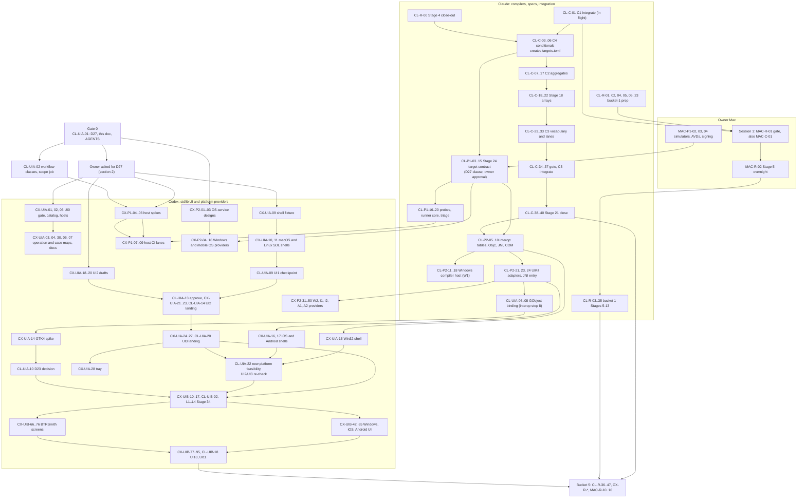

# WORKSTREAMS: path claims, packet dependencies and coordination protocol

**2026-10-07 consolidation (D29).** [PLAN.md](PLAN.md) is the sole active
roadmap and queue for both roles. CLAUDE.md and CODEX.md are compatibility entry
points. This file retains claims and protocol; historical split-file statements
below are superseded by D29. The current session is authorized to implement and
integrate after the required review and gates. No qualification bar is waived.

**Historical protocol status:** in force, 2026-10-03 (D27, §2); amended 2026-10-06 by D28. **Roadmap and decisions:** [PLAN.md](PLAN.md). **Rules every agent follows:** [AGENTS.md](AGENTS.md). **Provider queue:** [PLAN.md](PLAN.md#provider-implementation-queue).
**Contents:** 449 work packets (Claude 185, Codex 209, owner 55), generated from six planning analysts' output plus the writer adjustments in §9 and the review changes in §10, with four packets added on 2026-10-03 (`CX-UIA-30`, `CL-UIA-24`, `CL-R-50`, `CL-P2-29`; [codex-ui-lanes.md](docs/workstreams/codex-ui-lanes.md)).

**D28 (2026-10-06).** [PLAN.md](PLAN.md) is Codex's active queue and results. This file keeps the shared path claims (§3.3), the cross-agent dependencies and the protocol (§3). Where a D27-era clause here conflicts with D28, D28 governs, including a conflicting Codex scheduling clause below that carries no D28 note. Packet ids are kept for traceability.

1. [Purpose and how to use this doc](#1-purpose-and-how-to-use-this-doc)
2. [Decision D27](#2-decision-d27-two-builder-agents-and-which-ui-work-starts-early)
3. [Coordination protocol](#3-coordination-protocol), including the [Codex cloud environment](#311-codex-cloud-environment)
4. [Assignment matrix](#4-assignment-matrix)
5. [Critical paths and timeline](#5-critical-paths-and-timeline), including the [first wave](#54-first-wave-start-immediately)
6. [Packets in full](#6-packets-in-full): [Claude](docs/workstreams/claude.md), [Codex](docs/workstreams/codex.md), [owner](docs/workstreams/owner.md)
7. [Open questions and defaults](#7-open-questions-each-with-the-default-in-force)
8. [Appendices](docs/workstreams/appendices.md#8-appendices)
9. [Writer adjustments](docs/workstreams/appendices.md#9-writer-adjustments)
10. [Review](docs/workstreams/appendices.md#10-review): three review lenses, what changed, what was rejected

## 1. Purpose and how to use this doc

**What this is.** One shared plan for the two builder agents, Claude and OpenAI Codex, and for the owner. It cuts every remaining PLAN.md item into **work packets** and gives each packet one owner, an explicit list of paths it may edit, numbered steps, an acceptance checklist and its dependencies.

**What it is not.** It is not a second roadmap. **PLAN.md is the roadmap and the source of every decision** (D1–D29; D27 is reproduced in §2). CLAUDE.md and CODEX.md are compatibility entry points to it. This doc only assigns the roadmap's items. If the two disagree, PLAN.md wins and Claude fixes this doc. Codex's queue, scheduling and results live in [PLAN.md](PLAN.md) (D28). This doc holds the shared path claims, cross-agent dependencies and the protocol. AGENTS.md's architecture rules (six-stage pipeline, parity, strict imports, naming, generated files) bind both agents and win over everything here.

**The owner's question, answered.**
- **One doc or two?** One. Claude's and Codex's packets share dependencies, paths and gates, and two documents would drift apart within a week. Each agent filters this doc by owner: §6.1 holds Claude's packets, §6.2 Codex's and §6.3 the owner's. (Since D28, Codex's active queue lives in [PLAN.md](PLAN.md); this doc keeps the shared claims and dependencies.)
- **What Codex does.** As suggested, Codex does the GUI for each platform: the stdlib `GUI`, `UI`, `Tray` and `App` providers and, once each contract is approved, the portable contracts. It also takes the work around them that needs no compiler change:
  - the stdlib OS-service providers (Windows, iOS and Android filesystem, process, HTTP and so on);
  - test hosts, packaging, cross-built dependencies and CI lanes for new platforms;
  - evidence harnesses, examples and the BTRSmith UI slices.
- **What Claude keeps.** Everything inside the two compilers, the shared specs, generators, runtime assets, the native readers, interop, the C-compatibility track, the roadmap (PLAN.md), and integration: Claude merges every branch, Codex's included, and runs every gate.
- **Cloud.** Yes, both agents work in Linux cloud containers. macOS and Windows proof comes from GitHub runners on Codex's draft PRs, and Android emulator proof from GitHub's Linux runners with KVM. GitHub capacity is the tight resource (§3.2). Anything that needs the Mac, a device, an account or the owner's ears is an **owner packet** (`MAC-…`), reduced to one command.
- **What you decide.** D27 (§2) amends D1 and D6(c). It is in force from 2026-10-03 because you asked for this split and started Codex; strike any clause you disagree with. You approved Stage 24's early start on 2026-10-03 (§7 Q2). Every other §7 default that would amend a decision is marked **needs owner approval**.

**Packet ids.**
- `CL-` is Claude, `CX-` is Codex and `MAC-` is the owner (the Mac, a device or an account).
- The middle part names the planning group:

| Group | Scope |
|---|---|
| `C` | Bucket 2, Stages 16–21 |
| `P1` | Stages 22–25 |
| `P2` | Stages 26–29 |
| `UIA` | Stages 30–33 |
| `UIB` | Stages 34–37 |
| `R` | The Stage 4 BTRSmith pin bump, the bucket-1 remainder (Stages 5–13) and bucket 5 (Stages 38–43) |

- `CL-REQ-NN` packets are created later from Codex's compiler requests (§3.6).

**Who reads what.**
- **Codex.** Read AGENTS.md first: Codex reads it natively, and its Codex section sits right after the title, inside Codex's read limit (§3.11). Then read [PLAN.md](PLAN.md), your queue (D28), then §3 here for path claims and the protocol. §6.2 keeps the older packet text for traceability. AGENTS.md's Mac capacity, lock, hub, disk and quiet-machine rules describe the owner's Mac and do not apply in your container. Everything about architecture, naming, parity and generated files does apply.
- **Claude.** Read AGENTS.md, PLAN.md, then this doc. Claude is this doc's only editor: it updates the lock table (§3.3) and records done packets at every integration batch.
- **The owner.** Read §2 (D27, in force; strike any clause you disagree with), §5.3 (your sessions, in order), §6.3 (one command each) and §7 (open questions). Every question has a default; the ones marked **needs owner approval** amend a decision and wait for your word, and everything else proceeds on its default.

**How to pick work.** Take a packet that meets all four conditions:
1. you own it;
2. its dependencies are met (§4 and §6): done, or in the state a qualifier names, `(ready)`, `(to finish)`, `(step)` or `(rolling)` (§3.10);
3. its owned paths are free in the lock table (§3.3);
4. it is the earliest such packet on your track in §5, and no struck D27 clause covers it (§2.2).

**Codex under D28.** Codex takes the next unit from [PLAN.md](PLAN.md) whose own prerequisites are met, instead of condition 4's track order. A blocked unit never stops independent units (D28).

The first waves are listed explicitly in §5.4.

**Numbers.** Estimates are **agent-hours** for balancing load between the agents. They are not calendar estimates, and the roadmap (PLAN.md) stays estimate-free (ref:1822). Packet totals after the writer adjustments in §9, the review changes in §10 and the 2026-10-03 UI-lanes changes:

| Owner | Packets | Agent-hours | Start now (dependencies met on `main`) |
|---|---:|---:|---:|
| Claude (`CL-`) | 185 (184 active; `CL-UIB-01` merged into `CL-UIA-01`) | 1458 | 21 |
| Codex (`CX-`) | 209 | 1896 | 30 |
| Owner (`MAC-`) | 55 | 106.3 attended; the Mac is busy about 282.5 h, with 14 overnights | 2 |
| **Total** | **449** | **3460.3** | **53** |

**Where this doc lives.** Packet `CL-UIA-01` commits it as `WORKSTREAMS.md` at the repository root, next to PLAN.md, and links it from AGENTS.md and PLAN.md. That commit is **Gate 0** (`CL-UIA-01` alone; §5.4). Codex's first draft PR (#21) predates it. This doc was generated from the six planning analysts' raw output (`packets.analyst.json`, beside it in the planning scratchpad), the writer adjustments in §9 and the review changes in §10. `packets.json` holds the final packets exactly as §6 renders them.

**Base.** The planning analysts read `main` at `8b73c79`. `main` is now `430a892` (batch 10a, the realtime seam: 5 commits); §9 lists the one file it touches. Three things on `origin` are newer than the analysts' view, and §10 assigns them:
- three Stage 4 lanes are still unmerged: `stage4/c-output-parity` (37 commits), `stage4/btrsmith-defects-compiler` (12) and `stage4/residual-final` (6). `CL-R-00` integrates them before the C4 lane reserves the same hotspots;
- Codex's draft PR #21 (`codex/ui0-catalog`, `b7aa53f`) already implements most of `CX-UIA-02`, and is adopted as that packet;
- CI capacity was measured on 2026-10-03 (§3.2).

## 2. Decision D27: two builder agents, and which UI work starts early

Packet `CL-UIA-01` adds the row below to PLAN.md's Decisions table, word for word. It amends two owner decisions (D1 and D6(c)). **D27 is in force from 2026-10-03:** the owner asked for this split (one plan for Claude, one for Codex, with Codex taking the GUI for each stdlib platform) and then started Codex on it. The owner has not read every clause, so any clause may be struck later; work under a struck clause takes no new packets, and its in-flight packets finish or park. One clause waited for the owner's explicit word, because it reorders Claude's own bucket work rather than adding Codex's: Stage 24's early start after C4 (§7 Q2). On 2026-10-03 the owner asked for all the UI work, iOS, iPadOS and Android included, to run in parallel; that is the word §7 Q2 waited for, so Stage 24's early start is approved.

**If the owner strikes D27 entirely,** only work PLAN already sanctions runs:
- Claude's bucket order: Stage 4's close-out (`CL-R-00`, `CL-R-01`), the C track, Gate 0, the bucket-1 preparation, and `CL-UIA-02`'s CI policy (CI hygiene that `CX-P1-03` needs);
- read-only planning one bucket early (PLAN's phase overview): Stage 22's adaptations (`CX-P1-02`) and the Stage 26–27 designs (`CX-P2-01…03`);
- Stage 23 provisioning (`CL-P1-02`; `CX-P1-03`, the Windows ARM64 job);
- Codex's bucket-2 tooling (`CX-C-01`), which is in order.

Codex's draft PR #21 (the UI0 catalog, `CX-UIA-02`) is integrated in the first batch after Gate 0.

```text
| D27 | **Two builder agents (Claude and Codex); early UI work** | **Status.** In force 2026-10-03: the owner asked for the Claude/Codex split and started Codex on it. The owner may strike any clause; work under a struck clause takes no new packets, and its in-flight packets finish or park. Stage 24's early start (the last clause's first bullet) was approved on 2026-10-03, when the owner asked for all the UI work, iOS, iPadOS and Android included, to run in parallel (WORKSTREAMS.md §7 Q2).<br>**Roles.** Claude (the main session) stays the integrator and the one contract owner D6(c) asks for. It alone changes the compilers, shared specs, generators, generated files, `src/runtime/**` (`c/`, `gpu/`, `windows/`), the native readers, editor tooling (`src/devex/**`, except a file a Codex packet names while no C-track packet holds it) and the hotspot files (Makefile, `flake.nix`, `flake.lock`, `nix/*`, `conftest.py`, `runner_capabilities.py`, `native_plan.py`, `budget_bench.py`, `ci.yml`, `macos.yml`, `windows.yml`, PLAN.md, AGENTS.md). It also applies the integrator-owned data (`btrc.toml` manifests, expected-skip manifests, denominators, `ci/tiers.toml`), which Codex changes only through `fragment:` commits. It approves and freezes every contract, merges every branch and pushes `main`. Codex (OpenAI) is a second builder. It owns stdlib platform providers and UI (`GUI`, `UI`, `Tray`, `App`, except their `btrc.toml`), OS-service providers that need no compiler change, test hosts, packaging and host tooling in `tools/` directories it owns, the lane workflows it creates, fixtures, examples, evidence harnesses and their docs, and the BTRSmith UI slices. It may draft UI contracts as the single designated writer chain. A draft becomes a contract only when Claude approves it under the standing design rule. Codex files a request for any compiler, spec or runtime change, and Claude turns it into a packet. Owner steps are `MAC-` packets, one command each.<br>**Mechanics.** `WORKSTREAMS.md` assigns the packets and their paths. Codex works on `codex/…` branches, claims a packet with a draft PR titled `[CX-…]` that carries a `Packet:` line, opens draft PRs to `main` only to get CI, and never merges. Claude integrates at most two Codex code branches per batch into `main-kn9jxh`. Docs-only branches do not count, and an atomic landing (UI2, UI3, a Stage 34 landing, a Stage 35 track milestone, the Windows FileSystem/Process landing) counts as one. Claude runs D5 and pushes per D4. The parity rule is unchanged.<br>**Amends D1.** D1 still orders Claude's work and the gate queue, except for the early starts named in the last clause. A Codex packet may run ahead of its bucket when its dependencies are met on `main`, or when it is planning or spike work, and it changes no file on Claude's list. Codex batches never displace a bucket 1–3 batch or a quiet window.<br>**Amends D6(c).** The bucket 3–4 platform lanes may be split between the two agents. There is still one contract owner (Claude), and one writer at a time per hotspot. IView, IWindow and `App.btrc` form one Codex writer chain.<br>**UI work that starts now:**<br>• UI0: the focused GUI gate, the catalog and drift test, the host matrix, the BTRSmith caller map and the headless Wayland/X11/AT-SPI tooling;<br>• the native-shell fixture and its macOS and Linux-SDL proofs;<br>• docs-only drafts of the UI2 and UI4–UI9 contracts;<br>• spikes that merge only a findings note: GTK4/WebGPU in plain C, Win32/UIKit/Android shell notes, the collection data model, accessibility bridges;<br>• the 100,000-row fixture generator.<br>**Starts as soon as its in-stage dependencies land,** without waiting for buckets 2–3 to close: the macOS and Linux-SDL halves of UI1–UI3 and the tray (Stages 31–33). UI2 and UI3 approvals are provisional for Windows, iOS and Android until `CL-UIA-22` re-checks them on the real shells. A change then is a versioned contract change, landed atomically with macOS and Linux. If D23 picks GTK4, `CX-UIA-29` ports the Linux UI2/UI3 core to GTK4 before the Linux UI4 work.<br>**Stays gated:**<br>• any portable-contract edit before its packet is approved; such edits land atomically with both reference providers;<br>• the btrc-hosted GTK4 spike and D23, which come after interop step 7 (`CL-P2-24`) and the GObject binding (step 8);<br>• the Windows, iOS and Android shells and UI tracks (Stages 23–29 first);<br>• Stage 34–37 provider work, which waits for the Stage 33 landing, the five shells and `CL-UIA-22`;<br>• BTRSmith screen migration, which waits for its btrc landing and pin bump;<br>• every compiler, spec and runtime change the last clause does not name;<br>• Mac, device and account evidence (D8).<br>**Codex stdlib code while bucket 2 runs:**<br>• no `#if`, `#ifdef` or `#undef` in `src/stdlib` until C4 lands; after that, only conditions valid on every target, and never `#undef`;<br>• no struct member spelled `T[] name` (write `T* name`);<br>• no `volatile T*`;<br>• import every btrc type spelled `struct X`, `union X` or `enum X`;<br>• no identifier that C3 reserves (`inline`, `restrict`, `va_arg`, `_Alignas`, …).<br>Codex stdlib branches are re-gated after C4, r09, r13, the C3 vocabulary commit and r15a.<br>**Claude may also start early** (each item an explicit amendment of D1):<br>• Stage 24 (`CL-P1-03`…`15`) and Stage 25's compiler packets (`CL-P1-16`…`20`), once C4 lands (`CL-C-06`). They interleave with C2/C3 by hotspot, never beside `CL-C-07` or `CL-C-23`, and `CL-P1-05` never beside `CL-C-25` or `CL-C-30`. Interop (`CL-P2-05`…`24`), the GObject binding (`CL-UIA-06`…`08`) and `CL-UIB-16` wait for bucket 2's close (`CL-C-40`);<br>• bucket-1 preparation that measures nothing: the runbook kit, the Stage B key and journal spec, never-merged floor spikes, reference attribution tooling and the host manifests (the x86_64 workflow waits for D7's probe);<br>• Stage 38 CI on runners that already exist: the macOS hardware skip tier, BTRSmith Linux CI and CI tiers;<br>• the BTRSmith UI2 subscriptions and Library.UI split (`CL-UIA-15`…`18`) once UI2 lands, because bucket 1 measures the D9 BTRSmith copy pinned by `CL-R-01`, never BTRSmith `main`. |
```

**D28 (2026-10-06) precedence.** The row above stays as copied. PLAN.md's D28 row supersedes three of its clauses for Codex:
- "Stays gated" bullets 3 and 4 (the Windows, iOS and Android shells and UI tracks; Stage 34–37 provider work), as applied to existing-interface repairs and per-platform slices. Those start on their own demonstrated prerequisites (§2.2, [PLAN.md](PLAN.md)). New contract and feature scope stays gated as written.
- The Roles grant of "the lane workflows it creates". D28 grants Codex no workflow edit, so Claude installs lane workflows (§3.2).
- The Mechanics clause "`WORKSTREAMS.md` assigns the packets". PLAN.md holds Codex's queue; this doc keeps the path claims and the protocol.

### 2.1 How D27 changes D1 and D6(c)

- **D1 (bucket order; UI-first rejected).** D1 still holds for everything Claude builds, except the early starts D27 names. D27 does not reopen UI-first:
  - Claude finishes bucket 2 in order. Its one bucket-3 exception is Stage 24 and Stage 25's compiler packets, which start once C4 lands, because every Windows, iOS and Android lane sits behind them. They interleave with C2/C3 by hotspot and never run beside a C schema commit (`CL-C-07`, `CL-C-23`).
  - Interop, the GObject binding and the availability model (`CL-UIB-16`) stay in bucket order: they wait for Stage 21's close (`CL-C-40`).
  - What changes for Codex is that a second agent can build stdlib UI and platform providers in parallel. It may do so only where every dependency is already on `main`, or where the work is planning or spikes, and it touches none of Claude's files.
  - The cost to Claude is integration time. That is capped at two Codex code branches per batch (an atomic landing counts as one), and Codex batches never displace a bucket 1–3 batch.
  - If the owner strikes the Stage 24 clause, `CL-P1-03` and `MAC-P1-01` wait for `CL-C-40` instead of `CL-C-06`, and every lane behind Stage 24 moves with them. Nothing else in this doc changes.
- **D6(c) (parallel platform lanes in buckets 3–4, one contract owner).** The lanes may now belong to different agents. The **contract owner stays one agent: Claude.** Owning a contract means four things:
  - deciding when it is frozen;
  - running or accepting its review under the standing design rule;
  - being the only agent that may change it after approval, either through a `CL-` packet or by approving a Codex change;
  - integrating it.

  Codex may *draft* the UI contracts (`CX-UIA-18/19/20/24`, `CX-UIB-01…05`, `CX-UIB-10…17`, `CX-UIB-95`). It is the one writer of the contract files once approved, but it never owns them. UI2 and UI3 are approved before the Windows, iOS and Android shells exist, so those approvals are provisional for the three new platforms until `CL-UIA-22` re-checks them (PLAN Stage 32 asks for reviewers who use the real shells).
- **D18, D19–D26.** Unchanged. In particular, C4 still never runs beside C1 (D18). §7 marks every default that would amend one of them as **needs owner approval**.

### 2.2 D27 in one table

| Class | Rule | Packets |
|---|---|---|
| **PLAN-sanctioned without D27** | Runs even if D27 is struck | Claude in bucket order: `CL-UIA-01` (Gate 0), `CL-R-00`, `CL-R-01`, `CL-C-01…`, `CL-C-00`, `CL-C-02`, `CL-REQ-01`, `CL-P1-02`, `CL-UIA-02` (CI policy commit), and the bucket-1 preparation below. Codex: `CX-C-01`, `CX-P1-02`, `CX-P1-03` (after `CL-UIA-02`), `CX-P2-01…03`. |
| **Starts now** (dependencies on `main`, or planning/spike) | No wait for buckets 2–3 | UI0: `CX-UIA-01`, `CX-UIA-02` (follow-up; PR #21's commit is integrated), `CX-UIA-06`, `CL-UIA-21`, `CL-UIA-24`, `CL-UIA-03` (PR #21's ids are on `main`), `CL-UIA-05` (rolling; step 6 first); shell fixture `CX-UIA-09`; UI2 drafts `CX-UIA-18/19/20`; UI4–UI9 pre-drafts `CX-UIB-01…05`; spikes `CX-UIA-12`, `CX-UIA-13`, `CX-UIB-06`, `CX-UIB-07`; generators `CX-UIB-08` (and `CX-UIB-09` with BTRSmith access). Non-UI Codex starters: `CX-P1-03…06` (`CL-UIA-02` is on `main`; under D28 Claude adds their workflows, Q20), `CX-R-01`, `CX-R-03`. |
| **Starts when in-stage dependencies land** | No wait for buckets 2–3 to close | macOS and Linux-SDL UI1–UI3 and the tray: `CX-UIA-03/04/05/07/30`, `CX-UIA-10`, `CX-UIA-11`, `CL-UIA-09`, `CL-UIA-11/12`, `CL-UIA-13`, `CL-UIA-14`, `CL-UIA-19`, `CL-UIA-20`, `CX-UIA-21…28`; the GTK4 port `CX-UIA-29` and `CL-UIA-23` only if D23 picks GTK4 |
| **D28 / PLAN.md** (2026-10-06) | Starts on its own demonstrated prerequisites; a blocked unit never stops independent units | `CX-STDLIB-01…05` (existing-interface repairs taken from `CX-UIA-23/27` and `CX-UIB-18/26/31`) and the per-platform slices: the Windows SDK import, then the Toolhelp thread count; iOS and Android app-private files; the Android NativeActivity host; the mobile lifecycle, one button and one field ([PLAN.md](PLAN.md)) |
| **Gated by bucket 3** (new contract/feature scope only) | Waits for its Stage 23–29 packets | `CX-UIA-15/16/17` (Win32, UIKit, Android shells), `CL-UIA-06…08` (GObject, after interop step 7) and `CX-UIA-14` (GTK4 spike), `CL-UIA-10` (D23), `CL-UIA-22` (new-platform feasibility and the UI2/UI3 re-check), all of Stage 35 (`CX-UIB-42…65`, `CL-UIB-14`, `CL-UIB-19`) |
| **Gated by the Stage 33 landing, the five shells and `CL-UIA-22`** (new contract/feature scope only) | Contract approval `CL-UIB-02` checks against real shells | `CX-UIB-10…17`, `CL-UIB-02…08`, the Stage 34 providers |
| **Gated by the BTRSmith btrc landing** | After the pin bump (`CL-UIB-15`'s step for that landing) | `CX-UIB-66…76`, `CX-UIB-83…85` |
| **Claude early starts** (D27's last clause) | Measure nothing; merge nothing that changes compiler behavior ahead of order, except Stage 24/25 after C4 | Bucket-1 preparation and Stage 38 CI on existing runners: `CL-R-02`, `CL-R-04`, `CL-R-05` (spike branches never merged), `CL-R-06`, `CL-R-23`, `CL-R-36`, `CL-R-37`, `CL-R-38`, `CL-R-50`. After C4 (`CL-C-06`): `CL-P1-03…20`. After UI2 (`CL-UIA-14`): `CL-UIA-15…18`. |

## 3. Coordination protocol

This protocol is fixed. Every packet follows it, and a packet's own text never overrides it.

### 3.1 Roles

| | Claude | Codex | Owner |
|---|---|---|---|
| Builds | Both compilers (`src/compiler/python`, `src/compiler/btrc`) in parity; shared specs (`src/language/*`); generators (`tools/compiler_codegen`); runtime assets (`src/runtime/**`: `c/` and its manifest, `gpu/`, `windows/`); native readers (`tools/NativeHeaderReader.cpp`, `tools/JavaClassReader.c`); native import and lowering; editor tooling (`src/devex/**`); the C-compatibility track; the target contract; interop; boundary records; CI hotspots, lane workflows (D28) and the workflow-class policy; BTRSmith's composition-root and policy work | Stdlib platform providers and UI (`src/stdlib/{GUI,UI,App,Tray}` except `btrc.toml`: providers now, portable contracts once approved); stdlib OS-service providers that need no compiler change; test hosts, packaging and host tooling in `tools/` directories it owns (Claude writes their lane workflow files, D28); fixtures and pytest drivers for its providers; examples; UI evidence and automation harnesses; docs for its areas; BTRSmith UI and platform slices | Steps that need the Mac, hardware, accounts, licences or the owner's ears (D8) |
| Integrates | Every branch, Codex's included, into `main-kn9jxh`; applies every `fragment:` commit; runs every gate; pushes `main` (D4) | Never merges or pushes `main` | Never edits tracked files |
| Decides | Contract approval and freezing (D6(c)), merge order, conflicts, PLAN.md | The order of its active queue in PLAN.md (D28); nothing beyond its own units | D27, D28, and every §7 default marked **needs owner approval**; may override any other default at any time |

### 3.2 Branches, draft PRs and CI

- **One packet, one branch, one PR.** Codex works on a branch whose name starts with `codex/`, ideally `codex/<packet-id-lowercase>` (for example `codex/cx-uia-02`), branched from the current `main`, or from its base branch when it stacks (below).
- **The claim key** is the PR title prefix `[CX-…]` plus the `Packet:` line of the §3.7 report, not the branch name: Codex may not control branch names (PR #21's branch is `codex/ui0-catalog`).
- **Open the draft PR at once.** Open it against `main` as soon as the branch has its first commit; that claims the packet's paths (§3.3).
  - Title: `[CX-UIA-02] <packet title>`.
  - Body: the report template in §3.7, filled in as the work proceeds.
  - If Codex cannot create a draft PR, the title starts with `[DRAFT]`, and Claude treats the PR as a draft.
  - When the CI cap below is reached, a packet without a docs-tier claim commit (policy item 3) opens its draft PR when the slot frees. Until then its planned paths count as reserved through a `Reserved:` row in the lock table (§3.3.2); PLAN.md units included.
- **Stacked branches.** A packet whose dependency is marked `(ready)` stacks on an unmerged contract or base packet:
  - it branches from the base packet's branch, opens its draft PR against `main`, and names the base in the PR body;
  - a base is **ready** when its acceptance is ticked and its draft-PR CI is green;
  - only the base's landing packet merges it: `CL-UIA-14`, `CL-UIA-20`, `CL-UIA-23`, `CL-UIB-05…08`, `CL-UIB-17` or `CL-P2-27`;
  - a stacked packet's owned-path self-check diffs against its base branch, not `origin/main`.
- **Reproduction branches.** D24 keeps a reproduction written before its fix on its own branch, recorded as failing in the catalog. Such a branch (`codex/<id>-<case>-repro`, for example `codex/cx-uia-11-e40-repro`) belongs to the packet that writes it and is never merged. The fix packet lands the reproduction with its fix (`CX-STDLIB-01`, [PLAN.md](PLAN.md), lands E40's; D28).
- **Spike branches.** A spike's prototype (`CX-UIA-12`, `CX-UIB-06`, `CX-UIB-07`) lives on `codex/<id>-spike`, which is pushed but never gets a PR and is never merged. A spike that needs a hosted runner gets one `focus=native-gui` dispatch on that branch (`CX-UIB-07`; policy item 8). The findings PR on `codex/<id>` carries only Markdown outside the test-read set, so it runs the docs tier.
- **Two repositories.** A packet with paths in both btrc and BTRSmith runs as two Codex tasks, one per repository environment, under the same packet id. The btrc half merges first, the BTRSmith half pins it, and the packet is done when both are.
- **What the draft PR is for.** Only CI. Codex never merges or closes a PR, and never pushes to `main`, `main-kn9jxh` or another agent's branch. Claude closes the PR after integrating it.
- **CI on every push** to the draft PR:
  - `ci.yml`: the Linux matrix, the devcontainer and C11;
  - `macos.yml`: macOS shards, the header reader, the AppKit fixtures. Hosted macos-15 exposes a paravirtual Metal adapter: GPU correctness rows run there, while real-GPU timing, pacing and idle-CPU rows stay owner-tier;
  - `windows.yml`: the native bootstrap and the VSIX. It runs a fixed module list; Windows, iOS and Android provider suites run on the host lanes' provider-suite jobs (`CX-P1-07/08/09`).
  - A first `scope` job in each of the three workflows picks one tier and reads `ci/tiers.toml` (`CL-R-38`, batch 16) for the jobs and matrix rows that tier runs:
    - `docs`: Markdown outside the test-read set runs only the `static` job (generated-check, lint, format-check and the naming contract).
    - `lane`: other `codex/*` PRs run the Linux matrix (`scope`, `release`, the 13 test shards, `bench`, `linux-arm64-bundle`, `skip-reports`: about 18 jobs, with lint and format inside `release`), macOS `scope`, `native-bundle` (arm64) and `native-gui`, and Windows `scope` only unless its paths change. A windows.yml run whose other jobs are skipped still concludes success; record it as "green (scope only)". ci.yml's Linux `native-gui` job runs only on a `focus=native-gui` dispatch.
    - `pr`: any other PR runs `static` and the unit shard, plus the corpus shards its changed paths select.
    - `main`: a push to `main`, a full dispatch, the PR label `ci:full`, or a change to `src/compiler/**`, `src/language/**`, `src/runtime/**`, `tools/compiler_codegen/**`, a compiler-import module or a CI hotspot (including `release.yml` and `ci/tiers.toml`) runs today's full matrix on all three workflows.
    - `extended` (a dispatch with `focus=extended`, and the nightly `release.yml` run at 08:23 UTC) adds macOS clang O1 and O3; `release` (a `release.yml` dispatch or a `v*` tag) runs every hosted job and assembles one ledger bundle.
    - The old `docs` job is now `static`, and `release.yml`'s calls prefix every job name.
- **Workflow files a packet owns** follow the lane-workflow class in `test_ci_workflow_contracts.py`: push and pull_request to `main` with a paths filter that includes the workflow file itself, plus `workflow_dispatch` (and `workflow_call` for a reusable workflow). Every pytest job uploads its skip report as its last step, and the packet adds that workflow's row in the same commit.
  - Under D28 Codex edits no workflow file and no `ci/proposed/` file. Claude writes lane workflows from the commands in the packet's `REQUEST`, under the same class policy.
  - `CL-UIA-02` replaced the exact-trigger test with this class policy on `main` (batch 13), so a new lane workflow no longer fails the unit shards and lane-workflow packets no longer wait.
  - Until a workflow file is on `main`, it runs only on its `pull_request` trigger, because GitHub dispatches only workflows on the default branch. Rerun with `gh run rerun <id> [--failed]`.
- **Rerun or focus:**
  - `gh workflow run ci.yml --ref codex/<id>` (likewise `macos.yml`, `windows.yml` and any lane workflow already on `main`);
  - `-f focus=native-gui` runs only the native-GUI job, and `-f focus=extended` the extended tier;
  - read results with `gh run list --branch codex/<id>`, `gh run view <run-id> --log-failed` and `gh run download <run-id> -n <artifact>`.
- **Capacity, measured on 2026-10-03.**
  - One `macos.yml` run is 9 macOS jobs and about 236 runner-minutes; its unit shard alone took 65 minutes in run 37084025400. At most 5 macOS jobs ran at once on this account, and whole runs took 66–125 minutes.
  - One `ci.yml` run is 17 Linux jobs, against the account's 20-job concurrency limit.
  - At 03:17Z three macOS runs and two CI runs were still queued (`main` at 02:13 and 02:29, PR #21 at 02:37).
  - Since `CL-R-38` (batch 16) a `codex/*` PR runs the lane tier, about 22 jobs (18 Linux, 3 macOS, 1 Windows) against the account's 20-job limit, which macOS jobs count toward. So: **at most one Codex PR with a lane- or main-tier run in flight (queued or running)**; docs-tier PRs are uncapped, and a packet's own workflow counts its jobs too. `CL-R-50` made the lane tier path-selective in batch 18: a lane run always has `scope`, `static`, `release` and the unit shard, adds the heavy Linux shards only for stdlib, test-program, example, tool and root-config paths, and adds the macOS jobs only for macOS, GUI and native paths. A lane run reduced to those four jobs (a catalog-data PR, for example; about 60 Linux runner-minutes, no macOS) does not count against the cap. The cap rises to two once the first real heavy lane run's runner-minutes are recorded. Codex pushes when a step's local checks pass, not after every edit.
- **CI feedback loop** (confirm the details in the Codex settings, §3.11):
  - Codex monitors its own draft-PR CI under the Codex CI policy below, for at most 180 minutes after its final push. If the run has not finished, or the task cannot stay alive (§3.11 item 8), it records the run ids in the PR body and ends; Claude's `@codex` comment loop then applies.
  - At each batch, Claude reads the runs. For each red job it posts a PR comment through REST (§3.8) that begins `@codex` and gives the job, the run id and the failing log lines.
  - The owner, or the Codex GitHub integration if PR-comment triggers are on, starts the follow-up task on the same branch.
- **Codex CI policy** (every packet; [`docs/workstreams/codex-ui-lanes.md`](docs/workstreams/codex-ui-lanes.md) gives the exact commands):
  1. Check the tier and the cap before each push. The `gh api …/actions/runs` query lists in-flight `codex/*` runs. Advisory priority: PLAN.md's queue order.
  2. Local acceptance and an owned-path self-check before each push.
  3. Batch corrections. Four pushes per packet (claim, final, two fixes) is a guideline, not a stop: a verified repair may push again (D28). The CI cap and one dispatch per workflow (item 8) still apply, and Codex avoids redundant dispatches (PLAN.md). A claim commit may carry only a non-test-read Markdown file, so the claim runs the docs tier.
  4. Watch `release`, `tests (unit)`, `tests (btrc)` and macOS `native-gui` first. Fix in owned paths and re-push at once.
  5. `gh run watch <id> --exit-status --interval 120`, time-boxed to 180 minutes after the final push.
  6. For a failure the diff cannot cause, compare with `main`'s latest run. Rerun with `--failed` once, for infrastructure failures only; otherwise record it and hand back.
  7. Never add `ci:full`, and never dispatch `full` or `extended`.
     - No Makefile, `ci/tiers.toml` or core-workflow change unless the packet names it as a `fragment:` (§3.5). Such a PR runs the main tier and takes the CI slot.
     - Prefer a `REQUEST` when Claude can land the line first.
     - A lane workflow with a matrix pytest job needs a `ci/tiers.toml` row (`test_ci_workflow_contracts.py:564`); under D28 Claude adds it with the workflow.
  8. At most one `focus=native-gui` dispatch per workflow per packet. Dispatching needs `actions:write`; without it, Claude dispatches and posts the run id.
  9. Hand back when green, after a third red, or at the time box, then continue another independent PLAN.md unit (D28). A pending run or approval never stops unrelated work.
- **BTRSmith** (private) uses the same convention: branch `codex/<id>` in `schiffy91/btrsmith`, a draft PR to BTRSmith `main`, from a second Codex environment (§7 Q19). BTRSmith has no CI until `CL-R-37` (Linux, tagged macOS) and `CL-R-48` (KVM emulator, Windows dispatch); its macOS and iOS evidence comes from owner sessions.
- **Claude's own lanes** keep today's branch names (`stage<N>/<topic>`, `integ/<batch>`). Claude claims a lane by pushing its branch and opening a `[CL-…]` draft PR, with Owned paths first, before the first edit. That claim counts in §3.3 like a Codex draft PR. Lane reports carry the §3.7 fields.

### 3.3 Path ownership and the lock table

**2026-10-08 integration claim:** this authorized session owns the bounded
`codex/integrate-qualified-linux` assembly from compiler `56d548c4` and qualified
Windows main `49f136ec`. Exact Linux source/test paths, retained native evidence,
Mac-only final skip fragments and pending combined gates are recorded in
[the integration report](docs/workstreams/qualified-linux-integration.md).
No UI2 provider work or compiler implementation edits are part of this packet.

**2026-10-08 D29 follow-up claim:** the parent integrator owns
`src/runtime/windows/btrc_win_compat.h`,
`src/tests/python/test_native_win_compat.py` and
`docs/workstreams/windows-arm64-native-toolchain.md` on
`codex/windows-arm64-native-zig` from `fe115d6b` to repair the observed newer-CRT
`mkdtemp` declaration conflict. This retains the Windows qualification gates;
the existing native-toolchain paths remain in the same packet.

**Rule.** A packet holds its **owned paths** from the moment its branch or draft PR exists until Claude integrates or abandons it. While held, no other packet edits those files. Its **must-not-touch** list is binding even when the file is free.

**Integrator-owned data and generated files (§3.3.1) are never held.** Any number of in-flight packets may carry `fragment:` or `derived:` changes to them, and Claude serializes them at integration. A packet lists them as `fragment (not held): <file> <what>`; a Claude landing packet lists them as "(integrator: applies fragments; not held)".

**Before starting a packet:**
1. Check that its dependencies are met (§3.10).
2. Read the lock table below.
3. List the open claims through REST (Claude Code sessions cannot use GraphQL, so `gh pr list` fails there):
   `gh api 'repos/schiffy91/btrc/pulls?state=open&per_page=100' --jq '.[]|"\(.number) \(.head.ref) \(.title)"'`
   Claims are the `[CX-…]` and `[CL-…]` draft PRs, plus Claude's lanes in the table.
4. If any owned path is held, take another packet, or ask the holder in its PR to carry your hunk.
5. Open the draft PR with **Owned paths** as the first section of its body. That is the claim.

**Shared append-only files.** Two packets may each append to these; whichever merges second rebases:
- table rows in `tools/bench/scripts/README.md` (`CX-C-01`, `CL-R-02`);
- separate sections of BTRSmith `docs/NativePlatformPlan.md` (`CX-P1-01`, `CL-UIA-03`, `CL-R-00`);
- separate sections of `docs/design/ci-health.md` (`CL-R-36`, `CX-P2-18`);
- workflow rows in `src/tests/python/test_ci_workflow_contracts.py` (one per lane workflow, which Claude adds under D28; the policy itself is Claude's: `CL-UIA-02`, now `CL-R-50`);
- `native_ui_shell_fixtures.py` (`CX-UIA-09`, then `CX-UIA-15/16/17`). `test_native_ui_shell.py` holds the portable harness (`CX-UIA-09`); each platform's rows live in its own `test_native_ui_shell_<platform>.py`, created by `CX-UIA-09` (macos, linux) or by that platform's shell packet, and then owned by that platform's packets;
- new parametrization rows in `src/tests/python/test_native_cxx_owners.py` (`CX-P2-30`);
- the UI catalog's shard documents under `docs/design/native-ui-catalog/`: `families.toml`, `operations/<Owner>.toml`, `cases/E<aa>-E<bb>.toml`, `surface/<Stem>.toml`, `evidence/<kebab-name>.toml|.jsonl`, `amendments/<packet-id-lowercase>.toml` and `hosts.toml`. Each file is held by one packet, as listed in its README; the layout and admission rules live in `tools/qualification/ui_catalog.py`. Classification of a slot lives in exactly one file; evidence may come from several, and the last in ledger order wins (schema.py). The seed `docs/design/native-ui-catalog.toml` changes only through reviewed releases (§7 Q35, Q36). Until `CL-UIA-24` repoints the frozen sources, no packet adds a row shaped ``| `Owner.member` |`` to `native-ui-api-inventory.md` or changes an N/E row id in `native-ui-parity.md`. No test or tool names a Markdown file outside ci.yml's `TEST_READ_MARKDOWN` (`test_scope_counts_every_markdown_file_a_test_or_tool_reads_as_code`).

iOS and iPadOS are one platform family: one provider directory (`GUI/IOS`, `App/IOS`), one ledger family (`ios`), with iPad as `provenance.device_class`. They take one lane, not two. Holds stay per packet, so a platform's parallel-safe packets (for example `CX-UIB-44` ∥ `45`) run at once.

#### 3.3.1 Who may edit which files

| Class | Paths | Editor | How the other agent gets a change |
|---|---|---|---|
| Compiler sources | `src/compiler/**` | Claude | `REQUEST(…)` (§3.6) |
| Shared specs and generators | `src/language/**`, `tools/compiler_codegen/**` | Claude, one owner per schema commit | `REQUEST(…)` |
| Generated files | `src/compiler/python/syntax/ast/generated.py`, `…/abi/generated.py`, `…/abi/native_generated.py`, `…/runtime/generated.py`, `src/compiler/btrc/generated/**`, `src/stdlib/btrc.lock`, `src/stdlib/btrc.symbols`, `src/devex/lsp/catalog/generated.py` | Regenerated by Claude, never edited by hand; never held | A `derived:` commit, which Claude drops (§3.5) |
| Runtime and readers | `src/runtime/**` (`c/` and its manifest, `gpu/`, `windows/`), `tools/NativeHeaderReader.cpp`, `tools/JavaClassReader.c`, the boundary manifest | Claude (one D14 re-capture per commit) | `REQUEST(…)`: `CL-P2-28` for GPU platform branches, `CL-P2-14` for the Windows shims |
| Editor tooling | `src/devex/**` | Claude (construct commits keep it in step with the parsers); Codex only in packets that name the file, never while a C-track packet holds it | `REQUEST(…)` |
| Hotspots | `Makefile`, `flake.nix`, `flake.lock`, `nix/*`, `src/tests/conftest.py`, `src/tests/runner_capabilities.py`, `tools/native_plan.py`, `tools/budget_bench.py`, `.github/workflows/{ci,macos,windows}.yml`, lane workflow files (Claude writes them from a Codex `REQUEST`, D28), the policy in `test_ci_workflow_contracts.py`, `tools/qualification/*.py` (existing modules), PLAN.md (a pointer), AGENTS.md, PLAN.md | Claude, one holder at a time | A `fragment:` commit (Makefile lines, CI tier lines) or `REQUEST(…)` |
| Integrator-owned data | `src/stdlib/**/btrc.toml` exports and native rows, `src/tests/fixtures/expected-skips/*.json` (including new runner manifests), `tools/qualification/denominators.toml`, `ci/tiers.toml`, the totals table in `docs/design/platform-parity.md` | Claude applies them; never held | A `fragment:` commit |
| Compiler-import stdlib modules | The root prelude, `BackgroundJobs` (`HostWorkerPools`, `WorkerPools`, `WorkerPoolProvider` and its providers, `ProcessThreads` and its providers), `Bytes`, `Callback`, `Console`, `Digest`, `FileSystem`, `IO`, `Iterable`, `JSON`, `Map`, `Math`, `OwnedBuffer`, `Platform`, `Process`, `Result`, `Strings`, `TOML`, `Timer`, `Vector` | Claude, or a Codex packet that names the file, under the rule in §3.4 | `REQUEST(…)` |
| Inventory cells | `docs/design/platform-inventory.toml` | Either agent, only the cells of operations its packet implements; Claude merges conflicts. The frozen denominator never changes | — |
| Codex areas | `src/stdlib/{GUI,UI,App,Tray}/**` except `btrc.toml` (portable contract files only after approval), stdlib OS-service provider directories (`FileSystem/Windows`, `HTTP/IOS`, …), `tools/{target_hosts,windows_toolchain,xbuild,audio_rig,ui,ui_evidence,devices,android,apple}/**`, its fixtures and test modules, `docs/design/native-ui-*.md` and the UI catalog, `examples/**` | Codex, per packet | Claude asks in the PR, or opens a `CL-` packet |
| Frozen | `docs/design/plan-reference.md` | Nobody | — |

#### 3.3.2 In-flight lock table (snapshot; Claude updates it in every integration merge commit)

Between updates, the source of truth is the set of open `[CX-…]` and `[CL-…]` draft PRs plus the Claude lanes listed here. [PLAN.md](PLAN.md) lists Codex's active units and their paths. Claims and reservations are recorded in this table: a unit holds its paths once its draft PR exists, and a `Reserved:` row reserves them before that (§3.2).

| Packet | Agent | Branch | Holds | State |
|---|---|---|---|---|
| Canonical tuple declaration order | Codex integrator under D29 | `codex/compiler-tuple-canonical-order` | `src/compiler/python/ir/lowering/translation_unit.py`; `src/compiler/python/ir/lowering/generics.py`; `src/compiler/btrc/ir/lowering/Declarations.btrc`; `src/tests/python/test_native_link_reuse.py`; `src/tests/python/test_generic_tuple_declarations.py`; `src/tests/btrc/test_tuple_typedef_parity.py`; `docs/workstreams/compiler-tuple-canonical-order.md` | Active 2026-10-08: hosted root71 exposes one tuple-order parity failure after canonical generic ordering. Preserve complete discovery and nested by-value dependencies; implement paired canonical tuple ordering under G12, with source-frozen fixtures and full boundary recapture before integration. |
| Interface-parent reachability | Codex integrator under D29 | `codex/compiler-interface-parent-reachability` | `src/compiler/python/ir/lowering/reachability.py`; `src/compiler/btrc/ir/lowering/Reachability.btrc`; `src/tests/python/test_stdlib_reachability.py`; `src/tests/btrc/test_interface_inheritance_reachability.py`; `docs/workstreams/interface-parent-reachability.md` | Active 2026-10-08: fixture-only `72be5947` proves three failures/eight passes; reviewed paired fix `808592c9` passes ten reference checks. Fresh Linux self-host and all 11 compiler regressions pass; Grid04 four native rows pass and four genuine negative controls reach the intended identity assertion; other96 rerun remains active after an isolated fixture typing correction. Initial four strict-C failures and original archives retained; no emitter fallback or gate waiver. |
| macOS GUI coordination | Codex under D29 | `codex/macos-shell-lifecycle` | `src/tests/conftest.py`; `src/tests/python/test_macos_gui_coordination.py`; marker-only edits in `test_native_gui_appkit.py`, `test_native_app_runtime.py`, `test_native_pointer_runtime.py`, `test_native_control_sizing_runtime.py`, `test_native_tray_runtime.py`, `test_native_webgpu_imports.py`, `test_native_objective_c_delegates.py`, `test_native_ui_shell_macos.py` (all under `src/tests/python/`); `docs/workstreams/macos-gui-coordination.md` | Reserved 2026-10-08 by integrator assignment; source and pure-process proof only while native build lane is occupied. No native qualification claimed. |
| `CL-C-01` | Claude | `stage16/ccompat-c1-integrate` | — | integrated in batch 12 (C1 exit; Mac BTRSmith rerun owed) |
| `CL-R-00` | Claude | `stage4/btrsmith-defects-compiler`, `stage4/residual-final`, `stage4/c-output-parity` | — | integrated in batch 11, with the Stage 4 drift ledger in `src/stdlib/README.md`; `CL-R-01` (the BTRSmith pin bump) remains |
| `CX-UIA-02` (adopted from PR #21) | Codex | `codex/ui0-catalog` (`b7aa53f`); the follow-up `codex/cx-uia-02-shards` (`98cf54c`, PR #22) | — | first commit integrated in batch 11 (PR #21 closed); the follow-up integrated in batch 20 with two integrator fixes to `ui_catalog.py` (placeholders for every frozen release, `--kind surface`); `ui_catalog.py` is now a Claude hotspot. Wave 2 (`CX-UIA-03`, `04`, `30`, `05`) branches from `main` |
| `CX-UIA-18`, `CX-UIA-19`, `CX-UIA-20` | Codex | `codex/cx-uia-18`, `-19`, `-20` (PRs #25, #24, #23) | — | drafts integrated in batch 20 (`docs/design/ui-contracts/`); `CL-UIA-13` reviews them together; `CL-P2-22` may start on 19 and 20 |
| `CX-UIB-01`, `CX-UIB-02` | Codex | `codex/cx-uib-01`, `-02` (PRs #29, #27) | — | pre-drafts integrated in batch 20 (`docs/design/native-ui-contracts/`); `CL-UIB-02` reviews them |
| `CX-UIA-13` | Codex | `codex/cx-uia-13` (PR #28) | — | notes integrated in batch 20 (`docs/design/native-ui-shells/{windows,ios,android}.md`); `CL-UIA-12` reviews them |
| `CX-UIB-03`…`06` | Codex | `codex/cx-uib-03`…`06` (PRs #30, #31, #32, #44) | — | pre-drafts and the collection-model findings integrated in batch 21 (`docs/design/native-ui-contracts/`); `CL-UIB-02` reviews them |
| `CX-P2-03` | Codex | `codex/cx-p2-03-r2` (PR #50; first draft #36) | — | approved by `CL-P2-01` round 2 and merged in batch 31 (`docs/design/mobile-storage.md`); its non-blocking items ride the first implementation packet |
| `CX-P2-01`, `CX-P2-02` | Codex | `codex/cx-p2-01-r2` (PR #52), `codex/cx-p2-02-r2` (PR #51) | the design docs | revision 4 pushed (#52 `d77b4b14`, #51 `0fa4c093`), docs CI green; awaiting `CL-P2-01` round 4 (Claude). Round 2 resolved every round-1 blocker; round 3 returned both in batch 36 (4 and 8 blockers) |
| `CX-UIA-12` | Codex | `codex/cx-uia-12` (PR #38; spike `codex/cx-uia-12-spike`, never merged) | — | findings integrated in batch 21 (`docs/design/linux-gtk4-feasibility.md`); `CL-UIA-12` reviews them |
| `CX-UIA-10`, `CX-UIA-06` follow-up | Codex | `codex/cx-uia-10` (#54), `codex/cx-uia-06-followup` (#56) | — | integrated in batch 36 (AppKit accessibility and key-view evidence with the AX gate bound to fixture controls; the integrator applied the PR's verified promotion of the four test records to the fixed-gate run, artifact 11354918053. Evidence routes bound to trusted runners and devices). Returned the same day: `CX-P1-03` (#53, must build on `tools/target_hosts/windows`), `CX-P2-01` round 3 (#52, 4 blockers), `CX-P2-02` round 3 (#51, 8 blockers) |
| `CX-P1-06` | Codex | `codex/cx-p1-06` (#43); follow-ups `codex/cx-p1-06-native-hardening` (#58, `6ec9b9dc`) | `tools/target_hosts/windows/**` (#58) | integrated in batch 35 (gated Windows executor with a kill-on-close Job Object, Linux cross-build bundles for x64 and ARM64, native checker); the integrator added `.github/workflows/host-windows.yml` (its REQUEST), whose first run on `main` is the native evidence. Before `CL-P1-17` freezes the protocol: the status file must leave the target's cwd, `prepare()` must be atomic, and admission must pin argv and expected outcomes. Follow-ups open in #58, green (CI 37358029674; Host Windows 37358027694, 16/16 native cases on x64 and on ARM64); awaiting Claude integration, which comes before #53 rebases onto that host |
| `CX-UIA-11` | Codex | `codex/cx-uia-11` (#55); the E40 reproduction stays on never-merge `codex/cx-uia-11-e40-repro` (`bbe4f56e`) until `CX-STDLIB-01` ([PLAN.md](PLAN.md), D28) lands it with the fix | — | integrated in batch 34 (Linux SDL shell evidence in `ui1-linux.toml`; bounded Wayland/libdecor and X11 clipboard probes). Follow-ups on the PR: `observed` holds the outcome word; probes get a whole-program watchdog and no side effects inside `assert()`; the Wayland acceptance row waits for the libdecor fix. `CX-UIA-10` (#54) was returned: its AX gate passes without the Commit button; follow-up #57 integrated in batch 38 (E40 records now count as failed; probes bounded and NDEBUG-safe; the clipboard probe compiles in CI; the integrator keeps `bbe4f56e` reachable on branch `evidence/cx-uia-11-e40-repro` (the proxy refuses tags)) |
| `CX-UIA-06`, `CX-UIB-08` | Codex | `codex/cx-uia-06` (#49), `codex/cx-uib-08` (#48) | — | integrated in batch 32 (UI evidence host map and Linux desktop check; the 100,000-record collection fixture). Follow-ups on the PRs: hosts validator binding runner/device to platform; record-key tie-break before `CX-UIB-28` |
| `CX-P1-03` | Codex | `codex/cx-p1-03` (#53) | `tools/windows_toolchain/**` | returned again in batch 36 at `958d309b` (push 2/4): rebase onto `tools/target_hosts/windows` once #58 is integrated; Claude adds `windows-arm64.yml` (D28). First returned in batch 32 (no `windows-arm64.yml` or `ci/proposed/` file, which D28 makes Claude's; 0 of 5 acceptance items; depended on #43; VsDevCmd quoting) |
| `CX-UIA-09`, `CX-UIA-01` | Codex | `codex/cx-uia-09` (#40), `codex/cx-uia-01` (#33) | — | integrated in batch 30 (the UI1 shell fixture; the UI0 focused-gate runbook, setup script and coverage test) |
| `CX-UIB-07` | Codex | `codex/cx-uib-07` (#42), prototype `codex/cx-uib-07-spike` | its findings doc | open: macOS run 37217909473 on the repaired prototype refused `(void*)surface.nativeView()` in both compilers (the probe's parameter is not declared a read-only borrow); see the PR. Its 4/4 push stop is lifted by D28; AX trust (acceptance item 1) stays unknown until `CL-UIB-09`; see [PLAN.md](PLAN.md) |
| `CX-UIA-30`, `CX-UIA-04` | Codex | `codex/cx-uia-30` (#45), `codex/cx-uia-04` (#46) | — | case map (470 slots) and operation map B integrated in batch 23; cells stay implemented-unverified until the evidence follow-up |
| `CX-UIA-03` | Codex | `codex/cx-uia-03` (#47) | — | operation map A integrated in batch 24 (81 frozen ids, 15 pending factories; `GUI.rasterText` retired); cells implemented-unverified until the evidence follow-up |
| `CX-P1-02` | Codex | `codex/cx-p1-02` (#41) | — | `platform-adaptations.md` integrated in batch 23 for the owner's sign-off; its 58-cell `platform-inventory.toml` patch (PR body) and the `platform-parity.md` totals wait for that sign-off |
| `CX-P1-04`, `05` | Codex | `codex/cx-p1-04` (#34), `-05` (#35) | their `tools/target_hosts/**` | repaired on 2026-10-04 (`55a71b8c`, `628a4a54`), not yet re-reviewed; awaiting integrator review plus Claude-added `host-ios.yml`/`host-android.yml` (D28). Returned in batch 23: no workflow was committed (D28 now makes the workflows Claude's), Android app mode could not work with real adb, and the iOS spawn timeout leaked its child. `CX-P1-06`, returned with them, is integrated (its own row above) |
| `CX-C-01` | Codex | `codex/cx-c-01` (PR #26) | `tools/bench/scripts/ccompat_checkpoint.sh`, one README row, `test_ccompat_checkpoint_script.py` | integrated in batch 26; its first real run is `MAC-C-02`. Follow-ups (minor, fail closed): the RED gate's step lines in `summary.txt`, optional parent budget runs, the quiet verdict in `summary.json`, the macOS socket path length. BTRSmith's btrc input moves to a branch URL in `CL-R-01`, so `MAC-C-09`'s flake.lock-only bump can work |
| UI0 evidence promotion | Claude | `stage30/ui0-evidence-promotion` | — | integrated in batch 26 (438 operation cells passed from runs 37171132726/37171133887; the loader lets an observation of the same revision supersede an inventory audit) |
| `CL-UIA-01` (Gate 0) | Claude | — | — | done: `main` at `7a83bb1` |
| `CL-UIA-02` | Claude | `stage30/ci-codex-lanes` | — | integrated in batch 13, with the `test-native-gui` Makefile target applied by the integrator; releases the workflows to `CL-R-36` |
| `CL-C-00`, `CL-C-02` | Claude | `stage19/c-prep` | — | integrated in batch 12 (CL-C-02 keeps one btrc check site, `ControlFlowValidator`, because `validation/Expressions.btrc` cannot import `ControlFlow.btrc` without an import cycle) |
| `CL-REQ-01` | Claude | — | — | done: already fixed by `3812e44`, no code change |
| `CL-REQ-02` | Claude | `stage18/req02-objc-emitter-transpile` | — | integrated in batch 13 |
| `CL-REQ-03` | Claude | `stage18/req03-module-unit-corpus` | — | integrated in batch 14 |
| `CL-REQ-04` | Claude | `stage18/req04-formatter-indent` | — | integrated in batch 15 |
| `CL-UIA-21` | Claude | `stage30/headless-gui-shell` | — | integrated in batch 13 (`tools/ui/headless-session.sh` and `test_headless_session.py` included) |
| `CL-R-02` | Claude | `stage5/runbook-kit` | — | integrated in batch 13 |
| `CL-R-01` | Claude | BTRSmith `stage4/pin-bump` (`8204b8a`) | BTRSmith `flake.nix`, `flake.lock`, `src/**`, `tests/**`, `tools/**`, `make/**`, `docs/Handoff.md` | Linux done (the three named failures and two flaky tests fixed; the btrc input follows a branch URL, lock unchanged); waits for `MAC-R-01` |
| `CL-C-03` | Claude | `stage16/c4-spec` | — | integrated in batch 14 |
| `CL-C-05`, `CL-C-06` | Claude | `stage16/c4-python`, then `stage16/c4-conditionals` (the one paired commit) | — | C4 integrated in batch 19 (the paired construct commit plus the ten review fixes); Stage 24 (`CL-P1-03`) and C2 may start |
| `CL-P1-01` | Claude | `stage22/doc-closeout` | — | integrated in batch 14 |
| `CL-P1-02` | Claude | `stage23/platforms-shell` | — | integrated in batch 16 (`nix develop .#platforms`; the Mac realization and AVD boot are `MAC-P1-03`'s) |
| `CL-R-38` | Claude | `stage38/ci-tiers` | — | integrated in batch 16 (`ci/tiers.toml`, `release.yml`, `tools/qualification/{tiers,bundle}.py`); push CI on `901728a` and the `release.yml` dispatch 37140445563 (one ledger bundle) were green |
| `CL-R-50` | Claude | `stage38/lane-tier-paths` | — | integrated in batch 18 (`[paths]` sets and `selected_tiers` in `ci/tiers.toml`); the first real Codex lane run is still to be measured |
| `CL-UIA-24` | Claude | `stage30/ui-ledger-releases` | — | integrated in batch 18 (several releases per kind, `retired`, the 2026-09-21 ui-operation and ui-case sources read from the seed with unchanged digests); step 4 (the family-cell source read from `families.toml`, digest unchanged) integrated in batch 28 on `stage30/ui0-report` |
| `CL-UIA-05` step 5 | Claude | `stage30/ui0-report` | — | integrated in batch 28 (`make qualification-report` renders the UI catalog section) |
| `CL-R-05` | Claude | `stage6/spikes-preset` (spikes `spike/stage6-*`, never merged) | — | preset integrated in batch 18; its rehearsal runs with `--stand-in` in the cloud; the measurements are `MAC-R-03`'s |
| `CL-REQ-05`, `CL-REQ-06` | Claude | `stage18/req05-lambda-capture`, `stage18/req06-scope-capture` | — | integrated in batch 19; REQ-06's deferred parity gaps (enum-constant shadowing, `class int* p = &Box.x`, first-error order, `CFunction` in `@realtime`) await a packet |
| `CL-P1-03` | Claude | `stage24/targets-schema` | — | integrated in batch 22 (Stage 24 commit 1a: targets.toml schema 2, 11 rows); `CL-P1-04` (commit 1b) is next and must first call `architectureAliases()`/`defaultEnvironments()` and drop them from the structure test's definition-only list |
| `CL-P1-04` | Claude | `stage24/target-owner` | — | integrated in batch 29 (one target owner per compiler); environment-aware macro selection moved to `CL-P1-05`, which waits for `CL-C-08` (landed in batch 33) and for `CL-REQ-09` (both edit `Constants.btrc`) |
| `CL-UIA-11` | Claude | `stage31/linux-gui-audio-shard` | — | integrated in batch 50 (Linux GUI and audio shard: x11 gating, wayland report-only until it runs green on main; the native-shell close wait landed with it); CI-tiering follow-ups recorded in the integration record |
| `CL-P1-05` | Claude | `stage24/target-data-model` | — | integrated in batch 48 after two review rounds (per-row literal typing and long casts, environment-aware predefined macros over all 11 rows, M3 refusal of `#define`/`#undef` of predefined names from a generated names list, per-OS release C with incremental row stamps, the Python stdlib archive keyed by row); `CL-P1-06` (commit 1d, the LSP `btrc.target` setting and the sub-batch 1 gate) is next |
| `CL-P1-07` | Claude | `stage24/hosted-platform-extractor` (fragments on never-merge `stage24/hosted-platform-fragments` `1020307`) | — | integrated in batch 31 after two review rounds; `CL-P1-08` consumes the fragments and must run the extractor on a Linux host |
| `CL-REQ-07` | Claude | `stage18/req07-module-unit-staleness` | — | integrated in batch 22 (SB-D1…D8 fixed, plus a stale `__LINE__`/`__FILE__` default) |
| `CL-R-23` | Claude | `stage10/host-manifests` | — | integrated in batch 16; `adapters.py` does not yet carry `host_manifest` into the ledger records |
| `CL-R-04` | Claude | `stage6/stageb-spec` | — | integrated in batch 16 (docs only); its defects SB-D1…D8 wait for the C4 landing, and SB-D9 is `CL-REQ-05` |
| `CL-R-36` | Claude | `stage38/macos-hardware-tier` | — | integrated in batch 15 (`macos-hosted` runner manifest, `hardware` skip category); releases the workflows to `CL-R-38` |
| `CL-R-06` | Claude | `stage6/reference-attribution` | — | integrated in batch 15 |
| `CL-C-04` | Claude | `stage16/c4-directives` | — | integrated in batch 13 |
| `CL-C-07` | Claude | `stage17/c2-schema` | — | integrated in batch 25 (the C2/Stage 18 schema; parsers still refuse the new forms); `CL-C-08` is next, and `CL-P1-04` may run beside it |
| `CL-REQ-08` | Claude | `stage18/req08-static-tuple-typedef` | — | integrated in batch 37 (btrcc declares tuple typedefs spelled only at file scope; both compilers walk generic code only through its instances). `CL-REQ-09` (`stage18/req09-float-literal-double`) and `CL-C-13` (`stage17/c2-l2`) were returned the same day: one blocker and six blockers |
| `CL-C-08` | Claude | `stage17/c2-shared-owners` | — | integrated in batch 33 (record-member, initializer-slot and integer-constant owners in both compilers, with three contract tests); C2 lanes `CL-C-09` and `CL-C-13`, `CL-REQ-09` and then `CL-P1-05` may start |
| `CL-R-37` | Claude | BTRSmith `stage38/btrsmith-ci` (`6658536`) | — | workflows proven (warm 50–57 billed minutes, cold about 250); the draft PR waits for `CL-R-01`'s three product fixes and the owner's check of plan minutes (D26) |
| `CX-PLAN-01` | Codex | `codex/stdlib-lane-plan` (#59) | — | integrated in batch 39 ([PLAN.md](PLAN.md) and the D28 owner update) |
| Reserved: C3 schema (`CL-C-23`) | Claude | — | the ASDL, `Node`, IR and both parsers | after C2's lanes; never beside `CL-P1-03`…`06` per D27 |
| Reserved: `flake.nix`/`nix/*` | Claude | — | free | queue |
| Reserved: `macos.yml`/`ci.yml`/`windows.yml`/`release.yml` | Claude | — | free; next `CL-UIA-11` (after `CX-UIA-09` and `CX-UIA-11`), then `CL-UIB-04`, then `CL-UIB-14`. `CL-R-50` edits `ci/tiers.toml` and the contract test, not the workflows | queue |
| Reserved: lane workflows (D28) | Claude | — | `.github/workflows/host-ios.yml` (for #34), `host-android.yml` (for #35), `windows-arm64.yml` (for #53) | queue: Claude adds each from its PR's `REQUEST` or commands; the reviewer-drafted `windows-arm64.yml` already passes `test_ci_workflow_contracts.py` |
| Reserved: `CX-STDLIB-01` (Codex, PLAN.md) | Codex | — | `src/stdlib/GUI/Linux/{LinuxApplication,LinuxSelect,LinuxTextField,LinuxWindow}.btrc`; its event fixture under `src/tests/native/gui/linux/`; the probes under `src/tests/native/gui/ui2/probes/linux/`; `src/tests/python/test_native_ui_linux_spike.py` (the moved collector; the old collector is removed); the new catalog shard `docs/design/native-ui-catalog/evidence/ui2-linux-e40.toml`, with the E40 hunk in `cases/E25-E47.toml` carried per §3.3 step 4 | unpublished, no draft PR yet. Later packets that list these paths (`CX-UIA-23`, `CX-UIA-27`, `CX-UIB-21`, `CX-UIB-26`, `CX-UIB-31`, `CX-UIB-33`) wait for it (§3.9) |
| Reserved: `CX-STDLIB-02` (Codex, PLAN.md) | Codex | — | `src/stdlib/GUI/Linux/{LinuxGrid,LinuxStack}.btrc`; `src/tests/native/gui/layout/linux/{LinuxGridScrollResize,LinuxStackScrollResize}.btrc`; `src/tests/python/test_native_ui_layout_resize.py` | unpublished, no draft PR yet. First `LinuxGrid` writer; `CX-STDLIB-04` follows it. `CX-UIB-26` waits for it (§3.9) |
| Reserved: `CX-STDLIB-04` (Codex, PLAN.md) | Codex | — | `src/stdlib/GUI/Linux/LinuxGrid.btrc` after `CX-STDLIB-02`; a `LinuxViewNode` validation change (`LinuxView.btrc`) needs its own explicit row | unpublished; reproduce before fixing (PLAN.md). `CX-UIB-26` waits for it (§3.9) |
| Reserved: `CX-STDLIB-05` (Codex, PLAN.md) | Codex | — | `src/stdlib/GUI/Linux/LinuxScrollView.btrc` and its dedicated fixture and driver | unpublished; independent of the grid writer. `CX-UIA-23`, `CX-UIA-27` and `CX-UIB-31` wait for it (§3.9) |
| Reserved: `CX-STDLIB-03` (Codex, PLAN.md) | Codex | — | `src/stdlib/GUI/MacOS/MacOSButton.btrc`; `src/tests/native/gui/controls/macos/ButtonAlignment.btrc`; the narrow fixture registration in `src/tests/python/test_native_gui_appkit.py` (coordinated with any active AppKit harness writer) | unpublished, no draft PR yet. `CX-UIB-18` (`MacOSButton.btrc`, `controls/macos/Button*.btrc`) waits for it (§3.9) |

### 3.4 Parity rule, and the stdlib modules the compiler imports

- **Parity.** Anything that changes either compiler's observable behavior is a Claude packet. It lands paired (Python half and btrc half in one commit), or btrc-internal with byte-identical output (AGENTS.md; PLAN "Python/btrc halves"). Codex never edits `src/compiler/**`. If Codex is unsure whether a change alters compiler behavior, it treats the change as Claude's and files a request.
- **Compiler-import stdlib modules.** The self-hosted compiler imports these transitively on `430a892`, so a change to them changes `btrcc`: the root prelude, `BackgroundJobs` (`HostWorkerPools`, `WorkerPools`, `WorkerPoolProvider` with its `Unix` and future Windows providers, `ProcessThreads` with its providers), `Bytes`, `Callback`, `Console`, `Digest`, `FileSystem`, `IO`, `Iterable`, `JSON`, `Map`, `Math`, `OwnedBuffer`, `Platform`, `Process`, `Result`, `Strings`, `TOML`, `Timer` and `Vector`. `BackgroundJobExecutor.btrc` and `NativeWorker.btrc` are outside the closure.
  - Codex edits them **only in packets that name the file**: the Stage 26 OS-service providers `CX-P2-04`, `-05`, `-06`, `-14`, `-15`, `-37` and `-42`.
  - Such a packet:
    1. builds its own `btrcc` (`make btrcc`);
    2. reaches the bootstrap fixed point, locally (`make bootstrap`) or through `ci.yml`'s bootstrap shard on its draft PR (§3.11);
    3. transpiles `src/compiler/btrc/BtrccMain.btrc`, `cli/WindowsMain.btrc` (windows-x86_64 and windows-aarch64) and `cli/MacOSMain.btrc` with zero analyzer warnings;
    4. shows that `btrcc`'s own C is byte-identical for every host entry: `BtrccMain` and `cli/WindowsMain` (both Windows targets) locally on Linux, and `cli/MacOSMain` through `macos.yml`'s bootstrap shard, because a Linux container cannot produce macOS-target C. No packet text waives this check.
  - A packet that changes `btrcc`'s own C by design, as the Windows FileSystem and Process providers do for `cli/WindowsMain`, lands through a Claude packet that owns the check and the native Windows bootstrap: `CL-P2-27`.
  - Defect fixes found in these modules during triage go to Claude (`CL-P1-20` in Stage 25; its set includes `Process.btrc`).
- **Root modules and `btrc.symbols`.** Every root module (`src/stdlib/*.btrc`) feeds `btrc.symbols`, which both compilers use for strict-import ownership of every canonical stdlib symbol (`frontend/symbol_index.py`, `FeStdlibSymbolDigest`).
  - A change to a root module's public top-level declarations shows up as an owner-line diff in `btrc.symbols`. Paste that diff in the PR body; Claude approves it at integration. A rename or removal is a `REQUEST`.
  - Any root-module edit, even inside a body, changes the file's CRC header, so the branch needs its `derived:` commit to pass `generated-check`.
- **Everything else in `src/stdlib`** is tested against the integrator's pinned `btrcc` (`BTRC_TEST_BTRCC=…`) and needs no bootstrap.

### 3.5 Generated and integrator-owned files: `fragment:` and `derived:` commits

A branch that changes integrator-owned data ends with up to two special commits, after all product commits, so its draft-PR CI can still go green:

1. **`fragment: <what>`** carries hand-written changes to the integrator-owned data in §3.3.1:
   - `btrc.toml` exports and native rows;
   - expected-skip rules and new runner manifests;
   - denominator releases;
   - Makefile target lines;
   - `ci/tiers.toml` lines;
   - inventory totals.

   Claude re-applies the content in the merge commit, possibly adjusted. A new runner name that `RUNNERS` in `tools/qualification/skips.py` lacks also needs an entry there, which Claude adds: `windows-arm64` and `windows-corpus` do; `ios` and `android` are already listed.
2. **`derived: regenerate`** carries regenerated outputs only: `src/stdlib/btrc.lock` (`btrcpy --fetch`), `btrc.symbols` and the LSP catalog. Claude drops this commit and regenerates.

**Skip rules.** Every new or changed test that skips on any existing runner (`linux-devcontainer`, `macos-hosted` for GitHub's macOS runners, `macos` for the owner's Mac, `windows`, `ios`, `android`) adds a rule to that runner's manifest in the `fragment:` commit, and `covered_by` names the runner that does run it (`macos-hosted` when a hosted macOS shard runs it; `macos` only for cases that need the Mac's hardware). Any acceptance item that says CI is green implies this. The skip gate runs in every unit shard and fails on a skip its runner's manifest does not expect, so a Windows-, iOS- or Android-only module needs `linux-devcontainer`, `macos-hosted` and `macos` rules before its PR goes green. Hardware-tier cases (a real audio device, a physical display, signing) are the `hardware` skip category: hosted runners skip them and the owner's Mac runs them.

**Reading older packet text.** Where a packet says a hand-written change goes "in the PR body", "as a fragment" or "in the derived commit", it means the `fragment:` commit. Regenerated outputs always go in `derived:`.

Never hand-edit a generated file. Never commit to `docs/design/plan-reference.md`.

### 3.6 How Codex requests a compiler (or other Claude-owned) change

When a packet needs a change to a compiler, spec, runtime asset, generator, reader, editor-tooling file or hotspot file, Codex stops that part of the work and adds a block to its PR body:

```text
REQUEST(<target>): <one line>
Repro: <minimal .btrc or command; show both frontends where relevant>
Expected / actual: <…>
Blocks: <which steps of this packet>
Workaround in this branch: <none | what, and how it is removed later>
```

- **`<target>`** is the Claude packet named in the Codex packet's steps or risks, when there is one. For example:
  - `CL-P1-20`: Stage 25 fixes inside the compiler's import closure;
  - `CL-P1-21`: a test-host entry-symbol option;
  - `CL-P2-09`, `-10`, `-21`, `-24`: JNI, COM, UIKit and JNI-entry interop;
  - `CL-P2-14`: the `src/runtime/windows` shims; `CL-P2-28`: GPU runtime platform branches;
  - `CL-UIB-09`, `-10`, `-11`, `-12`: UI interop for Objective-C, COM, Android and GObject/AT-SPI;
  - `CL-UIB-13`: the bucket-4 request queue (from `CL-UIB-02`);
  - `CL-C-…`: a `src/devex` file the C track holds;
  - `CL-UIA-02` or `CL-R-38`: CI.

  Otherwise it is `CL-REQ`.
- **What Claude does.** Within its next batch, Claude turns each `CL-REQ` into a numbered packet, `CL-REQ-NN`, adds it to §4, and replies in the PR with the id. The Codex packet carries on with the parts it can do, or parks. Parking one packet never stops other PLAN.md units (D28).
- **Workarounds** are allowed only if they change no compiler behavior and can be removed. A workaround is a deferral in the report.

### 3.7 The packet report (PR body)

Codex fills this in as it works, and Claude's lane reports carry the same fields. The `Packet:` line and the `[CX-…]` title are the claim key:

```markdown
Packet: CX-…  <title>                 Branch: codex/…   Base: <main sha, or the base packet's branch when stacked>
Owned paths: <copied from the PLAN.md unit, or from WORKSTREAMS.md §6>

Commits
- <sha> <subject>

Tests (command → passed / skipped / failed; per frontend where it applies)
- nix develop --command python3 -m pytest src/tests/python/test_x.py -q -rs → 41 / 2 / 0 (python), 41 / 2 / 0 (selfhost)

CI (queued run ids are fine at handoff; Claude reads the results, §3.2)
- ci.yml run <id>: green | red (<job>) | queued
- macos.yml run <id>: …   windows.yml run <id>: …   <lane workflow (Claude adds it, D28)> run <id>: …

Skip gate
- skip-reports jobs green (run ids); rules added: <rule ids> (fragment: commit)

Acceptance (copied from §6, ticked with evidence)
- [x] … — evidence: <run id / log line / count>

Fragments and derived files
- fragment: <file> <what>   |   derived: <regenerated outputs>   |   btrc.symbols owner-line diff (root modules, §3.4)

Compiler requests
- REQUEST(…) …

Deferrals and stand-in evidence
- …
```

### 3.8 How Claude integrates Codex branches

At each batch:
1. **Select branches.** Take at most **two Codex code branches** whose acceptance is ticked and whose CI is green. Docs-only branches (designs, drafts, findings notes) do not count, and an atomic landing (UI2, UI3, a Stage 34 landing, a Stage 35 track milestone, `CL-P2-27`) counts as one. A stacked branch is merged only by its landing packet. Add Claude's own lanes, in the stage's merge order.
2. **Rebase.** Fetch, and rebase onto `main-kn9jxh` on the integration branch (never force-push a `codex/*` branch). Drop each `derived:` commit, and re-apply each `fragment:` commit.
3. **Regenerate.** Run `make compiler-codegen-generate`, `btrcpy --fetch` for the stdlib lock, `btrc.symbols` and the LSP catalog. Update the lock table and record done packets in this doc. This all goes in the merge commit (PLAN.md's merge-batch procedure).
4. **Gate.** The cloud batch gate is what the recent cloud batches practised:
   - **locally:** generated-check, lint, format-check, `git diff --check`, zero-warning transpiles of the three entries, `boundary-check`, the changed modules plus the corpus through both compilers, and `make bootstrap`;
   - **from CI on the pushed SHA:** `make test` and `make test-c11` (ci.yml's 13 shards), plus `macos.yml` and `windows.yml`;
   - **on the Mac:** the Mac-only rows (D5's Mac gate at bucket exits, quiet measurements), as `MAC-` packets.
5. **Push.** On green, push `main` fast-forward only (D4). Read `ci.yml`, `macos.yml` and `windows.yml` on `main`, and record the batch and packet ids in the Progress log of the [integration record](docs/design/claude-integration-record.md#progress-log).
6. **Report back** through REST, because Claude Code sessions cannot use GraphQL:
   - comment: `gh api -X POST repos/schiffy91/btrc/issues/<n>/comments -f body='integrated in <sha> (batch <n>)'`;
   - close: `gh api -X PATCH repos/schiffy91/btrc/pulls/<n> -f state=closed`;
   - a red job on an unintegrated PR gets the `@codex` comment of §3.2's feedback loop.
7. **On red,** run D5's revert-bisect. The culprit packet's PR gets the failing test and goes back to Codex.

If a rebase conflicts on a Codex-owned path, Claude asks Codex in the PR to rebase onto the current `main` instead of rewriting product code itself, unless the fix is trivial.

### 3.9 Conflicts

| Conflict | Resolution |
|---|---|
| Two packets need one file | The earliest claim (a `[CX-…]` or `[CL-…]` draft PR, or a Claude lane in §3.3.2) wins. The other waits, or asks the holder to carry its hunk. Integrator-owned data and generated files are never a conflict (§3.3). |
| A contract question (UI, executor protocol, target contract, ledger schema) | Claude decides as contract owner and records the decision in PLAN.md. |
| Unsure whether a change alters compiler behavior | It is Claude's; file `REQUEST(…)`. |
| Merge order | The stage's order in PLAN.md and §5. Claude may reorder to unblock. |
| Evidence disputes | Ledger records and CI run ids win. Stand-in evidence (hosted runners, simulators) is labelled stand-in and never counts as physical. |
| Doc disagreement | AGENTS.md architecture rules, then PLAN.md decisions (D28), then PLAN.md for Codex's queue and scheduling, then this doc, then the packet text. |
| Owner unreachable | Use the default in §7, except a default marked **needs owner approval**, which waits. |

### 3.10 Definition of done

A packet is done when all four hold:
1. Every acceptance item is ticked with evidence (command, counts, CI run ids) in the PR body or lane report.
2. Claude has merged it in a green batch gate and pushed `main`, and CI on `main` is green.
3. Claude has recorded the packet id in the Progress log of the [integration record](docs/design/claude-integration-record.md#progress-log).
4. Any part the packet hands to a `MAC-` packet is named in its report.

A stage exit stays open until its `MAC-` evidence is ingested, but the cloud packet is done. A spike packet is done when its findings note lands; the spike branch is never merged.

**Stacked and rolling packets.** A stacked contract or base packet is done when its landing packet is done. A track packet that a rolling packet lands (`CL-UIA-05`, `CL-UIA-12`, `CL-UIB-19`, `CL-UIB-15`, `CL-P2-28`) is done when its own item lands, not when the rolling packet finishes.

**Dependency qualifiers** (§4 and §6 show them after the id):
- `(ready)`: the base's acceptance is ticked and its draft-PR CI is green; it is not yet merged.
- `(to finish)`: needed before this packet is done, not before it starts.
- `(step: …)`: the named step of a rolling packet is on `main`.
- `(rolling)`: each item, as it becomes ready.
- `(only if D23 = GTK4…)`: met trivially if D23 picks SDL, when Claude records the GTK4 packets as not applicable.

### 3.11 Codex cloud environment

**The container.** Assume a Linux x86_64 container with:
- no macOS, Apple SDK or iOS simulator;
- no Android emulator (no KVM);
- no physical devices;
- neither `/.dockerenv` nor `/run/.containerenv`, so the skip gate's runner detection says `linux`, which has no manifest. Export `BTRC_TEST_RUNNER=linux-devcontainer`: it is a stand-in with the same Nix toolchain as the CI image.

Apple, Windows and Android-emulator evidence comes from GitHub runners: draft-PR CI, `gh workflow run`, and the lane workflows Claude adds for a packet (D28). Pinned-Xcode (27A266a), arm64-emulator, hardware and signing evidence comes from the owner (`MAC-` packets).

**The Nix dev shell.** Every gate is defined by the flake. The Makefile wraps each target in `nix develop --command`; inside an open shell, use `make NIX= <target>`. The pinned dev shell provides:
- clang, and gcc 15.2.0;
- Python 3.14.6 with pytest, and ruff;
- zig 0.16.0, `gh`, Node 22;
- `xvfb-run` with Mesa's lavapipe Vulkan;
- SDL3, fontconfig, FreeType, ALSA and image headers;
- wgpu-native;
- a native header reader built from the tree, exported as `BTRC_NATIVE_HEADER_READER`.

The shell is impure in cloud containers: host tools such as `/usr/bin/lldb`, `valgrind` and `Xvfb` can leak in, so a cloud run can skip less than the devcontainer does. Build `btrcc` only through `make btrcc`, which wraps nix; PR #21 built its test compiler with the container's GCC 14.2 instead.

**Command rule.** Every acceptance command runs as `nix develop --command …`, even where a packet writes bare `python -m pytest` (the project needs Python ≥3.13, and `python` may be absent). `make` inside a shell is `make NIX= …`.

Commands Codex will use:

```bash
export BTRC_TEST_RUNNER=linux-devcontainer   # the skip gate's runner name in a cloud container
make build                                   # bin/btrcpy (the Makefile enters nix itself)
make btrcc                                   # bin/btrcc for this machine, about 10-20 min on 4 CPUs
export BTRC_TEST_BTRCC=$PWD/bin/btrcc        # pin it; tests stop rebuilding the compiler
nix develop --command python3 -m pytest src/tests/python/test_x.py -n 4 -q -rs
nix develop --command tools/virtual-display.sh python3 -m pytest src/tests/python/test_native_gui_runtime.py -q -rs   # GUI under Xvfb + lavapipe
make lint format-check generated-check && git diff --check
make bootstrap    # compiler-import packets only (§3.4), about 20 min; ci.yml's test-shard-bootstrap on the draft PR may replace it
```

Codex never runs the full `make test` as its gate. That is Claude's batch gate. Draft-PR CI carries the full matrix for Codex, and an acceptance item that says "make test" means draft-PR `ci.yml` green.

**Suggested setup script.** Paste it into the Codex environment's setup-script field. It mirrors `.claude/hooks/session-start.sh`:

```bash
#!/usr/bin/env bash
# Codex environment setup for schiffy91/btrc. Idempotent; runs with network access.
set -euo pipefail
NIX_BIN=/nix/var/nix/profiles/default/bin
if [ ! -x "$NIX_BIN/nix" ]; then
  curl -sSfL --proto '=https' --tlsv1.2 https://install.determinate.systems/nix -o /tmp/nix-installer.sh
  # No init system in the container: no daemon; drive the store directly.
  sh /tmp/nix-installer.sh install linux --no-confirm --init none \
    --extra-conf "experimental-features = nix-command flakes"
fi
export PATH="$NIX_BIN:$PATH" NIX_REMOTE=local BTRC_TEST_RUNNER=linux-devcontainer
grep -q 'NIX_REMOTE=local' ~/.bashrc 2>/dev/null || \
  printf 'export PATH="%s:$PATH"\nexport NIX_REMOTE=local\nexport BTRC_TEST_RUNNER=linux-devcontainer\n' "$NIX_BIN" >> ~/.bashrc
mkdir -p ~/.cache/btrc/gcroots
# Warm and GC-root the pinned toolchain, so the first make is not a cold download.
nix develop --profile ~/.cache/btrc/gcroots/dev --command true
nix develop --command gcc --version | head -1 | grep -q 'GCC) 15\.2\.' \
  || { echo "codex setup: the dev shell's gcc is not 15.2" >&2; exit 1; }
make build                      # bin/btrcpy
make btrcc || true              # optional prebuild through nix; packets rebuild it when needed
# gh credentials: secrets may be visible only to the setup script, so persist them.
# `gh auth login --with-token` refuses while GH_TOKEN is set, so unset it for the call.
if [ -n "${GH_TOKEN:-}" ]; then
  printf %s "$GH_TOKEN" | env -u GH_TOKEN nix develop --command gh auth login --with-token
  env -u GH_TOKEN nix develop --command gh auth setup-git
fi
echo "codex setup: ready"
```

`CX-UIA-01` turns this into `tools/ui/codex-setup.sh`, which also checks for Xvfb and builds the header reader. When `CL-P1-02` lands, add `nix develop .#platforms --profile ~/.cache/btrc/gcroots/platforms --command true` for the Android SDK, NDK and JDK, in Android packets only.

**Network.**
- *During setup:* `install.determinate.systems`, `cache.nixos.org`, `channels.nixos.org`/`releases.nixos.org`, and `github.com`, `api.github.com`, `codeload.github.com` and `objects.githubusercontent.com` (flake inputs and release archives).
- *During tasks:* the same hosts, because a branch that changes the dev shell re-evaluates it and `gh` talks to `api.github.com`. Add `ziglang.org` (zig archives). For Android packets that build locally, also add `dl.google.com`, `maven.google.com`, `repo.maven.apache.org`, `services.gradle.org` and `plugins.gradle.org`. Most Android and Apple builds run on GitHub runners anyway.

**Resources.**
- A `btrcc` build peaks near 3 GiB, and `make bootstrap` compiles a 431k-line translation unit at `-O2`.
- Confirm in the Codex settings whether container size is configurable. PR #21 reported 24 GiB of free disk; plan for that: keep one `build/test-btrcc` fingerprint, and enter the `.#platforms` shell only in Android packets.
- Where a local bootstrap does not fit, `ci.yml`'s bootstrap shard on the draft PR replaces it (§3.4).

**Verification options, cheapest first:**
1. local focused pytest with the pinned `btrcc`;
2. the draft PR's CI on every push;
3. `gh workflow run <wf>.yml --ref codex/<id>` (needs `actions:write`; only for workflows already on `main`);
4. the packet's lane workflow, once Claude adds it (D28);
5. Claude's batch gate at integration.

**The owner must confirm these in the Codex settings:**
1. **Repository access** to `schiffy91/btrc` with permission to push `codex/*` branches and open (draft) PRs. PR #21 shows this works.
2. **BTRSmith access.** Grant or deny it for the private `schiffy91/btrsmith`, as a second Codex environment with the same setup script (§7 Q19). Without it, the BTRSmith packets move to Claude.
3. **The setup script** above, with internet access during setup.
4. **Internet during tasks:** on, with the domains above allowed (or unrestricted).
5. **A GitHub token** (secret `GH_TOKEN`) with contents and pull-request write and `actions:write`. The **workflows** permission was requested so that packets could add workflow files (`CX-P1-03…09`, `CX-P2-18/26/31/49/50`). Under D28 and the owner's restriction Codex pushes no workflow file, so Claude adds them and Codex does not need that permission (§7 Q20).
6. **Container size and caching:** whether size is configurable, and whether Codex caches the container after setup (caching keeps the Nix store warm between tasks).
7. **AGENTS.md** is read automatically, up to `project_doc_max_bytes` (documented default 32 KiB; confirm whether cloud tasks apply it). AGENTS.md is 37,433 bytes today, and a cut at 32 KiB would drop its Makefile targets and Hard Rules. `CL-UIA-01` cuts it to at most 30,000 bytes and puts the Codex section right after the title. PLAN.md imports it (`@AGENTS.md`). AGENTS.md was 30,168 bytes when D28 arrived (2026-10-06), over that target but under 32 KiB, so D28 edits must keep it under 32,768 bytes.
8. **The CI feedback loop** (§3.2):
   - whether `@codex` PR comments start tasks;
   - whether a follow-up task can push to an existing `codex/*` branch without an owner click;
   - whether a task may stay alive to wait for CI.

### 3.12 Owner (`MAC-`) packets

- **Running them.** Each `MAC-` packet is one command, or a short fixed sequence, run from a clone of `~/.cache/btrc/hub.git` outside Google Drive under the locks AGENTS.md names. The one-command wrappers are:
  - `CX-C-01`: `tools/bench/scripts/ccompat_checkpoint.sh`, for bucket 2;
  - `CL-R-02`: `tools/runbook/run.sh <preset>`, for buckets 1 and 5 and the Stage 4 requalification;
  - `CX-UIA-06`: `tools/ui/linux-desktop-check.sh`;
  - `CX-UIB-40`: `python3 -m tools.ui_evidence`, for screen-reader and hardware UI sessions.

  Until a wrapper exists, the packet lists the fallback commands.
- **Mac occupancy.** Each packet shows the owner's attended estimate and the Mac's wall-clock hours, with overnights counted separately (§6.3). The Mac is the bottleneck, so plan by wall hours.
- **Results.** Paste the summary into the Claude session, or let the runbook push redacted summaries to an `evidence/<preset>-<date>` branch (§7 Q24). Claude ingests them through `python3 -m tools.qualification ingest` and records them in the [integration record](docs/design/claude-integration-record.md#progress-log). The owner never edits tracked files.
- **Rows awaiting hardware.** Rows that need hardware or accounts that do not exist yet (D8) are prepared and recorded as **awaiting hardware/account**, never as met.

## 4. Assignment matrix

Every packet, sorted by stage, then by owner (Claude, Codex, Owner), then by id. Click an id to jump to its full text in §6.

- **Owner:** Claude, Codex, or Owner (Mac, device or account).
- **Environment:** `linux` is the cloud container only; `linux+mac-ci`, `linux+win-ci` and `linux+all-ci` add GitHub runners (via draft PRs or `gh workflow run`); `linux+kvm-ci` adds a GitHub Linux runner with KVM for the Android emulator; `mac` is the owner's Mac; `device` is hardware or an account.
- **Now:** `yes` means the dependencies are met on `main`; packets under a struck D27 clause wait (§2, §5.4). `in flight` means running now; `merged` means folded into another packet (§9).
- **h:** estimated agent-hours. For owner packets, `wall` is the Mac's (or the owner host's) occupied wall-clock hours, with overnights counted separately (§6.3).
- **Depends on:** packet ids; PLAN-item references are resolved to their completing packets (Appendix A). A qualifier says when the dependency is met (§3.10): `(ready)` means acceptance ticked and draft-PR CI green, not yet merged; `(to finish)` is needed before the packet is done, not before it starts; `(step)` means one named step of a rolling packet; `(rolling)` means each item as it becomes ready; `(if GTK4)` applies only if D23 picks GTK4.

| ID | Title | Owner | Stage | Depends on | Environment | Now | h |
|---|---|---|---:|---|---|---|---:|
| [CL-R-00](docs/workstreams/claude.md#cl-r-00) | Stage 4 close-out: integrate the three open Stage 4 lanes and write the drift-findings ledger | Claude | 4 | — | linux+all-ci | yes | 8 |
| [CL-R-01](docs/workstreams/claude.md#cl-r-01) | BTRSmith pin bump to the Stage-4 btrc close-out: merge stage4/w2-btrsmith, re-pin, finish the rename ripple, run the Linux checks | Claude | 4 | CL-R-00 (to finish) | linux | yes | 6 |
| [MAC-R-01](docs/workstreams/owner.md#mac-r-01) | Stage 4 BTRSmith requalification at the new pin, then fast-forward BTRSmith main (one command) | Owner | 4 | CL-R-01, CL-R-02 | mac | no | 1.5 (wall 5) |
| [CL-R-02](docs/workstreams/claude.md#cl-r-02) | Mac runbook kit: tools/runbook engine, automated quiet check, resumable rounds, stage4-requal/stage5/stage13-final presets, evidence publication | Claude | 5 | — | linux+mac-ci | yes | 10 |
| [CL-R-03](docs/workstreams/claude.md#cl-r-03) | Stage 5 attribution and gap table from the evidence branch | Claude | 5 | MAC-R-02 | linux | no | 4 |
| [MAC-R-02](docs/workstreams/owner.md#mac-r-02) | Stage 5 quiet baseline measurement round, overnight (one command) | Owner | 5 | MAC-R-01, CL-R-02 | mac | no | 1 (wall 10, 1 night) |
| [CL-R-04](docs/workstreams/claude.md#cl-r-04) | Stage B consulted-fact reuse-key spec and skip-unchanged journal spec, with pass-family auditors and adversarial review (design only) | Claude | 6 | — | linux | yes | 10 |
| [CL-R-05](docs/workstreams/claude.md#cl-r-05) | Stage 6 per-file-cache floor spikes (decl, parse, instances, records, visibility, composed) as never-merged spike branches, with the stage6-spikes preset | Claude | 6 | — | linux | yes | 12 |
| [CL-R-06](docs/workstreams/claude.md#cl-r-06) | Reference-compiler attribution capture: tools/perf.py --cprofile rollup by owner and phase, plus the stage6-reference preset | Claude | 6 | — | linux | yes | 5 |
| [CL-R-07](docs/workstreams/claude.md#cl-r-07) | Native track I: attestation after SIGN_CODE and native receipts, so a product no-op does 0 links and 0 signings (sole native_plan.py owner) | Claude | 6 | MAC-R-02 | linux+mac-ci | no | 8 |
| [CL-R-08](docs/workstreams/claude.md#cl-r-08) | Stage 6 close: spike table, D12 resident-compiler go/no-go, D11 stopping-rule baselines, reference ≥90% attribution report, native-track merge gate | Claude | 6 | MAC-R-03, CL-R-04 | linux+all-ci | no | 5 |
| [MAC-R-03](docs/workstreams/owner.md#mac-r-03) | Stage 6 Mac measurements: spike instruction A/B, reference cProfile, native no-op and edit, composed-spike quiet run (one command) | Owner | 6 | MAC-R-02, CL-R-05, CL-R-06, CL-R-07 | mac | no | 1 (wall 10, 1 night) |
| [CL-R-09](docs/workstreams/claude.md#cl-r-09) | M11 acceptance test modules (invalidation; corruption and interruption; concurrency and directories; native and sanitizer; dev/release switching) and the edit-sequence harness | Claude | 7 | CL-R-04, CL-R-08 | linux+mac-ci | no | 12 |
| [CL-R-10](docs/workstreams/claude.md#cl-r-10) | Opt-in determinism tier: module-unit self-compile byte-stable at 1/2/4/8 workers × 10 shuffled schedules (make test-determinism) | Claude | 7 | CL-R-08 | linux | no | 6 |
| [CL-R-11](docs/workstreams/claude.md#cl-r-11) | setjmp barriers off the serialized u-solve path (paired, one commit; first in the ModuleUnits.btrc/modules.py queue) | Claude | 7 | CL-R-08 | linux | no | 10 |
| [CL-R-12](docs/workstreams/claude.md#cl-r-12) | Generic temporaries in btrcc (btrc-internal, byte-identical) plus an empty child-container allocation counter for M8a | Claude | 7 | CL-R-08 | linux | no | 10 |
| [CL-R-13](docs/workstreams/claude.md#cl-r-13) | mimalloc for btrcc (btrc-internal build option) with instruction and quiet-run presets feeding D15 | Claude | 7 | CL-R-08 | linux+all-ci | no | 6 |
| [CL-R-14](docs/workstreams/claude.md#cl-r-14) | M10 pool qualification: hot-lock wait/hold counters, TSan run, and real-thread stress of the stdlib concurrency contracts | Claude | 7 | CL-R-08, CL-R-11 | linux | no | 10 |
| [CX-R-22](docs/workstreams/codex.md#cx-r-22) | BTRSmith portable coverage: port the unported PortableCoverage.md rows (PlayerPan; SharedGPUComposition; Library/Journey/Hover), plus the stage7 GUI preset | Codex | 7 | CL-R-08, CL-R-01 | linux+mac-ci | no | 12 |
| [MAC-R-04](docs/workstreams/owner.md#mac-r-04) | Stage 7 Mac measurements: setjmp, M8a, mimalloc, M10 worker table, determinism tier, BTRSmith portable-coverage GUI runs (one command) | Owner | 7 | CL-R-10, CL-R-11, CL-R-12, CL-R-13, CL-R-14, CX-R-22 | mac | no | 2 (wall 10, 1 night) |
| [CL-R-15](docs/workstreams/claude.md#cl-r-15) | Reference compiler frontend cache (F) and shared positions/codec (S0) | Claude | 8 | CL-R-08 | linux | no | 10 |
| [CL-R-16](docs/workstreams/claude.md#cl-r-16) | Reference Stage B slices (validation, generics, realtime) as codecs plus replay, and the modules.py wiring | Claude | 8 | CL-R-15, CL-R-11 | linux | no | 12 |
| [CL-R-17](docs/workstreams/claude.md#cl-r-17) | Reference cold path: one serial cProfile, then hotspot cuts including the reference generic-allocation work, plus the stage8-reference preset | Claude | 8 | CL-R-08 | linux | no | 10 |
| [MAC-R-05](docs/workstreams/owner.md#mac-r-05) | Stage 8 reference-compiler measurements on the Mac (one command) | Owner | 8 | CL-R-15, CL-R-16, CL-R-17 | mac | no | 1 (wall 8, 1 night) |
| [CL-R-18](docs/workstreams/claude.md#cl-r-18) | Stage B slice 4: consulted-fact reuse keys from the CL-R-04 spec (paired, one commit) | Claude | 9 | CL-R-09, CL-R-16, MAC-R-04, MAC-R-05 | linux | no | 12 |
| [CL-R-19](docs/workstreams/claude.md#cl-r-19) | Skip-unchanged journal: analysis and lowering of unchanged groups skipped, plus fall-back, counters and edit-sequence harness (paired); freeze the journal spec | Claude | 9 | CL-R-18 | linux | no | 12 |
| [CL-R-20](docs/workstreams/claude.md#cl-r-20) | 10-executable warm batch in both compilers, plus BTRSmith's test-batch Make target | Claude | 9 | CL-R-18, CL-R-19 | linux | no | 12 |
| [CL-R-21](docs/workstreams/claude.md#cl-r-21) | Cold release: module units plus LTO (emitter pair, LTO in native_plan) within the runtime guardrail | Claude | 9 | CL-R-18, CL-R-13 | linux+mac-ci | no | 8 |
| [CL-R-22](docs/workstreams/claude.md#cl-r-22) | Product integration, then BTRSmith dev mode: module units in dev builds (D9), selfhost as default dev frontend (D16), issue #1 evidence, plus the stage9-acceptance preset | Claude | 9 | CL-R-19, CL-R-20, CL-R-21, CL-R-23 | linux | no | 8 |
| [MAC-R-06](docs/workstreams/owner.md#mac-r-06) | Stage 9 M11 acceptance on the Mac: Stage B counter, batch, cold release, product-Make, BTRSmith requalification, dev-mode pin (one command) | Owner | 9 | CL-R-22 | mac | no | 1.5 (wall 10, 1 night) |
| [CL-R-23](docs/workstreams/claude.md#cl-r-23) | Committed host manifests embedded in budget_bench JSON (the x86_64 acceptance workflow is CL-R-49) | Claude | 10 | — | linux | yes | 4 |
| [CL-R-49](docs/workstreams/claude.md#cl-r-49) | x86_64 acceptance workflow on the host D7's probe selects (acceptance-x86.yml) | Claude | 10 | CL-R-23, MAC-R-07, MAC-R-02, CL-UIA-02 | linux | no | 6 |
| [MAC-R-07](docs/workstreams/owner.md#mac-r-07) | Stage 10 owner actions: probe FRACTAL-NORTH, register the BTRSmith runner if it qualifies, add the read-only BTRSmith token secret | Owner | 10 | — | device | yes | 0.5 (wall 0.5) |
| [CL-R-24](docs/workstreams/claude.md#cl-r-24) | Stage 11 Lane Q step 1: records pack (paired), plus the stage11-remeasure and stage12-profile presets | Claude | 11 | CL-R-19, MAC-R-06 | linux | no | 12 |
| [CL-R-25](docs/workstreams/claude.md#cl-r-25) | Stage 11 Lane Q step 2: declaration-session cache (two codec agents from one schema note, then wiring; paired) | Claude | 11 | CL-R-24 | linux | no | 12 |
| [CL-R-26](docs/workstreams/claude.md#cl-r-26) | Stage 11 Lane F: durable cache-store API (BTRC_CACHE_DIR), then Visibility/imports and NativeImports/native_imports reuse (paired) | Claude | 11 | CL-R-19, MAC-R-06 | linux+mac-ci | no | 12 |
| [CL-R-27](docs/workstreams/claude.md#cl-r-27) | Stage 11 Lane F: parse-cache decoder prototype (go/no-go), then implementation (btrc-internal) | Claude | 11 | CL-R-26 | linux | no | 10 |
| [CL-R-28](docs/workstreams/claude.md#cl-r-28) | Stage 11 Lane N: edit-path native link and cold native, one commit in tools/native_plan.py | Claude | 11 | CL-R-21, MAC-R-06 | linux+mac-ci | no | 10 |
| [CL-R-29](docs/workstreams/claude.md#cl-r-29) | Resident compiler, only if D12 = go (both compilers, protocol and tests) | Claude | 11 | CL-R-08, CL-R-26 | linux | no | 12 |
| [MAC-R-08](docs/workstreams/owner.md#mac-r-08) | Stage 11/12 quiet re-measure after each batch, and the Stage 12 serial profile (one command each) | Owner | 11 | CL-R-24 | mac | no | 2 (wall 50, 5 nights) |
| [CL-R-30](docs/workstreams/claude.md#cl-r-30) | Stage 12 declaration and lowering hotspot cuts (4 btrc owners plus the Python calls.py check) | Claude | 12 | MAC-R-08, CL-R-25 | linux | no | 12 |
| [CL-R-31](docs/workstreams/claude.md#cl-r-31) | Stage 12 parallel analysis (paired, one commit): protocol core, journal-completeness auditors, test authors | Claude | 12 | CL-R-24, CL-R-25, CL-R-10 | linux | no | 12 |
| [CL-R-32](docs/workstreams/claude.md#cl-r-32) | Stage 12 conditional-tier gate: attribute the profile and decline or design each of borrowed returns, M9 arena, thread-confined ARC and M8b | Claude | 12 | MAC-R-08 | linux | no | 6 |
| [CL-R-33](docs/workstreams/claude.md#cl-r-33) | Stage 12 conditional implementation: borrowed returns and thread-confined ARC (only if triggered; runtime/c single owner; D14 re-capture) | Claude | 12 | CL-R-32 | linux+all-ci | no | 12 |
| [CL-R-34](docs/workstreams/claude.md#cl-r-34) | Stage 12 conditional implementation: M9 arena and M8b per-kind nodes (only if triggered) | Claude | 12 | CL-R-32, CL-C-40 | linux | no | 12 |
| [CL-R-35](docs/workstreams/claude.md#cl-r-35) | Stage 13 tables and D11 row dispositions (Mac and x86_64), marking bucket 1 done | Claude | 13 | MAC-R-09, CL-R-23, CL-R-49 | linux | no | 5 |
| [MAC-R-09](docs/workstreams/owner.md#mac-r-09) | Stage 13 bucket-1 exit on the Mac: full D5 gate chain on the final SHA, Mac test-c11, determinism tier, final quiet tables, BTRSmith checks (one command) | Owner | 13 | CL-R-30, CL-R-31, CL-R-32, CL-R-27, CL-R-28, CL-R-29 | mac | no | 2 (wall 12, 1 night) |
| [CL-C-01](docs/workstreams/claude.md#cl-c-01) | ccompat-c1-integrate: C1 exit proofs on the merged tree, per-construct parity review of r03/r19/r07, deferral hand-off (IN FLIGHT) | Claude | 16 | — | linux | in flight | 6 |
| [CL-C-03](docs/workstreams/claude.md#cl-c-03) | C4 spec commit ccompat-r18-spec: src/language/targets.toml, TargetManifest generator, generated target tables (no behavior change) | Claude | 16 | CL-C-01, CL-R-00 | linux | no | 6 |
| [CL-C-04](docs/workstreams/claude.md#cl-c-04) | C4 step 2: module units carry the whole directive list in source order (fixes the existing #define/#include ordering bug) | Claude | 16 | CL-C-01, CL-R-00 | linux | no | 4 |
| [CL-C-05](docs/workstreams/claude.md#cl-c-05) | C4 Python half: per-file #if conditioning, evaluator, macro rules, IRMacroUndef, caches, LSP, formatter, tools | Claude | 16 | CL-C-03, CL-C-04 | linux | no | 12 |
| [CL-C-06](docs/workstreams/claude.md#cl-c-06) | C4 btrc port, cache/driver tests, single construct commit, parity review and Linux memory evidence | Claude | 16 | CL-C-05 | linux+all-ci | no | 12 |
| [CX-C-01](docs/workstreams/codex.md#cx-c-01) | One-command Mac checkpoint script for bucket-2 evidence (memory A/B, budget scenarios, D5 gate, BTRSmith, pin bump), with a Linux dry-run test | Codex | 16 | — | linux | yes | 3 |
| [MAC-C-01](docs/workstreams/owner.md#mac-c-01) | Owner Mac: Stage 16 C1 checkpoint (Darwin 8-cell test-c11, Mac make test/bootstrap, BTRSmith rerun) | Owner | 16 | CL-C-01 | mac | no | 0.5 (wall 4.5) |
| [MAC-C-02](docs/workstreams/owner.md#mac-c-02) | Owner Mac: C4 checkpoint (BTRSmith --jobs 1 instructions/peak A/B, quiet M11 re-measure, gate with BTRSmith) | Owner | 16 | CL-C-06, CX-C-01 | mac | no | 1 (wall 8, 1 night) |
| [CL-C-07](docs/workstreams/claude.md#cl-c-07) | ccompat-c2-schema: one serial schema commit for C2 and Stage 18 dimensions (ASDL, Node, IR, grammar, shape invariant, 2 AST boundary re-captures) | Claude | 17 | CL-C-06 | linux | no | 8 |
| [CL-C-08](docs/workstreams/claude.md#cl-c-08) | C2 shared-owner commit: record-member owner, initializer-slot owner, three-way integer-constant query | Claude | 17 | CL-C-07 | linux | no | 10 |
| [CL-C-09](docs/workstreams/claude.md#cl-c-09) | C2 L1 r09: unions, C tag aliases for btrc records, wrong-keyword validator, tag references for strict imports, struct message parity | Claude | 17 | CL-C-08 | linux+mac-ci | no | 10 |
| [CL-C-10](docs/workstreams/claude.md#cl-c-10) | C2 L1 r08: typedef records, identity typedefs, object declarators, anonymous members | Claude | 17 | CL-C-09 | linux | no | 10 |
| [CL-C-11](docs/workstreams/claude.md#cl-c-11) | C2 L1 r10a: designated initializers (designators, current object, override refusal, extents, source-order evaluation) | Claude | 17 | CL-C-10 | linux | no | 10 |
| [CL-C-12](docs/workstreams/claude.md#cl-c-12) | C2 L1 r10b: compound literals, the type_name rule and the for-in head exception | Claude | 17 | CL-C-11 | linux | no | 10 |
| [CL-C-13](docs/workstreams/claude.md#cl-c-13) | C2 L2 r13: flexible array members (C11 layout, behind-a-pointer only) and the layout harness | Claude | 17 | CL-C-08 | linux+mac-ci | no | 8 |
| [CL-C-14](docs/workstreams/claude.md#cl-c-14) | C2 L2 enum tags: tag aliases on r09's owner, evidence rule for unknown enum X, typedef enum emission, native-tag collision refusal | Claude | 17 | CL-C-13, CL-C-09 | linux+mac-ci | no | 6 |
| [CL-C-15](docs/workstreams/claude.md#cl-c-15) | C2 L2 r12: bit-fields (types, widths, promoted reads, stores through the containing object, never addressable) | Claude | 17 | CL-C-14, CL-C-10, CL-C-11 | linux+mac-ci | no | 10 |
| [CL-C-16](docs/workstreams/claude.md#cl-c-16) | ccompat-c2-integrate: every C2 row PASS, layout agreement, divergences gone, memory delta, docs | Claude | 17 | CL-C-09, CL-C-10, CL-C-11, CL-C-12, CL-C-13, CL-C-14, CL-C-15 | linux+all-ci | no | 6 |
| [CL-C-17](docs/workstreams/claude.md#cl-c-17) | C2 follow-up: lift native flexible array members (last incomplete-array field of a native struct) with a Clang-layout cross-check | Claude | 17 | CL-C-16 | linux+mac-ci | no | 5 |
| [MAC-C-03](docs/workstreams/owner.md#mac-c-03) | Owner Mac: C2 schema memory row (BTRSmith --jobs 1 instructions retired and peak footprint, parent vs schema commit) | Owner | 17 | CL-C-07, CX-C-01 | mac | no | 0.3 (wall 1.5) |
| [MAC-C-04](docs/workstreams/owner.md#mac-c-04) | Owner Mac: Stage 17 exit (C2 memory row, Darwin test-c11, BTRSmith rerun) | Owner | 17 | CL-C-16, CX-C-01 | mac | no | 1 (wall 3) |
| [CL-C-18](docs/workstreams/claude.md#cl-c-18) | Stage 18 r17 step 2: multi-dimensional array representation and analyzer (extents, rank helpers, decay/argument/sizeof/initializer rules, refusals) | Claude | 18 | CL-C-17 | linux | no | 12 |
| [CL-C-19](docs/workstreams/claude.md#cl-c-19) | Stage 18 r17 step 3: storage lowering via row typedef chains (IRTypedefDef.array_size, ArrayTypedefRegistry, qualifier casts) | Claude | 18 | CL-C-18 | linux | no | 10 |
| [CL-C-20](docs/workstreams/claude.md#cl-c-20) | Stage 18 r17 step 4a: GPU lane, rank≥2 refused in @gpu, WGSL fails closed | Claude | 18 | CL-C-19 | linux | no | 4 |
| [CL-C-21](docs/workstreams/claude.md#cl-c-21) | Stage 18 r17 step 4b: collections and iteration lane (for-in/parallel-for refusals, row for-in, Span, generics, var, lambda captures, LSP) | Claude | 18 | CL-C-19 | linux | no | 6 |
| [CL-C-22](docs/workstreams/claude.md#cl-c-22) | Stage 18 step 5 and exit: native fixed multi-dimensional scalar fields, two reviewers, docs | Claude | 18 | CL-C-20, CL-C-21 | linux+mac-ci | no | 5 |
| [CL-REQ-01](docs/workstreams/claude.md#cl-req-01) | Fix the pre-existing failure test_cached_split_cli_restores_complete_executable_generation (the Python CLI reports --profile as cached) | Claude | 18 | — | linux | yes | 2 |
| [CX-C-02](docs/workstreams/codex.md#cx-c-02) | Optional devex fuzz pass over C4, C2 and Stage 18 syntax (formatter and LSP only, no compiler change) | Codex | 18 | CL-C-22 | linux | no | 5 |
| [MAC-C-05](docs/workstreams/owner.md#mac-c-05) | Owner Mac: Stage 18 exit gate (Darwin test-c11) plus the C3 vocabulary-commit memory row | Owner | 18 | CL-C-23, CX-C-01 | mac | no | 1 (wall 3) |
| [CL-C-00](docs/workstreams/claude.md#cl-c-00) | Reconcile the C3 vocabulary design with the goto design (schema reservation, pending tables, D-13/D-7 owners) | Claude | 19 | — | linux | yes | 2 |
| [CL-C-02](docs/workstreams/claude.md#cl-c-02) | btrc lambda-termination parity (D-13): one termination predicate, delete ExpressionTypeResolver's copy | Claude | 19 | — | linux | yes | 3 |
| [CL-C-23](docs/workstreams/claude.md#cl-c-23) | ccompat-c3-schema-vocabulary: one serial commit for keywords, '...', C3 AST/IR fields, goto kinds, targets.toml C3 columns, hosted/intrinsic rows, VS Code grammar, pending tables, six boundary records | Claude | 19 | CL-C-22, CL-C-03, CL-C-00 | linux | no | 12 |
| [CL-C-24](docs/workstreams/claude.md#cl-c-24) | C3 commit A: declaration-specifier shared owners (one specifier loop, function-specifier slot, lookahead, position table, value_type) | Claude | 19 | CL-C-23 | linux | no | 10 |
| [CL-C-25](docs/workstreams/claude.md#cl-c-25) | C3 commit B1: TargetLayout widths, typed integer-constant evaluator, constant lowering to plain C operators (D-2, D-3, D-4, D-9) | Claude | 19 | CL-C-24 | linux+all-ci | no | 12 |
| [CL-C-26](docs/workstreams/claude.md#cl-c-26) | C3 commit B2: LayoutModel, SizeofOperand owner, layout cross-check asserts, #pragma pack moved to the analyzer | Claude | 19 | CL-C-25 | linux+mac-ci | no | 10 |
| [CL-C-27](docs/workstreams/claude.md#cl-c-27) | C3 r15b: inline, static inline, _Noreturn, the completion owner and D-7 missing-return/lambda wording | Claude | 19 | CL-C-26, CL-C-02 | linux+mac-ci | no | 10 |
| [CL-C-28](docs/workstreams/claude.md#cl-c-28) | C3 r15c: _Static_assert at file, block and member positions, with the evaluator parity reviewer | Claude | 19 | CL-C-26 | linux | no | 8 |
| [CL-C-29](docs/workstreams/claude.md#cl-c-29) | C3 r15d: _Alignas and _Alignof | Claude | 19 | CL-C-26 | linux+mac-ci | no | 8 |
| [CL-C-30](docs/workstreams/claude.md#cl-c-30) | C3 r16: wide and UTF literals, long double (lexer, decoder, char16/32 emission, formatter literal rules) | Claude | 19 | CL-C-26 | linux+all-ci | no | 10 |
| [CL-C-31](docs/workstreams/claude.md#cl-c-31) | C3 stragglers: sizeof unary, hex floats, .5/1./1.f/1.e3, pointer +=/-=, sizeof (T){…} | Claude | 19 | CL-C-30 | linux | no | 6 |
| [CL-C-32](docs/workstreams/claude.md#cl-c-32) | C3 r15a: qualifiers on the base type, per-level pointer qualifiers (D-1 flip), register/auto/_Thread_local, D-11, D-12, D-7 const wording | Claude | 19 | CL-C-26 | linux+mac-ci | no | 14 |
| [CL-C-33](docs/workstreams/claude.md#cl-c-33) | C3 r14: variadic function definitions (..., va_list flow, va_arg, borrowed managed arguments) | Claude | 19 | CL-C-26 | linux+all-ci | no | 12 |
| [CL-C-37](docs/workstreams/claude.md#cl-c-37) | ccompat-c3-integrate: delete pending tables, complete known-language-gaps, full matrix, memory re-measure (r11 merged last) | Claude | 19 | CL-C-27, CL-C-28, CL-C-29, CL-C-30, CL-C-31, CL-C-32, CL-C-33, CL-C-36 | linux | no | 6 |
| [CX-C-03](docs/workstreams/codex.md#cx-c-03) | Optional devex fuzz pass over C3 and goto syntax (formatter and LSP only, no compiler change) | Codex | 19 | CL-C-37 | linux | no | 5 |
| [MAC-C-06](docs/workstreams/owner.md#mac-c-06) | Owner Mac: C3 commit B cross-target gate, BTRSmith Windows-target frontend check | Owner | 19 | CL-C-26 | mac | no | 0.5 (wall 2) |
| [MAC-C-07](docs/workstreams/owner.md#mac-c-07) | Owner Mac: r15a batch-3 BTRSmith rerun (D-1 volatile flip) and gate | Owner | 19 | CL-C-32, CX-C-01 | mac | no | 0.5 (wall 2) |
| [MAC-C-08](docs/workstreams/owner.md#mac-c-08) | Owner Mac: Stage 19+20 exit (C3 memory row, Darwin test-c11, BTRSmith rerun) | Owner | 19 | CL-C-37, CX-C-01 | mac | no | 1 (wall 3) |
| [CL-C-34](docs/workstreams/claude.md#cl-c-34) | Stage 20 read-only prep: goto fixture drafts with verified positions and the Python contract refined against the post-C3 code | Claude | 20 | CL-C-23 | linux | no | 4 |
| [CL-C-35](docs/workstreams/claude.md#cl-c-35) | Stage 20 goto Python half: JumpScopeIndex, plain-value owner, rules R1-R18, lowering with scope release, setjmp regions, LSP/formatter/docs | Claude | 20 | CL-C-27, CL-C-32, CL-C-33, CL-C-34, CL-C-01 | linux+mac-ci | no | 12 |
| [CL-C-36](docs/workstreams/claude.md#cl-c-36) | Stage 20 goto btrc port, single construct commit, ARC and setjmp adversarial reviews | Claude | 20 | CL-C-35 | linux+all-ci | no | 12 |
| [CL-C-38](docs/workstreams/claude.md#cl-c-38) | Stage 21: x-pointer-to-array, decide (two reviewers), then land on Stage 18's row typedefs or record a refusal | Claude | 21 | CL-C-37 | linux | no | 10 |
| [CL-C-39](docs/workstreams/claude.md#cl-c-39) | Stage 21 divergence sweep: close every remaining Python/btrc divergence from the C track | Claude | 21 | CL-C-37 | linux | no | 10 |
| [CL-C-40](docs/workstreams/claude.md#cl-c-40) | ccompat-c5-docs-final: grammar preamble refusal section, known-language-gaps, README wording, final C matrix, PLAN/MEMORY close-out | Claude | 21 | CL-C-38, CL-C-39 | linux | no | 5 |
| [MAC-C-09](docs/workstreams/owner.md#mac-c-09) | Owner Mac: Stage 21 final bucket-2 matrix, BTRSmith final regression, BTRSmith pin bump and push | Owner | 21 | CL-C-40, CX-C-01 | mac | no | 1 (wall 6) |
| [CL-P1-01](docs/workstreams/claude.md#cl-p1-01) | Stage 22 doc close-out: D6(c) and D27 amendments to the platform and UI ordering text | Claude | 22 | CL-UIA-01 | linux | no | 1.5 |
| [CX-P1-01](docs/workstreams/codex.md#cx-p1-01) | BTRSmith P0 inventory: every product journey and native package contract classified on the six slices | Codex | 22 | — | linux | yes | 10 |
| [CX-P1-02](docs/workstreams/codex.md#cx-p1-02) | Finish platform-adaptations.md for owner sign-off and reconcile the inventory classes | Codex | 22 | — | linux | yes | 6 |
| [MAC-P1-01](docs/workstreams/owner.md#mac-p1-01) | Bucket-3 entry gate on the Mac (full D5 batch gate plus the toolchain probe) | Owner | 22 | CL-C-06 | mac | no | 3 (wall 4.5) |
| [CL-P1-02](docs/workstreams/claude.md#cl-p1-02) | Nix platforms shell: Android SDK and NDK r29, JDK 17, zig 0.16.0, and the wgpu-native archive digests | Claude | 23 | — | linux+mac-ci | yes | 8 |
| [CX-P1-03](docs/workstreams/codex.md#cx-p1-03) | Windows ARM64 runner job: native btrcc bootstrap, MSVC/LLVM probe and wgpu ARM64 link (stand-in for the declined Windows VM) | Codex | 23 | CL-UIA-02 | linux+win-ci | yes | 8 |
| [MAC-P1-02](docs/workstreams/owner.md#mac-p1-02) | iOS simulator runtimes on the Mac: current and iOS 17, each launching a C11 binary | Owner | 23 | — | mac | yes | 3 (wall 2) |
| [MAC-P1-03](docs/workstreams/owner.md#mac-p1-03) | Android SDK and AVDs on the Mac: arm64-v8a API 29, 36 and 16 KiB boot | Owner | 23 | CL-P1-02 | mac | no | 3 (wall 2) |
| [MAC-P1-04](docs/workstreams/owner.md#mac-p1-04) | Signing identities, accounts and physical-device records under D8 | Owner | 23 | CL-P1-02 | device | no | 2 (wall 1) |
| [CL-P1-03](docs/workstreams/claude.md#cl-p1-03) | Stage 24 commit 1a: targets.toml schema 2, generator rules and generated rows (no behaviour change) | Claude | 24 | CL-C-06 | linux | no | 8 |
| [CL-P1-04](docs/workstreams/claude.md#cl-p1-04) | Stage 24 commit 1b: one target owner per compiler, the unified accept/reject set and host inference | Claude | 24 | CL-P1-03 | linux+all-ci | no | 10 |
| [CL-P1-05](docs/workstreams/claude.md#cl-p1-05) | Stage 24 commit 1c: the target data model in both analyzers, literal typing, and the release C files | Claude | 24 | CL-P1-04, CL-C-06 | linux+all-ci | no | 8 |
| [CL-P1-06](docs/workstreams/claude.md#cl-p1-06) | Stage 24 commit 1d: the LSP btrc.target setting, then the sub-batch 1 gate | Claude | 24 | CL-P1-05, CL-C-06 | linux+all-ci | no | 6 |
| [CL-P1-07](docs/workstreams/claude.md#cl-p1-07) | Stage 24 sub-batch 2 input: tools/hosted_platform.py and the Linux, MinGW and NDK unavailability lists | Claude | 24 | CL-P1-03, CL-P1-02 | linux | no | 6 |
| [CL-P1-08](docs/workstreams/claude.md#cl-p1-08) | Stage 24 commit 2a: hosted_abi.toml schema 3 [[platform_targets]] and the generated availability tables | Claude | 24 | CL-P1-07, MAC-P1-05, CL-P1-06 | linux | no | 5 |
| [CL-P1-09](docs/workstreams/claude.md#cl-p1-09) | Stage 24 commit 2b: the reachable-reference availability check in both optimizers, then the sub-batch 2 gate | Claude | 24 | CL-P1-08 | linux+all-ci | no | 8 |
| [CL-P1-10](docs/workstreams/claude.md#cl-p1-10) | Stage 24 commit 3a: the native importers read the row's triple and a validated sysroot, in both compilers | Claude | 24 | CL-P1-09 | linux+mac-ci | no | 10 |
| [CL-P1-11](docs/workstreams/claude.md#cl-p1-11) | Stage 24 commit 3b: link-plan schema 5 writers and the target-aware builder (TargetToolchain) | Claude | 24 | CL-P1-09 | linux+all-ci | no | 10 |
| [CL-P1-12](docs/workstreams/claude.md#cl-p1-12) | Stage 24 commit 3c (tests): link-plan v5 parity goldens and cross builds through the builder | Claude | 24 | CL-P1-09 | linux | no | 6 |
| [CL-P1-13](docs/workstreams/claude.md#cl-p1-13) | Stage 24 commit 3c (fixture): the target ABI fixture, static half | Claude | 24 | CL-P1-10 | linux+mac-ci | no | 6 |
| [CL-P1-14](docs/workstreams/claude.md#cl-p1-14) | Stage 24 commit 4a: provider filters (the env selector and the platform-directory rule) and the 11-row provider matrix | Claude | 24 | CL-P1-11, CL-P1-13 | linux | no | 8 |
| [CL-P1-15](docs/workstreams/claude.md#cl-p1-15) | Stage 24 commit 4b: canonical-label cache identity, stdlib archive schema 6, the cache-poisoning matrix and the full-matrix gate | Claude | 24 | CL-P1-14 | linux+all-ci | no | 10 |
| [MAC-P1-05](docs/workstreams/owner.md#mac-p1-05) | Stage 24 on the Mac: Apple hosted-availability extractions and the Apple macro oracle | Owner | 24 | CL-P1-03, CL-P1-07 | mac | no | 2 (wall 2) |
| [MAC-P1-06](docs/workstreams/owner.md#mac-p1-06) | Stage 24 sub-batches 2-3 on the Mac: BTRSmith checks, iOS native imports, the iOS cross build and the Apple ABI static compile | Owner | 24 | CL-P1-09, CL-P1-11, CL-P1-12, CL-P1-13, MAC-P1-02 | mac | no | 3 (wall 4) |
| [MAC-P1-07](docs/workstreams/owner.md#mac-p1-07) | Stage 24 exit on the Mac: the iOS native-read cache row and the quiet M11 re-measure | Owner | 24 | CL-P1-15 | mac | no | 4 (wall 8, 1 night) |
| [CL-P1-16](docs/workstreams/claude.md#cl-p1-16) | Stage 25 P2 target probes: iOS and Android platform codes, working-directory-independent probes, D14 re-capture | Claude | 25 | CL-P1-06 | linux+all-ci | no | 6 |
| [CL-P1-17](docs/workstreams/claude.md#cl-p1-17) | Stage 25 target runner core: compile for a target, the executor protocol, the applicability manifest, logs and ledger ingestion | Claude | 25 | CL-P1-10, CL-P1-11, CL-P1-13 | linux | no | 12 |
| [CL-P1-18](docs/workstreams/claude.md#cl-p1-18) | Stage 25 corpus triage, applicability review, per-target counts and the exit record | Claude | 25 | CX-P1-07, CX-P1-08, CX-P1-09 | linux+all-ci | no | 8 |
| [CL-P1-19](docs/workstreams/claude.md#cl-p1-19) | Stage 25 runtime semantics: target qualification fixtures, sanitizer coverage, atomics and the runtime/c fixes | Claude | 25 | CL-P1-17, CL-P1-16, CL-P1-18 | linux+all-ci | no | 12 |
| [CL-P1-20](docs/workstreams/claude.md#cl-p1-20) | Stage 25 fixes in the compilers and in the compiler's stdlib import closure, from triage | Claude | 25 | CL-P1-18 | linux+all-ci | no | 10 |
| [CX-P1-04](docs/workstreams/codex.md#cx-p1-04) | iOS test-host spike: simulator executor (spawn and app modes) with hand-written C11 fixtures on a GitHub macOS runner | Codex | 25 | CL-UIA-02 | linux+mac-ci | yes | 8 |
| [CX-P1-05](docs/workstreams/codex.md#cx-p1-05) | Android test-host spike and the CI emulator: KVM x86_64 emulators, shell and NativeActivity modes on GitHub Linux runners | Codex | 25 | CL-UIA-02 | linux+kvm-ci | yes | 10 |
| [CX-P1-06](docs/workstreams/codex.md#cx-p1-06) | Windows test-host spike: a native executor with job-object timeouts on windows-latest and windows-11-arm | Codex | 25 | CL-UIA-02 | linux+win-ci | yes | 5 |
| [CX-P1-07](docs/workstreams/codex.md#cx-p1-07) | Windows host integration and CI lane: the runner executor, the ABI fixture and the full applicable corpus on x64 and ARM64 | Codex | 25 | CX-P1-06, CL-P1-17, CL-P1-13, CL-P1-16 | linux+win-ci | no | 8 |
| [CX-P1-08](docs/workstreams/codex.md#cx-p1-08) | iOS host integration and CI lane: the simulator executor, the ABI fixture and the full applicable corpus on macos-15 | Codex | 25 | CX-P1-04, CL-P1-17, CL-P1-13, CL-P1-16 | linux+mac-ci | no | 8 |
| [CX-P1-09](docs/workstreams/codex.md#cx-p1-09) | Android host integration and CI lane: the emulator executor, the ABI fixture and the full applicable corpus on x86_64 emulators | Codex | 25 | CX-P1-05, CL-P1-17, CL-P1-13, CL-P1-16 | linux+kvm-ci | no | 10 |
| [CX-P1-10](docs/workstreams/codex.md#cx-p1-10) | Stage 25 stdlib portability fixes outside the compiler's import closure | Codex | 25 | CL-P1-18 | linux+all-ci | no | 10 |
| [MAC-P1-08](docs/workstreams/owner.md#mac-p1-08) | Stage 25 Mac device-queue runs: pinned-Xcode iOS simulators and arm64-v8a Android emulators | Owner | 25 | CX-P1-08, CX-P1-09, MAC-P1-02, MAC-P1-03 | mac | no | 6 (wall 6) |
| [CL-P2-01](docs/workstreams/claude.md#cl-p2-01) | Adversarial review and approval of the bucket-3 Codex contracts (Windows OS services, HTTP transport, mobile storage) | Claude | 26 | CX-P2-01, CX-P2-02, CX-P2-03 | linux | no | 4 |
| [CL-P2-02](docs/workstreams/claude.md#cl-p2-02) | Windows bounded launch seam in the runtime owner (CreateProcessW, job object, pipes, timeouts; D14) | Claude | 26 | CL-P1-16, CX-P1-07, CL-P1-09, CL-P2-01 | linux+win-ci | no | 10 |
| [CL-P2-03](docs/workstreams/claude.md#cl-p2-03) | Hosted-ABI route for Windows regex/glob/fnmatch (vendored engine) | Claude | 26 | CL-P1-09 | linux | no | 3 |
| [CL-P2-04](docs/workstreams/claude.md#cl-p2-04) | Dev-shell inputs for native HTTP transports and TLS test endpoints | Claude | 26 | CL-P2-01 | linux | no | 2 |
| [CL-P2-27](docs/workstreams/claude.md#cl-p2-27) | Land the Windows FileSystem and Process providers into btrcc (W1 host): integration, WindowsMain C review, native bootstrap | Claude | 26 | CX-P2-04 (ready), CX-P2-05 (ready), CX-P2-06 (ready) | linux+win-ci | no | 4 |
| [CX-P2-01](docs/workstreams/codex.md#cx-p2-01) | Windows OS-services provider design (FileSystem, Process, Terminal, Daemon, LocalApplicationChannel, BackgroundJobs) | Codex | 26 | — | linux | yes | 6 |
| [CX-P2-02](docs/workstreams/codex.md#cx-p2-02) | HTTP transport contract (interface freeze), curl-free test endpoints and Browser.open owner proposal | Codex | 26 | — | linux | yes | 5 |
| [CX-P2-03](docs/workstreams/codex.md#cx-p2-03) | Mobile storage, non-seekable stream and grant contract | Codex | 26 | — | linux | yes | 5 |
| [CX-P2-04](docs/workstreams/codex.md#cx-p2-04) | Windows FileSystem provider I: exact handles, snapshots, reparse-safe traversal, long/UNC/non-ASCII paths, durable replace | Codex | 26 | CL-P2-01, CL-P1-10, CL-P1-14, CX-P1-07, CL-P1-19, CL-P1-15, CL-P1-20 | linux+win-ci | no | 12 |
| [CX-P2-05](docs/workstreams/codex.md#cx-p2-05) | Windows FileSystem provider II: owner-only DACLs, LockFileEx locks, KnownFolder roots, junction-safe recursive delete | Codex | 26 | CX-P2-04 (ready), CL-P1-16, CL-P1-15 | linux+win-ci | no | 10 |
| [CX-P2-06](docs/workstreams/codex.md#cx-p2-06) | Windows Process provider over the launch seam, and explicit mobile process refusals | Codex | 26 | CL-P2-02, CL-P2-01, CL-P1-14, CL-P1-17, CX-P1-08, CX-P1-09, CL-P1-15, CL-P1-20 | linux+all-ci | no | 10 |
| [CX-P2-07](docs/workstreams/codex.md#cx-p2-07) | Windows Terminal console provider and mobile terminal refusals | Codex | 26 | CL-P2-01, CL-P1-10, CL-P1-14, CX-P1-07, CL-P1-15 | linux+all-ci | no | 6 |
| [CX-P2-08](docs/workstreams/codex.md#cx-p2-08) | Daemon on Windows (native supervisor) and mobile daemon refusals | Codex | 26 | CX-P2-06, CX-P2-05, CL-P1-15 | linux+all-ci | no | 8 |
| [CX-P2-09](docs/workstreams/codex.md#cx-p2-09) | Native HTTP transports on Linux (libcurl library) and macOS (NSURLSession), loopback/TLS endpoints, curl-free corpus | Codex | 26 | CL-P2-01, CL-P2-04, CL-P1-14 | linux+mac-ci | no | 10 |
| [CX-P2-10](docs/workstreams/codex.md#cx-p2-10) | Winsock sockets/server, WinHTTP transport and Browser.open on Windows | Codex | 26 | CX-P2-09, CL-P1-10, CX-P1-07, CL-P1-15 | linux+win-ci | no | 10 |
| [CX-P2-11](docs/workstreams/codex.md#cx-p2-11) | iOS HTTP transport (NSURLSession) and foreground-listener adaptation | Codex | 26 | CX-P2-09, CL-P1-14, CX-P1-08, CL-P1-15 | linux+mac-ci | no | 6 |
| [CX-P2-12](docs/workstreams/codex.md#cx-p2-12) | Android HTTP transport (HttpURLConnection over JNI or Cronet), loopback listener and network permission states | Codex | 26 | CX-P2-09, CL-P2-09, CX-P1-09, CL-P1-15 | linux+all-ci | no | 8 |
| [CX-P2-13](docs/workstreams/codex.md#cx-p2-13) | Regex/glob/fnmatch parity: vendored POSIX engine on Windows and behaviour checks on all slices | Codex | 26 | CL-P2-03, CL-P1-17, CX-P1-10, CL-P1-15 | linux+all-ci | no | 8 |
| [CX-P2-14](docs/workstreams/codex.md#cx-p2-14) | Mobile storage foundation: app roots, non-seekable streams, bounded import, revocation errors | Codex | 26 | CL-P2-01, CX-P1-08, CX-P1-09, CL-P1-16, CL-P1-15, CL-P1-20; CX-P2-05 and CL-P2-27 for path serialization only, while either holds the shared `FileSystem` and `IO.btrc` files (one writer, §3.4; D28, [PLAN.md](PLAN.md)) | linux+all-ci | no | 10 |
| [CX-P2-15](docs/workstreams/codex.md#cx-p2-15) | BackgroundJobs on Windows (winpthreads) and qualification on bionic/iOS | Codex | 26 | CL-P2-01, CL-P1-10, CL-P1-14, CL-P1-19, CL-P1-15, CL-P1-20 | linux+all-ci | no | 6 |
| [CX-P2-16](docs/workstreams/codex.md#cx-p2-16) | LocalApplicationChannel on Windows (named pipes with peer identity) and mobile restrictions | Codex | 26 | CX-P2-05, CL-P2-01, CL-P1-10, CL-P1-15 | linux+all-ci | no | 8 |
| [MAC-P2-01](docs/workstreams/owner.md#mac-p2-01) | Stage 26 iOS acceptance on pinned Xcode 27A266a (regex, process/terminal/daemon refusals, channel/jobs, mobile storage, HTTP) | Owner | 26 | CX-P2-06, CX-P2-07, CX-P2-08, CX-P2-11, CX-P2-13, CX-P2-14, CX-P2-15, CX-P2-16, MAC-P1-02 | mac | no | 2 (wall 3) |
| [CL-P2-05](docs/workstreams/claude.md#cl-p2-05) | Interop step 1: native_abi schema v2 (callback_parameters, real calling conventions) | Claude | 27 | CL-P1-10, CL-P1-13, CL-C-40 | linux | no | 6 |
| [CL-P2-06](docs/workstreams/claude.md#cl-p2-06) | Interop step 2: checked function-table calls (dispatch keys, M1 adapters, verifier rules 1 and 3, R3 pinning, D14) | Claude | 27 | CL-P2-05 | linux+mac-ci | no | 12 |
| [CL-P2-07](docs/workstreams/claude.md#cl-p2-07) | Interop step 3: Objective-C slice (schema v3 protocols/properties/main_actor, checked delegates) | Claude | 27 | CL-P2-06, CL-P1-06 | linux+mac-ci | no | 10 |
| [CL-P2-08](docs/workstreams/claude.md#cl-p2-08) | Interop step 4a: tools/JavaClassReader.c v1, flake build and schema v4 | Claude | 27 | CL-P2-07, CL-P1-02, MAC-P1-03 | linux | no | 8 |
| [CL-P2-09](docs/workstreams/claude.md#cl-p2-09) | Interop step 4b: checked JNI calls (Java importer branch, src/stdlib/Java, verifier rule 2, host-JVM CheckJNI) | Claude | 27 | CL-P2-08, CX-P1-09 | linux+all-ci | no | 12 |
| [CL-P2-10](docs/workstreams/claude.md#cl-p2-10) | Interop step 5: COM (ownership=com, QI, status/copied outputs, com-sinks, src/stdlib/COM) with exact release counts | Claude | 27 | CL-P2-09, CX-P2-17, CL-P1-10 | linux+win-ci | no | 12 |
| [CL-P2-11](docs/workstreams/claude.md#cl-p2-11) | Windows SDK-reader process provider in WindowsMain.btrc; native Windows btrcc imports Win32 headers | Claude | 27 | CL-P2-02, CX-P1-03, CL-P1-10 | linux+win-ci | no | 10 |
| [CL-P2-12](docs/workstreams/claude.md#cl-p2-12) | btrcc worker pool on Windows: spawned workers over the launch seam (parallel == serial) | Claude | 27 | CL-P2-02, CL-P2-11 | linux+win-ci | no | 12 |
| [CL-P2-13](docs/workstreams/claude.md#cl-p2-13) | Reference compiler worker pool on Windows (spawn-based, parallel == serial) | Claude | 27 | CL-P2-12 | linux+win-ci | no | 8 |
| [CL-P2-14](docs/workstreams/claude.md#cl-p2-14) | Unicode compiler host on Windows (wide argv/env/console, paths, bundle discovery) and compat-shim retirement | Claude | 27 | CL-P2-27, CL-P2-11 | linux+win-ci | no | 10 |
| [CL-P2-15](docs/workstreams/claude.md#cl-p2-15) | Windows relocatable bundle, PowerShell invocation, native-plan realization and debug line mapping | Claude | 27 | CL-P2-11, CL-P2-14, CX-P1-07, CX-P1-08, CX-P1-09 | linux+win-ci | no | 10 |
| [CX-P2-17](docs/workstreams/codex.md#cx-p2-17) | COM fixture servers (C side): Linux ComShape proxy counter server and registry-free Windows in-proc DLL | Codex | 27 | CL-P2-06 | linux+win-ci | no | 6 |
| [CX-P2-18](docs/workstreams/codex.md#cx-p2-18) | Windows CI matrix workflows: corpus shards x2 frontends x{O0,O2}, ARM64 bootstrap job, MSIX smoke, skip ledger, flake triage | Codex | 27 | CL-P2-15, CX-P1-03, CX-P1-07, CX-P1-08, CX-P1-09 | linux+win-ci | no | 10 |
| [MAC-P2-02](docs/workstreams/owner.md#mac-p2-02) | Stage 27 interop device-host evidence: Objective-C delegate on the iOS simulator, JNI on the arm64/16 KiB emulators | Owner | 27 | CL-P2-07, CL-P2-09, MAC-P1-02, CL-P1-02, MAC-P1-03, CX-P1-08, CX-P1-09 | mac | no | 2 (wall 2) |
| [CL-P2-16](docs/workstreams/claude.md#cl-p2-16) | BTRSmith target abstraction: Config.mk/Toolchain.mk/flake systems generalized to btrc target labels | Claude | 28 | CL-P1-11, CL-P1-12, CL-P1-15, CL-P2-15 | linux | no | 8 |
| [CL-P2-17](docs/workstreams/claude.md#cl-p2-17) | Stage 28 lock integration: BTRSmith dependency locks merged serially | Claude | 28 | CX-P2-22, CX-P2-23, CX-P2-24 | linux | no | 4 |
| [CL-P2-18](docs/workstreams/claude.md#cl-p2-18) | W1 close-out: apply the ABI-route decision, record 10 consecutive green Windows main runs, close W1 | Claude | 28 | CX-P2-26, CX-P2-18, CL-P2-10, CL-P2-11, CL-P2-12, CL-P2-13, CL-P2-14, CL-P2-15 | linux+win-ci | no | 4 |
| [CL-P2-19](docs/workstreams/claude.md#cl-p2-19) | Link-plan schema 6: artifact kinds, PIC, exports, visibility, import libs (both writers, parity) | Claude | 28 | CL-P1-11, CL-P1-12, CL-P1-15 | linux | no | 8 |
| [CL-P2-20](docs/workstreams/claude.md#cl-p2-20) | Library artifact builder: per-target static/shared libraries, split-unit state identity, incremental rebuild, M11 keys | Claude | 28 | CL-P2-19 | linux | no | 10 |
| [CL-P2-29](docs/workstreams/claude.md#cl-p2-29) | Stage 28 wgpu flake wiring: per-slice wgpu-native dev-shell paths and the GPU `btrc.toml` fragment from CX-P2-25 | Claude | 28 | CX-P2-25 | linux | no | 3 |
| [CL-R-48](docs/workstreams/claude.md#cl-r-48) | BTRSmith CI extension: a KVM Android emulator job and a windows-latest dispatch job, with billed minutes per run | Claude | 28 | CL-R-37 | linux+all-ci | no | 4 |
| [CX-P2-19](docs/workstreams/codex.md#cx-p2-19) | BTRSmith Windows launch artifact (packaging/windows shell, zig cross build, both frontends) | Codex | 28 | CL-P2-16, CL-R-48 | linux+win-ci | no | 6 |
| [CX-P2-20](docs/workstreams/codex.md#cx-p2-20) | BTRSmith Android launch artifact (thin Gradle/Activity shell, NDK cross build, emulator launch) | Codex | 28 | CL-P2-16, CL-P1-02, MAC-P1-03, CX-P1-09, CL-R-48 | linux+all-ci | no | 8 |
| [CX-P2-21](docs/workstreams/codex.md#cx-p2-21) | BTRSmith iOS launch artifact scripts (thin Xcode shell, device and simulator slices) | Codex | 28 | CL-P2-16, CX-P1-08 | linux+mac-ci | no | 6 |
| [CX-P2-22](docs/workstreams/codex.md#cx-p2-22) | Cross-build driver and dependency manifest; zlib, miniz, libyaml, SQLite for every ABI | Codex | 28 | CL-P2-16, CL-P1-02, CL-P1-11, CL-P1-12, CL-P1-15, CL-P1-13 | linux | no | 10 |
| [CX-P2-23](docs/workstreams/codex.md#cx-p2-23) | Cross-build pugixml (C++ runtimes per target) and vgmstream with libogg/libvorbis for every ABI | Codex | 28 | CX-P2-22 | linux | no | 10 |
| [CX-P2-24](docs/workstreams/codex.md#cx-p2-24) | Cross-build PSARC/Sloppak consumers, FreeType 2.14.3 and image codecs (libpng/libjpeg-turbo) for every ABI | Codex | 28 | CX-P2-22 | linux | no | 8 |
| [CX-P2-25](docs/workstreams/codex.md#cx-p2-25) | wgpu-native v27.0.4.0 prebuilt archives per slice: digests, link smoke, btrc_gpu_available() per target | Codex | 28 | CL-P1-02, CL-P1-14 | linux+all-ci | no | 8 |
| [CX-P2-26](docs/workstreams/codex.md#cx-p2-26) | Windows ABI route research and runner probe: MSVC aarch64 for wgpu-native, CRT/allocator pairing | Codex | 28 | CX-P2-25, CX-P2-22, CX-P1-03 | linux+win-ci | no | 6 |
| [CX-P2-27](docs/workstreams/codex.md#cx-p2-27) | Packaged assets and non-seekable media sources on every platform | Codex | 28 | CX-P2-14, CL-P2-09 | linux+all-ci | no | 8 |
| [CX-P2-28](docs/workstreams/codex.md#cx-p2-28) | Plugin and content inventory: bundled plugins vs data packages, restricted extension points with diagnostics | Codex | 28 | CX-P2-27, CX-P1-02 | linux | no | 5 |
| [CX-P2-29](docs/workstreams/codex.md#cx-p2-29) | Package contracts per ABI, data packages: SQLite (migrations, locking), libyaml, zlib, miniz | Codex | 28 | CX-P2-22, CL-P1-17, CX-P2-05, CX-P2-14 | linux+all-ci | no | 8 |
| [CX-P2-30](docs/workstreams/codex.md#cx-p2-30) | Package contracts per ABI, media and archive: pugixml C++ owner, vgmstream callback table, PSARC, Sloppak | Codex | 28 | CX-P2-23, CX-P2-24, CL-P1-17 | linux+all-ci | no | 10 |
| [MAC-P2-03](docs/workstreams/owner.md#mac-p2-03) | Stage 28 Mac runs: iOS dependency slices, iOS package suites, BTRSmith iOS launch, macOS host byte identity | Owner | 28 | CL-P2-16, CX-P2-21, CX-P2-22, CX-P2-23, CX-P2-24, CX-P2-29, CX-P2-30 | mac | no | 3 (wall 3) |
| [CL-P2-21](docs/workstreams/claude.md#cl-p2-21) | Interop step 6: Objective-C instantiated adapters (UIKit app/scene delegates, layerClass, error-outputs, M3 downcasts) | Claude | 29 | CL-P2-10, CL-P2-07, CX-P1-08 | linux+mac-ci | no | 12 |
| [CL-P2-22](docs/workstreams/claude.md#cl-p2-22) | Lifecycle shape check: I1/A1 lifecycle owners against the UI2 host-owned loop and executor draft (read-only) | Claude | 29 | CX-UIA-19, CX-UIA-20 | linux | no | 2 |
| [CL-P2-23](docs/workstreams/claude.md#cl-p2-23) | JavaClassReader v2: nullability annotations, ACC_NATIVE RegisterNatives targets, nested classes | Claude | 29 | CL-P2-08 | linux | no | 6 |
| [CL-P2-24](docs/workstreams/claude.md#cl-p2-24) | Interop step 7: JNI entry and callbacks (RegisterNatives, failure=throw, JavaWeak\<T>, array spans, Looper executor) | Claude | 29 | CL-P2-09, CL-P2-21, CL-P2-23, CX-P1-09 | linux+all-ci | no | 12 |
| [CL-P2-25](docs/workstreams/claude.md#cl-p2-25) | BTRSmith durable resource tokens: library roots, non-seekable scanning, container catalog, atomic durable state | Claude | 29 | CX-P2-37, CX-P2-42, CX-P2-05 | linux | no | 10 |
| [CL-P2-26](docs/workstreams/claude.md#cl-p2-26) | BTRSmith audio policy for route-based and mobile sessions and Windows endpoints | Claude | 29 | CX-P2-32, CX-P2-38, CX-P2-43 | linux | no | 8 |
| [CL-P2-28](docs/workstreams/claude.md#cl-p2-28) | GPU runtime platform branches: the _WIN32, iOS and Android paths of src/runtime/gpu, on request | Claude | 29 | CL-P2-29, CL-P1-15 | linux+all-ci | no | 8 |
| [CX-P2-31](docs/workstreams/codex.md#cx-p2-31) | Windows ARM64 native qualification on windows-11-arm (bootstrap, corpus shard, ABI fixture, provider suites) | Codex | 29 | CL-P2-18, CX-P2-18 | linux+win-ci | no | 6 |
| [CX-P2-32](docs/workstreams/codex.md#cx-p2-32) | WASAPI/MMDevice audio provider (Audio/Windows) with fault fixtures | Codex | 29 | CL-P2-10, CL-P1-19, CL-P1-15 | linux+win-ci | no | 12 |
| [CX-P2-33](docs/workstreams/codex.md#cx-p2-33) | Windows GPU foundations: wgpu-native compute, offscreen, async readback, device loss | Codex | 29 | CX-P2-25, CL-P2-29, CL-P2-18 | linux+win-ci | no | 8 |
| [CX-P2-34](docs/workstreams/codex.md#cx-p2-34) | Windows image decoding (WIC via COM) and FreeType font loading/metrics at 100/150/200% scale | Codex | 29 | CL-P2-10, CX-P2-24, CL-P2-17 | linux+win-ci | no | 8 |
| [CX-P2-35](docs/workstreams/codex.md#cx-p2-35) | Windows packaging: unpackaged developer executable plus test-signed MSIX (install, upgrade, uninstall, symbols) | Codex | 29 | CX-P2-19, CL-P2-20, CX-P2-18, CX-P1-02, CL-R-48 | linux+win-ci | no | 8 |
| [CX-P2-36](docs/workstreams/codex.md#cx-p2-36) | iOS application/scene lifecycle and main-executor owner (lifecycle only) | Codex | 29 | CL-P2-21, CL-P2-22, CX-P1-08, CL-P1-15 | linux+mac-ci | no | 10 |
| [CX-P2-37](docs/workstreams/codex.md#cx-p2-37) | iOS sandbox storage: security-scoped resource owner, bookmarks, revocation, SQLite durability | Codex | 29 | CX-P2-14, CX-P2-36, CL-P1-15 | linux+mac-ci | no | 10 |
| [CX-P2-38](docs/workstreams/codex.md#cx-p2-38) | iOS audio provider: AVAudioSession plus RemoteIO (Audio/IOS) | Codex | 29 | CX-P2-36, CL-P2-21, CL-P1-19, CL-P1-15 | linux+mac-ci | no | 12 |
| [CX-P2-39](docs/workstreams/codex.md#cx-p2-39) | iOS GPU: wgpu-native Metal path for device and simulator, CAMetalLayer surface lifecycle | Codex | 29 | CX-P2-25, CL-P2-29, CX-P2-36 | linux+mac-ci | no | 8 |
| [CX-P2-40](docs/workstreams/codex.md#cx-p2-40) | iOS app packaging tooling: reproducible Xcode-controlled build, entitlements, dSYMs, xcarchive for device and simulator | Codex | 29 | CL-P2-20, CX-P1-08, CX-P2-21 | linux+mac-ci | no | 8 |
| [CX-P2-41](docs/workstreams/codex.md#cx-p2-41) | Android Activity shell and application lifecycle owner (Looper executor, recreation, process-death restore) | Codex | 29 | CL-P2-24, CL-P2-22, CL-P1-15 | linux+all-ci | no | 10 |
| [CX-P2-42](docs/workstreams/codex.md#cx-p2-42) | Android storage and permissions: app-private files, SAF descriptor owners, persisted grants, permission states, intents | Codex | 29 | CX-P2-41, CX-P2-14, CL-P1-15 | linux+all-ci | no | 10 |
| [CX-P2-43](docs/workstreams/codex.md#cx-p2-43) | AAudio realtime provider (Audio/Android) with fault fixtures | Codex | 29 | CX-P1-09, CL-P1-10, CL-P1-19, CL-P1-15 | linux+all-ci | no | 10 |
| [CX-P2-44](docs/workstreams/codex.md#cx-p2-44) | Android GPU: wgpu-native Vulkan for arm64/x86_64, ANativeWindow surface lifecycle | Codex | 29 | CX-P2-25, CL-P2-29, CX-P1-09, CL-P1-15 | linux+all-ci | no | 8 |
| [CX-P2-45](docs/workstreams/codex.md#cx-p2-45) | Android packaging with full 16 KiB compatibility: APK/AAB, per-library alignment checker, bundletool validation | Codex | 29 | CL-P2-20, CX-P1-09, CX-P2-20 | linux+all-ci | no | 10 |
| [CX-P2-46](docs/workstreams/codex.md#cx-p2-46) | BTRSmith storage fixtures per platform: revoked/unavailable roots, rescan after restart, kill during write | Codex | 29 | CL-P2-25 | linux+all-ci | no | 8 |
| [CX-P2-47](docs/workstreams/codex.md#cx-p2-47) | BTRSmith AudioSetupFailure journeys ported to WASAPI, iOS and AAudio fault fixtures | Codex | 29 | CL-P2-26, CL-R-48 | linux+all-ci | no | 10 |
| [CX-P2-48](docs/workstreams/codex.md#cx-p2-48) | BTRSmith GPU portability on Vulkan and D3D12, with capability-chosen present mode | Codex | 29 | CX-P2-33, CX-P2-44, CL-P2-16, CL-R-48 | linux+all-ci | no | 10 |
| [CX-P2-49](docs/workstreams/codex.md#cx-p2-49) | iOS simulator CI workflow (corpus x2 frontends, provider suites, device-slice archive) | Codex | 29 | CX-P1-07, CX-P1-08, CX-P1-09, CX-P2-36, CX-P2-40 | linux+mac-ci | no | 8 |
| [CX-P2-50](docs/workstreams/codex.md#cx-p2-50) | Android emulator CI workflow (API 29/36 x 4/16 KiB, corpus, APK/AAB, alignment gate, lifecycle tests) | Codex | 29 | CX-P1-05, CX-P2-45, CX-P2-41 | linux+all-ci | no | 10 |
| [MAC-P2-04](docs/workstreams/owner.md#mac-p2-04) | Stage 29 pinned-Xcode iOS acceptance and Metal: UIKit adapters, xcarchive validation, BTRSmith Metal readback | Owner | 29 | CL-P2-21, CX-P2-36, CX-P2-37, CX-P2-38, CX-P2-39, CX-P2-40, CX-P2-46, CX-P2-48 | mac | no | 3 (wall 4) |
| [MAC-P2-05](docs/workstreams/owner.md#mac-p2-05) | Physical devices, audio endpoints, GPUs and distribution signing: prepared runbooks recorded as awaiting hardware/account (D8) | Owner | 29 | CX-P2-31, CX-P2-32, CX-P2-33, CX-P2-38, CX-P2-39, CX-P2-40, CL-P2-24, CX-P2-43, CX-P2-44, CX-P2-49 | device | no | 2 (wall 1) |
| [CL-UIA-01](docs/workstreams/claude.md#cl-uia-01) | Record D27 and the Codex lane protocol in PLAN.md and AGENTS.md | Claude | 30 | — | linux | yes | 4.5 |
| [CL-UIA-02](docs/workstreams/claude.md#cl-uia-02) | CI support for Codex lanes: the workflow-class contract policy, concurrency groups, a PR scope job and a focused native-GUI dispatch | Claude | 30 | — | linux+all-ci | yes | 5 |
| [CL-UIA-03](docs/workstreams/claude.md#cl-uia-03) | ui-0-product-journeys + btrsmith-ui0-callers: inventory BTRSmith's runtime GUI/UI callers (private repo) | Claude | 30 | CX-UIA-02 (ready) | linux | yes | 6 |
| [CL-UIA-04](docs/workstreams/claude.md#cl-uia-04) | qualification-p5-journey-catalog: freeze BTRSmith product journeys per platform and frontend | Claude | 30 | CL-UIA-03, CX-P1-01, CX-P1-02 | linux | no | 5 |
| [CL-UIA-05](docs/workstreams/claude.md#cl-uia-05) | Stage 30 integration batches and exit gate (rolling: each batch merges what is ready) | Claude | 30 | CL-UIA-01, CL-UIA-02, CL-UIA-03 (to finish), CX-UIA-01…07 (rolling), CX-UIA-30 (rolling), CL-UIA-21, CL-UIA-24 (to finish) | linux+all-ci | yes | 4 |
| [CL-UIA-21](docs/workstreams/claude.md#cl-uia-21) | tooling-linux-headless-gui: weston headless, Xvfb, lavapipe, GTK4 and AT-SPI in the dev shell and container | Claude | 30 | — | linux | yes | 7 |
| [CL-UIA-24](docs/workstreams/claude.md#cl-uia-24) | UI ledger releases: several releases per kind, a retired disposition, frozen UI sources pointed at the seed ledger and families.toml | Claude | 30 | CX-UIA-02 (to finish: families.toml on main) | linux | yes | 4 |
| [CX-UIA-01](docs/workstreams/codex.md#cx-uia-01) | ui-0-focused-gate: the make test-native-gui target and the UI agent runbook | Codex | 30 | — | linux+mac-ci | yes | 3 |
| [CX-UIA-02](docs/workstreams/codex.md#cx-uia-02) | ui-0-catalog-schema (adopted from PR #21): frozen catalog slots with the amendment model and drift gate, plus the shard loader | Codex | 30 | — | linux+all-ci | yes | 6 |
| [CX-UIA-03](docs/workstreams/codex.md#cx-uia-03) | ui-0-operation-map (A): application, window, view, container, handlers, GPU view, picker and GUI facade | Codex | 30 | CX-UIA-02 | linux+mac-ci | no | 6 |
| [CX-UIA-04](docs/workstreams/codex.md#cx-uia-04) | ui-0-operation-map (B): controls, layout containers, indicators, images and fonts | Codex | 30 | CX-UIA-02 | linux+mac-ci | no | 6 |
| [CX-UIA-05](docs/workstreams/codex.md#cx-uia-05) | ui-0-broader-surface: classify every GUI, App, UI and Tray export outside the interfaces | Codex | 30 | CX-UIA-02, CL-UIA-24 (to finish) | linux | no | 4 |
| [CX-UIA-06](docs/workstreams/codex.md#cx-uia-06) | ui-0-host-matrix: UI evidence hosts per platform, plus the Linux desktop check script | Codex | 30 | — | linux | yes | 4 |
| [CX-UIA-07](docs/workstreams/codex.md#cx-uia-07) | ui-0-doc-reconcile: GUI/UI/Tray/App READMEs and the roadmap docs derived from the catalog (no longer gates UI2 or repairs, D28) | Codex | 30 | CX-UIA-03, CX-UIA-04, CX-UIA-05, CX-UIA-30, CL-UIA-03 | linux | no | 4 |
| [CX-UIA-30](docs/workstreams/codex.md#cx-uia-30) | ui-0-operation-map (cases): classify the 47 E-cases × 5 platforms × 2 frontends (470 slots) | Codex | 30 | CX-UIA-02 | linux+all-ci | no | 5 |
| [MAC-UIA-01](docs/workstreams/owner.md#mac-uia-01) | tooling-linux-desktop-host: probe FRACTAL-NORTH or record the Linux desktop as unavailable | Owner | 30 | CX-UIA-06 | device | no | 1 (wall 1) |
| [CL-UIA-06](docs/workstreams/claude.md#cl-uia-06) | ui-1-linux-gobject-binding (Tier A, part 1): sinking, subtype casts and the GLib main-context executor in both compilers | Claude | 31 | CL-P2-24, CL-UIA-21 | linux | no | 10 |
| [CL-UIA-07](docs/workstreams/claude.md#cl-uia-07) | ui-1-linux-gobject-binding (Tier A, part 2): signals as stored callbacks in both compilers | Claude | 31 | CL-UIA-06 | linux | no | 10 |
| [CL-UIA-08](docs/workstreams/claude.md#cl-uia-08) | ui-1-linux-gobject-binding (Tier B): gtk_adjustment_new, class-field signatures and gtk_window_new sinking | Claude | 31 | CL-UIA-07, CL-UIA-21 | linux | no | 5 |
| [CL-UIA-09](docs/workstreams/claude.md#cl-uia-09) | ui-1-feasibility-review: UI1 checkpoint for macOS and Linux SDL (unlocks UI2) | Claude | 31 | CX-UIA-10, CX-UIA-11 | linux | no | 3 |
| [CL-UIA-10](docs/workstreams/claude.md#cl-uia-10) | D23 toolkit decision and Stage 31 close | Claude | 31 | CX-UIA-14 | linux | no | 3 |
| [CL-UIA-11](docs/workstreams/claude.md#cl-uia-11) | qualification-ci-linux-gui-audio: Linux GUI and audio CI shard under Wayland and X11 | Claude | 31 | CL-UIA-21, CX-UIA-09, CX-UIA-11, CL-UIA-02 | linux | no | 6 |
| [CL-UIA-12](docs/workstreams/claude.md#cl-uia-12) | Stage 31 integration batch: shell harness, macOS proof, Linux SDL baseline and docs (rolling) | Claude | 31 | CX-UIA-09…13 (rolling), CL-UIA-11 (to finish) | linux+all-ci | no | 3 |
| [CL-UIA-22](docs/workstreams/claude.md#cl-uia-22) | ui-1-feasibility-review for Windows, iOS and Android: toolkit questions, UI2/UI3 re-check on the real shells, Stage 31 close for those providers | Claude | 31 | CX-UIA-15, CX-UIA-16, CX-UIA-17, MAC-UIA-03, CL-UIA-10, CL-UIA-14, CL-UIA-20 | linux+all-ci | no | 4 |
| [CX-UIA-09](docs/workstreams/codex.md#cx-uia-09) | ui-1-shell-fixture: portable native-shell fixture, probe contract and provider × frontend × sanitizer harness | Codex | 31 | — | linux+mac-ci | yes | 10 |
| [CX-UIA-10](docs/workstreams/codex.md#cx-uia-10) | ui-1-macos: AppKit native-shell proof on hosted macOS runners | Codex | 31 | CX-UIA-09, CX-UIA-02 | linux+mac-ci | no | 7 |
| [CX-UIA-11](docs/workstreams/codex.md#cx-uia-11) | ui-1-linux-sdl-baseline: shell fixture on the SDL provider under X11 and Wayland, with the E40 reproduction on a branch | Codex | 31 | CX-UIA-09, CL-UIA-21, CX-UIA-02 | linux | no | 7 |
| [CX-UIA-12](docs/workstreams/codex.md#cx-uia-12) | GTK4/WebGPU interop pre-spike in plain C (throwaway; feeds ui-1-linux-gtk-spike) | Codex | 31 | — | linux | yes | 8 |
| [CX-UIA-13](docs/workstreams/codex.md#cx-uia-13) | Native-shell design notes for Win32, UIKit and Android Views (docs-only spike) | Codex | 31 | — | linux | yes | 5 |
| [CX-UIA-14](docs/workstreams/codex.md#cx-uia-14) | ui-1-linux-gtk-spike: btrc-hosted GTK4 provider prototype on Wayland and X11 | Codex | 31 | CL-UIA-08, CX-UIA-11, CX-UIA-12 | linux | no | 12 |
| [CX-UIA-15](docs/workstreams/codex.md#cx-uia-15) | ui-1-windows-shell: Win32 GUI provider skeleton and shell proof | Codex | 31 | CX-UIA-09, CX-UIA-13, CL-P1-06, CL-P1-14, CL-P2-06, CL-P2-10, CL-P2-29, CX-P2-25, CX-P1-07 | linux+win-ci | no | 12 |
| [CX-UIA-16](docs/workstreams/codex.md#cx-uia-16) | ui-1-ios-shell: UIKit GUI provider skeleton and shell proof on the simulator | Codex | 31 | CX-UIA-09, CX-UIA-13, CL-P1-06, MAC-P1-02, CX-P1-08, CL-P2-21, CX-P2-36, CX-P2-39 (to finish; the PLAN.md mobile-GUI slice starts without it, D28) | linux+mac-ci | no | 12 |
| [CX-UIA-17](docs/workstreams/codex.md#cx-uia-17) | ui-1-android-shell: Android Views shell proof (Activity plus checked JNI) | Codex | 31 | CX-UIA-09, CX-UIA-13, CL-P1-06, CL-P1-02, MAC-P1-03, CX-P1-09, CX-P1-05, CL-P2-24, CX-P2-41, CX-P2-44 (to finish; the PLAN.md mobile-GUI slice starts without it, D28), CL-P1-15 | linux+kvm-ci | no | 12 |
| [MAC-UIA-02](docs/workstreams/owner.md#mac-uia-02) | ui-1-macos on the owner's Mac: GPU child, Xcode 27 and Accessibility Inspector | Owner | 31 | CX-UIA-10 | mac | no | 1 (wall 1.5) |
| [MAC-UIA-03](docs/workstreams/owner.md#mac-uia-03) | iOS simulator and Android emulator shell confirmation on the owner's Mac | Owner | 31 | CX-UIA-16, CX-UIA-17 | mac | no | 1.5 (wall 2) |
| [CL-UIA-13](docs/workstreams/claude.md#cl-uia-13) | ui-2-contract-review: feasibility and parity review, reconciliation and standing approval | Claude | 32 | CX-UIA-18, CX-UIA-19, CX-UIA-20, CL-UIA-09, CX-UIA-13 | linux | no | 4 |
| [CL-UIA-14](docs/workstreams/claude.md#cl-uia-14) | UI2 atomic landing: contract, macOS and Linux in one gated commit | Claude | 32 | CX-UIA-21 (ready), CX-UIA-22 (ready), CX-UIA-23 (ready) | linux+all-ci | no | 5 |
| [CL-UIA-15](docs/workstreams/claude.md#cl-uia-15) | ui-2-btrsmith-subscriptions: replace BTRSmith polling with UI2 subscriptions and worker wakeup | Claude | 32 | CL-UIA-14, CL-UIA-03 | linux | no | 8 |
| [CL-UIA-16](docs/workstreams/claude.md#cl-uia-16) | btrsmith-libraryui-split: typed product view-model design and ui.snapshot versioning | Claude | 32 | CL-UIA-03, CL-UIA-14 | linux | no | 5 |
| [CL-UIA-17](docs/workstreams/claude.md#cl-uia-17) | btrsmith-libraryui-split migration (A): Library and Settings surfaces | Claude | 32 | CL-UIA-16, CL-UIA-15 | linux | no | 10 |
| [CL-UIA-18](docs/workstreams/claude.md#cl-uia-18) | btrsmith-libraryui-split migration (B): Player, inspection and agent surfaces | Claude | 32 | CL-UIA-16, CL-UIA-15 | linux | no | 10 |
| [CX-UIA-18](docs/workstreams/codex.md#cx-uia-18) | ui-2-contract-control-events: docs-only draft of typed control events, stable keys and setter suppression | Codex | 32 | — | linux | yes | 5 |
| [CX-UIA-19](docs/workstreams/codex.md#cx-uia-19) | ui-2-contract-executor: docs-only draft of worker wakeup, fair dispatch and the host-owned loop | Codex | 32 | — | linux | yes | 5 |
| [CX-UIA-20](docs/workstreams/codex.md#cx-uia-20) | ui-2-contract-lifecycle: docs-only draft of close transactions, exposure, ordered mutation and final release | Codex | 32 | — | linux | yes | 5 |
| [CX-UIA-21](docs/workstreams/codex.md#cx-uia-21) | UI2 interface landing branch: approved `I*.btrc` diff, BackgroundJobs hook, portable E-case fixtures and catalog rows | Codex | 32 | CL-UIA-13, CL-UIA-12 | linux | no | 6 |
| [CX-UIA-22](docs/workstreams/codex.md#cx-uia-22) | ui-2-macos: AppKit implementation of the UI2 contracts | Codex | 32 | CX-UIA-21 (ready) | linux+mac-ci | no | 12 |
| [CX-UIA-23](docs/workstreams/codex.md#cx-uia-23) | ui-2-linux: SDL provider implementation of the UI2 contracts, lossless pump and exposure repairs (split: existing-interface repair → CX-STDLIB-01, [PLAN.md](PLAN.md)) | Codex | 32 | CX-UIA-21 (ready), CX-UIA-11 | linux | no | 12 |
| [MAC-UIA-04](docs/workstreams/owner.md#mac-uia-04) | UI2 BTRSmith macOS evidence: journeys and idle wakeups before and after | Owner | 32 | CL-UIA-15 | mac | no | 1.5 (wall 2) |
| [MAC-UIA-05](docs/workstreams/owner.md#mac-uia-05) | Library.UI split: signed macOS smokes and AgentSurfaceAcceptance on the owner's Mac | Owner | 32 | CL-UIA-17, CL-UIA-18 | mac | no | 1.5 (wall 2) |
| [CL-UIA-19](docs/workstreams/claude.md#cl-uia-19) | UI3 contract review: feasibility and parity review and standing approval | Claude | 33 | CX-UIA-24, CL-UIA-14, CX-UIA-13 | linux | no | 3 |
| [CL-UIA-20](docs/workstreams/claude.md#cl-uia-20) | UI3 atomic landing: contract, macOS and Linux in one gated commit | Claude | 33 | CX-UIA-25 (ready), CX-UIA-26 (ready), CX-UIA-27 (ready) | linux+all-ci | no | 4 |
| [CL-UIA-23](docs/workstreams/claude.md#cl-uia-23) | GTK4 provider-core atomic landing and the Linux provider switch (only if D23 = GTK4) | Claude | 33 | CX-UIA-29 (ready) | linux+all-ci | no | 3 |
| [CX-UIA-24](docs/workstreams/codex.md#cx-uia-24) | ui-3-contract-input: draft of focus, commands, key identity, pointer/touch and edit transactions | Codex | 33 | CL-UIA-13 | linux | no | 6 |
| [CX-UIA-25](docs/workstreams/codex.md#cx-uia-25) | UI3 interface landing branch: approved IView/IWindow/ITextField/App diff, Commands owner and portable fixtures | Codex | 33 | CL-UIA-19 | linux | no | 6 |
| [CX-UIA-26](docs/workstreams/codex.md#cx-uia-26) | ui-3-macos: AppKit focus, responder-chain commands, IME, undo and keyboard identity | Codex | 33 | CX-UIA-25 (ready) | linux+mac-ci | no | 12 |
| [CX-UIA-27](docs/workstreams/codex.md#cx-uia-27) | ui-3-linux: Linux keyboard behaviour, editor precedence, preedit, undo and clipboard transactions (split: existing-interface repair → CX-STDLIB-01, [PLAN.md](PLAN.md)) | Codex | 33 | CX-UIA-25 (ready) | linux | no | 12 |
| [CX-UIA-28](docs/workstreams/codex.md#cx-uia-28) | ui-11-tray: typed tray commands, lifecycle qualification and a test StatusNotifierWatcher | Codex | 33 | CL-UIA-20 | linux+mac-ci | no | 10 |
| [CX-UIA-29](docs/workstreams/codex.md#cx-uia-29) | Linux GTK4 provider core: UI2/UI3 window, pump, executor, focus, commands and IME on GTK4 (only if D23 = GTK4) | Codex | 33 | CL-UIA-10, CL-UIA-20 | linux | no | 16 |
| [MAC-UIA-06](docs/workstreams/owner.md#mac-uia-06) | UI3 physical IME and keyboard-layout trials | Owner | 33 | CL-UIA-20 | mac | no | 1.5 (wall 1.5) |
| [CL-UIB-01](docs/workstreams/claude.md#cl-uib-01) | [Merged into CL-UIA-01] Record D27 and the Claude/Codex ownership protocol for bucket 4 | Claude | 34 | — | linux | merged | 0 |
| [CL-UIB-02](docs/workstreams/claude.md#cl-uib-02) | Adversarial review and approval of the UI4-UI9 contract packet | Claude | 34 | CX-UIB-17 (ready) | linux+mac-ci | no | 6 |
| [CL-UIB-03](docs/workstreams/claude.md#cl-uib-03) | Nix/devcontainer additions for the Stage 34-37 Linux UI work | Claude | 34 | CL-UIA-21, CL-UIA-10 | linux | no | 4 |
| [CL-UIB-04](docs/workstreams/claude.md#cl-uib-04) | UI test capabilities, expected-skip policy and CI UI shards for Stage 34 | Claude | 34 | CL-UIA-11, CL-UIA-21 | linux+mac-ci | no | 6 |
| [CL-UIB-05](docs/workstreams/claude.md#cl-uib-05) | Integrate and gate landing L1: UI4 contract, macOS and Linux controls, UI8 cores | Claude | 34 | CL-UIB-02, CL-UIB-04, CX-UIB-17 (ready), CX-UIB-18 (ready), CX-UIB-19 (ready), CX-UIB-20 (ready), CX-UIB-21 (ready), CX-UIB-22 (ready), CX-UIB-23 (ready) | linux+all-ci | no | 6 |
| [CL-UIB-06](docs/workstreams/claude.md#cl-uib-06) | Integrate and gate landing L2: UI5 layout | Claude | 34 | CL-UIB-05, CX-UIB-25 (ready), CX-UIB-26 (ready), CX-UIB-27 (ready), CL-UIB-03 | linux+all-ci | no | 5 |
| [CL-UIB-07](docs/workstreams/claude.md#cl-uib-07) | Integrate and gate landing L3: UI6 collections, UI9 cores, stress fixture, Linux GPU-children accessibility | Claude | 34 | CL-UIB-06, CX-UIB-24 (ready), CX-UIB-28 (ready), CX-UIB-29 (ready), CX-UIB-30 (ready), CX-UIB-31 (ready), CX-UIB-32 (ready), CX-UIB-33 (ready), CX-UIB-34 (ready) | linux+all-ci | no | 6 |
| [CL-UIB-08](docs/workstreams/claude.md#cl-uib-08) | Integrate and gate landing L4 (UI7), the probes and the Stage 34 close, including the denominator re-freeze | Claude | 34 | CL-UIB-07, CX-UIB-35 (ready), CX-UIB-36 (ready), CX-UIB-37 (ready), CX-UIB-38 (ready), CX-UIB-41 (ready), MAC-UIB-01, MAC-UIB-02, MAC-UIB-03 | linux+all-ci | no | 6 |
| [CL-UIB-09](docs/workstreams/claude.md#cl-uib-09) | Objective-C interop for AppKit and UIKit UI providers: accessibility-element subclasses, data-source protocols, generic erasure, completion blocks | Claude | 34 | CL-P2-21, CX-UIB-07 | linux+mac-ci | no | 12 |
| [CL-UIB-12](docs/workstreams/claude.md#cl-uib-12) | Linux UI interop: GTK custom widget and GtkAccessible implementation (GTK route), or verified D-Bus object export (SDL route) | Claude | 34 | CL-UIA-08, CL-UIA-10, CX-UIB-07 | linux | no | 10 |
| [CL-UIB-13](docs/workstreams/claude.md#cl-uib-13) | Compiler request queue for the second half of bucket 4: parity defects, analyzer and realtime support, header-reader gaps | Claude | 34 | CL-UIB-02 | linux+mac-ci | no | 8 |
| [CX-UIB-01](docs/workstreams/codex.md#cx-uib-01) | UI4 controls contract pre-draft with five-platform mapping (D27 planning) | Codex | 34 | — | linux | yes | 6 |
| [CX-UIB-02](docs/workstreams/codex.md#cx-uib-02) | UI5 layout and UI8 accessibility contract pre-draft (the IView/IWindow chain) | Codex | 34 | — | linux | yes | 6 |
| [CX-UIB-03](docs/workstreams/codex.md#cx-uib-03) | UI6 collections contract pre-draft | Codex | 34 | — | linux | yes | 5 |
| [CX-UIB-04](docs/workstreams/codex.md#cx-uib-04) | UI7 services contract pre-draft | Codex | 34 | — | linux | yes | 5 |
| [CX-UIB-05](docs/workstreams/codex.md#cx-uib-05) | UI9 GPU/scheduling and P6 runtime-probe contract pre-drafts | Codex | 34 | — | linux | yes | 6 |
| [CX-UIB-06](docs/workstreams/codex.md#cx-uib-06) | Spike: keyed collection data model in pure btrc (never merged) | Codex | 34 | — | linux | yes | 5 |
| [CX-UIB-07](docs/workstreams/codex.md#cx-uib-07) | Spike: accessibility bridge feasibility, AT-SPI on Linux and NSAccessibility virtual children on a macOS runner (never merged) | Codex | 34 | — | linux+mac-ci | yes | 6 |
| [CX-UIB-08](docs/workstreams/codex.md#cx-uib-08) | 100,000-record toolkit fixture generator (btrc data half of the fixture pair) | Codex | 34 | — | linux+mac-ci | yes | 4 |
| [CX-UIB-09](docs/workstreams/codex.md#cx-uib-09) | BTRSmith 10,000-song / 1,000-album license-clean acceptance catalog generator | Codex | 34 | — | linux | yes | 8 |
| [CX-UIB-10](docs/workstreams/codex.md#cx-uib-10) | UI4 contract, drafter A: buttons and links, toggles and radios, segmented control, images, progress and meters | Codex | 34 | CL-UIA-20, CL-UIA-10, CX-UIA-15, CX-UIA-16, CX-UIA-17, CX-UIB-01, CL-UIA-22 | linux+mac-ci | no | 8 |
| [CX-UIB-11](docs/workstreams/codex.md#cx-uib-11) | UI4 contract, drafter B: labels, text/search/password fields, multiline editor, numeric entry, ranges and selects | Codex | 34 | CL-UIA-20, CX-UIB-01 | linux+mac-ci | no | 10 |
| [CX-UIB-12](docs/workstreams/codex.md#cx-uib-12) | IView/IWindow chain, part 1: UI5 layout, viewport, navigation, appearance and scene-restoration contract | Codex | 34 | CL-UIA-20, CX-UIB-02, CX-UIB-11 (ready) | linux+mac-ci | no | 10 |
| [CX-UIB-13](docs/workstreams/codex.md#cx-uib-13) | IView/IWindow chain, part 2: UI8 accessibility contract, plus the IWindow/App.btrc parts that UI7 and UI9 request | Codex | 34 | CX-UIB-12 (ready), CX-UIB-15 (ready), CX-UIB-16 (ready) | linux+mac-ci | no | 8 |
| [CX-UIB-14](docs/workstreams/codex.md#cx-uib-14) | UI6 collections contract: keyed data source, selection model, cells and two-axis scrolling | Codex | 34 | CL-UIA-20, CX-UIB-03, CX-UIB-06 | linux+mac-ci | no | 8 |
| [CX-UIB-15](docs/workstreams/codex.md#cx-uib-15) | UI7 services contract: menus, popovers, async dialogs and pickers, clipboard, drag/drop, open/share, document state | Codex | 34 | CL-UIA-20, CL-P2-01, CX-UIB-04 | linux+mac-ci | no | 10 |
| [CX-UIB-16](docs/workstreams/codex.md#cx-uib-16) | UI9 GPU contract: display clock, exposure, presentation recovery, subtree capture, artwork budget and shaped text | Codex | 34 | CL-UIA-20, CX-UIB-05 | linux+mac-ci | no | 8 |
| [CX-UIB-17](docs/workstreams/codex.md#cx-uib-17) | Contract packet reconciler: factories, stubs, portable drivers, docs and the single review packet | Codex | 34 | CX-UIB-10 (ready), CX-UIB-11 (ready), CX-UIB-12 (ready), CX-UIB-13 (ready), CX-UIB-14 (ready), CX-UIB-15 (ready), CX-UIB-16 (ready) | linux+mac-ci | no | 8 |
| [CX-UIB-18](docs/workstreams/codex.md#cx-uib-18) | ui-4-macos part A: AppKit buttons and roles, switch/checkbox/radio, segmented control, images, progress and level, with their UI8 rows (split: existing-interface repair → CX-STDLIB-03, [PLAN.md](PLAN.md)) | Codex | 34 | CL-UIB-02, CX-UIB-22 (ready) | linux+mac-ci | no | 10 |
| [CX-UIB-19](docs/workstreams/codex.md#cx-uib-19) | ui-4-macos part B: labels, search/secure fields, NSTextView editor, stepper numeric field, ranges and selects | Codex | 34 | CL-UIB-02, CX-UIB-22 (ready) | linux+mac-ci | no | 12 |
| [CX-UIB-20](docs/workstreams/codex.md#cx-uib-20) | ui-4-linux part A: buttons, toggles, radios, segmented control, images and symbols, progress, forms (D23 route) | Codex | 34 | CL-UIB-02, CL-UIA-10, CX-UIB-23 (ready), CL-UIA-23 (if GTK4) | linux | no | 12 |
| [CX-UIB-21](docs/workstreams/codex.md#cx-uib-21) | ui-4-linux part B: labels, text modes, multiline editor, numeric entry, keyboard ranges and selects (D23 route) | Codex | 34 | CL-UIB-02, CL-UIA-10, CX-UIB-23 (ready), CL-UIA-23 (if GTK4) | linux | no | 12 |
| [CX-UIB-22](docs/workstreams/codex.md#cx-uib-22) | ui-8-macos core: NSAccessibility bridge, automation ids, GPU virtual children, throttled notifications | Codex | 34 | CL-UIB-02, CL-UIB-09 | linux+mac-ci | no | 12 |
| [CX-UIB-23](docs/workstreams/codex.md#cx-uib-23) | ui-8-linux core, part 1: accessibility tree for native and painted controls (GtkAccessible or AT-SPI over D-Bus) | Codex | 34 | CL-UIB-02, CL-UIB-03, CL-UIB-12, CL-UIA-23 (if GTK4) | linux | no | 12 |
| [CX-UIB-24](docs/workstreams/codex.md#cx-uib-24) | ui-8-linux, part 2: GPU virtual children, accessible collections, text and range values, throttled announcements | Codex | 34 | CL-UIB-06, CX-UIB-30 (ready) | linux | no | 10 |
| [CX-UIB-25](docs/workstreams/codex.md#cx-uib-25) | ui-5-macos: constrained layout, navigation/split/toolbar, appearance, RTL, text scaling, dismissal and restoration | Codex | 34 | CL-UIB-05 | linux+mac-ci | no | 12 |
| [CX-UIB-26](docs/workstreams/codex.md#cx-uib-26) | ui-5-linux layout: constrained measurement, navigation and split, portal theme and contrast, RTL, close veto (split: existing-interface repairs → CX-STDLIB-02 and CX-STDLIB-04, [PLAN.md](PLAN.md)) | Codex | 34 | CL-UIB-05, CL-UIB-03, CL-UIA-23 (if GTK4) | linux | no | 12 |
| [CX-UIB-27](docs/workstreams/codex.md#cx-uib-27) | ui-5-linux shaping: shaped runs and fallback fonts for control text (E37, control part) | Codex | 34 | CL-UIB-05, CL-UIB-03, CL-UIA-23 (if GTK4) | linux | no | 10 |
| [CX-UIB-28](docs/workstreams/codex.md#cx-uib-28) | ui-6-stress-fixture: the 100,000-row collection stress fixture with cell, bind, memory and frame counters | Codex | 34 | CL-UIB-02, CX-UIB-08 | linux+mac-ci | no | 8 |
| [CX-UIB-29](docs/workstreams/codex.md#cx-uib-29) | ui-6-macos: NSCollectionView, NSTableView and NSOutlineView collections with keyed diffing, selection, anchors and two-axis scrolling | Codex | 34 | CL-UIB-06, CX-UIB-28 (ready), CL-UIB-09 | linux+mac-ci | no | 12 |
| [CX-UIB-30](docs/workstreams/codex.md#cx-uib-30) | ui-6-linux collection owner: GtkListView/ColumnView/TreeListModel or an SDL recycler | Codex | 34 | CL-UIB-06, CX-UIB-28 (ready), CL-UIA-23 (if GTK4) | linux | no | 12 |
| [CX-UIB-31](docs/workstreams/codex.md#cx-uib-31) | ui-6-linux scroll and select repairs: boundary handoff, horizontal axis, honest phase, viewport-bounded select popup (split: existing-interface repairs → CX-STDLIB-05 and CX-STDLIB-01, [PLAN.md](PLAN.md)) | Codex | 34 | CL-UIB-06, CX-UIB-33 (ready) | linux | no | 8 |
| [CX-UIB-32](docs/workstreams/codex.md#cx-uib-32) | ui-9-macos: display-link pacing, occlusion state, GPU recovery that keeps editors, capture alignment, artwork accounting | Codex | 34 | CL-UIB-06, CL-UIB-09 | linux+mac-ci | no | 12 |
| [CX-UIB-33](docs/workstreams/codex.md#cx-uib-33) | ui-9-linux, part 1: exposure-aware frames, presentation recovery, display pacing, subtree capture without sleeping | Codex | 34 | CL-UIB-06 | linux | no | 10 |
| [CX-UIB-34](docs/workstreams/codex.md#cx-uib-34) | ui-9-linux, part 2: byte-accounted artwork trim without repaint, and shaped GPU text | Codex | 34 | CL-UIB-06, CX-UIB-27 | linux | no | 10 |
| [CX-UIB-35](docs/workstreams/codex.md#cx-uib-35) | ui-7-macos: NSMenu commands, NSPopover, async sheets and panels, security-scoped picks, pasteboard, drag/drop, sharing | Codex | 34 | CL-UIB-07, CL-UIB-09 | linux+mac-ci | no | 12 |
| [CX-UIB-36](docs/workstreams/codex.md#cx-uib-36) | ui-7-linux: portal pickers without the nested pump, menus and popovers, typed clipboard, drag/drop, portal open and share | Codex | 34 | CL-UIB-07, CL-UIB-03 | linux | no | 12 |
| [CX-UIB-37](docs/workstreams/codex.md#cx-uib-37) | P6 runtime-probe contract with a realtime no-allocation proof | Codex | 34 | CL-UIB-02, CX-UIB-05 | linux+mac-ci | no | 6 |
| [CX-UIB-38](docs/workstreams/codex.md#cx-uib-38) | Desktop probe providers: CoreAudio, ALSA, macOS and Linux GPU-surface timing, GUI counters, ledger export | Codex | 34 | CX-UIB-37 (ready), CL-UIB-07 | linux+mac-ci | no | 10 |
| [CX-UIB-39](docs/workstreams/codex.md#cx-uib-39) | New-platform probe providers: WASAPI, RemoteIO and AAudio, plus their GPU-surface timing | Codex | 34 | CX-UIB-37, CX-P2-32, CX-P2-38, CX-P2-43, CX-UIB-49, CX-UIB-57, CX-UIB-65 | linux+all-ci | no | 10 |
| [CX-UIB-40](docs/workstreams/codex.md#cx-uib-40) | UI evidence harness and screen-reader session runbooks: one command for each owner step | Codex | 34 | CX-UIA-02, CL-UIB-04 | linux | no | 8 |
| [CX-UIB-41](docs/workstreams/codex.md#cx-uib-41) | Stage 34 docs close-out: parity matrix, milestone states and the API inventory change log | Codex | 34 | CX-UIB-35 (ready), CX-UIB-36 (ready) | linux | no | 3 |
| [MAC-UIB-01](docs/workstreams/owner.md#mac-uib-01) | Owner sessions on the Mac: VoiceOver and keyboard-only journeys for each Stage 34 landing (L1-L4) | Owner | 34 | CX-UIB-40, CL-UIB-02, CX-UIB-18 (ready), CX-UIB-19 (ready), CX-UIB-22 (ready) | mac | no | 4 (wall 6) |
| [MAC-UIB-02](docs/workstreams/owner.md#mac-uib-02) | Owner sessions on the Linux desktop host: Orca journeys, real Wayland/X11 input and IME, portal trials for each landing | Owner | 34 | CX-UIB-40, MAC-UIA-01, CL-UIB-02, CX-UIB-20 (ready), CX-UIB-21 (ready), CX-UIB-23 (ready) | mac | no | 4 (wall 6) |
| [MAC-UIB-03](docs/workstreams/owner.md#mac-uib-03) | Mac hardware-tier runs and measurements for Stage 34: real GPU, idle CPU, frame timing, fixture hashes, AX trust | Owner | 34 | CX-UIB-40, CL-UIB-07, CX-UIB-08, CX-UIB-09 | mac | no | 3 (wall 6) |
| [CL-UIB-10](docs/workstreams/claude.md#cl-uib-10) | COM provider objects with several interfaces, for UI Automation and OLE drag/drop | Claude | 35 | CL-P2-10 | linux+win-ci | no | 12 |
| [CL-UIB-11](docs/workstreams/claude.md#cl-uib-11) | Android UI interop: the class-file reader over androidx AAR classes.jar, Java shim classes registered through RegisterNatives | Claude | 35 | CL-P2-24, CX-P2-45 | linux+kvm-ci | no | 12 |
| [CL-UIB-14](docs/workstreams/claude.md#cl-uib-14) | Stage 35 CI UI shards for Windows, iOS and Android | Claude | 35 | CX-P2-18, CX-P2-49, CX-P2-50, CX-P1-05, CL-UIB-04 | linux+all-ci | no | 4 |
| [CL-UIB-19](docs/workstreams/claude.md#cl-uib-19) | Stage 35 rolling track landings for Windows, iOS and Android | Claude | 35 | CL-UIB-14, CL-UIB-05, CX-UIB-42…65 (rolling) | linux+all-ci | no | 18 |
| [CX-UIB-42](docs/workstreams/codex.md#cx-uib-42) | Windows track, core part 1: lossless message pump, worker wakeup, close decision, control events (UI2) | Codex | 35 | CX-UIA-15, CL-UIA-20, CL-P2-10, CX-P2-18, CL-UIB-14, CL-UIA-22 | linux+win-ci | no | 12 |
| [CX-UIB-43](docs/workstreams/codex.md#cx-uib-43) | Windows track, core part 2: tab order, accelerators with editor precedence, IMM/TSF composition, undo, clipboard, WM_POINTER (UI3) | Codex | 35 | CX-UIB-42 | linux+win-ci | no | 12 |
| [CX-UIB-44](docs/workstreams/codex.md#cx-uib-44) | Windows track, controls: the 12 UI4 control families on common controls | Codex | 35 | CX-UIB-43, CL-UIB-05 | linux+win-ci | no | 12 |
| [CX-UIB-45](docs/workstreams/codex.md#cx-uib-45) | Windows track, layout: constrained layout, per-monitor DPI, high contrast and dark mode, RTL, text scaling, navigation | Codex | 35 | CX-UIB-43, CL-UIB-06 | linux+win-ci | no | 12 |
| [CX-UIB-46](docs/workstreams/codex.md#cx-uib-46) | Windows track, collections: owner-data virtual ListView and TreeView, selection, anchors | Codex | 35 | CX-UIB-44, CX-UIB-45, CL-UIB-07 | linux+win-ci | no | 10 |
| [CX-UIB-47](docs/workstreams/codex.md#cx-uib-47) | Windows track, services: HMENU commands, async IFileOpenDialog, OLE drag/drop, typed clipboard, ShellExecute and share | Codex | 35 | CX-UIB-44, CX-UIB-45, CL-UIB-08, CL-UIB-10 | linux+win-ci | no | 12 |
| [CX-UIB-48](docs/workstreams/codex.md#cx-uib-48) | Windows track, accessibility: UIA providers for custom controls and GPU virtual children (UI8) | Codex | 35 | CX-UIB-46, CX-UIB-47, CL-UIB-10 | linux+win-ci | no | 12 |
| [CX-UIB-49](docs/workstreams/codex.md#cx-uib-49) | Windows track, GPU: WebGPU child HWND clipping and overlays, DXGI waitable pacing, device-loss recovery, capture (UI9) | Codex | 35 | CX-UIB-46, CL-UIB-07, CX-P2-33, CX-P2-34 | linux+win-ci | no | 12 |
| [CX-UIB-50](docs/workstreams/codex.md#cx-uib-50) | iOS track, core part 1: scene lifecycle on an OS-owned loop, CFRunLoop worker wakeup, control events, suspension, dismissal, restoration | Codex | 35 | CX-UIA-16, CL-UIA-20, CX-P2-36, CL-P2-21, CX-P2-49, CL-UIB-14, CL-UIA-22 | linux+mac-ci | no | 12 |
| [CX-UIB-51](docs/workstreams/codex.md#cx-uib-51) | iOS track, core part 2: UIFocusSystem, UIKeyCommand with editor precedence, UITextInput composition and undo, touch and Pencil, software keyboard | Codex | 35 | CX-UIB-50 | linux+mac-ci | no | 12 |
| [CX-UIB-52](docs/workstreams/codex.md#cx-uib-52) | iOS track, controls: UISwitch, UISegmentedControl, UITextView, UIStepper, search and secure fields, progress, images | Codex | 35 | CX-UIB-51, CL-UIB-05 | linux+mac-ci | no | 12 |
| [CX-UIB-53](docs/workstreams/codex.md#cx-uib-53) | iOS track, layout: safe areas, keyboard layout guide, size classes, split view, navigation and tab bar, Dynamic Type, RTL, reduced motion | Codex | 35 | CX-UIB-51, CL-UIB-06 | linux+mac-ci | no | 12 |
| [CX-UIB-54](docs/workstreams/codex.md#cx-uib-54) | iOS track, collections: UICollectionView with diffable data sources, selection, anchors | Codex | 35 | CX-UIB-52, CX-UIB-53, CL-UIB-07, CL-UIB-09 | linux+mac-ci | no | 10 |
| [CX-UIB-55](docs/workstreams/codex.md#cx-uib-55) | iOS track, services: UIMenu and context menus, async alerts, document picker with security-scoped URLs, pasteboard, drag/drop, share sheet | Codex | 35 | CX-UIB-52, CX-UIB-53, CL-UIB-08, CX-P2-14, CX-P2-37 | linux+mac-ci | no | 12 |
| [CX-UIB-56](docs/workstreams/codex.md#cx-uib-56) | iOS track, accessibility: UIAccessibilityElement virtual children and XCUITest accessibility assertions (UI8) | Codex | 35 | CX-UIB-54, CX-UIB-55, CL-UIB-09 | linux+mac-ci | no | 10 |
| [CX-UIB-57](docs/workstreams/codex.md#cx-uib-57) | iOS track, GPU: CADisplayLink pacing, background/foreground surfaces, memory-pressure trim, mobile artwork at or below 64 MiB (UI9) | Codex | 35 | CX-UIB-54, CL-UIB-07, CX-P2-39 | linux+mac-ci | no | 10 |
| [CX-UIB-58](docs/workstreams/codex.md#cx-uib-58) | Android track, core part 1: Looper wakeup without a cached JNIEnv, control events, Activity recreation and process death, predictive Back | Codex | 35 | CX-UIA-17, CL-UIA-20, CL-P2-24, CX-P2-41, CX-P2-50, CL-UIB-11, CL-UIB-14, CL-UIA-22 | linux+kvm-ci | no | 12 |
| [CX-UIB-59](docs/workstreams/codex.md#cx-uib-59) | Android track, core part 2: focus navigation, KeyEvent versus InputConnection, composition, hardware and software keyboard, MotionEvent identity, clipboard | Codex | 35 | CX-UIB-58 | linux+kvm-ci | no | 12 |
| [CX-UIB-60](docs/workstreams/codex.md#cx-uib-60) | Android track, controls: CheckBox, Switch, RadioGroup, segmented toggles, multiline EditText, numeric input, SearchView, progress, images | Codex | 35 | CX-UIB-59, CL-UIB-05, CL-UIB-11 | linux+kvm-ci | no | 12 |
| [CX-UIB-61](docs/workstreams/codex.md#cx-uib-61) | Android track, layout: WindowInsets including the IME, density, fontScale, Fragment and navigation stacks, RTL, split screen | Codex | 35 | CX-UIB-59, CL-UIB-06 | linux+kvm-ci | no | 12 |
| [CX-UIB-62](docs/workstreams/codex.md#cx-uib-62) | Android track, collections: RecyclerView with stable ids and DiffUtil, selection, anchors | Codex | 35 | CX-UIB-60, CX-UIB-61, CL-UIB-07, CL-UIB-11 | linux+kvm-ci | no | 10 |
| [CX-UIB-63](docs/workstreams/codex.md#cx-uib-63) | Android track, services: PopupMenu commands, async dialogs, SAF pickers with persisted grants, ClipboardManager, drag/drop, Intent share | Codex | 35 | CX-UIB-60, CX-UIB-61, CL-UIB-08, CX-P2-42, CX-P2-14 | linux+kvm-ci | no | 12 |
| [CX-UIB-64](docs/workstreams/codex.md#cx-uib-64) | Android track, accessibility: AccessibilityNodeProvider virtual children through a Java shim, UiAutomator assertions (UI8) | Codex | 35 | CX-UIB-62, CX-UIB-63, CL-UIB-11 | linux+kvm-ci | no | 10 |
| [CX-UIB-65](docs/workstreams/codex.md#cx-uib-65) | Android track, GPU: Choreographer pacing, SurfaceView recreation that leaves audio alone, onTrimMemory, mobile artwork at or below 64 MiB (UI9) | Codex | 35 | CX-UIB-62, CL-UIB-07, CX-P2-44 | linux+kvm-ci | no | 10 |
| [MAC-UIB-04](docs/workstreams/owner.md#mac-uib-04) | Owner: iOS screen reader and devices for Stage 35 (Accessibility Inspector on the simulator; VoiceOver on iPhone and iPad, awaiting hardware) | Owner | 35 | CX-UIB-56, CX-UIB-57, MAC-P1-02, MAC-P1-04 | device | no | 3 (wall 3) |
| [MAC-UIB-05](docs/workstreams/owner.md#mac-uib-05) | Owner: Android TalkBack on Mac emulators (API 29, current, 16 KiB) and on two physical vendors (awaiting hardware) | Owner | 35 | CX-UIB-64, CX-UIB-65, CL-P1-02, MAC-P1-03, MAC-P1-04 | mac | no | 3 (wall 4) |
| [MAC-UIB-06](docs/workstreams/owner.md#mac-uib-06) | Owner: Windows Narrator journeys and x64/ARM64 hardware runs (awaiting hardware, D8) | Owner | 35 | CX-UIB-48 | device | no | 2 (wall 2) |
| [CL-UIB-15](docs/workstreams/claude.md#cl-uib-15) | Stage 36 BTRSmith integration batches and btrc pin bumps | Claude | 36 | CL-UIB-05 | linux | no | 8 |
| [CX-UIB-66](docs/workstreams/codex.md#cx-uib-66) | BTRSmith: replace the self-reposting step loop with worker wakeups and a display clock | Codex | 36 | CL-UIA-14, CL-UIA-17, CL-UIA-18, CL-UIB-07, CL-UIB-15 (step) | linux | no | 10 |
| [CX-UIB-67](docs/workstreams/codex.md#cx-uib-67) | BTRSmith slice 1: Library search and filters on subscriptions with stable option ids | Codex | 36 | CL-UIA-03, CL-UIA-17, CL-UIA-18, CL-UIA-20, CL-UIB-05, CX-UIB-09, CL-UIB-15 (step) | linux | no | 10 |
| [CX-UIB-68](docs/workstreams/codex.md#cx-uib-68) | BTRSmith slice 2: Settings and device changes on keyed selects, the E46 departure transaction, async alerts | Codex | 36 | CX-UIB-67, CL-UIB-06, CL-UIB-08, CL-P2-26, CX-P2-47 | linux | no | 10 |
| [CX-UIB-69](docs/workstreams/codex.md#cx-uib-69) | BTRSmith adaptive layout, part A: platform-derived admission bounds, semantic icon ids, localizable strings, desktop E46/E47 | Codex | 36 | CL-UIA-03, CL-UIB-06, CL-UIA-17, CL-UIA-18, CL-UIB-15 (step) | linux | no | 10 |
| [CX-UIB-70](docs/workstreams/codex.md#cx-uib-70) | BTRSmith adaptive layout, part B: compact Library, Settings and Player layouts on intrinsic stacks | Codex | 36 | CX-UIB-69, CL-UIA-17, CL-UIA-18, CL-UIB-15 (step) | linux | no | 12 |
| [CX-UIB-71](docs/workstreams/codex.md#cx-uib-71) | BTRSmith slice 3a: Library browse on the shared collection contract with the artwork budget | Codex | 36 | CX-UIB-68, CL-UIB-07, CL-P2-25 | linux | no | 12 |
| [CX-UIB-72](docs/workstreams/codex.md#cx-uib-72) | BTRSmith slice 3b: async import picker, scan/cancel progress, unsaved-edit flows, filter popover | Codex | 36 | CX-UIB-66, CX-UIB-67, CL-UIB-08, CL-P2-25 | linux | no | 8 |
| [CX-UIB-73](docs/workstreams/codex.md#cx-uib-73) | BTRSmith slice 4, part A: Player transport, keys and exact scrub through shared commands | Codex | 36 | CX-UIB-71, CX-UIB-66, CL-UIB-07, CX-P2-48 | linux | no | 10 |
| [CX-UIB-74](docs/workstreams/codex.md#cx-uib-74) | BTRSmith slice 4, part B: tab drag, cycle lane, lyric band and auto-hide over GPU content, overlay clipping, soak instrumentation | Codex | 36 | CX-UIB-73, CX-UIB-38 | linux | no | 10 |
| [CX-UIB-75](docs/workstreams/codex.md#cx-uib-75) | BTRSmith accessibility, part A: accessible musical GPU surfaces and recycled album cells | Codex | 36 | CX-UIB-67, CL-UIB-07 | linux | no | 10 |
| [CX-UIB-76](docs/workstreams/codex.md#cx-uib-76) | BTRSmith accessibility, part B: an audit of every core actionable control, plus per-platform screen-reader journey scripts | Codex | 36 | CX-UIB-75, CX-UIB-68, CX-UIB-71, CX-UIB-73 | linux | no | 8 |
| [MAC-UIB-07](docs/workstreams/owner.md#mac-uib-07) | Owner: BTRSmith Mac evidence for each Stage 36 slice (frontend check, journeys, search p95, idle CPU, VoiceOver per screen) | Owner | 36 | CX-UIB-40, CX-UIB-66 | mac | no | 4 (wall 8) |
| [MAC-UIB-08](docs/workstreams/owner.md#mac-uib-08) | Owner: Player 30-minute audio/UI soak with physical audio (0 app-induced xruns, frame p95 at most 16.7 ms) | Owner | 36 | CX-UIB-74, CX-UIB-38 | mac | no | 1 (wall 2) |
| [CL-UIB-16](docs/workstreams/claude.md#cl-uib-16) | Apple and Android API availability model in native_abi.asdl, the reader and both importers (UI10 OS/SDK prerequisite) | Claude | 37 | CL-P1-06, CL-P2-05, CL-P2-07, CL-P2-08, CL-P2-21, CL-P2-24, CL-UIA-08 | linux+mac-ci | no | 12 |
| [CL-UIB-17](docs/workstreams/claude.md#cl-uib-17) | Stage 37 landings, the final full gate on the bucket-4 revision, and the coverage report | Claude | 37 | CX-UIB-77, CX-UIB-78, CX-UIB-79, CX-UIB-80, CX-UIB-81, CX-UIB-82, CX-UIB-86, CX-UIB-87, CX-UIB-88, CX-UIB-89, CX-UIB-90, CX-UIB-91, CX-UIB-92, CX-UIB-93, CX-UIB-94, CL-UIB-16, CX-UIB-95 (ready), CL-UIB-18, CL-UIB-19 | linux+all-ci | no | 8 |
| [CL-UIB-18](docs/workstreams/claude.md#cl-uib-18) | UI11 contract review and approval (pickers, rich text and web, print and media, data editing, documents and help) | Claude | 37 | CX-UIB-95 (ready) | linux | no | 3 |
| [CX-UIB-77](docs/workstreams/codex.md#cx-uib-77) | UI10: journey script schema, shared harness, stable automation ids, diagnostics and the E32 input-to-presentation observer | Codex | 37 | CL-UIA-04, CX-UIA-09, CX-UIB-22, CX-UIB-23, CX-UIB-40 | linux | no | 10 |
| [CX-UIB-78](docs/workstreams/codex.md#cx-uib-78) | macOS journey driver: AX API plus CGEvent, extending the ApplicationJourney and PlayerPan harnesses | Codex | 37 | CX-UIB-77 | linux+mac-ci | no | 10 |
| [CX-UIB-79](docs/workstreams/codex.md#cx-uib-79) | Linux journey driver: AT-SPI plus libei/uinput on Wayland and XTest on X11 | Codex | 37 | CX-UIB-77, CL-UIB-03 | linux | no | 10 |
| [CX-UIB-80](docs/workstreams/codex.md#cx-uib-80) | Windows journey driver: UI Automation plus SendInput | Codex | 37 | CX-UIB-77, CX-UIB-48 | linux+win-ci | no | 10 |
| [CX-UIB-81](docs/workstreams/codex.md#cx-uib-81) | iOS journey driver: XCUITest | Codex | 37 | CX-UIB-77, CX-UIB-56 | linux+mac-ci | no | 10 |
| [CX-UIB-82](docs/workstreams/codex.md#cx-uib-82) | Android journey driver: UiAutomator | Codex | 37 | CX-UIB-77, CX-UIB-64 | linux+kvm-ci | no | 10 |
| [CX-UIB-83](docs/workstreams/codex.md#cx-uib-83) | BTRSmith mobile restoration: the versioned scene checkpoint format and restore logic (serial) | Codex | 37 | CX-UIB-74, CX-UIB-70, CL-P2-25 | linux | no | 8 |
| [CX-UIB-84](docs/workstreams/codex.md#cx-uib-84) | BTRSmith iOS adaptation and packaging lane: rotation, keyboard occlusion, backgrounding, scene recreation, simulator journeys | Codex | 37 | CX-UIB-83, CX-UIB-57, CX-P2-40 | linux+mac-ci | no | 12 |
| [CX-UIB-85](docs/workstreams/codex.md#cx-uib-85) | BTRSmith Android adaptation and packaging lane: Activity recreation, process death, insets, emulator journeys | Codex | 37 | CX-UIB-83, CX-UIB-65, CX-P2-45, CL-R-48 | linux+kvm-ci | no | 12 |
| [CX-UIB-86](docs/workstreams/codex.md#cx-uib-86) | UI10 qualification aggregation: 470/470 case slots, 1,620/1,620 operation slots, 50/50 core families, final parity docs | Codex | 37 | CX-UIB-78, CX-UIB-79, CX-UIB-80, CX-UIB-81, CX-UIB-82, CX-UIB-84, CX-UIB-85, CX-UIB-49, CX-UIB-57, CX-UIB-65, CX-UIB-68, CX-UIB-71, CX-UIB-72, CX-UIB-74, MAC-UIB-09, MAC-UIB-10 | linux | no | 8 |
| [CX-UIB-87](docs/workstreams/codex.md#cx-uib-87) | UI11 pickers on the desktop: date/time and color/font contracts with AppKit and GTK (or portal) providers | Codex | 37 | CL-UIB-08, CL-UIB-18, CX-UIB-95 (ready) | linux+mac-ci | no | 10 |
| [CX-UIB-88](docs/workstreams/codex.md#cx-uib-88) | UI11 pickers on Windows, iOS and Android: providers or reviewed adaptations | Codex | 37 | CX-UIB-87, CX-UIB-47, CX-UIB-55, CX-UIB-63 | linux+all-ci | no | 10 |
| [CX-UIB-89](docs/workstreams/codex.md#cx-uib-89) | UI11 rich text and web view on the desktop: NSTextView with WKWebView, and GtkTextView with WebKitGTK | Codex | 37 | CL-UIB-08, CL-UIB-03, CL-UIB-18, CX-UIB-95 (ready) | linux+mac-ci | no | 12 |
| [CX-UIB-90](docs/workstreams/codex.md#cx-uib-90) | UI11 rich text and web view on Windows, iOS and Android: RichEdit with WebView2, UITextView with WKWebView, Spannable with WebView | Codex | 37 | CX-UIB-89, CX-UIB-48, CX-UIB-56, CX-UIB-64, CL-P2-17 | linux+all-ci | no | 12 |
| [CX-UIB-91](docs/workstreams/codex.md#cx-uib-91) | UI11 print, preview and system media transport on the desktop: NSPrintOperation, GTK/portal Print, MPNowPlayingInfoCenter, MPRIS | Codex | 37 | CL-UIB-08, CL-UIB-18, CX-UIB-95 (ready) | linux+mac-ci | no | 10 |
| [CX-UIB-92](docs/workstreams/codex.md#cx-uib-92) | UI11 print and media transport on Windows, iOS and Android: print dialogs, SMTC or an adaptation, UIPrintInteractionController, PrintManager, MediaSession | Codex | 37 | CX-UIB-91, CX-UIB-47, CX-UIB-55, CX-UIB-63 | linux+all-ci | no | 10 |
| [CX-UIB-93](docs/workstreams/codex.md#cx-uib-93) | UI11 N58 advanced data editing on the UI6 collections: reorderable sections, drag handles, inline editors, hierarchical tables | Codex | 37 | CL-UIB-07, CL-UIB-08, CL-UIB-18, CX-UIB-95 (ready) | linux+mac-ci | no | 10 |
| [CX-UIB-94](docs/workstreams/codex.md#cx-uib-94) | UI11 N59 document surfaces and N60 help/services, plus Windows, iOS and Android dispositions for N58-N60 | Codex | 37 | CX-UIB-93, CX-UIB-46, CX-UIB-54, CX-UIB-62, CL-UIB-18, CX-UIB-95 (ready) | linux+all-ci | no | 12 |
| [CX-UIB-95](docs/workstreams/codex.md#cx-uib-95) | UI11 contract drafts (docs-only), then the approved interfaces, factory lines and stubs as the base branch for CX-UIB-87…94 | Codex | 37 | CL-UIB-08 | linux+all-ci | no | 6 |
| [MAC-UIB-09](docs/workstreams/owner.md#mac-uib-09) | Owner: mobile physical qualification (100 restores, 20 launches with p95 at most 4 s; iPhone, iPad and two Android vendors), awaiting hardware | Owner | 37 | CX-UIB-84, CX-UIB-85, MAC-P1-04 | device | no | 3 (wall 4) |
| [MAC-UIB-10](docs/workstreams/owner.md#mac-uib-10) | Owner: Stage 37 per-host evidence (installed-app journeys on macOS and the Linux desktop host) | Owner | 37 | CX-UIB-78, CX-UIB-79, CX-UIB-83 | mac | no | 2.5 (wall 3) |
| [MAC-UIB-11](docs/workstreams/owner.md#mac-uib-11) | Owner: bucket-4 exit gate on the Mac (make test, make bootstrap and make test-c11 on the CL-UIB-17 revision) | Owner | 37 | CL-UIB-17 | mac | no | 1 (wall 4.5) |
| [CL-R-36](docs/workstreams/claude.md#cl-r-36) | Close qualification-ci-macos-native-suite: hardware skip category and a hosted-runner manifest, so hosted macOS shards skip only hardware-tier cases | Claude | 38 | — | linux+mac-ci | yes | 6 |
| [CL-R-37](docs/workstreams/claude.md#cl-r-37) | BTRSmith CI: Linux hosted runners on every push and PR for both frontends, macOS on tags, btrcc via actions/cache, cost per run recorded | Claude | 38 | — | linux | yes | 8 |
| [CL-R-38](docs/workstreams/claude.md#cl-r-38) | CI tiering core: PR, main, extended, release and hardware tiers for Linux, macOS and Windows; a tier manifest for lane fragments; one release dispatch producing one ledger bundle | Claude | 38 | CL-R-36 | linux+all-ci | no | 10 |
| [CL-R-39](docs/workstreams/claude.md#cl-r-39) | CI tiering extension: Windows ARM64, iOS simulator, Android emulator and Linux GUI/audio lanes folded into the tiers | Claude | 38 | CL-R-38, CX-P1-07, CX-P1-08, CX-P1-09, CX-P1-05, CX-P2-18, CX-P2-49, CX-P2-50, CL-UIA-11 | linux+all-ci | no | 6 |
| [CL-R-40](docs/workstreams/claude.md#cl-r-40) | P6 build-bench core: budget_bench target/driver abstraction (cross target, installable artifact, install/relaunch), ledger platform and variant records | Claude | 38 | CL-R-23, CL-P1-06, CL-P1-11, CL-P1-12, CL-P2-16 | linux | no | 8 |
| [CL-R-50](docs/workstreams/claude.md#cl-r-50) | Lane-tier path selection in `ci/tiers.toml`: catalog-data, `tools/ui` and `tools/target_hosts` `codex/*` PRs skip the heavy Linux shards; macOS jobs only for GUI/MacOS/native/shell paths | Claude | 38 | CL-R-38 | linux+all-ci | yes | 3 |
| [CX-R-11](docs/workstreams/codex.md#cx-r-11) | P6 build-bench target adapters for Windows, iOS and Android build drivers | Codex | 38 | CL-R-40, CX-P2-35, CX-P2-40, CX-P2-45 | linux+all-ci | no | 10 |
| [CL-R-47](docs/workstreams/claude.md#cl-r-47) | BTRSmith self-host matrix: full suite through selfhost on Linux CI, macOS cells via the Mac preset, paired fixes for compiler-caused failures | Claude | 39 | CL-R-22, CL-R-37, CX-UIB-66…76 | linux | no | 8 |
| [CX-R-05](docs/workstreams/codex.md#cx-r-05) | MVP Library screen closure prep: #16 library milestone, #7 scroll 5 ms mean and page-fetch spikes, #3 hover and tooltip captures, plus the mvp-library preset | Codex | 39 | CX-UIB-71, CX-UIB-72, CX-UIB-77…82, CL-R-37 | linux+mac-ci | no | 12 |
| [CX-R-06](docs/workstreams/codex.md#cx-r-06) | MVP Player closure prep: #17 transport, shortcuts, speed, metronome, cycles, four skins; #2 200 FPS framebuffer-only swapchain and GPU pacing; #19 fretboard hints and landing glow | Codex | 39 | CX-UIB-73, CX-UIB-74, CX-UIB-77…82, CL-R-37 | linux+mac-ci | no | 12 |
| [CX-R-07](docs/workstreams/codex.md#cx-r-07) | MVP Settings and visual acceptance prep: #18 btrsmith.json as the source of truth for every UX constant and string; #6 side-by-side capture sheets against the mocks and instrument art | Codex | 39 | CX-UIB-68, CX-UIB-69, CX-UIB-70, CL-R-37 | linux+mac-ci | no | 10 |
| [CX-R-08](docs/workstreams/codex.md#cx-r-08) | P5 journeys on installed products, macOS and Linux: driver runs, ledger ingest, Linux stand-in on hosted runners, real-desktop runbook | Codex | 39 | CX-UIB-77…82, CL-R-37, CL-R-38 | linux+mac-ci | no | 10 |
| [CX-R-09](docs/workstreams/codex.md#cx-r-09) | P5 Windows journeys on hosted x64 and ARM64 runners, plus the one-command physical Windows script (tooling-windows-physical prep) | Codex | 39 | CX-UIB-42…49, CX-P2-35, CX-UIB-77…82, CL-R-39 | linux+win-ci | no | 8 |
| [CX-R-10](docs/workstreams/codex.md#cx-r-10) | P5 iOS-simulator and Android-emulator journey lanes (stand-in) plus device scripts and the pinned-run presets | Codex | 39 | CX-UIB-50…57, CX-UIB-58…65, CX-P2-40, CX-P2-45, CX-UIB-84, CX-UIB-85, CX-UIB-77…82, CL-R-39 | linux+mac-ci | no | 10 |
| [MAC-R-10](docs/workstreams/owner.md#mac-r-10) | Stage 39 macOS session: MVP captures, the #6 side-by-side review, P5 macOS installed-product journeys, self-host matrix GUI cells (one command plus the review) | Owner | 39 | CX-R-05, CX-R-06, CX-R-07, CX-R-08, CL-R-47 | mac | no | 2 (wall 4) |
| [MAC-R-11](docs/workstreams/owner.md#mac-r-11) | Stage 39 qualifying simulator and emulator journeys on the Mac with pinned Xcode 27A266a and the Android AVDs, two at a time (one command) | Owner | 39 | CX-R-10 | mac | no | 1.5 (wall 4) |
| [MAC-R-12](docs/workstreams/owner.md#mac-r-12) | Physical devices and the Linux desktop: run the prepared one-command scripts when hardware exists; until then the rows stay awaiting hardware (D8) | Owner | 39 | CX-R-08, CX-R-09, CX-R-10 | device | no | 1 (wall 2) |
| [CX-R-01](docs/workstreams/codex.md#cx-r-01) | Audio loopback latency rig, macOS and Linux: btrc program plus analyzer (≥100 round-trip samples, p50/p95/p99, method recorded) | Codex | 40 | — | linux+mac-ci | yes | 8 |
| [CX-R-02](docs/workstreams/codex.md#cx-r-02) | Latency rig backends and session scripts for Windows (WASAPI), iOS and Android (AAudio) | Codex | 40 | CX-R-01, CX-P2-32, CX-P2-38, CX-P2-43 | linux+all-ci | no | 10 |
| [CX-R-03](docs/workstreams/codex.md#cx-r-03) | Stage 40 session kit for macOS: checklists for btrsmith #4, #5, #21, #22, signed listening/route/visual record template, latency and 2-hour soak procedures | Codex | 40 | — | linux | yes | 5 |
| [CX-R-04](docs/workstreams/codex.md#cx-r-04) | BTRSmith #4: distinct amp and cabinet DSP models with authored auto-switching under 1 ms | Codex | 40 | CL-R-01, bucket 5 opening (D1/D25) | linux | no | 12 |
| [MAC-R-13](docs/workstreams/owner.md#mac-r-13) | Stage 40 physical sessions: the macOS loopback-latency run, a 2-hour soak, listening, route and visual sign-offs for btrsmith #4, #5, #21, #22; other platforms when hardware exists | Owner | 40 | CX-R-01, CX-R-03, CX-R-04 | device | no | 1 (wall 4) |
| [CX-R-12](docs/workstreams/codex.md#cx-r-12) | P6 runtime-run orchestration per platform and the UI10 numeric report, using the Stage 34 runtime probes | Codex | 41 | CX-UIB-38, CL-UIB-17, CX-R-08 | linux+mac-ci | no | 10 |
| [MAC-R-14](docs/workstreams/owner.md#mac-r-14) | Stage 41 P6 quiet measurements on the Mac: iOS and Android build budgets, macOS runtime runs, UI10 numeric rows, 120 Hz panel check (one command) | Owner | 41 | CX-R-11, CX-R-12 | mac | no | 1.5 (wall 10, 1 night) |
| [CL-R-41](docs/workstreams/claude.md#cl-r-41) | P7 sanitizer matrix on desktop targets (Linux, macOS, Windows) and the sanitizer omissions table | Claude | 42 | CL-R-38, CX-UIB-77…82 | linux+all-ci | no | 10 |
| [CL-R-42](docs/workstreams/claude.md#cl-r-42) | P7 sanitizers on mobile: iOS simulator ASan/TSan and Android emulator ASan/HWASan, added to the omissions table | Claude | 42 | CL-R-41, CX-P1-08, CX-P1-09 | linux+mac-ci | no | 8 |
| [CL-R-43](docs/workstreams/claude.md#cl-r-43) | P7 devtools interface: target-aware DAP launch/attach contract, crash symbolication to .btrc, LSP target-aware imports (Linux/macOS reference) | Claude | 42 | CL-P1-06, CX-P1-07, CX-P1-08, CX-P1-09 | linux+mac-ci | no | 10 |
| [CL-R-44](docs/workstreams/claude.md#cl-r-44) | P7 release artifacts, compiler half: byte-reproducible unsigned btrcc bundles, symbols, license notices, checksums | Claude | 42 | CL-R-38, CL-P2-15, CX-P2-18 | linux+all-ci | no | 8 |
| [CX-R-13](docs/workstreams/codex.md#cx-r-13) | Devtools per-target adapters: Windows, iOS (simulator and device) and Android launch/attach and symbolication | Codex | 42 | CL-R-43 | linux+all-ci | no | 10 |
| [CX-R-14](docs/workstreams/codex.md#cx-r-14) | P7 release artifacts, app half: reproducible unsigned BTRSmith packages per platform with notices, symbols and checksums | Codex | 42 | CL-R-44, CL-P2-17, CX-P2-35, CX-P2-40, CX-P2-45 | linux+all-ci | no | 12 |
| [CX-R-15](docs/workstreams/codex.md#cx-r-15) | Signing and store validation prep: Android release-keystore flow, apksigner and bundletool validation, a notarization path that records 'declined', Windows test-signing, and the p7-notarization preset | Codex | 42 | CX-R-14 | linux+all-ci | no | 6 |
| [CX-R-16](docs/workstreams/codex.md#cx-r-16) | P7 install, upgrade and uninstall on desktop (macOS, Linux, Windows): state preserved across upgrade, libraries load from an unrelated cwd/user | Codex | 42 | CX-R-14 | linux+all-ci | no | 8 |
| [CX-R-17](docs/workstreams/codex.md#cx-r-17) | P7 install and upgrade on mobile: iOS simulator and Android emulator upgrade with durable-state retention | Codex | 42 | CX-R-14, CX-R-10 | linux+mac-ci | no | 6 |
| [CX-R-18](docs/workstreams/codex.md#cx-r-18) | P7 stress and fault classes on desktop, 100 cycles each | Codex | 42 | CX-R-14, CX-UIB-77…82 | linux+all-ci | no | 12 |
| [CX-R-19](docs/workstreams/codex.md#cx-r-19) | P7 stress and fault classes on mobile: suspension, process death, permission revocation, low storage (simulator and emulator) | Codex | 42 | CX-R-17 | linux+mac-ci | no | 8 |
| [CX-R-20](docs/workstreams/codex.md#cx-r-20) | P7 OS-version matrix: minimum and current OS and SDK-update evidence on hosted runners, simulators and emulators; closes UI10's OS evidence | Codex | 42 | CX-R-14, CX-R-10 | linux+all-ci | no | 8 |
| [MAC-R-15](docs/workstreams/owner.md#mac-r-15) | Stage 42 Mac-bound steps: notarization declined record, Android release keystore, pinned-Xcode OS matrix, simulator debugger, macOS install/upgrade and stress (one command) | Owner | 42 | CX-R-13, CX-R-15, CX-R-16, CX-R-18, CX-R-20 | mac | no | 1.5 (wall 3) |
| [CL-R-45](docs/workstreams/claude.md#cl-r-45) | Final W2, I2 and A2 platform exit reports from the ledger (equivalent, adapted, restricted, missing; physical rows awaiting) | Claude | 43 | CX-R-09, CX-R-10, CX-R-12, CX-R-16, CX-R-17, CX-R-18, CX-R-19, CX-R-20, MAC-R-11, MAC-R-14, MAC-R-15 | linux | no | 6 |
| [CL-R-46](docs/workstreams/claude.md#cl-r-46) | Release-candidate coordinator: freeze SHAs and package set, run every tier, aggregate one ledger bundle and coverage report, restart on any fix (plus the rc-mac preset) | Claude | 43 | CL-R-45, CL-R-39, CL-R-41, CL-R-42, CL-R-43, CL-R-44, CX-R-14, CX-R-21 | linux+all-ci | no | 8 |
| [CX-R-21](docs/workstreams/codex.md#cx-r-21) | BTRSmith platform release assembly on the frozen SHAs: per-platform packages signed as far as D8 allows, release notes, coverage-report links | Codex | 43 | CX-R-14, CX-R-15, CX-R-16, CX-R-20 | linux+all-ci | no | 6 |
| [MAC-R-16](docs/workstreams/owner.md#mac-r-16) | Stage 43 release-candidate Mac gate chain on the frozen SHAs (one command; any fix restarts) | Owner | 43 | CL-R-46 | mac | no | 2 (wall 6) |

## 5. Critical paths and timeline

Order follows dependencies and payoff only. There are no calendar dates (ref:1822). Each wave starts when the packets it waits for are on `main`.

### 5.1 The three tracks and what each unblocks

**Claude track: compilers, specs, integration.** Three spines interleave by hotspot, and the integrator serializes `pipeline/ModuleUnits.btrc` with `application/modules.py`, both parsers, both emitters, `flake.nix` and the workflows.

1. **Gate 0.** `CL-UIA-01` alone: it records D27 (in force at the owner's request), commits this doc, adds the Codex section to AGENTS.md and trims AGENTS.md under Codex's read limit. `CL-UIA-02` follows in the next batch (the workflow-class policy, concurrency groups and the scope job; its focus dispatch lands with `CX-UIA-01`). With D27 in force, that opens the UI work (§2).
2. **Stage 4 close-out.** `CL-R-00` integrates the three open Stage 4 lanes and writes the drift-findings ledger. The C4 lane reserves the same hotspots, so it waits for `CL-R-00`.
3. **C track (bucket 2).** This is the longest serial chain, and it gates Stage 24, and through it every Windows, iOS and Android lane:
   - `CL-C-01` (in flight) and `CL-R-00`, then `CL-C-03` ∥ `CL-C-04`, then `CL-C-05` → `CL-C-06` (C4; this creates `targets.toml`);
   - then `CL-C-07` → `CL-C-08` (the C2 schema and shared owners);
   - then C2 lane L1 (`09`→`10`→`11`→`12`) ∥ lane L2 (`13`→`14`→`15`), then `CL-C-16` → `CL-C-17`;
   - then Stage 18 (`CL-C-18`→`19`→`20`∥`21`→`22`);
   - then C3 (`CL-C-23`→`24`→`25`→`26`), then lanes `27…33`;
   - then goto (`34`→`35`→`36`), then `CL-C-37`, then Stage 21 (`38`∥`39`→`40`).

   `CL-C-00` and `CL-C-02` are small start-now prerequisites.
4. **Platform spine (bucket 3).** Stage 23 provisioning (`CL-P1-02`) runs now. After C4 lands, under D27's Stage 24 clause (§7 Q2, approved by the owner on 2026-10-03; struck, Stage 24 would wait for `CL-C-40`):
   - Stage 24 runs `CL-P1-03`→`04`→`05`→`06` (sub-batch 1), then `07` with the owner's `MAC-P1-05`, then `08`→`09` (sub-batch 2), then `10`∥`11`∥`12`∥`13` (sub-batch 3), then `14`→`15`.
   - Stage 25 runs the target probes and runner core (`CL-P1-16`, `CL-P1-17`), then Codex's host CI lanes, then triage and fixes (`CL-P1-18`…`20`).
   - Interop waits for bucket 2's close (`CL-C-40`), then runs serially: `CL-P2-05`→`06`→`07`→`08`→`09`→`10` (COM)→`21` (UIKit adapters)→`24` (JNI entry), with `CL-P2-23` (reader v2) beside it. These steps gate WASAPI, WIC, the iOS lifecycle and audio, the Android Activity, and the Windows, iOS and Android shells. `CL-P2-09` also needs Stage 25's Android host (`CX-P1-09`, after `CX-P1-05`), and `CL-P2-10` needs Codex's COM fixtures (`CX-P2-17`, which starts when `CL-P2-06` lands). So the Android host spike and `CX-P2-17` gate all three new-platform shells. Behind `CL-C-40` they have about 100 chain-hours of slack, and none if §7 Q48 is approved.
   - W1 needs `CL-P2-02` (launch seam) and then `CL-P2-11…15`, and closes with `CL-P2-18`. The Windows FileSystem and Process providers land into `btrcc` through `CL-P2-27` before the Unicode host (`CL-P2-14`).
   - The GObject binding `CL-UIA-06`→`07`→`08` is interop step 8: it follows step 7 (`CL-P2-24`). Then the availability model (`CL-UIB-16`), the GTK4 spike (Codex), D23 (`CL-UIA-10`) and, only if D23 picks GTK4, the GTK4 core port (`CX-UIA-29`, landed by `CL-UIA-23`).
   - The GPU runtime's platform branches (`CL-P2-28`) follow Codex's requests from the Windows, iOS and Android GPU packets.
5. **Bucket-1 spine.** It runs whenever the Mac produces evidence:
   - Preparation now: `CL-R-01`, `CL-R-02`, `CL-R-04`, `CL-R-05`, `CL-R-06`, `CL-R-23`. The x86_64 workflow (`CL-R-49`) waits for D7's probe (`MAC-R-07`) and the Stage 5 baseline.
   - After Stage 5 (`MAC-R-02`): `CL-R-03`, then Stage 6 (`CL-R-07`→`MAC-R-03`→`CL-R-08`), then Stages 7–9 (`CL-R-09…22`, `MAC-R-04…06`), then 11–12 (`CL-R-24…34`, `MAC-R-08`), then 13 (`MAC-R-09`, `CL-R-35`).
   - Its hotspot `ModuleUnits.btrc`/`modules.py` is shared with C4 and with Stage 24/25. The integrator alternates, C track first.
6. **Codex UI-lane support (2026-10-03).** Three small Claude items the Codex lanes wait on: `CL-UIA-05` step 6 (the `NATIVE_GUI_TESTS` line), `CL-UIA-24` (before `CX-UIA-05` integrates) and `CL-R-50` (the CI cap). §5.4 orders them.

**Codex track: stdlib UI and platform providers.**

Codex's critical path is [PLAN.md](PLAN.md)'s queue (D28). The chains below describe new-contract scope and packet traceability only.

1. **UI0 (D27 in force).** `CX-UIA-02`'s follow-up (shard loader, family cells), then `CX-UIA-03` → `04` → `30` → `05` (one lane run at a time until `CL-R-50`), then `07`; `CX-UIA-01`'s remainder; `CX-UIA-06`.
2. **UI1 on existing providers.** `CX-UIA-09` (shell fixture) → `CX-UIA-10` (macOS) ∥ `CX-UIA-11` (Linux SDL) → Claude's checkpoint `CL-UIA-09`. `CX-UIA-12` (GTK4 pre-spike) and `CX-UIA-13` (shell notes) also gate `CL-UIA-12`, and through it UI2.
3. **UI2 → UI3 → tray (macOS and Linux).**
   - `CX-UIA-18/19/20` (drafts, written now) and `CX-UIA-13` (shell notes) → `CL-UIA-13` (approval, provisional for the new platforms) → `CX-UIA-21` → `22` ∥ `23` (stacked) → `CL-UIA-14` (atomic landing);
   - → `CX-UIA-24` → `CL-UIA-19` → `CX-UIA-25` → `26` ∥ `27` → `CL-UIA-20` → `CX-UIA-28` (tray).

   This is the critical path of the new-contract scope. It never waits for buckets 2–3.
4. **Platform foundations, beside the UI chain.**
   - Test-host spikes `CX-P1-04/05/06`, then CI lanes `CX-P1-07/08/09` once Claude's runner core lands.
   - OS-service designs `CX-P2-01/02/03`, then the Windows and mobile providers `CX-P2-04…16`.
   - Then the W2/I1/I2/A1/A2 providers `CX-P2-31…50`, cross-built dependencies `CX-P2-22…25`, and BTRSmith target shells `CX-P2-19…21`.
5. **New-platform shells.**
   - `CX-UIA-15` (Win32) after COM (`CL-P2-10`, which needs `CL-P2-09` and `CX-P2-17`), `CL-P2-29` and the Windows host lane (`CX-P1-07`).
   - `CX-UIA-16` (UIKit) after `CL-P2-21`, the iOS lifecycle `CX-P2-36`, the iOS GPU `CX-P2-39` (to finish, D28) and the iOS host lane.
   - `CX-UIA-17` (Android) after `CL-P2-24`, `CX-P2-41`, `CX-P2-44` (to finish, D28) and the Android host lane.
   - Then `CL-UIA-22`: the toolkit questions, the UI2/UI3 re-check on the real shells and Stage 31's close for the three providers.
   - `CX-UIA-14` (GTK4 spike) after `CL-UIA-08` (interop step 8).
6. **Stage 34.**
   - The pre-drafts `CX-UIB-01…05` are written now. The contract packet `CX-UIB-10…17` (stacked) follows the Stage 33 landing (`CL-UIA-20`) and `CL-UIA-22`, then approval `CL-UIB-02`.
   - Then four landings, each gated by Claude with its own UI8/UI9 acceptance, including the VoiceOver and Orca sessions run on the integration branch before the push: L1 controls (`CL-UIB-05`), L2 layout (`06`), L3 collections and GPU (`07`), L4 services (`08`).
7. **Stages 35–37.**
   - Windows, iOS and Android UI tracks `CX-UIB-42…65` on the CI UI shards (`CL-UIB-14`), each milestone landing through `CL-UIB-19` behind Stage 34.
   - BTRSmith screens `CX-UIB-66…76`, each after `CL-UIB-15`'s pin bump for the landing it needs.
   - UI10 automation and restoration `CX-UIB-77…86`; UI11 drafts `CX-UIB-95` → approval `CL-UIB-18` → `CX-UIB-87…94`.
8. **Bucket 5.** Journeys, packaging, signing, install, stress and the OS matrix: `CX-R-01…22`.

**Owner track.** These are sessions, not packets; §5.3 lists them in order. Each one unblocks a Claude or Codex spine: Stage 5 numbers for bucket 1, simulators and AVDs for Stages 24–25, screen-reader and GPU evidence for the UI landings, and BTRSmith checks for every pin bump.

### 5.2 Dependency graph (milestones)



Every packet-level dependency is in §4, and in each packet in §6. External PLAN-item dependencies are resolved to packet ids in Appendix A.

### 5.3 Owner sessions, in order

Each line gives the session, its command source, and what it unblocks. Run nothing heavy beside a gate (AGENTS.md).

0. **Decisions, no Mac:** approve or strike D27 (§2), answer the §7 questions marked **needs owner approval**, and confirm the Codex settings in §3.11. **Unblocks:** all of Codex's UI work, Stage 24 after C4, and the CI feedback loop.
1. **Session 1: one gate, two packets** (about 5 h of Mac wall time, mostly unattended).
   - When `CL-C-01` is on `main` and `CL-R-01`/`CL-R-02` are ready, run `tools/runbook/run.sh stage4-requal --btrsmith-branch stage4/pin-bump` (`MAC-R-01`). It runs:
     - the D5 gate;
     - BTRSmith at the new pin on both frontends;
     - the Stage 15 BTRSmith peak and instructions A/B row.
   - Its summary also serves as `MAC-C-01` (Stage 16 C1 exit) for the same `main` SHA. The bucket-3 entry baseline (`MAC-P1-01`) waits for C4 (session 5).
   - Same day, add `MAC-R-07`: the 5-minute FRACTAL-NORTH probe, plus the optional token. Then run `MAC-P1-02` (iOS runtimes), never during the gate.
   - **Unblocks:** Stage 5, BTRSmith `main` at the new pin, Stage 16's exit, the Stage 10 host decision (and with it `CL-R-49`) and the Apple Stage 24 extractions.
2. **Overnight 1:** `MAC-R-02`, the Stage 5 quiet baseline. **Unblocks:** all of Stage 6 (`CL-R-03`, `CL-R-07`, the spike measurements).
3. **Linux desktop check:** `MAC-UIA-01`, after `CX-UIA-06`. **Unblocks:** D23's IME evidence, Orca sessions, and the `linux-desktop` host row.
4. **macOS GPU shell confirmation:** `MAC-UIA-02`, after `CX-UIA-10`. **Unblocks:** the UI1 macOS GPU rows.
5. **C4 checkpoint:** `MAC-C-02` (overnight, with the quiet check), after `CL-C-06`, then `MAC-P1-01` (the bucket-3 entry gate, about 4.5 h) on the same post-C4 `main`. **Unblocks:** Stage 16's exit, the C2 schema fork (`MAC-C-03` follows `CL-C-07`) and Stage 22's exit.
6. **Android AVDs and signing records:** `MAC-P1-03` and `MAC-P1-04`, after `CL-P1-02`. **Unblocks:** Stage 24/25 Android evidence.
7. **Stage 6 measurements:** `MAC-R-03`. **Unblocks:** D12 and the Stage 6 close (`CL-R-08`).
8. **Afterwards, as each one's dependencies land:**
   - bucket 2: `MAC-C-04…09`;
   - bucket 3: `MAC-P1-05…08` and `MAC-P2-01…05`;
   - bucket 4: `MAC-UIA-03…06` and `MAC-UIB-01…11`. Screen-reader sessions run once per Stage 34 landing, L1–L4, on its integration branch before the push (§7 Q31);
   - bucket 1: `MAC-R-04…09`;
   - bucket 5: `MAC-R-10…16`.

### 5.4 First wave (start immediately)

**Gate 0 comes first.** It is `CL-UIA-01` alone (which absorbs `CL-UIB-01`), in Claude's next batch; `CL-UIA-02` follows in the batch after. With D27 in force, that opens Codex's UI work. Codex's first draft PR (#21, `CX-UIA-02`) predates Gate 0: Claude integrates it in the first batch after Gate 0, or asks Codex to rework it.

**Claude, in this order:**
1. `CL-UIA-01` (Gate 0): record D27 (in force at the owner's request), commit `WORKSTREAMS.md`, add the AGENTS.md Codex section, trim AGENTS.md to at most 30,000 bytes, and add the PR template.
2. `CL-R-00`: integrate `stage4/btrsmith-defects-compiler`, `stage4/residual-final` and `stage4/c-output-parity`, and write the Stage 4 findings ledger, before the C4 lane reserves the same hotspots.
3. `CL-C-01`: finish `ccompat-c1-integrate` (in flight). Once it and `CL-R-00` are on `main`, start `CL-C-03` (targets.toml spec) ∥ `CL-C-04` (module-unit directive order), then `CL-C-05`/`06` (C4).
4. `CL-UIA-02`: the workflow-class policy in `test_ci_workflow_contracts.py`, concurrency groups and the scope job, so lane workflows can go green and Codex's PRs do not swamp the macOS runners. Its focus dispatch lands with `CX-UIA-01`.
5. `CL-C-02` with `CL-C-00`: btrc lambda-termination parity, and the C3/goto design reconciliation (both small, both start now); `CL-REQ-01` (the pre-existing `--profile` failure).
6. `CL-UIA-21` (formerly `CX-UIA-08`): weston/Xvfb/GTK4/AT-SPI in the dev shell. This unblocks the Wayland rows of `CX-UIA-11` and, later, the GObject binding. When `flake.nix` frees, `CL-P1-02` (Android SDK/NDK, JDK, wgpu digests) follows.
7. `CL-R-02`, then `CL-R-01`: the Mac runbook kit and the BTRSmith pin bump, so owner Session 1 is one command.
8. For the Codex UI lanes (2026-10-03): `CL-UIA-05` step 6, the `NATIVE_GUI_TESTS` line `CX-UIA-01` needs, in the next batch; `CL-UIA-24` before `CX-UIA-05` integrates; `CL-R-50`, which lifts the CI cap; and the UI0 evidence dispatch (`CL-UIA-05` step 7) once the batch that lands the `CX-UIA-02` follow-up is pushed.

Fill-ins when a slot is free:
- `CL-P1-01` (1.5 h docs, after `CL-UIA-01`);
- `CL-UIA-03` (BTRSmith caller map; PR #21's ids are on `main`);
- `CL-R-04`, `CL-R-05`, `CL-R-06`, `CL-R-23` (bucket-1 prep);
- `CL-R-36`, `CL-R-37` (CI on existing runners).

**Codex works from [PLAN.md](PLAN.md) (D28).** The Codex lists below, through Wave 1b, are the 2026-10-03 first wave, kept as history.

**Codex, PLAN-sanctioned work** (runs whatever happens to D27; §2):
1. `CX-C-01`: the one-command Mac checkpoint script. It unblocks every bucket-2 owner session (`MAC-C-02…09`).
2. `CX-P1-02`: the adaptations for the owner, which closes Stage 22 (read-only planning).
3. `CX-P2-01`, `02`, `03`: the Windows OS-services, HTTP and mobile-storage designs (docs, one bucket early).
4. `CX-P1-03`: the Windows ARM64 job for Stage 23 provisioning (`CL-UIA-02` is on `main`; Q20's default is in force, with the `ci/proposed/` fallback).

**Codex, UI work under D27, in this order.** [`docs/workstreams/codex-ui-lanes.md`](docs/workstreams/codex-ui-lanes.md) was the assignment Codex worked from until D28: per-platform status, the lanes that can be authored at once, the CI policy, Tasks 0–4 and wave 2. This list was its order:
1. `CX-C-01` first in the CI queue: bucket-2 tooling, ready for `MAC-C-02` when C4 lands.
2. The `CX-UIA-02` follow-up on `codex/cx-uia-02-shards` (shard loader and contract, family cells, IFontFace scope). After it is integrated: `CX-UIA-03` → `04` → `30` → `05`, then `07`.
3. `CX-UIA-09` now (UI2's head), with `CX-UIA-01`'s remainder beside it. Then `CX-UIA-10` ∥ `11`, once `09` and the follow-up are integrated.
4. Docs tier, uncapped: `CX-UIA-19` ∥ `20` ∥ `18`; `CX-UIA-13` split per platform with an iPadOS section; `CX-UIA-12` (prototype on a no-PR spike branch); `CX-P2-01/02/03`.
5. Host spikes under the CI cap: `CX-P1-05` → `CX-P1-04` (with iPad) → `CX-P1-06` → `CX-P1-03`; then `CX-UIA-06` and `CX-P1-02`.

Wave 1b, in any order as capacity allows (at most one Codex PR with lane- or main-tier CI in flight; docs-tier PRs uncapped, §3.2):
- `CX-UIB-01…08`: Stage 34 pre-drafts, spikes and the generator;
- `CX-R-01`, `CX-R-03`: latency rig and session kit;
- with BTRSmith access, `CX-P1-01` and `CX-UIB-09`.

**Owner:** the decisions in §5.3 item 0 first (D27, the §7 approvals, the Codex settings). Then Session 1 and Overnight 1, as soon as `CL-R-01`/`CL-R-02` and `CL-C-01` are ready. `MAC-R-07` and `MAC-P1-02` can run any day the Mac is free.

### 5.5 Load by stage

Agent-hours (and packet counts) per stage and owner, after the §9 adjustments, the §10 review changes and the 2026-10-03 UI-lanes changes. A packet counts under the first stage its `plan_stage` names. The last column is the Mac's occupied wall-clock hours for the owner packets (estimates), with overnights in brackets: the Mac, not the owner's attention, is the bottleneck.

| Stage | Title | Claude | Codex | Owner | Total h | Owner Mac wall h (overnights) |
|---:|---|---:|---:|---:|---:|---:|
| 4 | Structure-first drift review, native-migration audit, BTRSmith pin bump | 14 (2) | — | 1.5 (1) | 15.5 | 5 |
| 5 | Quiet baseline measurement round | 14 (2) | — | 1 (1) | 15 | 10 (1) |
| 6 | Edit-floor spikes, Stage B key and journal spec, reference attribution, native track I | 40 (5) | — | 1 (1) | 41 | 10 (1) |
| 7 | Correctness nets, M10 pool qualification, first cold-path cuts | 54 (6) | 12 (1) | 2 (1) | 68 | 10 (1) |
| 8 | Reference compiler M11 budgets (Python track) | 32 (3) | — | 1 (1) | 33 | 8 (1) |
| 9 | Stage B completion and M11 closure on the Mac | 52 (5) | — | 1.5 (1) | 53.5 | 10 (1) |
| 10 | x86_64 NixOS acceptance host (remote lane, starts whenever the host exists) | 10 (2) | — | 0.5 (1) | 10.5 | 0.5 |
| 11 | Bounded final push A, the edit path (D11) | 68 (6) | — | 2 (1) | 70 | 50 (5) |
| 12 | Bounded final push B, cold path and memory (conditional tiers) | 54 (5) | — | — | 54 | — |
| 13 | Bucket-1 exit qualification | 5 (1) | — | 2 (1) | 7 | 12 (1) |
| 16 | C1 constructs, then C4 (approved, D19) | 40 (5) | 3 (1) | 1.5 (2) | 44.5 | 12.5 (1) |
| 17 | C2 aggregates | 93 (11) | — | 1.3 (2) | 94.3 | 4.5 |
| 18 | Multi-dimensional arrays, alone (approved, D19) | 39 (6) | 5 (1) | 1 (1) | 45 | 3 |
| 19 | C3 vocabulary and specifier lanes | 123 (14) | 5 (1) | 2 (3) | 130 | 7 |
| 20 | goto and labels, alone (approved, D19) | 28 (3) | — | — | 28 | — |
| 21 | C5 close-out | 25 (3) | — | 1 (1) | 26 | 6 |
| 22 | P0 entry, parity inventory, adaptations, toolchain matrix, device registry | 1.5 (1) | 16 (2) | 3 (1) | 20.5 | 4.5 |
| 23 | P1 provisioning (toolchains, simulators, SDK, VM, signing, devices) | 8 (1) | 8 (1) | 8 (3) | 24 | 5 |
| 24 | P1 shared target contract | 101 (13) | — | 9 (3) | 110 | 14 (1) |
| 25 | P1 test hosts and P2 runtime parity | 48 (5) | 59 (7) | 6 (1) | 113 | 6 |
| 26 | P3 OS services | 23 (5) | 128 (16) | 2 (1) | 153 | 3 |
| 27 | W1 Windows host and interop lane I (one ownership design, function tables, early Objective-C and JNI slices, then COM) | 110 (11) | 16 (2) | 2 (1) | 128 | 2 |
| 28 | P4 dependency closure and library artifacts (W1 exit) | 41 (7) | 93 (12) | 3 (1) | 137 | 3 |
| 29 | Non-UI platform tracks and interop lane II (Objective-C protocols, then JNI) | 58 (7) | 184 (20) | 5 (2) | 247 | 5 |
| 30 | UI0 catalog, journeys and evidence hosts | 35.5 (7) | 38 (8) | 1 (1) | 74.5 | 1 |
| 31 | UI1 shells on all five platforms and the toolkit decision | 44 (8) | 85 (9) | 2.5 (2) | 131.5 | 3.5 |
| 32 | UI2 contracts (events, executor, lifecycle) and the Library.UI split | 42 (6) | 45 (6) | 3 (2) | 90 | 4 |
| 33 | UI3 input, focus and commands, then the tray | 10 (3) | 62 (6) | 1.5 (1) | 73.5 | 1.5 |
| 34 | UI4–UI9 contract packet and macOS/Linux reference providers | 69 (10) | 368 (41) | 11 (3) | 448 | 18 |
| 35 | Windows, iOS and Android UI tracks (one milestone behind Stage 34) | 46 (4) | 274 (24) | 8 (3) | 328 | 9 |
| 36 | BTRSmith screen migration slices (one milestone behind Stage 34) | 8 (1) | 110 (11) | 5 (2) | 123 | 10 |
| 37 | UI10 automation and mobile restoration; UI11 long tail | 23 (3) | 192 (19) | 6.5 (3) | 221.5 | 11.5 |
| 38 | CI tiers, macOS native suite, BTRSmith CI, cross-target benchmarks | 41 (6) | 10 (1) | — | 51 | — |
| 39 | P5 journeys on installed products and the macOS MVP closure | 8 (1) | 62 (6) | 4.5 (3) | 74.5 | 10 |
| 40 | Physical instrument, listening and latency sessions | — | 35 (4) | 1 (1) | 36 | 4 |
| 41 | P6 numeric acceptance | — | 10 (1) | 1.5 (1) | 11.5 | 10 (1) |
| 42 | P7 release engineering | 36 (4) | 70 (8) | 1.5 (1) | 107.5 | 3 |
| 43 | Final platform exits and the release candidate | 14 (2) | 6 (1) | 2 (1) | 22 | 6 |
| **All** | | **1458 (184)** | **1896 (209)** | **106.3 (55)** | **3460.3** | **282.5 (14)** |

## 6. Packets in full

The full packet text lives in three files beside this plan, one per owner, so each agent reads only its own track. Every packet id in this document links to its entry.

- [Claude packets](docs/workstreams/claude.md): the compilers, specs, runtime, interop, the C track, Stage 24, bucket 1, CI hotspots and every integration.
- [Codex packets](docs/workstreams/codex.md): stdlib platform providers, the UI tracks, platform host tooling and their tests.
- [Owner packets](docs/workstreams/owner.md): steps that need the Mac, a device or an account.
- [packets.json](docs/workstreams/packets.json): the same packets, machine-readable.

## 7. Open questions, each with the default in force

Every question has a default. A default marked **needs owner approval** would amend an owner decision (D1–D28) or a roadmap exit (PLAN.md), so it waits for the owner's word; until then the packets it governs follow the unamended decision. Every other default is in force, and the owner overrides it by saying so; Claude then records the change in PLAN.md and updates the affected packets. Questions come from all six analysts, with duplicates merged. Q48–Q51 were added on 2026-10-03 and sit in section A with the other questions on decisions and order; their defaults change nothing, and the marker sits on the answer that would amend a decision.

### A. Decisions and order

- **Q1. Keep D27 as drafted (§2), or strike clauses?** This includes the clause that lets the macOS and Linux-SDL halves of UI1–UI3 and the tray start when their in-stage dependencies land.
  *Default:* D27 is in force from 2026-10-03: the owner asked for this split and started Codex on it. Striking a clause later parks the packets under it. The owner approved Stage 24's early start on 2026-10-03 (Q2).
- **Q2. When does Stage 24 start: after C4, or after Stage 21 (D1)?** The Stage 24 design and its Progress entry say the implementation "waits for C4". D1's bucket order would wait for Stage 21. Every Windows, iOS and Android lane sits behind Stage 24.
  *Default:* D27's Stage 24 clause: Stage 24 and Stage 25's compiler packets start right after C4 lands (`CL-C-06`). They interleave with the C2/C3 batches by hotspot ownership, never beside a C schema commit (`CL-C-07`, `CL-C-23`), and commit 1c (`CL-P1-05`) never runs beside `CL-C-25` or r16 (`CL-C-30`), because all three edit `syntax/Literals.btrc`. Interop, GObject and `CL-UIB-16` still wait for `CL-C-40`. **Approved by the owner on 2026-10-03.** It amends D1. If struck, `CL-P1-03` and `MAC-P1-01` wait for `CL-C-40`.
- **Q3. Amend D18 so `CL-C-03`/`CL-C-04` start beside the in-flight `CL-C-01`?**
  *Default:* No. Start both the moment `CL-C-01` merges.
- **Q4. Approve `CL-C-00`'s four reconciliations?**
  1. the goto schema `GotoStmt(name, name_line, name_col)`/`LabelStmt(name)`;
  2. no interim goto message;
  3. D-13 landing now as `CL-C-02`;
  4. D-7's wording going to r15b.

  *Default:* Approved under the standing design rule once `CL-C-00`'s reviewer reports no contradiction.
- **Q5. Approve the bucket-2 scheduling choices?**
  - The C2 schema stays serial after the C4 behavior commit.
  - C3 commit B splits into B1/B2.
  - r10 splits into designators, then compound literals.
  - goto runs after r15a and r14, so r11 still merges last.

  *Default:* Yes to all four.
- **Q6. `x-pointer-to-array`: land it, or record a refusal?**
  *Default:* Land it (`CL-C-38`'s recommendation). Stage 18's row typedefs lower `int (*p)[3]` to `R3* p`. Its two reviewers decide finally.
- **Q7. Who adds the data-model columns to `targets.toml`?** Two packets plan to: the C3 vocabulary commit (`CL-C-23`) and Stage 24 (`CL-P1-03`).
  *Default:* Whichever lands first adds them, spelled as in `platform-target-contract.md` §1.2, and the other consumes them without adding twins. Under Q2's default, `CL-P1-03` lands first.
- **Q8. Stage 24's owner questions.**
  *Default:* The macOS row minimum is 14.0; `windows-aarch64-msvc` is a provisional, GPU-only, non-host row (Stage 28's `CL-P2-18` confirms or removes it); there is no `ios-x86_64-simulator` row.
- **Q9. Sign-off on `platform-adaptations.md` Q1–Q10.**
  *Default:* `CX-P1-02`'s recommended answers take effect once two adversarial reviewers and one parity reviewer leave no blocking finding, so Stage 22 can close. The owner may override any answer later; affected packets (`CX-P2-03/05/12/14/16/28/35/37`) re-check. **Needs owner approval.** It extends the standing design rule to the adaptations.
- **Q10. M8b ordering.** D17 says M8b, if it runs, lands before Stage 15, and Stage 15 has already landed.
  *Default:* If Stage 12 triggers it (≥20%), it lands after Stage 21 (`CL-R-34`). Otherwise it is declined with numbers. **Needs owner approval.** It amends D17's ordering.
- **Q11. Pull BTRSmith #4 (amp and cab DSP models, `CX-R-04`) forward?**
  *Default:* No. It stays in bucket 5 (D25).
- **Q12. Move the Apple/Android availability model (`CL-UIB-16`) earlier than Stage 37?**
  *Default:* Yes. It joins the `native_abi.asdl` chain right after the GObject binding (`CL-UIA-08`, interop step 8), so GObject stays on bucket 4's critical path and no late schema commit lands in Stage 37. **Needs owner approval.** It moves Stage 37 work into Stage 31's window (D1's stage order).
- **Q13. Start interop steps 1–2 (`CL-P2-05`, `CL-P2-06`) before Stage 24 sub-batch 3?**
  *Default:* No. They follow `CL-P1-10` and `CL-P1-13`, as `items.json` says. Under Q2's default that is soon enough.
- **Q14. The pre-existing failure `test_cached_split_cli_restores_complete_executable_generation`** (4 cases: the Python CLI reports `--profile` as cached), recorded at Stage 18.
  *Default:* Claude fixes it as `CL-REQ-01` in its next batch (AGENTS.md rule 6: no pre-existing failures).
- **Q15. Linux HTTPS through the libcurl library (`CX-P2-09`) under D22's "OS trust stores".**
  *Default:* Yes. libcurl is linked through `pkg-config` and uses the system CA store, with no `curl` executable.
- **Q16. May the reference compiler stay serial on Windows if the spawn-based pool is slow (`CL-P2-13`)?**
  *Default:* Yes. This is a recorded performance gap with identical output, not a parity exception.
- **Q17. The Windows SDK reader needs a new compiler file (97 → 98).**
  *Default:* Keep it inside `cli/WindowsMain.btrc`. If that is impossible, Claude updates the inventory and the structure test in that same commit.
- **Q18. How does a test host embed a program: `-Dmain=btrc_program_main`, or a compiler entry-symbol option?**
  *Default:* Start with `-Dmain`. If it breaks on emitted C, Claude opens `CL-P1-21`, a paired compiler option.
- **Q48. Start interop (`CL-P2-05…24`) after Stage 24 sub-batch 3 instead of `CL-C-40`?** The early start saves about 85–130 agent-hours on each new-platform shell's chain.
  *Default:* No; interop waits for `CL-C-40` (D1 and D27 unchanged). A yes **needs owner approval**: it amends D1 and D27.
- **Q49. Count catalog-data branches (TOML shards under `docs/design/native-ui-catalog/`, no code) as docs-only for D27's two-branch integration cap?**
  *Default:* No; they count (D27 unchanged). A yes **needs owner approval**: it amends D27.
- **Q50. Split `CL-UIA-22` and `CL-UIB-14` per platform, so each Stage 35 track waits only for its own shell?**
  *Default:* No (D27 unchanged). A yes **needs owner approval**: it amends D27's "Stays gated". D28 answers this for existing-interface repairs and per-platform slices. For new UI4–UI9 contract and feature work, a yes still needs owner approval, and each contract still needs its review.
- **Q51. Approve UI4–UI9 provisionally for macOS and Linux, so Stage 34 provider work starts before all five shells and D23 exist?**
  *Default:* No (D27 unchanged). A yes **needs owner approval**: it amends D27. D28 answers this for existing-interface repairs and per-platform slices. For new UI4–UI9 contract and feature work, a yes still needs owner approval, and each contract still needs its review.

### B. Codex access and ownership

- **Q19. Does Codex get the private `schiffy91/btrsmith`?**
  *Default:* Yes, as a second Codex environment on `schiffy91/btrsmith` with the same setup script (a Codex environment and its PRs are per repository). Packets with paths in both repositories run as two tasks under one id (§3.2). If not, these Codex packets move to Claude, keeping their ids, with a note in §4:
  - `CX-P1-01`;
  - `CX-P2-19…24`, `CX-P2-28…30`, `CX-P2-35`, `CX-P2-45…48`;
  - `CX-UIB-09`, `CX-UIB-66…76`, `CX-UIB-83…85`;
  - `CX-R-04…07`, `CX-R-14`, `CX-R-15`, `CX-R-21`, `CX-R-22`.

  Their BTRSmith paths stay out of the btrc repository either way.
- **Q20. Does Codex get a GitHub token with the *workflows* permission?** It is needed to push new workflow files: `CX-P1-03…09`, `CX-P2-18`, `CX-P2-26`, `CX-P2-31`, `CX-P2-49`, `CX-P2-50`.
  *Default:* **Superseded by D28:** Codex commits no workflow or `ci/proposed/` file. Claude installs lane workflows from the PR's `REQUEST`. (The 2026-10-03 default was yes, with a `ci/proposed/<name>.yml` fallback that Claude moved into `.github/workflows/` at integration.)
- **Q21. Who is D6(c)'s UI contract owner?** The Stage 34–37 analyst proposed Codex.
  *Default:* Claude, as in §2.1. Codex is the single designated writer chain for the UI contract files, and its drafts become contracts only on Claude's approval (`CL-UIA-13`, `CL-UIA-19`, `CL-UIB-02`, `CL-UIB-18`). Part of D27 (Q1).
- **Q22. May Codex edit compiler-import stdlib modules (`FileSystem`, `Process`, `IO`, `BackgroundJobs`, …)?**
  *Default:* Yes, only in packets that name the file (`CX-P2-04`, `-05`, `-06`, `-14`, `-15`, `-37`, `-42`), under §3.4's own-btrcc, bootstrap, zero-warning and byte-identical-C rule. A packet that changes `btrcc`'s own C by design lands through Claude (`CL-P2-27`). Triage fixes in those modules stay with Claude (`CL-P1-20`). Part of D27 (Q1).
- **Q23. Codex edits to shared ledgers.**
  *Default:* Codex edits `platform-inventory.toml` cells of its own operations directly, and Claude merges conflicts. Expected-skip manifests, denominators, `btrc.toml`, Makefile lines and `ci/tiers.toml` go through the `fragment:` commit (§3.5).

### C. Evidence, CI and hosts

- **Q24. How do Mac results reach the cloud agents?**
  *Default:* The runbooks push only redacted summary JSON (no raw logs, `$HOME` redacted, gitleaks-scanned) to never-merged `evidence/<preset>-<date>` branches on the public btrc origin. Anything quoting BTRSmith content goes to the private BTRSmith repository instead.
- **Q25. Do hosted runners count as evidence?**
  *Default:*
  - `windows-11-arm` is real windows-arm64 evidence, and the KVM `ubuntu` emulator is real android-x86_64 evidence.
  - `windows-latest` (Windows Server 2025) and `macos-15`, whose simulators run a runner Xcode rather than 27A266a, are **stand-ins**. That covers the Win32 UI fixtures and UIA client tests on `windows-latest`.
  - The pinned-Xcode simulator runs on the Mac (`MAC-P1-08`, `MAC-P2-0x`, `MAC-R-11`/`15`) are the iOS-simulator evidence.
  - Narrator, physical devices and hardware stay awaiting hardware.
- **Q26. Do hosted macOS runners grant AX/TCC trust?**
  *Default:* Treat every AX-tree assertion (E11, E21, E28) as owner-tier until `CX-UIB-07` proves otherwise.
- **Q27. Instructions retired off the Mac.** Hosted Linux runners and cloud containers expose no PMU.
  *Default:* Use cachegrind `Ir` as a separately named x86_64 counter. Wall-clock rows of 16 CPUs or more stay awaiting hardware. **Needs owner approval.** It amends D7's fallback, which names instructions retired.
- **Q28. BTRSmith workload on the x86_64 lane (`CL-R-23`).**
  *Default:* No BTRSmith token goes into the public btrc repository. The x86_64 BTRSmith measurement runs in BTRSmith's private CI (`CL-R-37`) within D26's minute budget.
- **Q29. Register the owner's Mac as a BTRSmith self-hosted runner, amending D26?**
  *Default:* No. Owner sessions stay one-command runbooks.
- **Q30. BTRSmith CI cost beyond D26's Linux-only default.**
  *Default:* `CL-R-48` adds a KVM emulator job and a `workflow_dispatch` windows-latest job to BTRSmith's CI, used by `CX-P2-19/20/35/47/48` and `CX-UIB-85`, with billed minutes per run recorded against the included minutes (Windows bills 2× on a private repository). macOS stays tagged-release only, so BTRSmith macOS and iOS evidence comes from `MAC-UIB-07`, `MAC-UIB-09`, `MAC-R-04` and `MAC-R-10`. **Needs owner approval.** It amends D26's Linux-only default.
- **Q31. How often are there screen-reader sessions?**
  *Default:* As PLAN's Stage 34 exit requires: one VoiceOver and one Orca session per landing, L1–L4 (`MAC-UIB-01/02`), run on the landing's integration branch before its push, plus one VoiceOver pass per screen in Stage 36 (`MAC-UIB-07`). Orca rows stay awaiting hardware if no Linux desktop host exists (Q32).
- **Q32. Which machine is the Linux desktop host for Orca, portals and IME?**
  *Default:* FRACTAL-NORTH, if `MAC-R-07`/`MAC-UIA-01` finds it. Otherwise a NixOS VM on the Mac (the one guest allowed beside a gate), recorded as non-physical.
- **Q33. D23's IME criterion.**
  *Default:* Headless ibus/fcitx under weston counts for the GTK4 spike's go/no-go provisionally. A desktop IME trial (`MAC-UIA-06` on the Q32 host) confirms it before GTK4 ships at UI4. **Needs owner approval.** It relaxes D23's evidence bar provisionally.
- **Q34. D23's scope.**
  *Default:* "GTK4 for Linux UI4–UI8" leaves UI2/UI3 Linux on the shipping SDL provider when they land. PLAN decides D23 before UI2, and D27 reverses that order, so if D23 picks GTK4, `CX-UIA-29` ports the Linux UI2/UI3 core to GTK4 and `CL-UIA-23` lands it before the Linux UI4 work. Part of D27 (Q1).
- **Q35. UI denominators: amendments (PR #21) or a re-freeze?** The analysts planned a re-freeze of about 178 declarations in `CX-UIA-02`; Codex's PR #21 instead keeps the 2026-09-21 release (162 / 1,620 / 470) frozen and pins the 17 added declarations as amendments.
  *Default (recorded by `CL-UIA-01`):* PR #21's amendment model. It is the earliest claim (§3.9), it is already tested, and it keeps PLAN's Stage 30 and Stage 37 numbers true for the frozen release. Every later re-freeze is a **new reviewed release** (the first absorbs the amendments and the broader surface: `CX-UIA-05` proposes it in its PR body and `CL-UIA-24` lands it, with the support for several releases per kind; then `CX-UIA-21`, `CX-UIA-25`, `CL-UIB-08`), and `ui0-source-inventory-2026-09-21` stays frozen. Stage 37's exit counts every ui-operation release in force; `CL-UIA-01` adds that reading and the 20/25/178 current-source recount to PLAN's Stage 30 and Stage 37 text.
  *Retired slots:* `GUI.rasterText` (10 frozen slots, decision btrc-D056) takes `CL-UIA-24`'s `retired` disposition, which no shard may classify. So Stage 30's "All 1,620 operation slots … are classified" reads as 1,610 classified plus 10 retired, and Stage 37's "1,620 of 1,620" reads the same way. **Needs owner approval:** it interprets a PLAN exit. Until then those 10 slots keep the Stage 30 exit open.
- **Q36. Where does the UI catalog live?**
  *Default (recorded by `CL-UIA-01`):* PR #21's seed, `docs/design/native-ui-catalog.toml` (with `ui0-source-amendments.toml` and `ui0-catalog.md`), plus sibling shard documents under `docs/design/native-ui-catalog/` (operation classifications per owner, the broader surface, hosts, evidence), merged by subject by `tools/qualification/ui_catalog.py` and checked by `test_ui0_catalog.py`. The seed changes only through reviewed releases.
- **Q37. CI capacity for Codex PRs.**
  *Default:* the §3.2 limits: at most one Codex PR with lane- or main-tier CI in flight until `CL-R-50` lands and a lane run is measured, then two, with a lane run that `CL-R-50` reduces to `scope`, `release` and unit not counted; docs-tier PRs uncapped; at most two Codex code branches per integration batch, with docs-only branches not counted and an atomic landing counting as one.
- **Q38. Land E40's Linux lossless-dequeue fix before UI2?**
  *Default:* Superseded by D28: yes. `CX-STDLIB-01` ([PLAN.md](PLAN.md)) lands the fix with its reproduction before UI2, which still meets D24. (Until D28 the default was No: it would land with its reproduction in UI2, `CX-UIA-23`.)
- **Q39. May BTRSmith's P0 inventory totals appear in public btrc docs?**
  *Default:* Counts only, by release name. No journey text.
- **Q40. Put the Android SDK/NDK in a named shell (`nix develop .#platforms`) and amend Stage 23's exit wording?**
  *Default:* Yes. The default shell and the CI image do not grow. **Needs owner approval.** It amends Stage 23's exit wording.

### D. Product and housekeeping

- **Q41. Which touch gesture replaces the hover-only album preview (`CX-UIB-71`)?**
  *Default:* A long press shows the preview, and a tap opens the album. It is recorded as a deliberate deviation.
- **Q42. Promote N57 (system media transport) into UI10?**
  *Default:* No. It stays in UI11 (`CX-UIB-91/92`).
- **Q43. Fold Stage 15's pending Mac row (BTRSmith peak and instructions A/B) into owner Session 1?**
  *Default:* Yes (§5.3).
- **Q44. Is BTRSmith `aeeca0fd` still reachable, and is `stage4/w2-btrsmith` free to merge?**
  *Default:* Yes to both. `CL-R-01` merges the branch. The Stage 5 preset checks the commit and measures only the new pin if it is gone.
- **Q45. Can Claude's cloud sessions reach BTRSmith (`add_repo`)?**
  *Default:* Assume yes. If not, those Claude packets (`CL-R-01`, `CL-R-37`, `CL-UIA-03/04/15–18`, `CL-P2-16/25/26`) run from the Mac session.
- **Q46. Should Codex take the optional devex fuzz passes `CX-C-02`/`CX-C-03`?**
  *Default:* Yes, only as filler when its UI work is blocked. `CX-C-02` must finish before `CL-C-30` touches the formatter.
- **Q47. Does the Codex GitHub integration act on PR comments?** The CI feedback loop (§3.2) needs a way to start a follow-up task on an existing branch.
  *Default:* Claude posts the `@codex` failure comment at each batch, and the owner starts the follow-up task until the settings confirm that `@codex` comments do (§3.11 item 8).

## 8. Appendices, writer adjustments and review

The appendices (dependency resolution and path tables), the writer adjustments and the adversarial review are in [docs/workstreams/appendices.md](docs/workstreams/appendices.md).

## 2026-10-08 D29 compiler lifetime combination

Owner: performance_review; branch `codex/compiler-lifetimes-3974`, exact base
`3974d47bc87851b1ac19b8d2b4bd5022f2d94676`. Claim before implementation:
`src/compiler/btrc/pipeline/Pipeline.btrc`,
`src/compiler/btrc/pipeline/ModuleUnits.btrc`,
`docs/workstreams/compiler-lifetimes-3974.md`, and this claim only.
Combine the reviewed token71352 and reply-slot d726 ownership changes without
generic4d930 or unrelated data/generated changes. Separate source evidence does
not qualify the combination: fresh compiler, affected semantics, full final gates
and current-product quiet memory/instruction measurements remain pending.
